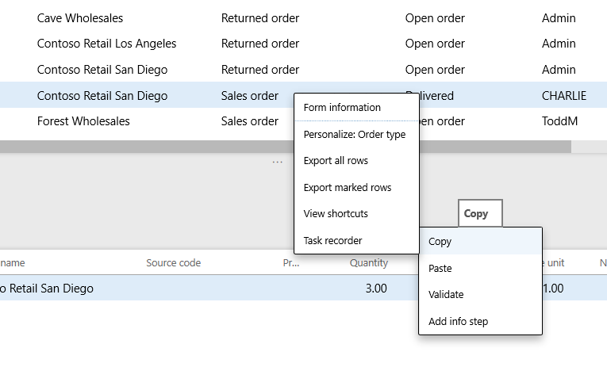

---
# required metadata

title: Chain test cases
description: 
author: robadawy
manager: AnnBe
ms.date: 08/01/2019
ms.topic: article
ms.prod: 
ms.service: dynamics-ax-platform
ms.technology: 

# optional metadata

# ms.search.form: 
# ROBOTS: 
audience: Developer
# ms.devlang: 
ms.reviewer: rhaertle
ms.search.scope: Operations
# ms.tgt_pltfrm: 
ms.custom: 21631
ms.search.region: Global
# ms.search.industry: 
ms.author: robadawy
ms.search.validFrom: 2019-08-01
ms.dyn365.ops.version: AX 7.0.0

---

# Chain test cases

[!include [banner](../../includes/banner.md)]

One of the key features of the Regression Suite Automation Tool (RSAT) is the chaining of test cases, that is, the ability of a test to pass values to other tests. Test cases are executed according to their defined order in the Azure DevOps test plan, which can also be updated in the test tool itself. It is important to correctly order the tests if you want to pass variables from one test case to the other.

To save the value of a variable while recording the test in Task Recorder, right-click the field and click **Task recorder > Copy** as shown below. This will save the variable in the recording file. This variable can be used in subsequent tests. 
 

In the Excel parameters file, these saved values appear in the **Saved** variables table of the **General** Tab.
 

 
To reuse these variables during test playback, copy the variable name and use it in place of a parameter value in the data file of another test (or the same test) as shown below. 
 

 
Variables can be used in the same test case where they are defined and can also be passed between tests during the same test run.

## Support for formulas of saved variables

You can create formulas that contain saved (copied) variables. If you have been using an older version of RSAT, you will need to regenerate new Excel parameter files to take advantage of this functionality. Supported operators are **+**, **-**, **/** and **\***. Only numerical variables can be used in RSAT formulas; strings or dates are not supported. Always specify variable names within double braces **{{varname}}**. For example, **{{var1}} + {{var2}}**.

In the image below, two different variables are being used in a formula:
 

 
