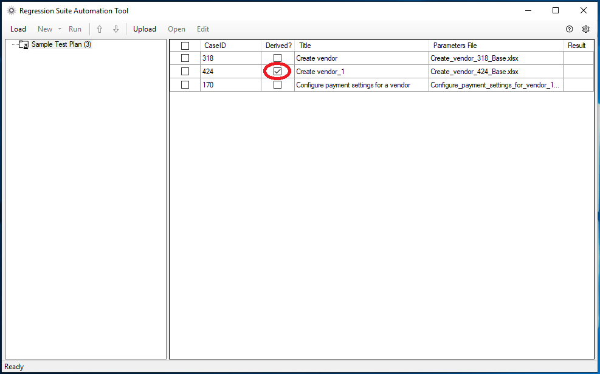

---
# required metadata

title: Derived test cases
description: 
author: robadawy
manager: AnnBe
ms.date: 08/01/2019
ms.topic: article
ms.prod: 
ms.service: dynamics-ax-platform
ms.technology: 

# optional metadata

# ms.search.form: 
# ROBOTS: 
audience: Developer
# ms.devlang: 
ms.reviewer: rhaertle
ms.search.scope: Operations
# ms.tgt_pltfrm: 
ms.custom: 21631
ms.search.region: Global
# ms.search.industry: 
ms.author: robadawy
ms.search.validFrom: 2019-08-01
ms.dyn365.ops.version: AX 7.0.0

---

# Derived test cases

[!include [banner](../../includes/banner.md)]

RSAT lets you execute the same test case with multiple configurations. To achieve that, select a test case in RSAT and then select **New > Create Derived Test Case**. This creates a child test case in Azure Dev Ops. The resulting derived test case is linked to its parent test case in Azure DevOps. It has an Excel parameters file attached but no recording file. The derived test case will appear in the RSAT grid under the same test suite with the Derived column checked. Derived test cases are named after their parent test case with a numeric suffix.

In the following image, a derived test case has been created from a test case called **Create Vendor**.

 
The derived test case is automatically created in Azure DevOps. It is a child item of the **Create Vendor** test case and is tagged with the special keyword **RSAT:DerivedTestSteps**.

 

 
When you run (playback) a derived test case, it will use the recording of its parent test case and its own copy of the Excel parameters file. This will allow you to run the same test with different parameters without the need to maintain more than one recording.

A derived test case does not need to be part of the same test suite as its parent test case. You can move it to another suite.
