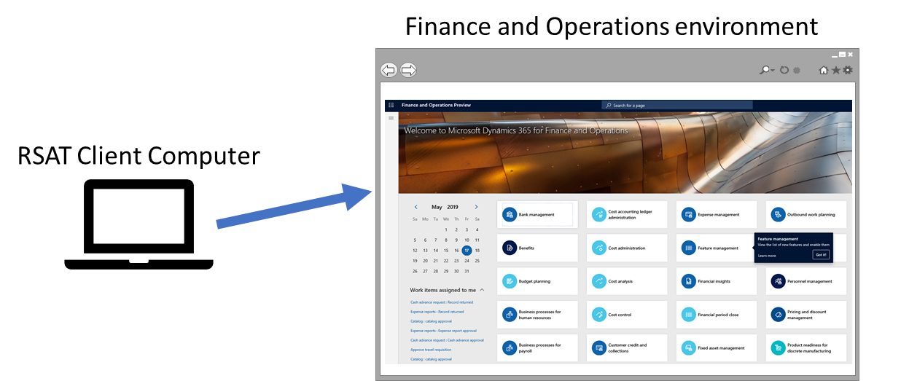
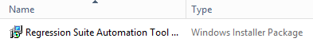
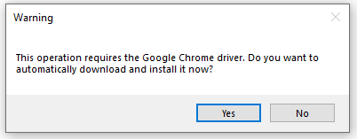
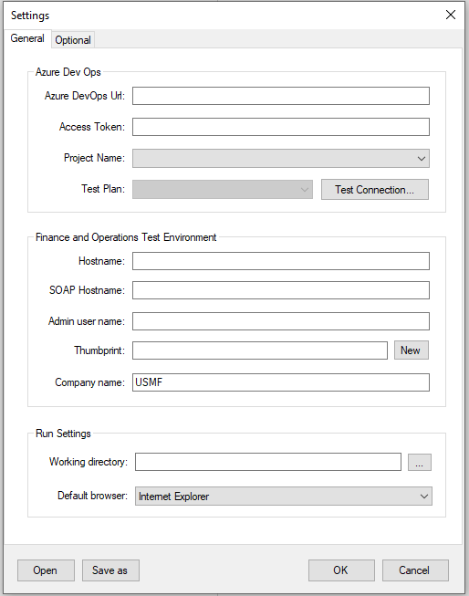
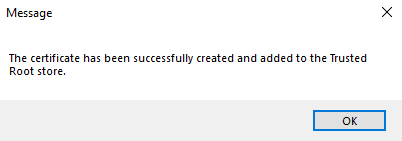
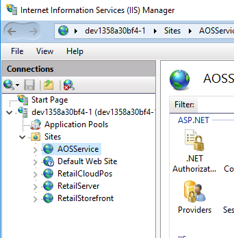
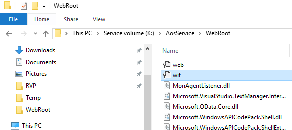

---
# required metadata

title: RSAT installation and configuration
description: 
author: robadawy
manager: AnnBe
ms.date: 08/01/2019
ms.topic: article
ms.prod: 
ms.service: dynamics-ax-platform
ms.technology: 

# optional metadata

# ms.search.form: 
# ROBOTS: 
audience: Developer
# ms.devlang: 
ms.reviewer: rhaertle
ms.search.scope: Operations
# ms.tgt_pltfrm: 
ms.custom: 21631
ms.search.region: Global
# ms.search.industry: 
ms.author: robadawy
ms.search.validFrom: 2019-08-01
ms.dyn365.ops.version: AX 7.0.0

---

# RSAT installation and configuration

[!include [banner](../../includes/banner.md)]

## Prerequisites

### Dynamics 365 for Finance and Operations test environment
Your Dynamics 365 for Finance and Operations test environment must be running Platform update 15 or newer. The Regression Suite Automation Tool must have access to your Dynamics 365 for Finance and Operations test environment via a web browser.  

### Excel
You need Microsoft Excel installed to generate and edit test parameters. 

### Azure DevOps
You must have an Azure DevOps project to store and manage your test cases, test plans and test case results. You will need an Azure DevOps Test Manager or Test Plans license. For example, if you have a Visual Studio Enterprise subscription, you already have a license to Test Plans. For more information, see [Pricing for Azure DevOps](https://azure.microsoft.com/en-us/pricing/details/devops/azure-devops-services/).

### Authentication Certificate
RSAT is designed to be installed on any Windows 10 computer and connect remotely via a web browser to a Dynamics 365 for Finance and Operations environment.



To enable secure authentication, RSAT requires a certificate to be installed on the RSAT client computer. The RSAT settings dialog allows you to automatically create and install the authentication certificate, you will also need to configure the Finance and Operations VMs to trust the connection. Follow the instructions in the next sections to install and configure RSAT.

## Installation

### Installer
Download Regression Suite Automation Tool.msi to your machine and double-click it to run the installer. 


 
### Selenium and Browser Drivers
RSAT requires Selenium and web browser driver libraries. RSAT will prompt you if needed libraries are missing and will automatically install them for you. Select yes when you see the following (or similar) dialogs.
 

 


Alternatively, refer to [Install Selenium Driver](#install-selenium-drivers).

## Configuration

Open RSAT from your desktop.


 
Click the **Settings** button on the top right to configure RSAT.



### General Settings
These settings are required.

#### Azure DevOps
Configure your connection to the Azure DevOps project and test plan.

+ **Azure DevOps Url**: This is the URL of your Azure DevOps organization. Example: https://yourAzureDevOpsUrlHere.visualStudio.com
+ **Access Token**: The access token that allows the tool to connect to Azure DevOps. You need to create a Personal Access Token or use an existing one that you have saved. For more information, see https://www.visualstudio.com/en-us/docs/setup-admin/team-services/use-personal-access-tokens-to-authenticate 
+ **Project Name**: The name of your Azure DevOps project. RSAT will automatically detect project names and test plans available based the Azure DevOps URL specified. You can then select the Test Project and Test Plan.
+ **Test Plan**: The Azure DevOps test plan that contains your test cases. For more information, see https://www.visualstudio.com/en-us/docs/test/manual-exploratory-testing/getting-started/create-a-test-plan 

Click **Test Connection** to test your connection to Azure DevOps.

#### Finance and Operations Test Environment
Configure your connection to the test environment.

+ **Hostname**: Hostname of the Dynamics 365 for Finance and Operations test environment. Example: <myaos>.cloudax.dynamics.com. Do not include the **https://** or **http:/** prefix.
+ **SOAP Host Name**: SOAP Hostname of the Dynamics 365 for Finance and Operations test environment. The SOAP hostname is typically the same as the Hostname with a soap suffix. Example: <myaos>soap.cloudax.dynamics.com. Do not include the https:// or http:/ prefix.
+ **Admin User Name**: Email address of an admin user on the Finance and Operations test environment.
+ **Thumbprint**: Thumbprint of the authentication certificate you are using.
    1. Click the New button to create and install a new authentication certificate. When prompted, place the .cer file anywhere on disk for your records.
    2. When the process completes, the new certification is installed in the local machine’s trusted root store.
        
        

    3. The thumbprint of the newly created certificate is automatically inserted on this form. Copy this thumbprint, you will use it in the next section to configure the AOS to trust the connection.

+ **Company name**: Specify a company name to use as you default Finance and Operations company during creation of Excel Parameters files. It can be changed later my editing an Excel file.


#### Run setting
Configure your local settings.

+ **Working directory**: Folder location for storing test automation files, including Excel test data files. For example: **C:\Temp\RegressionTool**.
+ **Default browser**: Select the browser to use for test execution.

Click **Ok** to apply your settings and close the dialog. Click **Cancel** to cancel your changes and close the dialog. The **Save As** and **Open** buttons allow you to save your settings for reuse later. Click **Save As** to save your current settings into a configuration file on your computer. Click **Open** to restore your settings from a configuration file.

### Optional Settings
Select the Optional tab to configure optional settings.

+ **Test Run Prefix**: RSAT reports test run results to Azure DevOps. Test runs are named using the following convention: **<Run ID> <Prefix> <Test Suite>**. Use this setting to set the **<Prefix>**.
+ **Test Run Timeout**: Timeout (in minutes) of a test run. All active windows are closed and pending test cases fail when this timeout is reached.
+ **Test Action Timeout**: Timeout (in minutes) of individual test steps. When a test step times out, the test case fails.

### Configure the AOS machine to trust the connection
After creating the certificate, configure the Finance and Operations AOS to trust the test automation connection. On a multi-AOS environment, repeat the steps below for all AOS machines.

1.	Open a Remote Desktop connection to the AOS machine.
2.	Open IIS and find AOSService in the list of sites.

    

3.	Right-click **AOSService** then click **Explore**.
4.	Open and find the file **wif.config**.
  
    

5.	Update the **wif.config** file by adding a new authority entry as show inthe following example. Use **127.0.0.1** for the authority name and paste your certificate thumbprint.

```
<issuerNameRegistry type="Microsoft.Dynamics.AX.Security.SharedUtility.AxIssuerNameRegistry, Microsoft.Dynamics.AX.Security.SharedUtility">
        <authority name="CN=127.0.0.1">
          <keys>
            <add thumbprint="ccbc124d0a119xxxxxxxxxxxxxxxxxxxx841e797" />
          </keys>
             <validIssuers>
            <add name="CN=127.0.0.1" />
          </validIssuers>
        </authority>
```

## Installation on multiple machines
If you install RSAT on more than one computer, you need to generate a new certificate for every RSAT installation. The certificate must be generated and installed on the same computer as RSAT. You can have more than one thumbprint entry in the AOS wif.config file if you want your AOS to trust connections from more than one client where RSAT is installed. The following example shows multiple thumbprints nodes.

```
<keys>
    <add thumbprint="ccbc124d0a119xxxxxxxxxxxxxxxxxxxx841e797" />
    <add thumbprint="bbbbbbbbbbbbbbxxxxxxxxxxxxxxxxxxxx999999" />
</keys>
```

## Install Selenium Drivers

For manual installation of Selenium drivers, follow these steps:
1. Download [Selenium 3.13.1](http://selenium-release.storage.googleapis.com/3.13/selenium-dotnet-strongnamed-3.13.1.zip). Or, go to http://docs.seleniumhq.org/download and click **Previous releases**. Choose **3.13** and download **selenium-dotnet-strongnamed-3.13.1.zip**.
2. Install the Selenium libraries:
    + Unzip the downloaded file. 
    + Unpack the file **dist\Selenium.WebDriver.StrongNamed.3.13.1.nupkg**. To unpack this file, add the .zip suffix to the file and unzip it. 
    + Copy the contents of the folder named **Selenium.WebDriver.StrongNamed.3.13.1.nupkg\lib** to **C:\Program Files (x86)\Regression Suite Automation Tool\Common\External\Selenium**.
3.	Download the [Internet Explorer driver version 3.4.0](http://selenium-release.storage.googleapis.com/3.4/IEDriverServer_x64_3.4.0.zip). Or, go back in the browser, open the **3.4** folder and download **IEDriverServer_x64_3.4.0.zip**.
4.	Unzip the downloaded file and move the contents to **C:\Program Files (x86)\Regression Suite Automation Tool\Common\External\Selenium**.

If you want to use Google Chrome as your browser, follow these steps:
1. Go to https://sites.google.com/a/chromium.org/chromedriver/downloads. 
2. Download **chromedriver_win32.zip** from the latest/current release.
3. Unzip the downloaded file and move the contents to **C:\Program Files (x86)\Regression Suite Automation Tool\Common\External\Selenium**.
