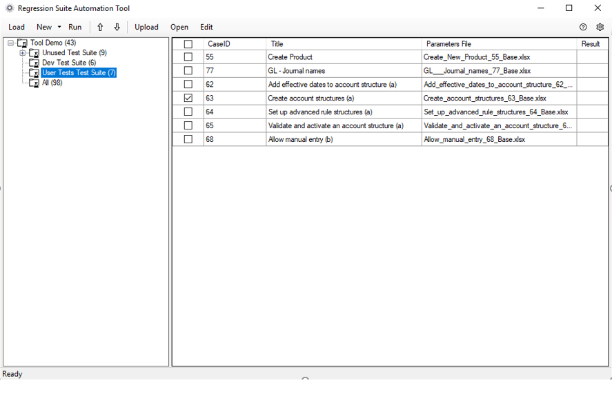
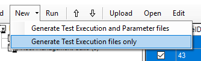
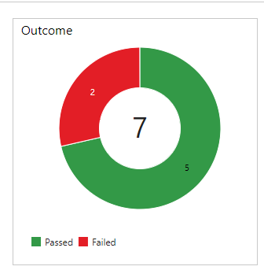
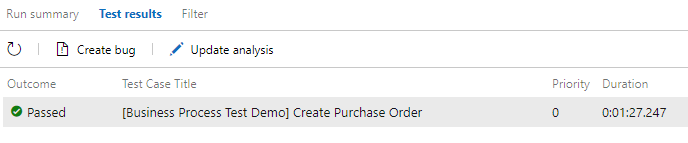
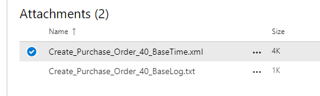

---
# required metadata

title: Run Regression suite automation tool test cases
description: This topic explains how to load test cases from Azure DevOps, generate automation files, modify test parameters, run tests, investigate results, and save your work back to Azure DevOps.
author: robadawy
manager: AnnBe
ms.date: 08/01/2019
ms.topic: article
ms.prod: 
ms.service: dynamics-ax-platform
ms.technology: 

# optional metadata

# ms.search.form: 
# ROBOTS: 
audience: Developer
# ms.devlang: 
ms.reviewer: rhaertle
ms.search.scope: Operations
# ms.tgt_pltfrm: 
ms.custom: 21631
ms.search.region: Global
# ms.search.industry: 
ms.author: robadawy
ms.search.validFrom: 2019-08-01
ms.dyn365.ops.version: AX 7.0.0

---

# Run Regression suite automation tool test cases

[!include [banner](../../includes/banner.md)]

This topic explains how to load test cases from Azure DevOps, generate automation files, modify test parameters, run tests, investigate results, and save your work back to Azure DevOps.

## Load test cases and create automation files
In Azure DevOps, select **Load** to download test cases and test case automation files. All test cases belonging to the test plan specified in the **Settings** dialog box are downloaded.
 

Test cases are organized by test suites under a common test plan. These are test suites you created in your Azure DevOps project. Using this tool, you can work with one test suite at a time.

If the tool fails to load any test case, verify that your test plan in Azure DevOps is properly created and contains the desired test suites and test cases.

If this is the first time you load this test plan, the **Parameters File** column will be blank. You will need to create test automation files for your test cases. Test automation files consist of:

+ Test parameter files (Microsoft Excel files contain test case parameters)
+ Other binary and XML files needed to execute the tests.

When you select **New**, test automation files are generated in your working directory. The Excel test parameter files will appear on the grid under **Parameters File**.

 
You can also generate binary and XML files only without overwriting your parameter files. Use submenu **New > Generate Execution Files** to only regenerate execution files and leave Excel files unaffected. This is typical when you install a new version of the tool, you can update your execution files while preserving the test parameter files.

## Modify test parameters

This section describes how to modify Excel files to specify input and validation parameters for your test run. Select one or more test cases you want to modify and select **Edit**. This will open an Excel window for each selected test case. Alternatively, you can open the Excel files directly from the working directory. 

In addition to the **General** tab, the Excel file contains a data tab for every Finance and Operations form that the test case visits.

Select the desired form (Excel tab) that you want to edit and identify the parameter values that you want to change. Values are identified by their control name. If you are not sure which control is correct, open the form in Finance and Operations, right-click the control whose value you want to change, and select **form information**.

Save the Excel files when you are done making edits.

### Run a test as a specific user
By default, tests are executed in Finance and Operations using the admin role. If you want to run the test as a specific security role, specify the email address of a Finance and Operations user under the **Test User** parameter in the **General** tab of the Excel parameter file. The **Test User** must be a valid user of the Finance and Operations environments you are connecting to. The test will run under the security roles that the specific user belongs to. You need version 1.200 or newer for this feature to be functional.

 
### Run a test in the context of a specific company
The **General** tab of the Excel parameter file also allows you to specify the name of a Finance and Operations legal entity (Company). The test will run in the context of this company. You can specify your default company in the **Settings** dialog box of the tool.

### Infolog and message validation
Excel parameter files that are generated using version 1.200 or newer contain a **MessageValidation** tab.

You can enter messages in this tab under **Message Validation**. After a test case completes execution, it validates that the messages specified here appear in the Finance and Operations Infolog. The test case will fail if these messages are not found.

You can specify any expected messages including error messages that are expected. If an expected error occurred, but exists in this section, the test will not fail.
 

## Run
Select **Run** to execute the selected test cases. Only test cases with existing automation files can be run. The tool will open Finance and Operations and execute these tests with the data you entered in Excel.

You can modify the order in which test cases are executed using the up and down arrow buttons.

### Pause prior to a test case run 
You can add a pause before a test case starts execution. If you want to pause, update the cell **Pause (seconds)** on the **General** tab of the Excel parameters file.

## Investigate results
When all test cases complete execution, **Pass** or **Fail** will be populated in the **Result** column. You can click on the result to see error messages.

Additional investigation details are available in Azure DevOps. To view this information, from your Azure DevOps project page, go to **Test > Runs**.

Select the desired test run. It will include the results of all tests that were executed during that run.
 

You can open a failed test result and review the **ErrorMessage** section for information about the failure.
 

All error messages are also available locally under **C:\Users\$YourUserName\AppData\Roaming\regressionTool\errormsg-<TestCaseId>.txt**.

### Test response times
In addition to execution logs, the duration of a test case is also available in the test result.
 

You can also review the response time of each step of the test case by opening the **BaseTime.xml** file attached to the test result.
 

You need version 1.200 or newer for response times to be available.

## Save your work
To preserve your work, select **Upload**. This will upload test automation files, including Excel test parameter files, of all selected test cases to Azure DevOps for future use.
After test automation files are uploaded to Azure DevOps, the next time you use the Regression suite automation tool, even from a different computer, you can simply use **Load** and then **Run**, without generating test execution files or editing Excel parameter files.
