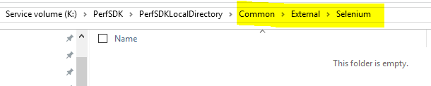
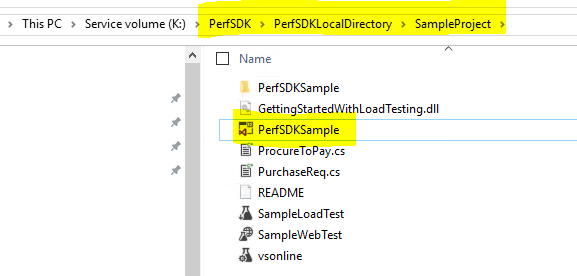
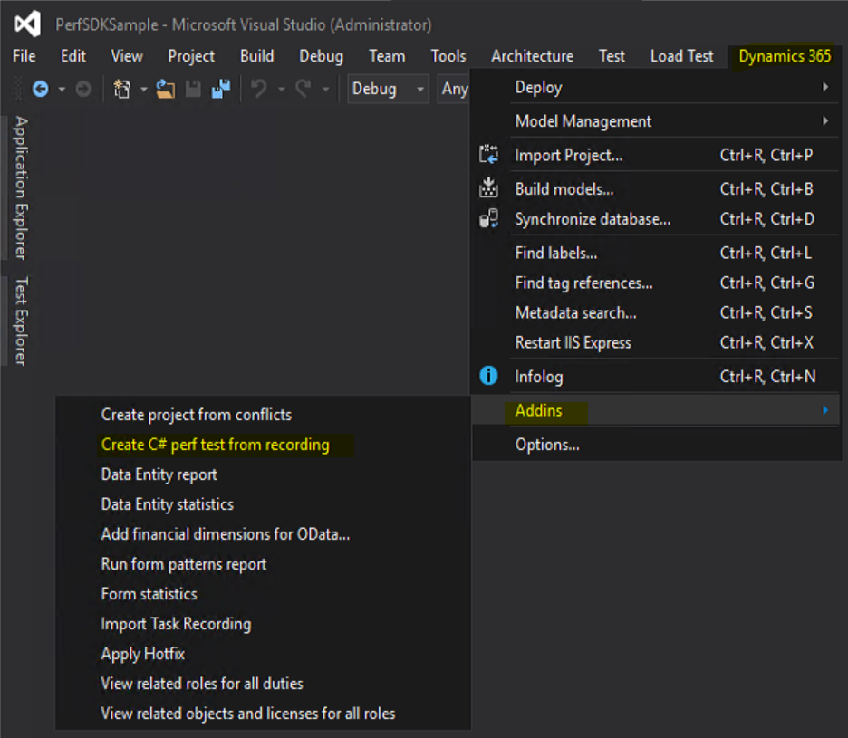
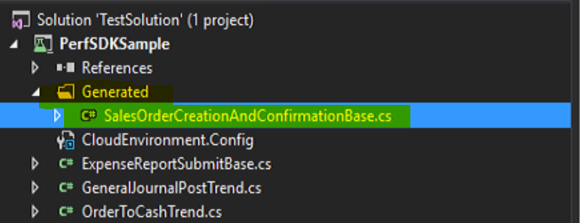
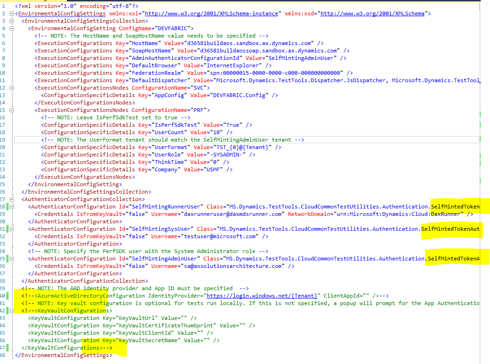

---
# required metadata

title: Single user testing with Task recorder and Performance SDK
description: This topic provides information about single user testing with Visual Studio and the PerfSDK with a performance test script generated with Task Recorder. 
author: hasaid
manager: AnnBe
ms.date: 05/15/2019
ms.topic: article
ms.prod: 
ms.service: dynamics-ax-platform
ms.technology: 

# optional metadata

# ms.search.form: 
# ROBOTS: 
audience: Developer
# ms.devlang: 
ms.reviewer: kfend
ms.search.scope: Operations
# ms.tgt_pltfrm: 
ms.custom: 9954
ms.assetid: 7b605810-e4da-4eb8-9a26-5389f99befcf
ms.search.region: Global
# ms.search.industry: 
ms.author: jujoh
ms.search.validFrom: 2016-02-28
ms.dyn365.ops.version: AX 7.0.0

---

# Single user testing with Task recorder and Performance SDK

[!include [banner](../includes/banner.md)]

Use the information in this topic to perform single user testing by using Visual Studio and the Performance SDK with a performance test script that is generated with Task Recorder. 

## Prerequisites
A Dynamics 365 for Finance and Operations development environment with PU21 or above is required to complete the steps in this topic.

## Use Task Recorder to define and record an end-to-end business scenario 

Before you run a single-user test with a scenario, you need to work with your business team to define your end-to-end scenarios, and use Task recorder to create a recording the steps in each scenario. For more information about how to create a task recording, see the topic, [Task recorder](../user-interface/task-recorder.md). The scenarios that you want to test are based on your customer’s business requirements. In this topic, we will use the sample scenario, Create and confirm a sales order.

In Microsoft Dynamics 365 for Finance and Operations and log in as a Sales persona.
With Task Recorder turned on, create and confirm a sales order that includes the following information:

- Customer account
- Item Number
- Sales quantity
- Site
- Warehouse
- Sales price

When you are finished, click **Save as developer recording** to download the xml file.

  
 
## Configure a Finance and Operations development environment

1. Download [selenium-dotnet-strongnamed-3.13.1.zip](http://selenium-release.storage.googleapis.com/index.html?path=3.13/0) and [IEDriverServer_Win32_3.13.0.zip](http://selenium-release.storage.googleapis.com/index.html?path=3.13/).
2. Unblock and unzip the files.
 
 
 
3. Rename the .nupkg files under the **dist** folder as zip files, and then unzip the zip files.

  | Original file name                               | New file name                                  |
|---------------------------------------------|-------------------------------------------|
| Selenium.Support.StrongNamed.3.13.1.nupkg   | Selenium.Support.StrongNamed.3.13.1.zip   |
| Selenium.WebDriver.StrongNamed.3.13.1.nupkg | Selenium.WebDriver.StrongNamed.3.13.1.zip |
  
4.	Create the folder, **Common\External\Selenium** under your perfSDK folder.

 

5.	Copy the following files, and save them to the folder that you created in the previous step.

  - IEDriverServer.exe from unzipped folder of IEDriverServer_Win32_3.13.0.zip
  - WebDriver.dll and WebDriver.xml from lib\net45 folder of the unzipped folder of Selenium.WebDriver.StrongNamed.3.13.1.zip
  - WebDriver.Support.dll and WebDriver.Support.xml from lib\net45 folder of unzipped folder of Selenium.Support.StrongNamed.3.13.1.zip
 
 
 
## Generate a C# performance test from Task recorder

After you have finished recording the end-to-end scenario, you need to generate a C# performance test script that is based the recording. 

1. Open Visual Studio as an admin in a development environment.
2. Open the PerfSDKSample solution from your PerfSDK folder. Typically, you should find perfSDK folder in K:\PerfSDK\PerfSDKLocalDirectory in a tier-1 sandbox or a Cloud-hosted-environment.

 
 
3.	Add a reference to the WebDriver.dll in the folder Common\External\Selenium.

 
 
4.	Go to **Dynamics 365** /> **Addins** /> **Create C# perf test from recording**.

 
 
5.	Enter the required details in the **Import Task Recording** window and then click **Import**.

 
 
 - **Recording path**: The file location of the developer recording of your E2E scenario.
 - **Project path**: The location of the PerfSDKSample project. Normally, it’s <Your_PerfSDK_Folder>\SampleProject\PerfSDKSample\PerfSDKSample.csproj.
 - **PerfSDK path**: The perfSDK path. Normally, it’s <ServiceVolumeDrive>\PerfSDK\PerfSDKLocalDirectory.

 After you click **Import**, a new C# class is created under the **Generated** folder of your **PerfSDKSample** project.
 
 
 
7.	Build the solution.

## Run single user testing with Test Explorer in Visual Studio

1.	Update **CloudEnvironment.config** of the **PerfSDKSample** project to reflect the configurations of your environment by doing the following:

- Replace **AadAuthenticator** in each **AuthenticatorConfiguration** under **AuthenticatorConfigurationCollection** with **SelfMintedTokenAuthenticator**.
- Comment out **AzureActiveDirectoryConfiguration** and **KeyVaultConfigurations**.
 
 
 
2.	In Visual Studio, go to **Test** /> **Windows** /> **Test Explorer**.

 
 
3.	Right-click on your test case, and then click **Run selected tests**.

 
 
 

## Tips and tricks
Use the following tips and tricks for single user testing with Task recorder and the PerSDK.

- Run your business E2E scenario first before capture it by using Task recorder. 
- When you record your scenario with Task recorder, enter values manually instead of selecting from a drop-down list.
- Replay your Task recording to make sure everything works as expected.
- Restart Visual Studio if you don’t see your test case after the solution is built.

## Troubleshooting
For information about single or multi-user testing with PerformanceSDK, see [Troubleshooting guide](troubleshoot-perf-sdk-user-testing.md).

