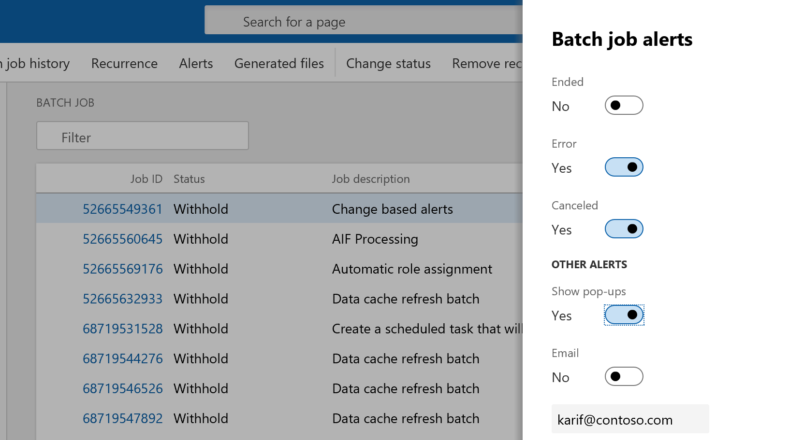
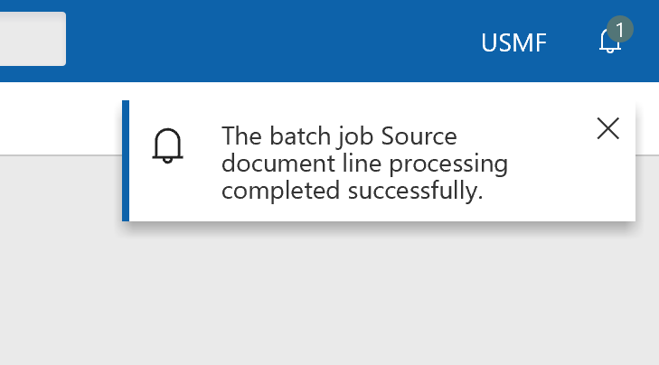

---
# required metadata

title: Alerts
description: This topic provides information about setting up alerts for batch jobs in Microsoft Dynamics 365 for Finance and Operations.
author: hasaid
manager: AnnBe
ms.date: 03/12/2019
ms.topic: article
ms.prod: 
ms.service: dynamics-ax-platform
ms.technology: 

# optional metadata

# ms.search.form: 
# ROBOTS: 
audience: IT Pro
# ms.devlang: 
ms.reviewer: kfend
ms.search.scope: Core, Operations
# ms.tgt_pltfrm: 
ms.custom: 62333
ms.assetid: 6135bcf7-bf8f-42ae-b2c6-458f6538e6a4
ms.search.region: Global
# ms.search.industry: 
ms.author: hasaid
ms.search.validFrom: 2019-03-08
ms.dyn365.ops.version: Platform update 25

---

# Alerts

[!include [banner](../includes/banner.md)]

[!include [banner](../includes/preview-banner.md)]

Alerts form a notification system for critical events in Microsoft Dynamics 365 for Finance and Operations. You can use alerts to stay informed about events that you want to track during the workday. You can enable a set of alert rules so that you're alerted when a batch job ended, ended in error, or was canceled. You can choose whether the alerts are emailed to you or appear as a pop-up notification in the action center. Alerts can be setup per batch job and per user.

## Set up alerts for batch enhanced forms
Complete the following steps to set up alerts for batch enhanced forms.

1.	Go to **System administration** \> **Inquiries** \> **Batch jobs**.
2.	Select a batch job from the list, and then click **Alerts**.
3.	In the **Batch job alerts** pane, configure your alerts and then click **OK**.

 

4.	Check the Action Center for alert notifications.

# Set up alerts for batch legacy forms
Complete the following steps to set up alerts for batch legacy forms.

1.	Go to **System administration** \> **Inquiries** \> **Batch jobs** and select a batch job.
2.	Click **Batch job** and select **Alerts**.

 

3.	Configure your alerts and then click **OK**.

>[!NOTE] 
> Click **Email** and move the slider to **Yes** to recieve email notifications.
