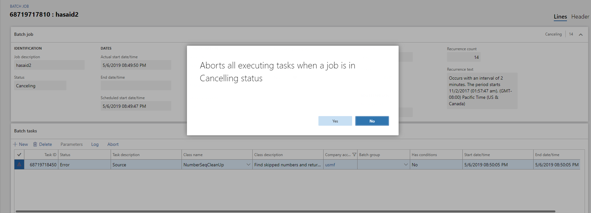

---
# required metadata

title: Abort an executing batch job
description: This topic provides information about how to clean up the batch job history in Microsoft Dynamics 365 for Finance and Operations.
author: hasaid
manager: AnnBe
ms.date: 05/08/2019
ms.topic: article
ms.prod: 
ms.service: dynamics-ax-platform
ms.technology: 

# optional metadata

# ms.search.form: 
# ROBOTS: 
audience: IT Pro
# ms.devlang: 
ms.reviewer: kfend
ms.search.scope: Core, Operations
# ms.tgt_pltfrm: 
ms.custom: 62333
ms.assetid: 6135bcf7-bf8f-42ae-b2c6-458f6538e6a4
ms.search.region: Global
# ms.search.industry: 
ms.author: hasaid
ms.search.validFrom: 2019-05-08
ms.dyn365.ops.version: Platform update 27

---

# Abort an executing batch job
[!include [banner](../includes/banner.md)]

[!include [banner](../includes/preview-banner.md)]

It is important to note that this feature should be used with caution. Aborting a running process is an inherently unsafe action, which may lead to data corruption, either orphaned or incomplete. This should only be used to mitigate other issues caused by the running tasks.

Complete the following steps to immediately abort the running task.

1. Go to **System administration** \> **Inquiries** \> **Batch jobs**.
2. Select a batch job that is in a canceling state.
3. On the **Batch tasks** tab, select **Abort** on the task , and then click **OK**.

     

