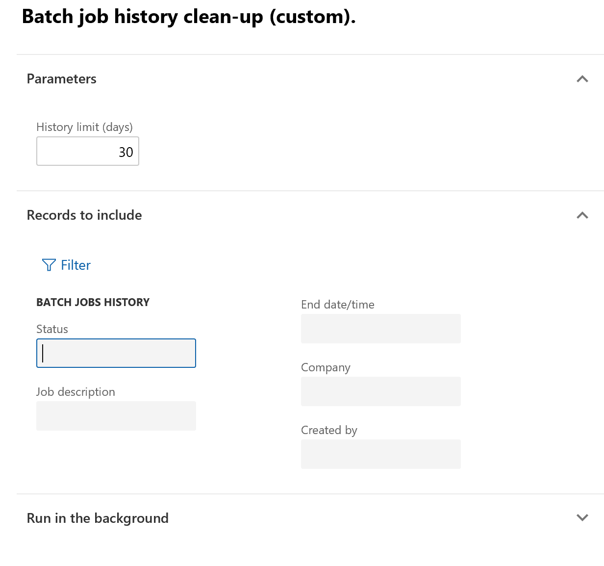

---
# required metadata

title: Batch history cleanup
description: This topic provides information about batch history cleanup in Microsoft Dynamics 365 for Finance and Operations.
author: hasaid
manager: AnnBe
ms.date: 03/12/2019
ms.topic: article
ms.prod: 
ms.service: dynamics-ax-platform
ms.technology: 

# optional metadata

# ms.search.form: 
# ROBOTS: 
audience: IT Pro
# ms.devlang: 
ms.reviewer: kfend
ms.search.scope: Core, Operations
# ms.tgt_pltfrm: 
ms.custom: 62333
ms.assetid: 6135bcf7-bf8f-42ae-b2c6-458f6538e6a4
ms.search.region: Global
# ms.search.industry: 
ms.author: hasaid
ms.search.validFrom: 2019-03-08
ms.dyn365.ops.version: Platform update 25

---

# Batch history cleanup

[!include [banner](../includes/banner.md)]

[!include [banner](../includes/preview-banner.md)]

When you execute a batch job, a history is recorded. This history can be used to monitor the proper execution of jobs. However, when several batch jobs have been created, especially those with a high recurrence, a lot of batch job history entries are generated.
Too many entries in the history table can negatively affect the performance of future jobs.

Two forms have been added to the System Administration workspace to facilitate the cleanup of batch job history:

- Batch job history clean-up
- Custom batch job history clean-up 

 

> [!NOTE] 
> We recommend that you regularly clean up the batch history and complete the clean up outside of business hours.

## Batch job history clean-up

Complete the following steps to quickly clean all history entries older than a specified timeframe. The timeframe has been specified in days.

1.	On the **Batch job** menu, click **Batch job history clean-up**.
2.	In the **History limit (days)** field, specify the number of days to keep a history of batch jobs.

 
- Custom batch job history clean-up 

 

> [!NOTE] 
> We recommend that you regularly clean up the batch history and complete the clean up outside of business hours.

## Batch job history clean-up

Complete the following steps to quickly clean all history entries older than a specified timeframe. The timeframe has been specified in days.

1.	On the **Batch job** menu, click **Batch job history clean-up**.
2.	In the **History limit (days)** field, specify the number of days to keep a history of batch jobs.

 
 
# Custom batch job history clean-up 

The custom batch job allows you to add additional filtering based on criteria such as status, job description, company, or user. Other criteria can be added by clicking on the filter button.

 

1.	On the **Batch job** menu, click **Batch job history clean-up (custom)**.
2.	Specify the number of days to keep in the history.
3. Enter any filter criteri and then click **OK**.
