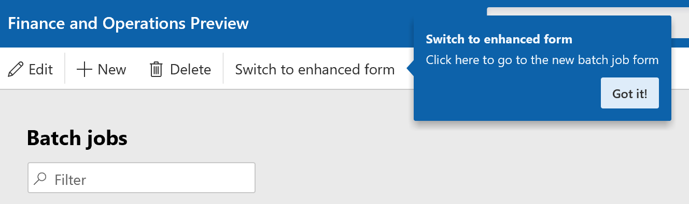
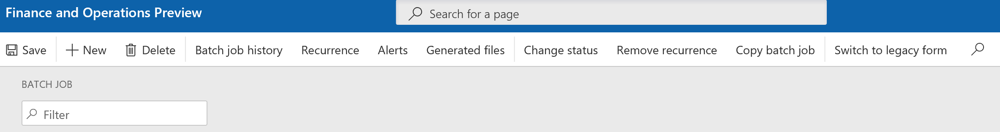
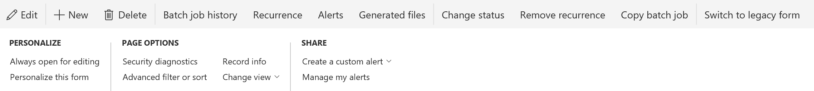

# Batch enhanced form

[!include [banner](../includes/banner.md)]

The new enhanced form is a detailed transaction form, When clicking on the Batch job (Job ID) , Header and lines are displayed which summarizes the batch tasks and constrains related to the selected Batch Job
>[!NOTE] 
>This feature is available as of Platform update 25.

## Switch to Enhanced form
Complete the following switch to Enhanced form.

1.	Go to System administration > Inquiries > Batch jobs.
2.	You will be notified about the enhanced form.
3.	Click on switch to enhanced forms

 
 
4.	Notice the difference between enhanced and legacy forms

# Batch Legacy form
 

5.	You can switch back to the legacy forms
