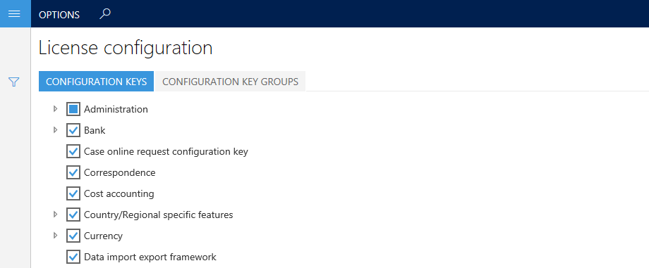

---
# required metadata

title: Maintenance mode
description: This topic provides information about maintenance mode in Microsoft Dynamics 365 for Finance and Operations. Maintenance mode is a system-wide setting that lets system administrators safely make system changes that might affect system functionality.
author: manalidongre
manager: AnnBe
ms.date: 12/10/2018
ms.topic: article
ms.prod: 
ms.service: dynamics-ax-platform
ms.technology: 

# optional metadata

ms.search.form: SysConfiguration
# ROBOTS: 
audience: IT Pro
# ms.devlang: 
ms.reviewer: sericks
ms.search.scope: Core, Operations
# ms.tgt_pltfrm: 
ms.custom: 70292
ms.assetid: c11a35e8-40bb-4005-adf3-cfd998a418fc
ms.search.region: Global
# ms.search.industry: 
ms.author: manado
ms.search.validFrom: 2016-02-28
ms.dyn365.ops.version: AX 7.0.0

---

# Maintenance mode

[!include [banner](../includes/banner.md)]
[!include [banner](../includes/preview-banner.md)]

This topic provides information about maintenance mode in Microsoft Dynamics 365 for Finance and Operations. When maintenance mode is turned on, it provides a safe way for system administrators to make system changes that might affect system functionality. For example, configuration keys can be enabled or disabled. While maintenance mode is on, only system administrators and users who have the **Maintenance mode user** role can sign in to the system. By default, maintenance mode is turned off. When maintenance mode is off, you can't edit the **License configuration** page.

## Turn maintenance mode on and off in sandbox and production environments through Lifecycle Services (In preview)
You can now turn maintenance mode on and off directly through Lifecycle Services (LCS) on your sandbox and production environments. Refer to the following steps to do this:

1. Go to the environment details page and on the **Maintain** menu and click **Configure Maintenance Mode**. This menu item will display for customers added to the preview.
2. In the slider, set **Turn maintenance mode on** for the environment and select **Confirm**.
3. A servicing operation will begin and your system  will go into maintenance mode.
4. On completion, the environment state will be **In Maintenance**. At this point, only the system administrator will have access to the environment.
5. After you are done making system-wide changes, you can turn off maintenance mode by clicking **Disable Maintenance Mode** in the environment updates section.
6. This will start a servicing operation that takes your environment out of maintenance mode. You can see the progress of the operation in the environment details page.
7. After this is complete, your environment goes back to the **Deployed** state. Now all users can sign in to the environment.
8. You can check the environment history page to see when the maintenance mode was turned on or turned off. To get to the environment history page, select **History** and **Environment changes** on the environment details page.

Turning maintenance mode on and off for your sandbox and production environment is very similar to a servicing operation. If turning maintenance mode on or off fails, you will see options such as **Resume**, **Rollback**, and **Abort**. You also have the option to **download the logs** to troubleshoot why the operation failed.
 
## Turn maintenance mode on and off 
### Maintenance mode in non-production environments
You can turn on maintenance mode locally by running the following command. 

> [!Note]
> On some virtual machines (VMs), the exact location of the Deployment.Setup.exe tool might differ. Check AosServiceWebRootbin.

    J:\AosService\PackagesLocalDirectory\Bin\Microsoft.Dynamics.AX.Deployment.Setup.exe --metadatadir J:\AosService\PackagesLocalDirectory --bindir J:\AosService\PackagesLocalDirectory\Bin --sqlserver . --sqldatabase axdb --sqluser axdbadmin --sqlpwd ********* --setupmode maintenancemode --isinmaintenancemode true

The following table describes the parameters that are used in this command.

| Parameter name              | Description  |
|-----------------------------|------|
| --setupmode maintenancemode | Use this parameter to inform the setup tool that the system will be put into or taken out of maintenance mode.    |
| --metadatadir               | Use this parameter to specify the metadata directory. You should use the default packages directory.              |
| --bindir                    | Use this parameter to specify the binaries directory. You should use the default packages directory.              |
| --sqlserver                 | Use this parameter to specify the Microsoft SQL Server. For one-box environments, use a period (**.**).           |
| --sqluser                   | Use this parameter to specify the SQL Server user. You should use **AOSUser**.                                    |
| --sqlpwd                    | Use this parameter to specify the SQL Server password.                                                            |
| --isinmaintenancemode       | Use this parameter to turn configuration mode on or off. Use **true** to turn it on and **false** to turn it off. |

After the instance of Finance and Operations Application Object Server (AOS) is restarted, the system will be in maintenance mode. You can then enable configuration keys, as shown in the following screenshot. 

 

If you try to access Finance and Operations while the system is in maintenance mode, but you aren't a system administrator or a user who has the **Maintenance mode user** role, you may receive an error message. 

You can turn off maintenance mode by running the following command.

    J:\AosService\PackagesLocalDirectory\Bin\Microsoft.Dynamics.AX.Deployment.Setup.exe --metadatadir J:\AosService\PackagesLocalDirectory --bindir J:\AosService\PackagesLocalDirectory\Bin --sqlserver . --sqldatabase axdb --sqluser axdbadmin --sqlpwd ********* --setupmode maintenancemode --isinmaintenancemode false

### Maintenance mode in production environments
To turn on maintenance mode in a production environment, you must submit a request to the Dynamics Service Engineering (DSE) team by using the **Other request** form in LCS on the **Service requests** page. For more information about submitting a request through LCS, see [Submit service requests to the Dynamics Service Engineering team](../lifecycle-services/submit-request-dynamics-service-engineering-team.md). 

The Dynamics Service Engineering team will move your system into maintenance mode and work with you to complete the configuration updates. After the team receives a confirmation from you that the updates are complete, they will remove your system from maintenance mode.

## Troubleshooting
Errors can be found in Event viewer.

