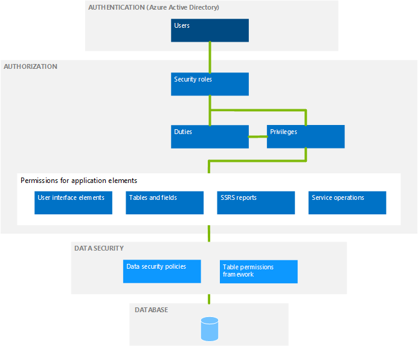

---
# required metadata

title: Security architecture
description: This topic provides an overview of the security architecture of Finance and Operations.
author: sarvanisathish
manager: AnnBe
ms.date: 08/30/2019
ms.topic: article
ms.prod: 
ms.service: dynamics-ax-platform
ms.technology: 

# optional metadata

ms.search.form: SysSecConfiguration, SysUserGroupInfo, SysSecRoleExcludeUsers
# ROBOTS: 
audience: IT Pro
# ms.devlang: 
ms.reviewer: sericks
ms.search.scope: Core, Operations
# ms.tgt_pltfrm: 
ms.custom: 15441
ms.assetid: bea829b3-38ce-463c-a7e3-c9393b79d559
ms.search.region: Global
# ms.search.industry: 
ms.author: sarvanis
ms.search.validFrom: 2016-02-28
ms.dyn365.ops.version: AX 7.0.0

---

# Security architecture
[!include [banner](../includes/banner.md)]
[!include [banner](../includes/preview-banner.md)]

This topic provides an overview of the security architecture of Finance and Operations.

When you understand the security architecture, you can more easily customize security to fit the requirements of your business. The following diagram provides a high-level overview of the security architecture. 

## Authentication
By default, only authenticated users who have user rights can establish a connection. 

Microsoft Azure Active Directory (AAD) is a primary identity provider. To access the system, users must be provisioned into a Finance and Operations instance and should have a valid AAD account in an authorized tenant.

## Authorization
Authorization is the control of access to Finance and Operations applications. Security permissions are used to control access to individual elements of the program: menus, menu items, action and command buttons, reports, service operations, web URL menu items, web controls, and fields in the Finance and Operations client. 

Individual security permissions are combined into privileges, and privileges are combined into duties. The administrator grants security roles access to the program by assigning duties and privileges to those roles. 

Context-based security controls access to securable objects. When a privilege is associated with an entry point (such as a menu item or a service operation), a level of access, such as **Read** or **Delete**, is specified. The authorization subsystem detects the access at run time, when that entry point is accessed, and applies the specified level of access to the securable object that the entry point leads to. This functionality helps to ensure that there is no over-permissioning, and the developer gets the access that he or she intended. 

For more information, see [Role-based security](role-based-security.md).

## Data security
Authorization is used to grant access to elements of the program. By contrast, data security is used to deny access to tables, fields, and rows in the database. 

Use the extensible data security framework to control access to transactional data by assigning data security policies to security roles. Data security policies can restrict access to data, based on either the effective date or user data, such as the sales territory or organization. 

Record-level security, which was a mechanism for securing data in Dynamics AX 2012 and earlier versions, is obsolete. Extensible data security is the recommended mechanism for securing or filtering data in the program. 

Additionally, the Table Permissions Framework helps protect some data. Data security for specific tables is enforced by Application Object Server (AOS).

## Auditing
Auditing of user sign in and sign out is enabled, which means that the system logs when a user signs in or out of the application. A sign out is logged even if the user's session expires or ends.

A system administrator or security administrator can access the audit logs by going to  the **User log** page (**System administration** > **Inquiries** > **User log**).
