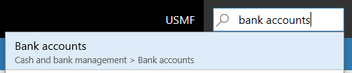
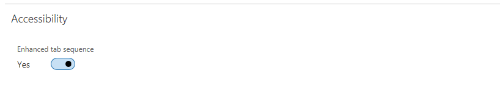

---
# required metadata

title: Accessibility features
description: This topic describes a significant set of functionality specifically designed to assist users with various disabilities, including those who utilize sight assist technologies such as Windows Narrator.
author: TLeforMicrosoft
manager: AnnBe
ms.date: 11/09/2017
ms.topic: article
ms.prod: 
ms.service: dynamics-ax-applications
ms.technology: 

# optional metadata

# ms.search.form:  
audience: Application User
# ms.devlang: 
# ms.reviewer: sericks
ms.search.scope: Operations
# ms.tgt_pltfrm: 
# ms.custom: 
ms.search.region: Global
# ms.search.industry: 
ms.author: tlefor
ms.search.validFrom: 2017-12-31 
ms.dyn365.ops.version: 7.3
---

# Accessibility features

Microsoft Dynamics 365 for Operations and Finance, Enterprise edition a
significant set of functionality specifically designed to assist users with
various disabilities, including those who utilize sight assist technologies such
as Windows Narrator.

**Windows Narrator and Keyboard only access**

Each field and control has a label and description of applicable shortcuts, read
by a screen reader.

**A wealth of shortcuts provided for the most common actions:**

Data entry and keyboard interaction is at the heart of most users daily
interactions. To enhance your user experience, we’ve authored shortcuts to help
you “jump” around the screen and shortcuts for specialized actions.

<https://docs.microsoft.com/en-us/dynamics365/unified-operations/fin-and-ops/get-started/shortcut-keys>

**Navigate to any top-level-form using form search**

Any form that is available in the Navigation Pane menu\*, is also available by
typing it’s name or description. “jump to the form search using Alt+G” and type
the name of the form.

\*only top level forms can be directly navigated to. Secondary forms rely on
information or context from their parent.

**Action search for keyboard only users or for heads down data entry**

Each action offered on a form is keyboard accessible, via the tab sequence. But
we also offer the ability to executed actions more directly using an “action
search”

**Example:**

Assume that “Email notification log” in the Email Notification section is an
action we’d like to execute. (right most section)

The user can execute that action by gaining focus into the action pane via a
shortcut Ctrl+F6 and then tabbing through all of the tabs/actions until the
action mail notification log” has focus.

Or the user can execute the action more directly… From anywhere on the form, the
user uses a shortcut to expose the search action: Ctrl + ‘

The user then types words that describe the action, and the action is made
available, and can be directly executed. (in this example we’ve typed any of the
words in the actions label… even partial words are accepted)

Typing “email”, “notific” and “log” all allowed the user to “jump” to the Email
notification log functionality.

| [./media/image4.jpeg](./media/image4.jpeg) | [./media/image5.jpeg](./media/image5.jpeg) | [./media/image6.jpeg](./media/image6.jpeg) |
|--------------------------------------------|--------------------------------------------|--------------------------------------------|

~   cid:image004.jpg\@01D35891.76984830

~   cid:image005.jpg\@01D35891.76984830

~   cid:image006.jpg\@01D35891.76984830

When complete the user once again uses the shortcut Ctrl+’ and is returned to
the field they were positioned when they executed the action search.

**Tab Sequence:**

In daily use, it is understood that not EVERY field is used to perform common
tasks. Therefore, by default Dynamics offers an “optimized” tab sequence with
tab stops on only those fields that are key to common scenarios.  If the user
finds that some key fields should be included in their use of the product, the
user who is utilizing Windows Narrator may use Narrator’s keyboard actions to
gain access to those fields to inspect their content, or the user may enable
Dynamics “Enhanced tab sequence” which makes all editable and readonly fields
part of the tab sequence. The user can then choose to use form personalization
to create a custom tab sequence, choosing which fields they don’t need to be
part of the tab sequence.

**Form Patterns:**

Nearly 90% of Microsoft Dynamics forms are based on a small set of “form
patterns” Each form pattern is used to convey the most common actions taken on
that form. A form pattern ensures familiarity and ease of understanding when
common actions, and common data are always presented in the same location on
different forms. With a small number of form patterns, regardless of the number
of forms in the system, the user can easily learn and use the system with
confidence once the form pattern is recognized.

**Responsive Layout:**

Microsoft Dynamics is designed to work on different devices and form factors
from the smallest screens with large screens with the highest resolutions. Our
responsive layout engine allows the user to zoom in to magnification levels of
200% (in some scenarios, greater than 200%)

| [./media/image8.jpeg](./media/image8.jpeg) | [./media/image9.png](./media/image9.png) |
|--------------------------------------------|------------------------------------------|

~   cid:image008.jpg\@01D35891.76984830

~   cid:image009.png\@01D35891.76984830

**We provide guidance to our developers and customers on how to incorporate
accessible thinking in their customizations**

<https://docs.microsoft.com/en-us/dynamics365/unified-operations/dev-itpro/user-interface/enable-accessibility>
