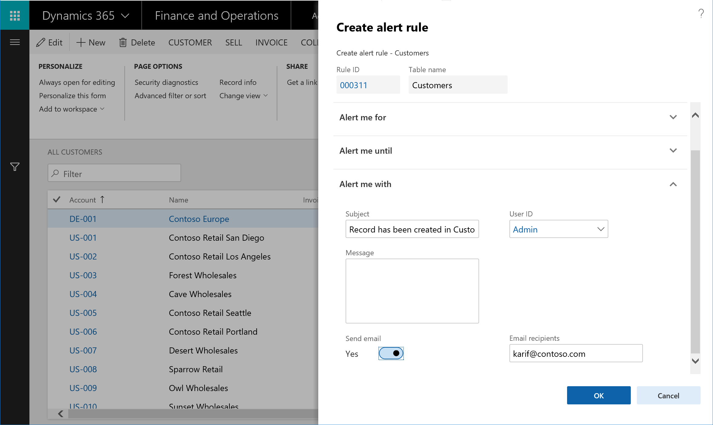

---
# required metadata

title: Client alert notifications by email
description: This topic provides information about how to set up rules that send email notifications when triggered by an event.
author: tjvass
manager: AnnBe
ms.date: 01/30/2019
ms.topic: article
ms.prod: 
ms.service: dynamics-ax-applications
ms.technology: 

# optional metadata

ms.search.form: EventCreateRule
# ROBOTS:
audience: Application user
# ms.devlang: 
ms.reviewer: kfend
ms.search.scope: Operations, Core
# ms.tgt_pltfrm: 
# ms.custom:
ms.search.region: Global
# ms.search.industry:
ms.author: tjvass
ms.search.validFrom: 2019-1-29
ms.dyn365.ops.version: Platform update 24
---

# Client alert notifications by email

[!include [banner](../includes/banner.md)]

## Overview
You can create alert rules that automatically send email notifications when triggered by a pre-defined event. With Dynamics 365 for Finance & Operations, you can define custom alert rules to monitor filtered views of their data. The option to receive email notifications is available for all supported alert types and can be enabled for existing alert rules.  

You can use built-in controls to create alert rules that monitor the filtered views of System Batch jobs. By monitoring the value of the **Status** field, you can also configure alert rules that send email when a Batch job fails.  When these alert rules are created, you no longer have to check reports for changes to business data. Instead, you can let the Dynamics 365 for Finance & Operations intelligent change detection service monitor for you.

### What's important to know?
- Client Alerts depend on the Email subsystem delivered through Office Integration
- Recommend that the SMTP provider is used to enable distribution of email without relying on a local mail client
- Customers MUST configure integrated Email services to send notifications by email
- Email notifications are sent out to recipients on behalf of Alert owners

For more information on configuring email in Dynamics 365 for Finance & Operations, review the article [Configure and send email](https://docs.microsoft.com/en-us/dynamics365/unified-operations/fin-and-ops/organization-administration/configure-email).

Here's a screen shot of the latest **Create alert rule** form which now includes the **Send Email** option 
 
**Note:** Alert notifications will continue to be delivered via the Action Center when **Send email** option is set to **Yes**

### Alert notification email templates
The service dispatches Email notifications using pre-defined email templates that deliver the basic alert notification details.  This includes a direct link into the Finance & Operations form where the Alert rule was defined.

The following illustrations showcases the structure of the Alert notifications when received via Email 

