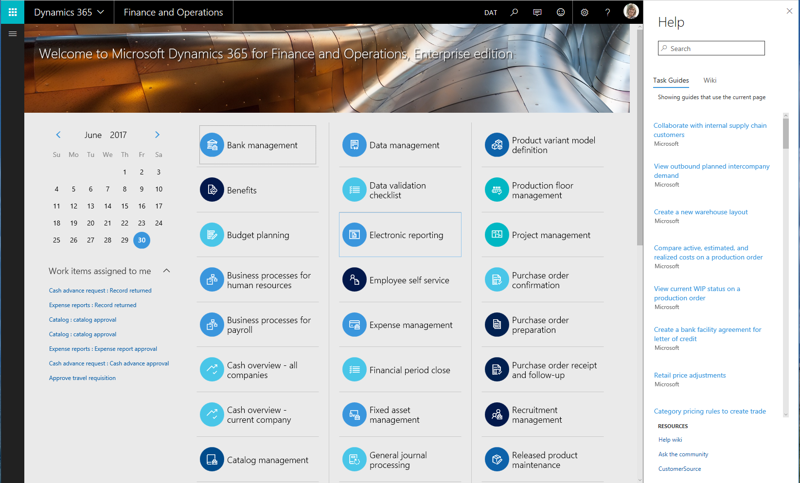
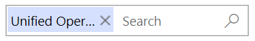
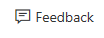
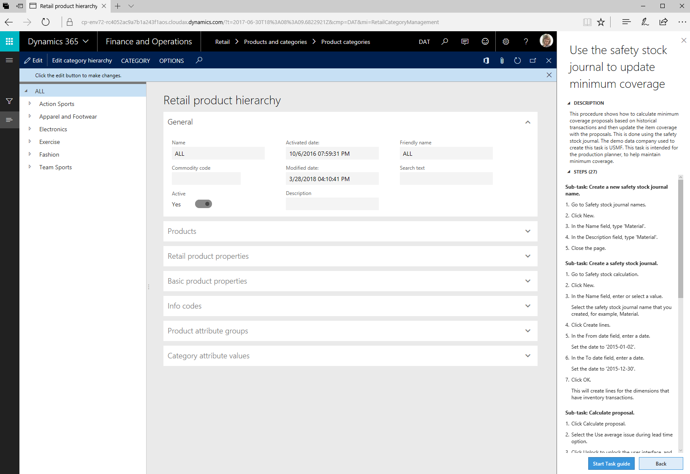
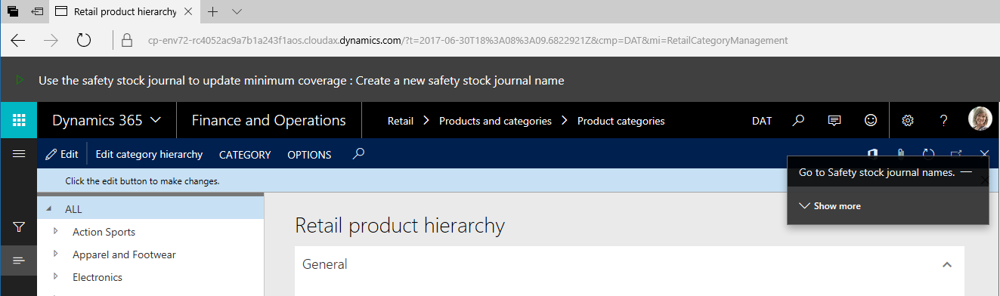
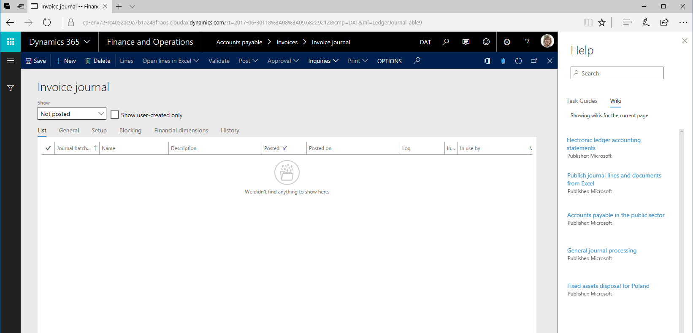
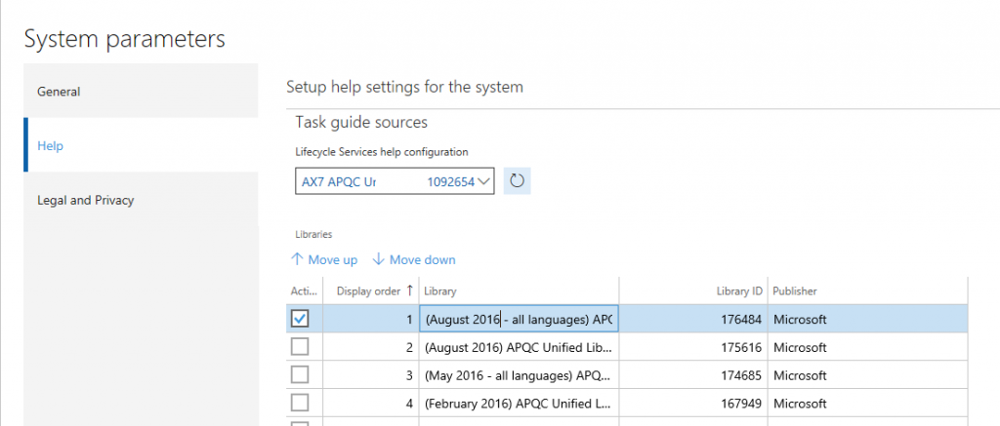
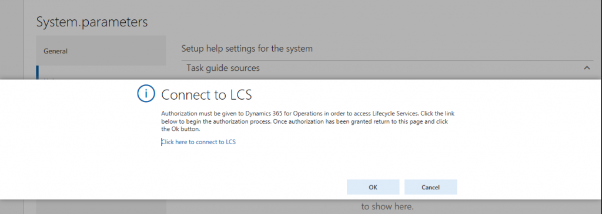

---
# required metadata

title: Help overview

description: This topic provides an overview of the components of the Microsoft Dynamics 365 for Finance and Operations Help system. It also explains how you can provide custom documentation and training to your organization. 
author: margoc
manager: AnnBe
ms.date: 10/31/2017
ms.topic: article
ms.prod: 
ms.service: dynamics-ax-platform
ms.technology: 

# optional metadata

# ms.search.form: 
# ROBOTS: 
audience: Application User, Developer, IT Pro
# ms.devlang: 
ms.reviewer: margoc
ms.search.scope: Core, Operations
# ms.tgt_pltfrm: 
ms.custom: 16381
ms.assetid: 018c148c-9cbd-41e0-8186-d75dbf66288f
ms.search.region: Global
# ms.search.industry: 
ms.author: margoc
ms.search.validFrom: 2016-02-28
ms.dyn365.ops.version: AX 7.0.0

---

# Help system overview

[!include[banner](../includes/banner.md)]

This topic provides an overview of the components of the Microsoft Dynamics 365 for Finance and Operations Help system. It also explains how you can provide custom documentation and training to your organization. 

> [!NOTE] 
> The following products are closely related: Dynamics 365 for Finance and Operations, Enterprise edition; Dynamics 365 for Retail; and Dynamics 365 for Talent. The same functionality may appear in all 3 products. As a result, in topics that are primarily related to Retail, the product name will be Dynamics 365 for Retail; in topics that are primarily related to Talent, the product name will be Dynamics 365 for Talent; and in topics that are related to the core product, the product name will be Dynamics 365 for Finance and Operations. Topics that are written for one product may apply to the same functionality in a related product.

The Help system is shared by the following products:
- Dynamics 365 for Finance and Operations, Enterprise edition
- Dynamics 365 for Retail
- Dynamics 365 for Talent

Finance and Operations includes a Help system that is based on two main components:

-   A documentation site
-   Task guides

You can access both help topics and task guides from the Help pane in whichever product you are using. The following screenshot shows Dynamics 365 for Finance and Operations

This topic describes the Help system, and explains how you can create custom documentation and training resources for your organization.

> [!IMPORTANT]
> The **Task guides** tab is currently not available in Microsoft Dynamics 365 for Talent and Microsoft Dynamics 365 for Retail. We are currently working to enable this functionality in a future release. The Task guides in the Getting Started experience in Talent remain available to cover basic functionality. Procedural help is also available on the docs.microsoft.com site ([docs.microsoft.com/dynamics365/unified-operations](../../index.md) for both Retail and Talent.

## Help on docs.microsoft.com

The docs.microsoft.com site ([docs.microsoft.com/dynamics365/unified-operations](../../index.md)) is the primary source of product documentation for Finance and Operations. The site offers the following features:

-   **Access to the most up-to-date content** – The site gives us a faster and more flexible way to create, deliver, and update product documentation. Therefore, it helps to ensure that you have access to the latest technical information.
-   **Content that is written by experts** – The site provides a richer set of product documentation that can be enhanced by community members both inside and outside Microsoft.
-   **Access to different types of content** – The site lets you quickly access different types of content about Finance and Operations, such as Microsoft Office Mix presentations, task guides, videos, and topics.
-   **Content that supports your business processes** – The site includes business process–focused content that takes advantage of the Business Process Modeler (BPM) in Microsoft Dynamics Lifecycle Services (LCS).

### Searching on docs.microsoft.com
We get a lot of questions about how to search for our content. On our site, if you start from a page about Finance and Operations, we scope your search to just be for Finance and Operations content. You can remove the scoping by clicking the X next to Operations in the search box. 

You can also find our content with any search engine. We recommend that for best results, you use a site search, such as 
site:docs.microsoft.com dynamics 365 "search term".  

### The docs.microsoft.com table of contents
Finance and Operations, Retail, and Talent all share a single table of contents on the docs site, which enables customers to see the context of the topic they are in. It also enables you to use the Filter control above the table of contents to find topics that you are looking for.

### Follow a topic
To follow a topic, click the +Follow button below the comment box. You will need to log in to follow the topic. See [Leave us a comment](#leave-us-a-comment) for details.  

### Use an RSS feed
To subscribe to an RSS feed of all updates to the Unified Operations content, use the following link from a browser that supports RSS feeds, such as Internet Explorer, or an RSS feed manager: 

https://docs.microsoft.com/api/search/rss?locale=en-us&$filter=scopes%2Fany(t%3A%20t%20eq%20%27Unified%20Operations%27)

### Give feedback 
We really like customer feedback. You can either comment, or suggest changes to our content through GitHub.

##### Leave us a comment 
If you have feedback or questions about a topic, leave us a comment at the bottom of the page.  

1 Click **Comments** to get to the comments at the bottom of the page.

2 Start typing your comments, and then click **Post comment**.

3 Select the type of account that you want to sign in with:  
Click one of the icons on the left to associate this site with an existing account, such as a Twitter, Facebook, or Microsoft account. 

Or 

On the right, enter an email address, and a new password to create a new account for the site. 

##### Suggest a change or contribute content through GitHub
To suggest a change, you'll need to have a GitHub account, and sign a Contributor License Agreement.  After you submit a pull request, we'll review your proposed changes. If necessary, we'll discuss them internally, and then get back to you.  

To get started, click the **Edit** (pencil) button on a topic, or go to our repo at https://github.com/MicrosoftDocs/dynamics-365-unified-operations-public. 

For more information, please refer to our contributor's guide: https://github.com/MicrosoftDocs/dynamics-365-unified-operations-public/blob/live/CONTRIBUTING.md. 

> [!NOTE]
> We will only be accepting contributions to our English repositories at this time.  
> We don't accept Issues reported through GitHub--be sure to use a pull request for content suggestions. Product and feature feedback is best handled through the Dynamics 365 Ideas Portal: https://ideas.dynamics.com/ideas/. 

## Task guides
A Task guide is a controlled, guided, interactive experience that leads you through the steps of a task, or business process. You can open (play) a Task guide from the Help pane. When you first click a Task guide, the Help pane will show the step-by-step instructions for the task. Localized Task guides are now available. 

We will provide different sets of task guides for each product such as Dynamics 365 for Retail, Dynamics 365 for Finance and Operations, or Dynamics 365 for Talent. The section Accessing Task guides from the Help pane describes how to find the correct task guides for your product. 

To begin the guided, interactive experience, click **Start task guide** at the bottom of the Help pane. A black pointer opens and indicates the action that you must perform. Follow the directions that appear in the UI, and enter data as directed. 

> [!IMPORTANT] 
> The data that you enter when you play a Task guide is real. If you're in a production environment, the data will be entered in the company that you’re currently using.

### It all begins with Task Recorder

Task guides are created by using Task Recorder. When you use Task Recorder, all the actions that you perform in the Finance and Operations UI (such as clicking menus, changing settings, and entering data) are recorded. The steps that you record are collectively called a task recording. As we explained in the previous section, task recordings can be displayed in the Help pane and played as task guides. However, there are other ways that you can use task recordings:

-   **Save task recordings to BPM** – You can save a task recording to a line of a hierarchy in a BPM library in LCS. When you save a task recording to BPM, a flowchart diagram is generated and displayed, together with the steps of the recording. **Note:** To display a task recording in the Finance and Operations Help pane and play it as a task guide, you'll have to save the recording to a BPM library.
-   **Save task recordings as Word documents** – By saving a task recording as a Microsoft Word document, you can easily produce printable training guides for your organization.

For more information about Task Recorder, see [Task recorder in Finance and Operations](../../dev-itpro/user-interface/task-recorder.md).

### Creating customized task recordings

You can create your own task recordings, or you can download and customize task recording that Microsoft provides. Therefore, you can create customized Help for your organization that reflects your specific Finance and Operations implementation. To display a task recording in the Finance and Operations Help pane and play it as a Task guide, you'll have to save the recording to a BPM library in LCS. If you're a partner, and you promote a library to a corporate library and include it in a solution, it will be available to your customers. For complete instructions, see [Using task recordings to create documentation or training](../../dev-itpro/user-interface/task-recorder.md).

## In-product Help
To access Help content within Finance and Operations, either click the **Help** (**?**) icon and then choose Help or press Ctrl+Shift+?. In both cases, the Help pane opens. From the Help pane, you can access articles or task guides. 

### Accessing help topics from the Help pane

From the Help pane, you can access articles that apply to the Finance and Operations client. When you first open the Help pane and click the **Wiki** tab, you’ll see the articles that apply to the page that you’re currently on in Finance and Operations. If no articles are found, you can enter keywords to refine your search. When you click an article in the Help pane, a new tab opens in your browser and displays the article. 

> [!IMPORTANT]
> This section does not apply to Dynamics 365 for Talent. The Help system for Talent is automatically connected to Task guides for the product. Also, you cannot create custom Task guides for Talent. 

### Accessing Task guides from the Help pane

Before you can access Task guides from the Help pane, a System administrator has to go to the **System parameters** page in Finance and Operations and configure some settings. 

> [!NOTE]
> -   In order to configure help, you must be signed in with an account in the same tenant as the tenant in which Finance and Operations is deployed.
> -   It is not possible to connect to an LCS library from an instance of Finance and Operations running in a local virtual hard drive (VHD).

On the **System parameters** page, follow these steps:

1.  **Important:** The first time that you open the Help tab, you must connect to Lifecycle Services. Be sure to click the link in the middle of the form, wait for the connection, close the dialog box, and then click **OK** to get to the parameters form.

2.  Select the Lifecycle Services project to connect to.
3.  Select BPM libraries (within the selected project) to retrieve task recordings from.
    - For Finance and Operations, for Microsoft content, select the February 2017 QPC Unified Library for Microsoft Dynamics 365 for Finance and Operations. 
    - For Retail, we will be releasing a library in July. 
    - You do not need to select a library for Talent—the connection to the correct library is established for you. 

4.  Set the display order of the BPM libraries. This determines the order in which task recordings from the libraries will appear in the Help pane.

After a System administrator has completed these steps, you can open the Help pane and click the **Task guides** tab. You'll now see the Task guides that apply to the page that you’re currently on in Finance and Operations. If no Task guides are found, you can enter keywords to refine your search. After you click a Task guide in the Help pane, the Help pane shows the step-by-step instructions, and you can play the task guide. 

### Where are the translated Task guides?

Translated Task guides are released in libraries with "All languages" in the title. In Finance and Operations, to see localized Task guide help, make sure that you are connected to an appropriate library. The language that a Task guide appears in is controlled for each user by the Language settings under **Options** &gt; **Preferences**. 
-   If a Task guide has been translated, when you open that Task guide all the text of the Task guide will appear in your selected language.
-   If a Task guide has not yet been translated, when you open it, only some of the text (the text of the controls) will appear in your selected language.

## Additional resources
The following table lists our websites. Our content websites are organized to support the customer life cycle. Each phase is supported by a different set of sites. Sites that have an asterisk (\*) next to the name require that you sign in by using an account that is associated with a service plan.

| Site                                                                     | Description                                                                                                                                                                                                                                |
|--------------------------------------------------------------------------|--------------------------------------------------------------------------------------------------------------------------------------------------------------------------------------------------------------------------------------------|
| [Docs.microsoft.com](/dynamics365/) | Hosts or links to all product documentation for Dynamics 365.                                                                                                                                                               |
| [Lifecycle Services](http://lcs.dynamics.com/en/)\*                      | Provides a cloud-based collaborative workspace that customers and partners can use to manage Dynamics 365 for Finance and Operations projects from pre-sales to implementation and operations. This site is useful in all phases of an implementation. |
| [CustomerSource](http://www.customersource.com/)\*                       | Hosts extensive training resources and is the primary support site for Dynamics 365 for Finance and Operations. Sign in may be required to access specific resources on the site.                                                                      |
| [Support blog](http://aka.ms/AXSupportBlog)                              | Provides tips and tricks that are posted by the Dynamics 365 for Finance and Operations Support team.                                                                                                                                                  |
| [MSDN](http://aka.ms/AXMSDN)                                             | Hosts content from previous releases that is written for developers.                                                                                                                                                                       |
| [TechNet](http://aka.ms/TechNet)                                         | Hosts content from previous releases that is written for IT professionals and application users.                                                                                                                                           |
| [Dynamics Community](http://community.dynamics.com/)                  | Hosts blogs, forums, and videos.                                                                                                                                                                                                           |
| [Microsoft.com/dynamics365/](https://www.microsoft.com/en-us/dynamics365/home)                 | Provides evaluation and sales information.                                                                                                                                                                                                 |

See also
--------
[Finance and Operations help system (downloadable fact sheet)](https://mbs.microsoft.com/customersource/global/AX/learning/fact-sheets/msdaxhelpsystemfactsheet)

[Task Recorder](../../dev-itpro/user-interface/task-recorder.md)

[Create documentation or training using Task recordings](../../dev-itpro/user-interface/task-recorder.md)

[New or updated Task guides (November 2016)](new-task-guides-november-2016.md)
[New or updated task guides (August 2016)](new-updated-task-guides-available-august-2016.md)
[New or updated task guides (May 2016)](new-updated-task-guides-available-may-2016.md)
[New task guides (February 2016)](new-task-guides-available-february-2016.md)
