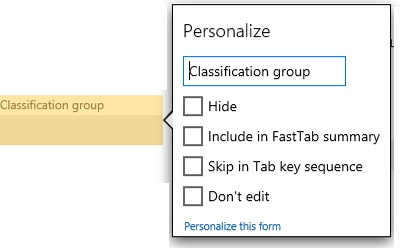
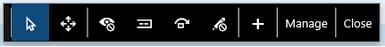
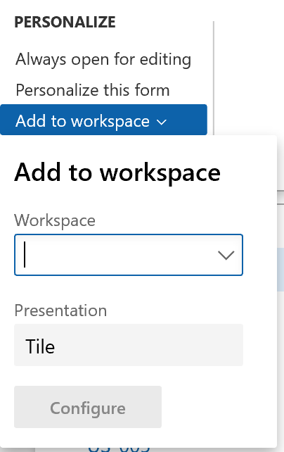

---
# required metadata

title: Personalize the user experience
description: This topic explains how you can personalize Microsoft Dynamics 365 for Finance and Operations.
author: TLeforMicrosoft
manager: AnnBe
ms.date: 04/27/2018
ms.topic: article
ms.prod: 
ms.service: dynamics-ax-applications
ms.technology: 

# optional metadata

ms.search.form: SysUserSetup, DefaultDashboard
# ROBOTS: 
audience: Application User, IT Pro
# ms.devlang: 
ms.reviewer: sericks
ms.search.scope: Core, Operations
# ms.tgt_pltfrm: 
ms.custom: 62363
ms.assetid: 57b445d7-3e9e-4228-8728-f63b9dbd77a3
ms.search.region: Global
# ms.search.industry: 
ms.author: tlefor
ms.search.validFrom: 2016-02-28
ms.dyn365.ops.version: AX 7.0.0

---

# Personalize the user experience

[!INCLUDE [banner](../includes/banner.md)]

This topic explains how you can personalize Microsoft Dynamics 365 for Finance and Operations.

There are many types of personalizations in Dynamics 365 for Finance and Operations. One set of personalizations are selections that you make in a list of options on a setup page (for example, color theme or time zone). Some personalizations are called *implicit* and are related to page usage (for example, Finance and Operations keeps track of the widths of grid columns if you adjust them as well as the expanded/collapsed state of FastTabs). Other personalizations are termed *explicit* and refer to changes made by a user, oftentimes through an interactive personalization mode, to modify the appearance of a page by directly changing the way that elements appear or act on the page (for example, adding, hiding, or reordering elements on the page).  

Any personalization a user makes in Finance and Operations is for that user only, regardless of type of personalization or the company that the user is currently interacting with. Changes that one user makes to a page do not affect other users in the system.

## System-wide options for the current user
The **User options** page contains a number of system-wide settings for the current user. To navigate to the **User options** page, first click the **Settings** menu button (represented by a gear image) in the Navigation bar, and then click **User options**. There you'll find four blades with various user settings: 

-   **Visual** - This is where you can choose a color theme and the default size of elements on your pages.
-   **Preferences** - Here you can choose defaults for each time you open Finance and Operations including the company, initial page, and default view/edit mode (which determines if a page is locked for viewing or opened for editing each time you open it). You'll also find language, time zone, date, time, and number format options. Lastly, this page contains a number of miscellaneous preferences that vary from release to release.
-   **Account** - Here you can adjust your user name and other account-related options.
-   **Workflow** - Here is where you can choose workflow-related options.

## Implicit personalizations
Implicit personalizations are those personalizations that you perform simply by interacting with certain controls that remember their current visible state. 

- **Grid columns** - You can adjust the width of a column in a list by selecting the sizing bar to the left or right of the column header and sliding it left or right to the desired width. Finance and Operations will store your desired width for that column and resize that column to that width every time you open the page with that list. 

- **FastTabs** - Some pages have expandable sections called *FastTabs*. Finance and Operations will store which FastTabs you have expanded, and which FastTabs you have collapsed. Each time you return to the page, those same FastTabs will be expanded or collapsed based on your last encounter with the page. In some cases, collapsing a FastTab may improve performance because Finance and Operations will not need to retrieve the information for that FastTab until the FastTab is expanded. Later in this topic, we'll also explain how to change the order of your FastTabs. 

- **Fact Boxes** - Some pages have a section called a *Fact Box* pane, which contains read-only information related to the current subject of the page. Each section in the Fact Box Pane is called a Fact Box. You can hide or show the entire Fact Box pane and you can also expand or collapse each individual Fact Box. Finance and Operations will remember your preferences and restore the Fact Box pane and each Fact Box to the same state they were in based on your last encounter with the page. In some cases, collapsing a Fact Box may improve performance because Finance and Operations will not need to retrieve the information for that Fact Box until the Fact Box is expanded.

- **Action Panes** - Most pages have an *Action pane* near the top of the page that contains many of the actions a user can perform on the current page. These actions are often organized into tabs. You can choose to pin open the selected tab or to have the tabs be collapsed by default. Finance and Operations will restore the pinned state of the Action pane the next time you view the page. If the Action Pane is pinned open, Finance and Operations will also display showing with the last tab you had selected. 

- **QuickFilters** - Above many lists is a *QuickFilter* that allows a user to filter the list on the column of a user's choice. Once you have used the QuickFilter above a particular list, Finance and Operations will filter by default on the column you last filtered on in that list. You can still choose to filter on a different column if desired.  

- **Column header filters** - When filtering a list using the *Column header filters*, users can change the filter operator (for example, from "begins with" to "is exactly") as needed to find the desired data. Each time you use a column header filter and modify the filter operator, Finance and Operations will remember that change and restore it the next time you are filtering on that column.

- **Navigation pane** - The *Navigation pane* is available by selecting the hamburger image in the left pane of any page. Users can choose to pin the Navigation pane open or keep the Navigation pane collapsed by default. Once you have pinned the Navigation pane open, Finance and Operations will keep that pane open until you choose to collapse it. 

## Explicit personalizations
Every person and company has a different perspective on which data is most important to them, or which data isn’t needed for the way they run their business. The ability to tailor the way your information is ordered, interacted with, or even hidden is key to making Finance and Operations a personal and productive experience. 

Explicit personalizations are those personalizations that you perform explicitly with the intent to change the appearance or behavior of an element or page.

### Using right-click context menu options
The right-click context menu provides a few ways to explicitly change a page to better you or your company's needs. 

First, some of the most common and important ways to change a page are available as options directly in the right-click context menu. In particular, users can add or hide columns from a list simply by right-clicking on a grid column header and choosing **Add columns** or **Hide this column**.   

Second, the most basic types of explicit personalization are available by right-clicking an element and selecting **Personalize**. (Note that not all elements on your page can be personalized.) When you select this method of personalization, you'll see the element's property window. 

 

If you want to, you can personalize an element on your page in one of the following ways:
- Change the element's label. 
- Hide the element so that it isn’t shown on the page. This will not delete or modify the data in the field; it simply doesn't display the information on the page any longer. 
- Include the information in the FastTab summary section (if the element is in a FastTab).
- Skip the field when tabbing. 
- Make it so that data in that field (for any record) cannot be changed by marking it as **Don’t Edit**. 

Other elements may expose other personalization capabilities through the **Personalize** option as well. For example, the **Personalize** option for a tile may allow promoting that tile to the dashboard, and the **Personalize** option for the dashboard may allow a new workspace to be created on the dashboard. 

### Using the Personalization toolbar 
When you want to move or hide elements or make several changes to the page, you can use the Personalization toolbar, which is available from the element's property window by choosing **Personalize this form**. The Personalization toolbar is also available in each page's Action pane under the **Personalize** group of the **Options** tab. Select **Personalize this form** and you'll see the Personalization toolbar. 

The Personalization toolbar has a number of personalization actions available:  

- Choose the **Select** tool when you want to select and change the properties of an element. First, click the Select tool, and then click the element whose properties that you want to modify. When you select an element, the element's property window will open and you can modify any of the properties for that element. You can repeat the process for other personalizable elements on the page. In some cases, you'll select an element and see that some of the properties are not modifiable. This means that based on the way the current element is used, Finance and Operations cannot let you change that property. For example, you cannot hide a field that is required. 

- Choose the **Move** tool when you want to move an element to a different location within the current group of elements. (You cannot move an element outside of its parent group). First, click the Move tool and then click the element that you want to move. When you click the element that you want to move, Finance and Operations will scan the page to determine where this element can be moved and create a series of "drop zones."  As you drag the element around within the current group, each "drop zone" is shown as a colored, bold line next to the area where the element can be dropped. 

- Choose the **Hide** tool to hide an element on the page. To hide an element, simply choose the Hide tool and click the element that you'd like to hide. When you choose the Hide tool, all currently hidden elements will be made visible and shown in a shaded container to give you the option to unhide currently hidden elements. Choosing the **Select** tool will you to see how the page will look with the selected elements hidden. 

- Choose the **Summary** tool when you want an element to show in the FastTab summary area. The Summary tool will only apply to fields that are contained within a FastTab section. When you choose the Summary tool, Finance and Operations will show all fields that have been selected as summary fields by enclosing them in a shaded container. You can interactively add and remove fields from a FastTab summary by clicking the field. 

- Choose the **Skip** tool to remove an element from the page's keyboard tab sequence. When you choose the Skip tool, all currently skipped elements will be shown in a shaded container to give you the option to make these elements part of the tab sequence again. 

- Choose the **Edit** tool when you want to mark an element as *Editable* or *Not editable*. When you choose the Edit tool, all currently non-editable elements will be shown in a shaded container to give you the option to make them editable again. Note, some fields are required and cannot be made non-editable. Those fields will appear with a padlock icon next to them. 

- Choose the **Insert** button to see a list of elements that can be inserted on a page.
    - Choose the **Field** tool under **Insert** to add a field to your page. With the **Field** tool, you can only add fields that are part of the page definition but are not currently shown on the page. See the [Custom fields](user-defined-fields.md) topic for more information about creating completely new fields that are not part of the current page definition. When you choose the **Field** tool, you'll first need to select the group or area where you'd like to add a field. A dialog box will display the list of fields related to the section that you've selected. From that dialog box, you can select one or more fields to add and click **Insert**. If you later want to remove a field that you've previously added, repeat the process, but simply clear the field that you previously added.   
    - Choose the **PowerApp** tool under **Insert** to embed a PowerApp into the page. See the [Embed PowerApps](embed-power-apps.md) article for more detailed information on how to embed a PowerApp into a page. 

- Choose the **Manage** button to see a list of management options related to all personalizations for the current page. 
    - Choose **Clear** to reset the page to its default, installed state. All personalizations on the current page will be cleared. There is no undo action, so only use this option when you are certain that you want to reset your page. 
    - Choose **Import** to load a personalization from a file that you or someone else previously created for this page. Importing a personalization will replace all of your current personalizations for that page with the personalizations from the selected file. 
    - Choose **Export** if you want to save your personalizations on this page to a file. You can share your personalizations with others by having them import the file with your personalizations for this page.   

- Choose the **Close** button to close the toolbar and return the page to its previously interactive state. 

With the Personalization toolbar, saving is implicit. Your personalizations take effect immediately as you make them and there is no need to click a **Save** button. In some cases, you'll see a padlock icon next to an element when you select a tool. This means that in order for the page to work correctly, you cannot modify the properties related to the selected tool. When the Personalization toolbar is opened, the page becomes non-interactive. You cannot enter data or expand or collapse sections.

### Adding a tile, list, or link to a workspace
Some pages with lists will have an additional personalization feature available within its Action Pane under the **Personalize** group of the **Options** tab. Select **Add to workspace** to open a drop-down list that gives you the ability to show the information in the current list (filtered and sorted or default) on a workspace as a list, summary tile (that can be used to show the number of items in the list), or a link. 

 

- To add a list to a workspace, first sort or filter the list with the information as you'd like to see it on your workspace, then select the **Add to workspace** dialog. Next, pick the desired workspace and select **List** from the **Presentation** drop-down. After clicking **Configure**, a pane will open allowing you to pick the columns you'd like to see in the list as well as a label for the list as it will appear on the workspace. 

- To add a tile to a workspace, first filter the list to represent the data you want summarized (or want quick access to). Then, open the **Add to workspace** drop dialog. Next, pick the desired workspace and select **Tile** from the **Presentation** drop down. After clicking **Configure**, a pane will open allowing you to provide a tile label and decide if the tile will show a count. When placed on a workspace, the tile will allow you to open the current page from the workspace and show the filtered list associated with the tile. 

- To add a link to a workspace, first filter the list to represent the data you are interested in. Then, open the **Add to workspace** drop dialog. Next, pick the desired workspace and select **Link** from the **Presentation** drop down. After clicking **Configure**, a pane will open allowing you to provide a label for the link as well as optionally a label for a new section that will contain this link. 

When your list, tile, or link has added to a workspace, you can then open that workspace and re-order elements on the workspace as desired.

### Adding a summary from a workspace to a dashboard
Some workspaces contain count tiles (tiles with numbers on them) that you'd also like to see on your dashboard. In a workspace, right-click a count tile, select **Personalize**, and then select **Pin to dashboard**. The next time you navigate to (and refresh) the selected dashboard, you'll see that count below that workspace's navigation tile on the dashboard. You can also click on that count to navigate directly to the data represented by that count.

### Personalizing your dashboard
The dashboard is often the first page you'll see when you open Finance and Operations. You can personalize the dashboard to show only the workspace tiles that you'd like to see, to arrange the tiles in the order you'd prefer to see them, to rename your workspace navigation tiles, or to add an entirely new workspace tile.    

To personalize the dashboard, select any tile and right-click to open a context menu. On the context menu, select **Personalize**. 
- If the selected tile is one that you'd like to hide or rename, you can make that change directly on the property window. 
- If you'd like to reorder the workspace tiles, then select **Personalize this form** in the property window to open the Personalization toolbar. You can then use the **Move** tool to arrange the tiles as desired.
- If you'd like to create a new workspace tile, then select **Add a workspace** in the property window. This will create a new workspace tile at the bottom of the dashboard. You can rename this new workspace tile as desired, and add lists, tiles, and links to the workspace in the same way as described in the [Adding lists, tiles, or links to workspaces](personalize-user-experience.md#adding-a-tile-list-or-link-to-a-workspace) section of this article.  

## Administration of personalization
After you personalize a page, you can share your personalizations with other users by exporting the personalized page. You can then ask other users to navigate to the personalized page and import the personalization file that you created, or you can give your personalization to a user who has administrator privileges who can then apply your personalization file to many users at one time.

Users who have administrator privileges can also manage personalizations for other users on the **Personalization** page. This page has four tabs: 

- **Apply** – Here you can import or select a personalization for one or more users. To apply a personalization to one or more users, select a role and users within that role, then select an existing personalization or import a personalization file to apply to the users you've selected. The personalization will be validated and applied to all the selected users the next time that they open the selected page.

- **Clear** – Here you can clear all personalizations for a page for one or more users. Select a page to see the list of users who have personalized that page. Then, pick the users who should have personalizations for that page cleared, and select **Clear**. All personalizations that the selected users have applied to the selected page or workspace will then be deleted. This action can't be undone. However, if the page or workspace has a saved personalization, that personalization can be re-imported.

- **Manager per User** – Pick a user to see the list of pages this person has personalized. You can then choose to enable or disable their ability to utilize personalization for specific pages or for the entire system. You may also import, export, or clear a personalization for this user.

- **System** – Here you can temporarily disable all personalizations for all users in the system. Doing so will not delete the personalizations but will simply reset all pages to their default state for all users. If you re-enable personalization later, all personalizations will be reapplied. You can also permanently delete all personalizations for all users in the system. Be sure to export any personalizations you might want later before performing this step, as there is no way to recover deleted personalizations later. 

## Personalization of inventory dimensions

When you personalize the setup of inventory dimensions on a page, consider the settings that have been created by using the **Display dimension** option. For example, if you use personalization to hide a column for the Batch number inventory dimension and the column appears the next time the page is opened, it could be because the Dimension display settings control what inventory dimension columns are displayed. 

The Dimension display settings apply across all pages and these settings will override any personalized setup of inventory dimension fields on individual pages. 

For the example with the Batch number inventory dimension, this dimension would have to be cleared as part of the **Display dimensions** option for the table to not display this column. Eventually this change would apply not only on one specific page but across all pages.
