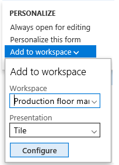

---
# required metadata

title: Personalize the user experience
description: This topic explains how you can personalize the app.
author: jasongre
manager: AnnBe
ms.date: 06/11/2019
ms.topic: article
ms.prod: 
ms.service: dynamics-ax-applications
ms.technology: 

# optional metadata

ms.search.form: SysUserSetup, DefaultDashboard
# ROBOTS: 
audience: Application User, IT Pro
# ms.devlang: 
ms.reviewer: sericks
ms.search.scope: Core, Operations
# ms.tgt_pltfrm: 
ms.custom: 62363
ms.assetid: 57b445d7-3e9e-4228-8728-f63b9dbd77a3
ms.search.region: Global
# ms.search.industry: 
ms.author: jasongre
ms.search.validFrom: 2016-02-28
ms.dyn365.ops.version: AX 7.0.0

---

# Personalize the user experience

[!include [banner](../includes/banner.md)]

This topic explains how you can personalize the app.

There are three basic classes of personalizations.

- Personalizations made on a setup page. Examples include the color theme and time zone.
- Personalizations related to page usage, called *implicit* personalizations. For example, the system keeps track of the width of grid columns if you adjust them, and the expanded or collapsed state of FastTabs.
- Personalizations a user makes to modify the appearance of a page by changing the way an element appears or acts on that page, often through an interactive personalization mode. These personalizations are called *explicit* personalizations. For example, the user might add, hide, or reorder elements on the page.

Every personalization that a user makes is for that user only, regardless of type of personalization or the company that the user is currently interacting with. The changes that one user makes to a page don't affect other users in the system.

## System-wide options for the current user

The **User options** page contains several system-wide settings for the current user. To open the **User options** page, select the **Settings** menu (the gear symbol) on the navigation bar, and then select **User options**. The **User options** page has four tabs that contain various user settings:

- **Visual** – Select a color theme and the default size of elements on pages.
- **Preferences** – Select default values that are used every time that you open the system. These values include the company, the initial page, and the default view/edit mode. (The view/edit mode determines whether a page is locked for viewing or opened for editing every time that you open it.) This tab also includes options for the language, the time zone, and the date, time, and number format. Finally, this tab includes several miscellaneous preferences that vary from release to release.
- **Account** – Adjust your user name and other account-related options.
- **Workflow** – Select workflow-related options.

In addition to modifying your user settings, you can also view and delete your usage data and personalizations by clicking the **Usage data** button. When you use the application, many of your selections are remembered to make the system easier for you to use in the future. The **Personalization** tab, in particular, allows you to view and manage the personal changes that you have made to pages in the system. Feature callouts, the pop-up windows that introduce you to new features in the system (available in Platform update 26), can also be reset from this tab so that you are again alerted about previously encountered features.  

## Implicit personalizations

Implicit personalizations are personalizations that you make just by interacting with controls that "remember" their current visible state.

- **Grid columns** – You can adjust the width of a column in a grid by selecting the sizing bar to the left or right of the column header, and then sliding it left or right until the column is the desired width. The app stores the width that you set for a column. It then resizes the column to that width every time that you open the page that includes that grid.
- **FastTabs** – Some pages have expandable sections that are known as *FastTabs*. The app stores information about the FastTabs that you've expanded and collapsed. Then, every time that you return to the page, the same FastTabs will be either expanded or collapsed, based on your last interaction with the page. In some cases, you can help improve system performance by collapsing a FastTab, because the app doesn't have to retrieve the information for that FastTab until the FastTab is expanded. As explained later this topic, you can also change the order of the FastTabs on a page.
- **Fact Boxes** – Some pages have a section that is known as a *Fact Box pane*. This pane contains read-only information that is related to the current subject of the page. Each section in the Fact Box pane is known as a *Fact Box*. You can hide or show the whole Fact Box pane, and you can also expand or collapse individual Fact Boxes. The app stores your preferences. Then, every time that you return to the page, the state of the Fact Box pane and the individual Fact Boxes will be restored, based on your last interaction with the page. In some cases, you can help improve system performance by collapsing a Fact Box, because the app doesn't have to retrieve the information for that Fact Box until the Fact Box is expanded.
- **Action Panes** – An *Action Pane* appears near the top of most pages. The Action Pane contains buttons for many of the actions that you can perform on the current page. These buttons are often organized on tabs. You can pin open the entire Action Pane, or you can have it collapsed by default. Then, the next time that you open the page, the app will restore the pinned state of the Action Pane. If the Action Pane is pinned open, the app will also show the tab of actions you last used.
- **QuickFilters** – A *QuickFilter* appears above many grids. The QuickFilter lets you filter the grid, based on a column that you select. The app stores the column that you filtered on. Then, the next time that you open the page that includes that grid, the grid will be filtered on the same column. However, you can then filter the grid on a different column.
- **Column header filters** – When you filter a grid by using the *Column header filters*, you can change the filter operator as you require to find the data that you want. For example, you can change the operator from **begins with** to **is exactly**. Every time that you use a column header filter and modify the filter operator, the app stores the change. It will then restore filter operator the next time that you filter on that column.
- **Navigation pane** – You can open the *Navigation pane* by selecting the **Menu** button in the left pane of any page. (The **Menu** button is sometimes referred to as the *hamburger*, *hamburger menu*, or *hamburger button*.) You can pin the Navigation pane open, or you can keep it collapsed by default. After you pin the Navigation pane open, the app will keep it open until you collapse it.

## Explicit personalizations

Different people and companies have a different perspective on the data that is most important to them, or the data that they don't require for the way that they run their business. You can tailor the way that your information is ordered and interacted with. You can also specify that some information should be hidden. These capabilities are key to a personal and productive experience and are examples of explicit personalizations. Explicit personalizations are personalizations that you make explicitly, with the intention of changing the appearance or behavior of an element or page.

### Shortcut menu options

Shortcut menus provide a few ways to explicitly change a page to better suit your requirements or the requirements of your company. (A shortcut menu is also known as a *right-click menu* or *context menu*.)

Some of the most typical and important changes that can be made to a page are available directly as options on a shortcut menu. For example, starting in Platform update 17, if you want to add or hide columns in a grid, just right-click a grid column header, and then select **Add columns** or **Hide this column**.

Additionally, the most basic types of explicit personalization are available by right-clicking an element and then selecting **Personalize**. (Note that not all elements on your page can be personalized.) When you use this method of personalization, the element's property window appears.

You can use the property window to personalize an element in the following ways:

- Change the element's label.
- Hide the element so that it isn't shown on the page. The data in the field isn't deleted or modified. The information just doesn't appear on the page any longer.
- Include the information in the FastTab summary section (if the element is on a FastTab).
- Skip the field when you press Tab to move among the fields on the page.
- Prevent data in the field (for any record) from being edited.

The property window might include other personalization capabilities, depending on the element. For example, the property window for a tile might let you promote that tile to a dashboard, and the property window for a dashboard might let you create a new workspace on that dashboard.

### The Personalization toolbar

If you want to make multiple changes to a page or make changes that aren't available through other mechanisms (such as reordering elements), you can use the **Personalization** toolbar. To open the **Personalization** toolbar, select **Personalize this form** in an element's property window. You can also select **Personalize this form** in the **Personalize** group on the **Options** tab of each page's Action Pane.

#### Navigating the page

Your ability to navigate the page while the **Personalization toolbar** is open depends on the platform version that you are running.

- Prior to Platform update 19, while the **Personalization** toolbar is open, the page is read-only (you cannot enter anything) and non-interactive (you can only make changes to the visible elements on the page). If you want to make changes to elements inside a collapsed section or on a different tab, you need to close the **Personalization** toolbar, expand a section or switch to the desired tab, and then reopen the **Personalization** toolbar.

- Starting in Platform update 19, if the **Personalization** toolbar is open, the page is still read-only but is much more interactive. Specifically, you can expand or collapse the FactBox pane, switch tabs, and expand or collapse sections while the **Personalization** toolbar is open in the same manner as you typically would on the page. To apply a personalization change to a collapsible section or tab (such as to hide a FastTab), you will trigger the button that appears beside the collapsible section or tab when it gains keyboard focus or when you hover over it.

#### Personalization tools

The following tools are available on the **Personalization** toolbar:

- Use the **Select** tool to select and change the properties of an element. Select the **Select** tool, and then select the element to modify the properties of. When you select an element, the element's property window appears, and you can modify any of the properties of that element. You can repeat the process for other elements that can be personalized on that page. However, because of the way that some elements are used, the app won't let you change some of their properties. Therefore, when you select an element, you might see that some of its properties can't be modified. For example, you can't hide a field that is required.
- Use the **Move** tool to move an element to a different location within the current group of elements. (You can't move an element outside its parent group). Select the **Move** tool, and then select the element to move. When you select an element, the app scans the page to determine where the element can be moved. It then creates a series of "drop zones." As you drag the element around within the current group, each "drop zone" is shown as a colored, bold line next to the area where the element can be dropped.
- Use the **Hide** tool to hide an element on the page. Select the **Hide** tool, and then select the element to hide. When you select the **Hide** tool, all elements that are currently hidden are made visible and are shown in a shaded container. You can then unhide them. By selecting the **Select** tool, you can see how the page will look when the selected elements are hidden.

    - Starting in Platform update 18, you can hide required fields and sections that contain required fields. This allows you to create a simplified experience where required fields that are defaulted by business logic are not shown. Hidden required fields are also temporarily made visible if they are empty when a save is attempted.

- Use the **Summary** tool when you want an element to appear in the FastTab summary section. The Summary tool applies only to fields that are on a FastTab section. When you select the **Summary** tool, all fields that have been selected as summary fields are shown in a shaded container. You can interactively add fields to the FastTab summary and remove fields from the FastTab summary by selecting the fields.
- Use the **Skip** tool to remove an element from the page's keyboard tab sequence. When you select the **Skip** tool, all elements that are currently skipped are shown in a shaded container. You can then make them part of the tab sequence again.
- Use the **Edit** tool to mark an element as either editable or not editable. When you select the **Edit** tool, all elements that are currently non-editable are shown in a shaded container. You can then make them editable again. Note that some fields are required and can't be made non-editable. A padlock symbol appears next to those fields.
- Use the **Insert** button to see a list of elements that can be inserted on a page.

    - Select the **Field** tool under **Insert** to add a field to your page. When you use the **Field** tool, you can add only fields that are part of the page definition but that aren't currently shown on the page. For information about how to create new fields that aren't part of the current page definition, see [Custom fields](user-defined-fields.md). After you select the **Field** tool, you must first select the group or area where you want to add a field. A dialog box shows the list of fields that are related to the selected group or area. In the dialog box, select one or more fields to add, and then select **Insert**. To remove a field that you previously added, repeat the process, but clear the selection of the field in the dialog box.
    - Select the **PowerApp** tool under **Insert** to embed an app that was created by using Microsoft PowerApps into the page. For detailed information about how to embed a PowerApps app into a page, see [Embed PowerApps](embed-power-apps.md).

- Select the **Manage** button to view a list of management options that are related to all personalizations for the current page.

    - Select **Clear** to reset the page to its default, installed state. All personalizations on the current page are cleared. There is no undo action. Therefore, use this option only if you're sure that you want to reset the page.
    - Select **Import** to load a personalization from a file that you or someone else previously created for the page. All your current personalizations for the page are replaced with the personalizations from the selected file.
    - Select **Export** to save your personalizations for the page to a file. You can share your personalizations with other users. Those users just have to import the file that contains your personalizations for the page.

- Select the **Close** button to close the **Personalization** toolbar and return the page to its previous interactive state.

When the **Personalization** toolbar is used, save operations are implicit. Your personalizations take effect as soon as you make them, and you don't have to select a **Save** button. In some cases, when you select a tool, a padlock symbol appears next to an element. This symbol indicates that you can't modify the element properties that are related to the selected tool, because changes to those properties will prevent the page from working correctly.

### Adding a tile, list, or link to a workspace

For some pages that include lists, an additional personalization feature is available. The **Add to workspace** button in the **Personalize** group on the **Options** tab of the Action Pane lets you show the information from the current list in a specific workspace. You can show a filtered and sorted view of the information in the workspace, or you can show the default view. You can also specify whether the information appears in the workspace as a list, as a summary tile that can show the number of items in the list, or as a link.

- To add a list to a workspace, first sort or filter the list on the page so that it shows the information as you want it to appear in the workspace. Then select **Add to workspace**. Select a workspace, and then, in the **Presentation** field, select **List**. After you select **Configure**, a dialog box appears, where you can select the columns that should appear in the list in the workspace. You can also specify the label to use for the list in the workspace.
- To add a tile to a workspace, first filter the list on the page so that it shows the data that you want to be summarized or that want quick access to. Then select **Add to workspace**. Select a workspace, and then, in the **Presentation** field, select **Tile**. After you select **Configure**, a dialog box appears, where you can specify the label to use for tile in the workspace. You can also specify whether the tile should show a count. After the tile is added to the workspace, you can select it to open the current page from the workspace and view the filtered list that is associated with the tile.
- To add a link to a workspace, first filter the list on the page so that it shows the data that you're interested in. Then select **Add to workspace**. Select a workspace, and then, in the **Presentation** field, select **Link**. After you select **Configure**, a dialog box appears, where you can specify the label to use for the link. You can also optionally specify a label for a new section that will contain this link.

After your list, tile, or link has been added to a workspace, you can open that workspace and reorder the elements in it as you want.

### Adding a summary from a workspace to a dashboard

Some workspaces contain count tiles (that is, tiles that have numbers on them), and you might want those tiles to appear on your dashboard too. In a workspace, right-click a count tile, and then select **Personalize**. Then, in the tile's property window, select **Pin to dashboard**. The next time that you open (and refresh) the selected dashboard, the count will appear below the navigation tile for that workspace. You can select that count to go directly to the data that it represents.

### Personalizing your dashboard

The dashboard is often the first page that you see when you open the app. You can personalize the dashboard so that it shows only the workspace tiles that you want to see. You can also rearrange the tiles so that they are in the order that you prefer to see them in, rename your workspace navigation tiles, or add a completely new workspace tile.

To personalize the dashboard, right-click any tile, and then select **Personalize** to open the tile's property window.

- If you want to hide or rename the selected tile, you can make that change directly in the property window.
- To reorder the workspace tiles, in property window, select **Personalize this form** to open the **Personalization** toolbar. You can then use the **Move** tool to arrange the tiles as you want.
- To create a new workspace tile, in the property window, select **Add a workspace**. A new workspace tile is created at the bottom of the dashboard. You can rename this new workspace tile as you want. You can also add lists, tiles, and links to the workspace as described in the [Adding lists, tiles, or links to workspaces](personalize-user-experience.md#adding-a-tile-list-or-link-to-a-workspace) section of this topic.

## Administration of personalization

After you personalize a page, you can share your personalizations with other users by exporting the personalized page. You can then ask other users to open the personalized page and import the personalization file that you created. Alternatively, you can give your personalization to a user who has administrator privileges. That user can then apply your personalization file to many users at the same time.

Users who have administrator privileges can also manage personalizations for other users on the **Personalization** page. This page has four tabs:

- **Apply** – You can import or select a personalization for one or more users. To apply a personalization to one or more users, first select a role and users who have that role. Then either select an existing personalization to apply to the selected users, or import a personalization file. The personalization is validated and will be applied to all the selected users the next time that they open the selected page.
- **Clear** – You can clear all personalizations for a page or workspace for one or more users. First select a page or workspace to see a list of the users who have personalized it. Then select the users who should have personalizations for that page or workspace cleared, and select **Clear**. All personalizations that the selected users have applied to the selected page or workspace are deleted. This action can't be undone. However, if a personalization was saved for the page or workspace, that personalization can be reimported.
- **Manager per user** – Select a user to see the list of pages that the user has personalized. You can then enable or disable the selected user's ability to use personalizations for specific pages, or for the entire system. You can also import, export, or clear a personalization for the selected user. In addition, you can reset feature callouts for the selected user, which will make all previously dismissed pop-up windows that introduced new features display again the next time that the user encounters those features.   
- **System** – You can temporarily disable all personalizations for all users in the system. In this case, the personalizations are deleted. All pages are just reset to their default state for all users. If you re-enable personalization later, all personalizations will be reapplied. You can also permanently delete all personalizations for all users in the system. There is no way to recover personalizations that have been deleted. Therefore, before you perform this task, be sure to export any personalizations that you might want later.

## Personalization of inventory dimensions

When you personalize the setup of inventory dimensions on a page, consider the settings that have been created by using the **Display dimension** option. For example, you use personalization to hide a column for the Batch number inventory dimension, but the column appears the next time that the page is opened. This behavior occurs because the **Dimension display** settings control the inventory dimension columns that are shown.

The **Dimension display** settings apply across all pages and override any personalized setup of inventory dimension fields on each individual page.

As a result, in the preceding example, if you don't want the column for the Batch number inventory dimension to appear on a page, you must clear that dimension as part of the **Display dimensions** option for that page.
