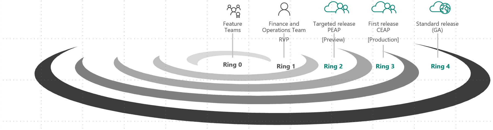

---
# required metadata

title: Standard and targeted service updates
description: This topic provides information about the different release options for Microsoft Dynamics 365 for Finance and Operations.
author: meeramahabala
manager: AnnBe
ms.date: 12/07/2018
ms.topic: article
ms.prod: 
ms.service: dynamics-ax-platform
ms.technology: 

# optional metadata

# ms.search.form: 
# ROBOTS: 
audience: IT Pro
# ms.devlang: 
ms.reviewer: sericks
ms.search.scope: Operations
# ms.tgt_pltfrm: 
ms.custom: 
ms.assetid: 
ms.search.region: Global
# ms.search.industry: 
ms.author: meeram
ms.search.validFrom: 2017-10-31
ms.dyn365.ops.version: Platform update 11
---

# Standard and First release service updates

[!include [banner](../includes/banner.md)]

With Dynamics 365 for Finance and Operations, you receive new service updates and features monthly instead of doing expensive upgrades every few years. You can manage how your organization receives these updates. For example, you can sign up for an early release so that your organization receives updates first. You can designate that only certain environments receive the updates. Or, you can remain on the default release schedule and receive the updates later. This topic explains the different release options and how you can use them for your organization.

*Service updates* contain both application (including Financial reporting and Retail) and platform changes that are critical improvements to the service, including regulatory updates. New features will be included in service updates. 

## Release processes
Each new release is designed and developed by the Dynamics 365 for Finance and Operations team. Any new release is first tested and validated by the feature team, then by the entire Dynamic 365 for Finance and Operations and Retail teams. During this time, extensive testing is done on various test topologies. A compatibility checker also runs tests to ensure backward compatibility. In addition, several customer databases and code are benchmark-tested with automation to ensure no breaks.

- Ring 2 is a targeted release. This release is available to partners, customers, and ISVs who opt in through the [Insider program](https://experience.dynamics.com/) and join the Preview Early Access Program (PEAP). During a targeted release, Microsoft monitors telemetry, collects feedback, and further validates quality by monitoring key metrics. During this phase, the release must be deployed on Dev/Test environments. In this preview phase, partners, customers, and ISVs use the release to validate their customizations and provide feedback. This release cannot be used in production.

- Ring 3 is a production-ready, *first release* for customers who opt in. During this phase, customers have the option of taking the release all the way to production and can choose between Microsoft managing the update or self-managing the update. Participating in the First release program has the benefit of having the Microsoft engineering team closely monitoring the update for any aberrations to ensure a successful update.

- Ring 4 is the final, default ring and is available to all customers. Microsoft will manage and update all environments based on the configured maintenance window.

The releases are shown in the following image.

## Standard release (Ring 4)
The standard release, or Ring 4, is the default option. With this release, you can access the most recent release of Finance and Operations when it is released to all customers. In the standard release, you configure the update day and time to ensure predictability. You can also designate an environment for user-acceptance testing (UAT). This environment is updated five business days prior to updating the production environment. Please see [One Version service updates FAQ](https://docs.microsoft.com/en-us/dynamics365/unified-operations/fin-and-ops/get-started/one-version) for more details.

## First release (Ring 3)
With the First release, Microsoft makes available the latest production-ready service update to customers:

- **First release auto update** – In this program, Microsoft manages the update to both UAT and production environments. In this program you will be informed of an upcoming update followed by a subsequent update to a specified Tier 2 sandbox. Participants can then work in the new environment while providing feedback directly to Microsoft. The participants will receive direct support from Microsoft for any issues that are submitted. This is followed by applying the validated update to production in a subsequent week. You can sign up for the program through the [Insider program](https://experience.dynamics.com/)

- **First release self-update** – In this program, you will have early access to the production-ready update and can choose to apply it on an environment of your choice (sandbox or production). Applying the update is managed by the customer and issues can be reported to Microsoft. This program has the advantage of providing additional time for validation if needed. The signup option for this program will be available through LCS.

## Targeted release (Ring 2)
Preview early access program (PEAP) is available for customers, partners, and ISVs to deploy into their sandbox. The participant is required to self-update to the latest service update in this timeframe. The participants can raise issues to Microsoft. This has the additional value of testing updates early, prior to updating the production environments.

## Access targeted releases or First release 
If you are interested in participating in the targeted or first releases of Finance and Operations and would like to learn more about the available options, see the [Insider program](https://experience.dynamics.com/).
