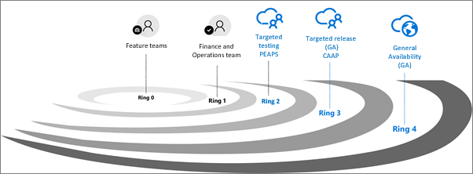

---
# required metadata

title: Standard and targeted platform releases
description: 
author: kfend
manager: AnnBe
ms.date: 01/29/2018
ms.topic: article
ms.prod: 
ms.service: dynamics-ax-platform
ms.technology: 

# optional metadata

# ms.search.form: 
# ROBOTS: 
audience: IT Pro
# ms.devlang: 
ms.reviewer: kfend
ms.search.scope: Operations
# ms.tgt_pltfrm: 
ms.custom: 
ms.assetid: 
ms.search.region: Global
# ms.search.industry: 
ms.author: kfend
ms.search.validFrom: 2017-10-31
ms.dyn365.ops.version: Platform update 11
---

# Standard and targeted platform releases

[!include[banner](../includes/banner.md)]

With each platform release of Microsoft Dynamics 365 for Finance and Operations, Enterprise edition, you receive new platform updates and features as they become available. This release cycle makes it easy to stay up to date on the most current version, instead of completing a mass update every few years. You can manage how your organization receives these updates. For example, you can sign up for an early release so that your organization receives updates first, or you can remain on the default release schedule and receive the updates later. This topic provides information about the different release options.

## Release processes
Each new release is designed and developed by the Dynamics 365 Finance and Operations team. The first release after development is complete is a targeted release. During this targeted release, Microsoft collects feedback and further validates quality. The next release is a generally available (GA) targeted release for customers who opt in. After the targeted general availability, the new release is made available to all customers. This series of progressive validation is in place to make sure that the release is as robust as possible. The releases are shown in the following graphic.

### Standard release
The standard release is the default option. With this release you can access the most recent release of Finance and Operations when it is released to all Finance and Operations customers. 

### Targeted release to CAAP
With a targeted release, Microsoft automatically deploys the latest platform update to a specified Tier 2 sandbox. Continuous Auto-update Advantage Program (CAAP) participants can then work in the new environment while providing feedback directly to Microsoft. CAAP participants will receive direct support from Microsoft for any issues that are submitted. 

### Access targeted releases for customers
If you are interested in participating in the targeted releases of Finance and Operations and would like to learn more about the CAAP program, see the [CAAP nomination site](https://aka.ms/CAAPNomination).

