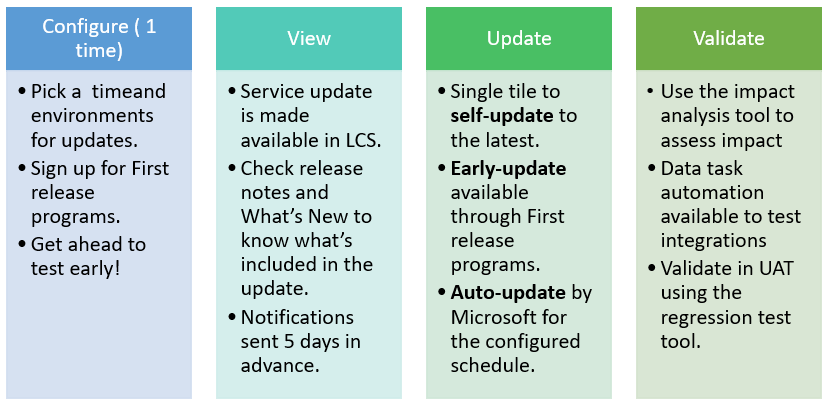

---
# required metadata

title: Standard and targeted service updates
description: 
author: meeramahabala
manager: AnnBe
ms.date: 11/19/2018
ms.topic: article
ms.prod: 
ms.service: dynamics-ax-platform
ms.technology: 

# optional metadata

# ms.search.form: 
# ROBOTS: 
audience: IT Pro
# ms.devlang: 
ms.reviewer: sericks
ms.search.scope: Operations
# ms.tgt_pltfrm: 
ms.custom: 
ms.assetid: 
ms.search.region: Global
# ms.search.industry: 
ms.author: meeram
ms.search.validFrom: 2017-10-31
ms.dyn365.ops.version: Platform update 11
---

# Standard and targeted service updates

[!include [banner](../includes/banner.md)]

With Dynamics 365 Finance and Operations, you receive new service updates and features monthly instead of doing expensive upgrades every few years. You can manage how your organization receives these updates. For example, you can sign up for an early release so that your organization receives updates first. You can designate that only certain environments receive the updates. Or, you can remain on the default release schedule and receive the updates later. This article explains the different release options and how you can use them for your organization.

Service updates will contain application (including financial reporting and Retail) and platform changes that are critical improvements to the service including regulatory updates. New experiences will be opt-in. 

## Release processes
Each new release is designed and developed by the Dynamics 365 Finance and Operations team. Any new release is first tested and validated by the feature team, then by the entire Dynamic 365 Finance and Operations and Retail teams. During this time extensive testing is done on various test topologies. A compatibility checker runs tests to ensure backward compatibility. Further several customer data bases and code are benchmark tested with automation to ensure no breaks.

The first release after development is complete is a **targeted release**.
This release is available to customers who opt-in through the [insider program](https://experience.dynamics.com/). During this targeted release, Microsoft monitors telemetry, collects feedback and further validates quality by monitoring key metrics. There are two phases of the targeted release. In the first phase, preview phase, partners customers and ISVs use the release to validate their customizations and provide feedback. This release cannot be used in production.

The next release is the first release for customers who opt in. After the targeted general availability, the new release is made available to all customers. This series of progressive validation is in place to make sure that the release is as robust as possible. The releases are shown in the following graphic.

### Standard release
The standard release is the default option. With this release you can access the most recent release of Finance and Operations when it is released to all Finance and Operations customers. In the standard release you configure the update date and time to ensure predictability. You can also designate an environment for user acceptance testing. This environment is updated prior to updating the production environment.

### First release
With a targeted release, Microsoft makes available the latest production service update to a specified Tier 2 sandbox. Customers can participate in this program know as partner early access program (CEAP). Participants can then work in the new environment while providing feedback directly to Microsoft. CEAP participants will receive direct support from Microsoft for any issues that are submitted.  This is followed by applying the validated update to Production in a subsequent week.

### Targeted release 
Preview early access program (PEAP) is available for customers, partner and ISVs to deploy into their sandbox and/ or production. The participant is required to self-update the to the latest service update in this timeframe. The participants can raise issues to Microsoft. This has the additional value of testing updates early prior to updating the production environments.

### Service update experience
All service updates will have a ONE-V experience of Onboard->Notice->Execute->Validate.

### Access targeted releases for customers
If you are interested in participating in the targeted releases of Finance and Operations and would like to learn more about the CEAP or PEAP program, see the [Insider program](https://experience.dynamics.com/).

