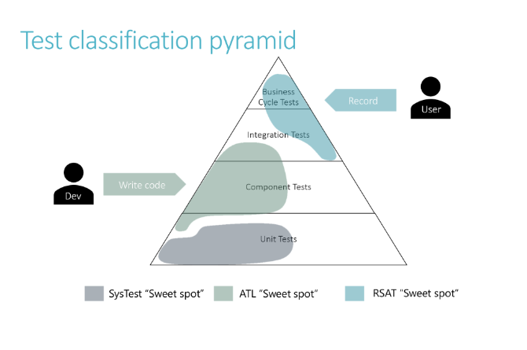

---
# required metadata

title: Recommendations for data agnostic testing using the Regression Suite Automation Tool
description: This 
author: kfend
manager: AnnBe
ms.date: 09/11/2019
ms.topic: article
ms.prod: 
ms.service: dynamics-ax-platform
ms.technology: 

# optional metadata

# ms.search.form:
# ROBOTS: 
audience: Application User, Developer, IT Pro
# ms.devlang: 
ms.reviewer: sericks
ms.search.scope: Core, Operations
# ms.tgt_pltfrm: 
ms.custom: 21761
ms.search.region: Global
# ms.search.industry: 
ms.author: kfend
ms.search.validFrom: 2019-09-11
ms.dyn365.ops.version: AX 7.0.0, Operations

---

# Recommendations for data agnostic testing using the Regression Suite Automation Tool

[!include [banner](../includes/banner.md)]

While the functional validation of an ERP application can’t be fully data agnostic, there are multiple phases and approaches for testing, some of which are defined in the below diagram.  

Where Unit Tests & Component tests are low level tests and can fully be data agnostic (i.e. not dependent on existing dataset), the Business Cycle tests or the regression validation tests are dependent on some existing data. However, these tests can become data agnostic when we consider some of the following approaches.  
The tests are dependent on the existing setup, configuration settings (parameters) only and occasionally on master data (customer, vendors, items, etc.) but never on the transaction data. Make sure that during the test, if we are changing any of these, we revert it back as part of the test in the end.  
 
Select the master data based on certain criteria instead of selecting a particular record (e.g. if you want to select an item based on its dimension values and stock availability, filter the product list with those values and select the first item and copy the number to be used for future tests). If it’s a simple master data such as customer, vendor, item etc., it can be created as part of the automation and used in future tests through chaining. 
 
Enter the unique identifiers (such as invoice numbers) either through number sequence or using Excel functions such as =TEXT(NOW(),"yyyymmddhhmm"). This function will get a unique number every minute and we can also track when the action happened. This can be used for variables such as Product Receipt numbers, Vendor Invoice Numbers so that the tests continue to work on the same DB again and again without requiring to restore.  
 
Always set the Edit mode of the environment to Read or Edit as the first test case because the default option is Auto which remembers the previous setting and can cause unreliable tests. 
 
 
 
Only do a validation after filtering on a particular transaction instead of generic validation. E.g. for number of records, filter for the transaction number you did or the date you did the transaction so that the validation excludes all other transactions. 
 
If you are checking customer balance, budget check etc., save the value first and then add your transaction value to validate the expected result instead of validating a fixed expected value. 
 
 
