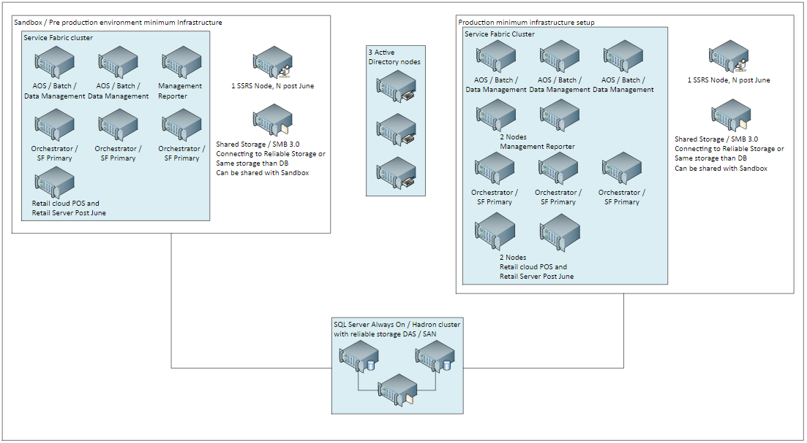

---
# required metadata

title: System requirements for on-premises deployments
description: This topic lists the system requirements for the current version of Microsoft Dynamics 365 for Finance and Operations, Enterprise edition, for on-premises deployments.
author: kfend
manager: AnnBe
ms.date: 01/11/2018
ms.topic: article
ms.prod: 
ms.service: dynamics-ax-platform
ms.technology: 

# optional metadata

# ms.search.form: 
# ROBOTS: 
audience: Application User, Developer, IT Pro
# ms.devlang: 
ms.reviewer: kfend
ms.search.scope: Core, Operations
# ms.tgt_pltfrm: 
ms.custom: 55651
ms.assetid: 
ms.search.region: Global
# ms.search.industry: 
ms.author: kfend
ms.search.validFrom: 2016-08-30
ms.dyn365.ops.version: Platform update 8

---

# System requirements for on-premises deployments

[!include[banner](../includes/banner.md)]

This topic lists the system requirements for the current version of Microsoft Dynamics 365 for Finance and Operations, Enterprise edition, for on-premises deployments. Before you install Finance and Operations, when this step is appropriate, verify that the system that you're working with meets or exceeds the minimum network, hardware, and software requirements.

## Network requirements
Microsoft Dynamics 365 for Finance and Operations, Enterprise edition (on-premises) can work on networks that use Internet Protocol Version 4 (IPv4) or Internet Protocol Version 6 (IPv6). Consider the network environment when you plan your system, and use the following guidelines.

### Network response time
The following table lists the minimum network requirements for the connection between the web browser and Application Object Server (AOS), and for the connection between AOS and the database in an on-premises system.

| Value     | Web browser to AOS                      | AOS to database |
|-----------|-----------------------------------------|------------------------------------------------------------------------------------------|
| Bandwidth | 50 kilobytes per second (KBps) per user | 100 megabytes per second (MBps) |
| Latency   | Less than 250–300 milliseconds (ms)     | Less than 1 ms (local area network [LAN] only). AOS and the database must be co-located. |

- Finance and Operations (on-premises) is designed for networks that have a latency of 250–300 milliseconds (ms) or less. This latency is the latency from a browser client to the datacenter that hosts Finance and Operations.
- Bandwidth requirements for Finance and Operations (on-premises) depend on your scenario. Typical scenarios require a bandwidth of more than 50 KBps between the browser and the Finance and Operations server. However, we recommend higher bandwidth for scenarios that have high payload requirements, such as scenarios that involve workspaces or extensive customization. The specific amount of bandwidth depends on use.

Deployments where AOS and the Microsoft SQL Server database are in different datacenters aren't supported. AOS and the SQL Server database must be co-located. 

In general, Finance and Operations is optimized to reduce browser-to-server round trips. The number of round trips from a browser client to the datacenter is either zero or one for each user interaction, and the payload is compressed.

> [!WARNING]
> Don't calculate bandwidth requirements from a client location by multiplying the number of users by the minimum bandwidth requirements. The concurrent usage of a given location is very difficult to calculate. We recommend that you use a real-life simulation against a non-production environment of Finance and Operations as the best gauge of performance for your specific case. 

### LAN environments
In LAN environments, Microsoft Remote Desktop in Microsoft Windows Server isn't required in order to connect to Finance and Operations. However, Remote Desktop might be required for servicing operations on the virtual machines (VMs) that make up the server deployments.

### WAN environments
In wide area network (WAN) environments, Remote Desktop in Windows Server isn't required in order to connect to Finance and Operations.

### Internet connectivity requirements
Finance and Operations (on-premises) doesn't require internet connectivity from user workstations. However, some features won't be available if there is no internet connectivity.

|                    |   |
|--------------------|---|
| **Browser client** | An intranet scenario without internet connectivity is a design point for the on-premises deployment option. Some features that require cloud services won't be available, such as Help and Task guide libraries in Microsoft Dynamics Lifecycle Services (LCS). |
| **Server**         | The AOS or Microsoft Azure Service Fabric tier must be able to communicate with LCS. The on-premises browser-based client doesn't require internet access. |
| **Telemetry**      | Telemetry data might be lost if there are long interruptions in connectivity. Interruptions in connectivity to LCS don't affect the on-premises application functionality. |
| **LCS**            | Connectivity to LCS is required for deployment, code deployment, and servicing operations. |

## Telemetry data transfer to the cloud
Most telemetry data is stored locally and can be accessed by using Event Viewer in Microsoft Windows. A small subset of telemetry events is transferred to the Microsoft telemetry pipeline in the cloud for diagnostics. Customer data and user-identifiable data aren't part of the telemetry data that is sent to Microsoft. VM names are sent to Microsoft to help with environment management and diagnostics from the LCS portal.

## Domain requirements
Consider the following domain requirements when you install Finance and Operations (on-premises):

- VMs that host Finance and Operations (on-premises) components must belong to an Active Directory domain. Active Directory Domain Services (AD DS) must be configured in native mode.
- VMs that run Finance and Operations (on-premises) components must have access to each other. This access is configured in AD DS. 
- The domain controller must be Microsoft Windows Server 2012 R2 or later, and the domain functional level must be 2012 R2 or more.

## Hardware requirements
This section describes the hardware that is required in order to run Finance and Operations (on-premises).

The actual hardware requirements vary, based on the system configuration, the data composition, and the applications and features that you decide to use. Here are some of the factors that can affect the choice of appropriate hardware for Finance and Operations (on-premises):

- The number of transactions per hour
- The number of concurrent users

## Minimum infrastructure requirements
Finance and Operations (on-premises) uses Service Fabric to host the AOS, Batch, Data management, Management reporter, and Environment orchestrator services. 

SQL Server must have a high-availability HADRON setup that has at least two nodes for production use.

The following illustration shows the minimum number of nodes that is recommended for your Service Fabric cluster.

 

## Processor and RAM requirements
The following tables list the number of processors and the amount of random-access memory (RAM) that are required for each role that is required in order to run this deployment option. For more information, see the recommended minimum requirements for a Service Fabric standalone cluster in [Plan and prepare your Service Fabric cluster](/azure/service-fabric/service-fabric-cluster-standalone-deployment-preparation).

> [!NOTE]
> If other Microsoft software is installed on the same computer, the system must also comply with the hardware requirements for that software. If other server applications are installed on the same computer as AOS, we recommend that you limit those server applications 1 gigabyte (GB) of RAM.

**Sizing by role and topology type**

| Topology   | Role (node type)              | Recommended processor cores | Recommended memory (GB) |
|------------|-------------------------------|-----------------------------|-------------------------|
| Production | AOS, Data management, Batch   | 8                           | 24                      |
|            | Management Reporter           | 4                           | 16                      |
|            | SQL Server Reporting Services | 4                           | 16                      |
|            | Orchestrator                  | 4                           | 16                      |
| Sandbox    | AOS, Data management, Batch   | 4                           | 24                      |
|            | Management Reporter           | 4                           | 16                      |
|            | SQL Server Reporting Services | 4                           | 16                      |
|            | Orchestrator                  | 4                           | 16                      |

**Minimum sizing estimates for production and sandbox deployments\***

| Topology                                        | Role                          | Number of instances |
|-------------------------------------------------|-------------------------------|---------------------|
| Production                                      | AOS (Data management, Batch)  | 3                   |
|                                                 | Management Reporter           | 2                   |
|                                                 | SQL Server Reporting Services | 1                   |
|                                                 | Orchestrator\*\*              | 3                   |
| Sandbox                                         | AOS, Data management, Batch   | 2                   |
|                                                 | Management Reporter           | 1                   |
|                                                 | SQL Server Reporting Services | 1                   |
|                                                 | Orchestrator                  | 3                   |
| *Summary for production and sandbox topologies* |                               | *16*                |

\* The numbers in this table are being validated by our preview customers and might be adjusted based on the feedback from those customers.

\*\* Orchestrator is designated as the primary node type and will also be used to run the Service Fabric services.

**Initial estimates for the back-end SQL Server and AD DS**

<table>
<thead>
<tr>
<th></th>
<th>Role</th>
<th>VMs/instances</th>
<th>Cores</th>
<th>Total cores</th>
<th>Memory per instance (GB)</th>
<th>Total memory (GB)</th>
</tr>
</thead>
<tbody>
<tr>
<td rowspan="3"><strong>Shared infrastructure</strong></td>
<td>SQL Server*</td>
<td>2</td>
<td>8</td>
<td>16</td>
<td>32</td>
<td>64</td>
</tr>
<tr>
<td>File server/Storage area network/Highly available storage</td>
<td colspan="5">
The back-end storage must be based on solid-state drives (SSDs) on a runtime storage area network (SAN).

Size and input/output operations per second (IOPS) throughput is based on the size of the workload.
</td>
</tr>
<tr>
<td>Active Directory</td>
<td>3</td>
<td>4</td>
<td>12</td>
<td>16</td>
<td>48</td>
</tr>
<tr>
<td><em>Summary for shared infrastructure</em></td>
<td></td>
<td><em>5</em></td>
<td></td>
<td><em>28</em></td>
<td></td>
<td><em>112</em></td>
</tr>
</tbody>
</table>

\* SQL Server sizes are highly dependent on workloads. For more information, see [Hardware sizing for on-premises environments](hardware-sizing-on-premises-environments.md).

## Storage

- **AOS** – Finance and Operations (on-premises) uses a Server Message Block (SMB) 3.0 share to store unstructured data. For more information, see [Storage Spaces Direct in Windows Server 2016](/windows-server/storage/storage-spaces/storage-spaces-direct-overview).
- **SQL** – The following options are viable:

    - A highly available SSD setup
    - A SAN that is optimized for online transaction processing (OLTP) throughputs
    - High-performance direct-attached storage (DAS) 

- **SQL Server and data management IOPS** – The storage for both data management and SQL Server should have at least 2,000 IOPS. Production IOPS depends on many factors. For more information, see [Hardware sizing for on-premises environments](hardware-sizing-on-premises-environments.md).
- **VM IOPS** – Each VM should have at least 100 write IOPS.

## Virtual host requirements
When you set up the virtual hosts for a Finance and Operations (on-premises) environment, see the guidelines in [Plan and prepare your Service Fabric cluster](/azure/service-fabric/service-fabric-cluster-standalone-deployment-preparation) and [Describing a service fabric cluster](/azure/service-fabric/service-fabric-cluster-resource-manager-cluster-description). Each virtual host should have enough cores for the infrastructure that is being sized. Multiple advanced configurations are possible, where SQL Server resides on physical hardware but everything else is virtualized. If SQL Server is virtualized, the disk subsystem should be a fast SAN or the equivalent. In all cases, make sure that the basic setup of the virtual host is highly available and redundant. In all cases, when virtualization is used, no VM snapshots should be taken.

## Software requirements for all server computers
The following software must be present on a computer before any Finance and Operations (on-premises) components can be installed:

- The Microsoft .NET Framework version 4.5.1 or later
- Service Fabric

For more information, see [Plan and prepare your Service Fabric cluster](/azure/service-fabric/service-fabric-cluster-standalone-deployment-preparation).

## Supported server operating systems
The following table lists the server operating systems that are supported for Finance and Operations components.

| Operating system                                     | Notes |
|------------------------------------------------------|-------|
| Microsoft Windows Server 2016 Datacenter or Standard | These requirements are for the database and the Service Fabric cluster that hosts AOS. |

## Software requirements for database servers

- Only 64-bit versions of SQL Server 2016 are supported.
- In a production environment, we recommend that you install the latest cumulative update (CU) for the version of SQL Server that you’re using.
- Finance and Operations (on-premises) supports Unicode collations that are case-insensitive, accent-sensitive, kana-sensitive, and width-insensitive. The collation must match the Windows locale of the computers that are running AOS instances. If you’re setting up a new installation, we recommend that you select a Windows collation instead of a SQL Server collation. For more information about how to select a collation for a SQL Server database, see the [SQL Server documentation](/sql/sql-server/sql-server-technical-documentation).

The following table lists the SQL Server versions that are supported for the Finance and Operations databases. For more information, see the minimum hardware requirements for [SQL Server](https://www.microsoft.com/en-us/sql-server/sql-server-2016).

| Requirement                                                      | Notes |
|------------------------------------------------------------------|-------|
| Microsoft SQL Server 2016 Standard Edition or Enterprise Edition | For the hardware requirements for SQL Server 2016, see [Hardware and Software Requirements for Installing SQL Server 2016](/sql/sql-server/install/hardware-and-software-requirements-for-installing-sql-server). |

## Software requirements for Application Object Server (AOS) 
- SQL Server Integation Services (SSIS)

## Software requirements for Reporting Server (BI)
- SQL Server Reporting Services (SSRS)

## Software requirements for client computers
The Finance and Operations web application can run on any device that has an HTML 5.0–compliant web browser. Here are some of the specific device/browser combinations that Microsoft has confirmed:

- Microsoft Edge (latest publicly available version) on Windows 10
- Internet Explorer 11 on Windows 10, Windows 8.1, or Windows 7
- Google Chrome (latest publicly available version) on Windows 10, Windows 8.1, Windows 8, Windows 7, or Google Nexus 10 tablet
- Apple Safari (latest publicly available version) on Mac OS X 10.10 (Yosemite), 10.11 (El Capitan) or 10.12 (Sierra), or Apple iPad

## Software requirements for Active Directory Federation Services 
Active Directory Federation Services (AD FS) on Windows Server 2016 is required.

The domain controller must be Windows Server 2012 R2 or later, and the domain functional level must be 2012 R2 or more. For more information about domain functional levels, see the following pages:

- [What Are Active Directory Functional Levels](https://technet.microsoft.com/en-us/library/cc787290(v=ws.10).aspx)
- [Understanding Active Directory Domain Services Functional Levels](https://technet.microsoft.com/en-us/library/understanding-active-directory-functional-levels(v=ws.10).aspx)

## Supported Microsoft Office applications
The following Microsoft Office applications are supported in the cloud and on-premises deployments of Finance and Operations:

-   To run the Microsoft Excel and Microsoft Word add-ins, you must have Microsoft Office 2016 for Windows or Mac installed. For more information about version requirements, see [Office integration troubleshooting](../../dev-itpro/office-integration/office-integration-troubleshooting.md).
-   To view documents that are generated by the Export to Excel or Export to Word functionality, you must have Microsoft Office 2007 or later installed.
 
## Hardware and software requirements for Retail components
Currently, Finance and Operations (on-premises) doesn't include the Retail components.
