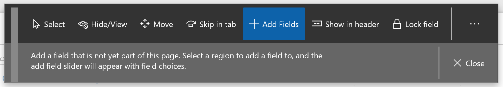

---
# required metadata

title: What's new or changed in Dynamics 365 for Finance and Operations platform update 22
description: This topic describes features that are either new or changed in Dynamics 365 for Finance and Operation platform update 22. 
author: tonyafehr
manager: AnnBe
ms.date: 10/24/2018
ms.topic: article
ms.prod: 
ms.service: dynamics-ax-platform
ms.technology: 

# optional metadata

# ms.search.form: 
# ROBOTS: 
audience: Developer, IT Pro
# ms.devlang: 
ms.reviewer: tfehr
ms.search.scope:  Operations
# ms.tgt_pltfrm: 
ms.custom: 
ms.assetid: b756a61c-52a3-47c5-b579-66b9249c592b
ms.search.region: Global
# ms.search.industry: 
ms.author: tfehr
ms.search.validFrom: 2017-09-30 
ms.dyn365.ops.version: Platform 22

---
# What's new or changed in Dynamics 365 for Finance and Operations platform update 22

[!include [banner](../includes/banner.md)]
[!include [banner](../includes/review-banner.md)]

This topic describes features that are either new or changed in Dynamics 365 for Finance and Operations platform update 22. This version has a build number of XXX.

### Dynamics 365 October '18 release notes
Wondering about upcoming and recently released capabilities in any of our business apps or platform? 

[Check out the October '18 release notes](https://go.microsoft.com/fwlink/?linkid=870424). We've captured all the details, end to end, top to bottom, in a single document that you can use for planning. 

### Platform update 22 bug fixes
For information about the bug fixes included in each of the updates that are part of Platform update 22, sign in to Lifecycle Services (LCS) and view this KB article. XXX

## Extensibility enhancements
The release notes contain information about the [third wave of platform extensibility enhancements for the October 2018 release](/BusinessApplication-ReleaseNotes/October18/dynamics365-finance-operations/platform-extensibility3), which are coming with Platform update 22. There are 10 enhancements detailed.

## Export up to one million rows to Excel
The Export to Excel feature can now be configured to allow users to export up to one million rows from a grid in Finance and Operations, a substantial increase from the previous 10,000 row limit. By default, the export limit is set to 50,000 rows, but through the **Client performance options** page, system administrators can adjust the export limit as high as one million rows.

For more information, see the article on [Troubleshooting the Office integration](/dynamics365/unified-operations/dev-itpro/office-integration/office-integration-troubleshooting.md#why-is-the-export-to-excel-functionality-limited-to-10000-records).

## Improved usability of the navigation pane
The navigation pane is a highly-used navigation mechanism in Finance and Operations that provides access to favorites, recently opened pages, workspaces, and notably the main menu. Because of its high usage, the navigation pane has been enhanced in a few ways to improve its usability. These changes are available starting in Platform Update 22. To learn more, see [Improved usability of the navigation pane](/BusinessApplication-ReleaseNotes/October18/dynamics365-finance-operations/updated-navigation-pane).

## Restyled personalizatin toolbar
The personalization toolbar has been restyled in Platform Update 22 to help users more easily tailor their own experiences in Finance and Operations. The following changes were made: 

-  The name of each personalization tool is now shown along with an icon, which helps users quickly recognize the tool they are interested in using.
-  The description for how to use the current tool is also now shown, which helps users understand how to make the desired personalizations.  
-  The entire personalization toolbar can be moved across the screen by dragging and dropping on a specific region at the far left of the toolbar. This allows users to personalize elements that were previously obscured by the toolbar.   

The following image shows how the personalization toolbar appeared before Platform Update 22.

The following image shows how the personaliation toolbar appears in Platform Update 22 and later.

