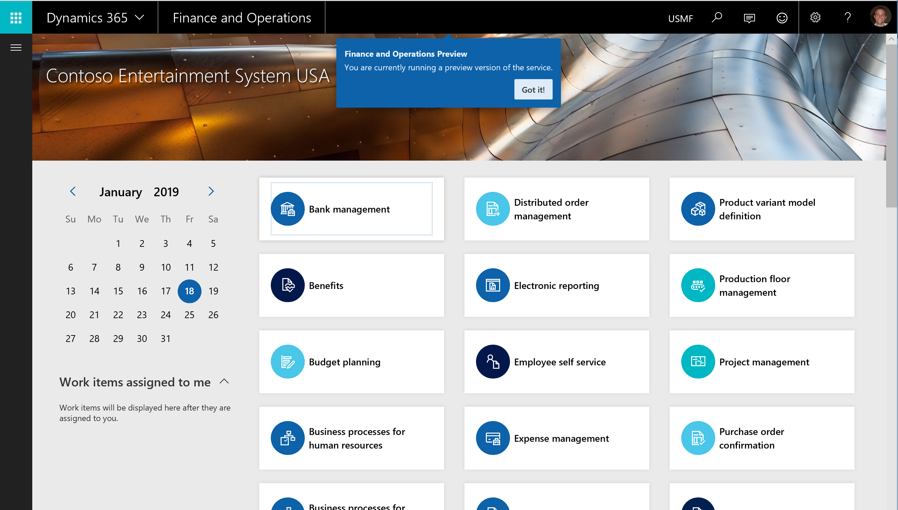
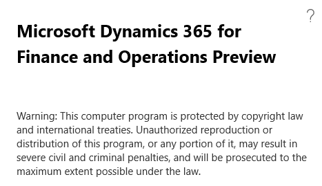

---
# required metadata

title: What's new or changed in Dynamics 365 for Finance and Operations platform update 24 (MONTH 2019)
description: This topic describes features that are either new or changed in Dynamics 365 for Finance and Operation platform update 24 (MONTH 2019). 
author: tonyafehr
manager: AnnBe
ms.date: 01/25/2019
ms.topic: article
ms.prod: 
ms.service: dynamics-ax-platform
ms.technology: 

# optional metadata

# ms.search.form: 
# ROBOTS: 
audience: Developer, IT Pro
# ms.devlang: 
ms.reviewer: tfehr
ms.search.scope:  Operations
# ms.tgt_pltfrm: 
ms.custom: 
ms.assetid:
ms.search.region: Global
# ms.search.industry: 
ms.author: tfehr
ms.search.validFrom: 20189-XX-XX
ms.dyn365.ops.version: Platform 24

---
# What's new or changed in Dynamics 365 for Finance and Operations platform update 24 (MONTH 2019)

[!include [banner](../includes/banner.md)]

[!include [banner](../includes/preview-banner.md)]

This topic describes features that are either new or changed in Dynamics 365 for Finance and Operations platform update 24. This version has a build number of 7.0.XXXX.

### Dynamics 365 October '18 release notes

Wondering about upcoming and recently released capabilities in any of our business apps or platform?

[Check out the October '18 release notes](https://go.microsoft.com/fwlink/?linkid=870424). We've captured all the details, end to end, top to bottom, in a single document that you can use for planning.

### Platform update 24 bug fixes

For information about the bug fixes included in each of the updates that are part of Platform update 24, sign in to Lifecycle Services (LCS) and view this [KB article](https://go.microsoft.com/fwlink).

## Business Events
This new capability will provide a framework that will allow business processes in Finance and Operations to capture business events as business processes are executed, and send the events to an external system or application.

This will allow, for example, a purchase order approval to trigger a fulfillment in the vendor organization sooner than later; a receipt of a damaged part to trigger the vendor claim process in real time; and so on. Since these events happen in the context of business processes, they are called *Business events* which enable *business process integration*.

External business processes will subscribe to specific business events from Finance and Operations to get notified when they occur. The business events can also be consumed as "triggers" in the Finance and Operations connector.

Some capabilities that will be included are:

-   Business events framework - for partner- and customer-implement business
    events

-   Business events administrator experience

-   Application business events

-   Workflow business events

-   Out of the box integration with Azure Event Grid and Azure Service Bus for
    advanced integration scenarios

-   Expose business events as 'triggers' in Microsoft Flow

For more information, see [Business events](../../dev-itpro/business-events/home-page.md).

## New APIs

New APIs have been added to help data integration retrieve errors that occurred during the import execution runs in a data project. For more information, see [Data management package REST API](../../dev-itpro/data-entities/data-management-api.md).

## Client Alert support for Email notifications **[PREVIEW]**
Stay on top of your business data with integrated change tracking tools.  With Platform Update 24, users are able to create Alert Rules that automatically dispatch email notifications to contacts when triggered by an event.  This capability has the honor of being the #1 requested feature in the Dynamics Ideas customer forum.  With Dynamics 365 for Finance & Operations, users are able to define custom Alert Rules to monitor filtered views of their data.  The option of receiving email notifications is available for all supported Alert types and can be enabled for existing Alert Rules.  

Supported scenarios include using intuitive controls to create Alerts Rules that monitor filtered views of System Batch jobs.  Move beyond the burden of constantly checking reports for changes to business data and let the Dynamics 365 for Finance & Operations intelligent change detection service do the monitoring for you.

> [!Note]
> Join the Dynamics 365 Insider Program to get early access to preview features.

## Clear identification of preview builds
Some partners, ISVs, and customers have access to preproduction builds of Finance and Operations by being part of the Preview Early Access Program (PEAP) or through using public previews of the service. This preview phase is intended as a mechanism for feedback on the latest features and for validation of customizations. These early releases, however, are not authorized to be used in production. See the [Standard and First release service updates](https://docs.microsoft.com/dynamics365/unified-operations/fin-and-ops/get-started/public-preview-releases) topic for more information about the Finance and Operations release process.  

To make the **preview** status clear to users, each preproduction build will be tagged in two different ways: 

1.  On each session start in a preview build, users will see a pop-up window indicating that they are using a preview version of the service.  

      

2.  The title of the **About** box will include the word *Preview*. 

    

