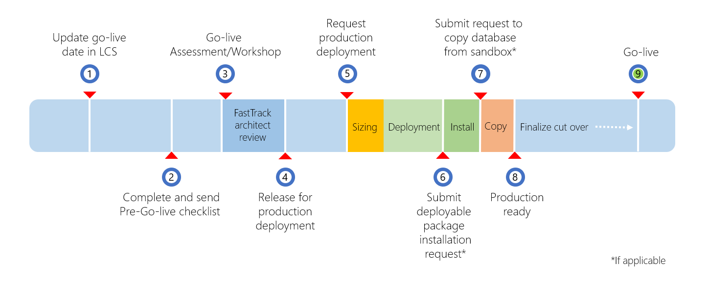

---
# required metadata

title: Prepare for go-live
description: This topic describes how to prepare to go live with a Microsoft Dynamics 365 for Finance and Operations project by using Microsoft Dynamics Lifecycle Services (LCS).
author: ClaudiaBetz-Haubold
manager: AnnBe
ms.date: 03/09/2018
ms.topic: article
ms.prod: 
ms.service: dynamics-ax-platform
ms.technology: 

# optional metadata

# ms.search.form:  
audience: IT Pro
# ms.devlang: 
ms.reviewer: margoc
ms.search.scope: Operations
# ms.tgt_pltfrm: 
# ms.custom: 
ms.search.region: Global
# ms.search.industry: 
ms.author: chaubold
ms.search.validFrom: 2018-01-31
ms.dyn365.ops.version: July 2017 update
---

# Prepare for go-live

[!include [banner](../includes/banner.md)]

This topic describes how to prepare to go live with a Microsoft Dynamics 365 for Finance and Operations project by using Microsoft Dynamics Lifecycle Services (LCS).

This graphic lists the phases of the go-live process.

The following table lists all the steps in the process, with the expected duration and who is responsible to take the action.

|   |                       Action                       |                                                 Duration/When                                                  |                Who                |                                                                             Notes                                                                             |
|---|----------------------------------------------------|----------------------------------------------------------------------------------------------------------------|-----------------------------------|---------------------------------------------------------------------------------------------------------------------------------------------------------------|
| 1 |             Update Go-live date in LCS             |                                      At the latest 2-3 months in advance                                       |         Partner/Customer          |                                              The milestone dates should be kept up-to-date on an   ongoing basis                                              |
| 2 |            Complete and send check list            |                                               After UAT complete                                               |         Partner/Customer          |                                                     Follow instructions in FastTrack   Go-live Assessment                                                     |
| 3 |   Project Assessment    (Fast Track Essentials)    |             2 business days for initial report, plus additional time   for mitigation, if required             |        FastTrack Architect        | Architect delivers assessment after checklist is received   and continues review until questions are clarified and mitigations are in   place, if applicable. |
|   |          Project Workshop   (Fast Track)           |                                     To coordinate with architect assigned                                      |        FastTrack Architect        |                                                                                                                                                               |
| 4 |         Release for production deployment          |                                     Upon successfully completed assessment                                     |        FastTrack Architect        |                                 If the production deployment request has already been   submitted, deployment will start now                                  |
| 5 |           Production deployment request            |                                                  Self-service                                                  |             Customer              |                    The production deployment request should only be submitted   after the FastTrack Architect has finished the assessment                     |
|   |                       Sizing                       | Immediate in case of automatic sizing.    Could require further clarifications of the subscription   estimate. |            Sizing team            |                                   Automatic sizing based on subscription estimate by   default, manual sizing by exception.                                   |
|   |                     Deployment                     |                                                    48 hours                                                    | Dynamic Service Engineering (DSE) |                                                        Status in LCS reflects the deployment progress                                                         |
| 6 |      Deployable Package Installation request       |                                                  Self-service                                                  |             Customer              |                                                    Follow the instructions in Apply a   deployable package                                                    |
|   |                Package installation                |          Depends on number of packages, minimum 5 hours lead time   and 4 hours downtime per package           | Dynamic Service Engineering (DSE) |                                                                                                                                                               |
| 7 | Database Copy from Sandbox request (if applicable) |                                                  Self-service                                                  |             Customer              |   Must exactly follow instructions documented in Copy   a Finance and Operations database from SQL Server to a production Azure SQL   Database environment    |
|   |                   Copy database                    |                                     5 hours lead time and 2 hours downtime                                     | Dynamic Service Engineering (DSE) |                                                                                                                                                               |
| 8 |                  Production ready                  |                                  After all previous steps have been completed                                  |         Customer/Partner          |                                               Customer/Partner can take control of the production   environment                                               |
|   |                 Cutover activities                 |                                             Depends on the project                                             |         Customer/Partner          |                                                                                                                                                               |
| 9 |                      Go live                       |                                             Depends on the project                                             |             Customer              |                                                                                                                                                               |

## Completing the LCS methodology

A major milestone in each implementation project is the cutover to the production environment.

To help guarantee that the production environment is used for live operations, Microsoft will provision the production instance only when the implementation is approaching the Operate phase, after the required activities in the LCS methodology are completed. For more information about the environments in your subscription, see the [Licensing guide](https://query.prod.cms.rt.microsoft.com/cms/api/am/binary/RE1CkHI).

Customers must complete the Analysis, Design and develop, and Test phases in the LCS methodology before the **Configure** button that is used to request the production environment becomes available. To complete a phase in LCS, you must first complete every required step in that phase. When all the steps in a phase are completed, you can complete the whole phase. You can always reopen a phase later if you must make changes. If you require more help, see [Lifecycle Services for Finance and Operations customers](../../dev-itpro/lifecycle-services/lcs-works-lcs.md).

The process of completing a step has two parts:

- Do the actual work, such as a fit-gap analysis or user acceptance testing (UAT).
- Mark the corresponding step in the LCS methodology as completed.

It's good practice to complete the steps in the methodology as you make progress with the implementation. Don't wait until the last minute. Don't just click through all the steps so that you can get a production environment. It's in the customer's best interest to have a solid implementation.

## UAT for your solution

During the UAT phase, you should test all the business processes that you've implemented, and any customizations that you've made, in a Sandbox: Standard Acceptance Test environment in the implementation project. To help guarantee a successful go-live, you should keep the following points in mind as you complete the UAT phase:

- Test cases cover the whole scope of requirements.
- Test by using migrated data. This data should include master data and opening balances, even if they aren't yet final.
- Test by using the correct security roles (default roles and custom roles) that are assigned to users.
- Make sure that the solution complies with any company-specific and industry-specific regulatory requirements.
- Document all features, and obtain approval and sign-off from the customer.

It isn't enough that you test in an environment that is a developer or demo topology, regardless of whether the environment is a cloud-hosted environment or a downloaded virtual hard disk (VHD). Here are the reasons:

- The topology of the Tier-1 environments differs from the topology of your production environment. It's important that you test all functionality on a Tier-2 or higher sandbox environment in the Microsoft-managed subscription. It's especially important that you test integrations, printing functionality, workflow functionality, and warehouse and retail devices in the sandbox environment.
- System performance can't be measured when you do the UAT on local virtual machines (VMs) or VMs that are privately hosted.
- To prevent delays during the cutover process, it's important that the team experience the servicing in LCS during the implementation. This servicing includes the processes of applying deployable packages, creating service requests, and moving database between environments.

## FastTrack Go-live assessment

Finance and Operations customers should complete a Pre go-live review with the Microsoft FastTrack team before they request their production environment. If you aren't familiar with Microsoft FastTrack, see [Microsoft FastTrack for Dynamics 365 overview](../get-started/fasttrack-dynamics-365-overview.md).

About eight weeks before go-live, the FastTrack team will ask you to fill in a Pre go-live checklist:

- If you have 150 or more seats, and a Microsoft solution architect is assigned to your project, the solution architect will contact you.
- If you have 20–149 seats, the checklist will be sent to you from <go-live@microsoft.com>.

You can also [download the checklist from CustomerSource](https://mbs.microsoft.com/customersource/Global/365Enterprise/learning/documentation/installation-setup-guides/fasttrack-checklist-fin-and-ops).

The project manager or a key project member must complete Pre go-live checklist during the Pre go-live phase of the project. Typically, the checklist is completed four to six weeks before the proposed go-live date, when UAT is completed or almost completed.

When you've completed the Pre go-live checklist, follow one of these steps:

- If you have 20–149 seats, send the checklist to <go-live@microsoft.com>.
- If you have 150 or more seats, and a Microsoft solution architect is assigned to your project, send the checklist to the solution architect.

After the checklist is submitted, a Microsoft solution architect will review the project and provide an assessment that describes the potential risks, best practices, and recommendations for a successful go-live of the project. In some cases, the solution architect might highlight risk factors and ask for a mitigation plan. When the assessment is completed, the solution architect will indicate that you're ready to request the production environment in LCS.

If you request the production environment before the assessment is completed, the deployment will be put on hold until the assessment is successfully completed.

## Requesting the production environment

After you've completed the Analysis, Design and develop, and Test phases in the LCS methodology, and the Go-live assessment has concluded that the project is ready, you can request your production environment.

We recommend that you select a generic user account as the Admin user of the environments that you deploy. If you use a named user account, you might not be able to access an environment if that user isn't available. Here are some scenarios where the Admin user must access an environment:

- **First sign-in to any environment after initial deployment** – In this case, the Admin user is the only user who can access the environment.
- **First sign-in to a sandbox environment after a database refresh from the production environment** – In this case, all user accounts except the Admin account are disabled.

Your production environment should be deployed to the same datacenter where your sandbox environments are deployed.

After you've signed off on the request for the production environment, Microsoft is responsible for deploying the production environment for you. The Microsoft service level agreement (SLA) for deployment of a production environment is 48 hours. The production environment can be deployed at any time within 48 hours after you submit the request, provided that your usage profile doesn't require additional information. You can view the progress of the deployment in LCS. Typically, the status of the production environment request remains **Queued** for a few hours before it's changed to **Deploying**.

When you submit the deployment request, a service request for the Microsoft Dynamics Service Engineering (DSE) team is automatically created. You can view this service request in the **Service requests** list in LCS. If the DSE team has questions that prevent it from deploying the production environment, it will add a comment to the service request. For example, the DSE team might ask that you update the subscription estimate or change the datacenter. In some cases, you might have to clear the sign-off from the production deployment request to make changes. You can clear the sign-off only while the status of the production environment request is **Queued**. To clear the sign-off, click the **Queued** button. The status of the request is returned to **Configure**. You can then make any changes that are required and sign off again.
