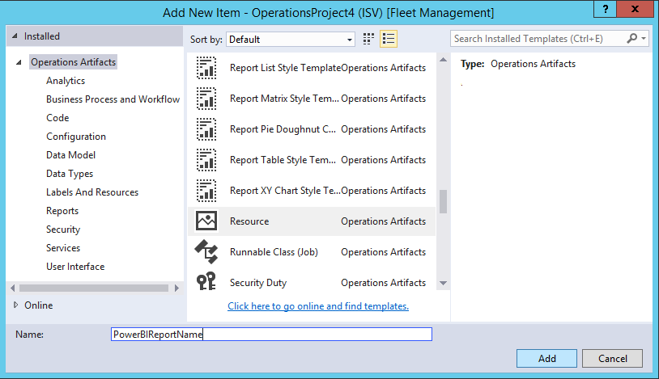
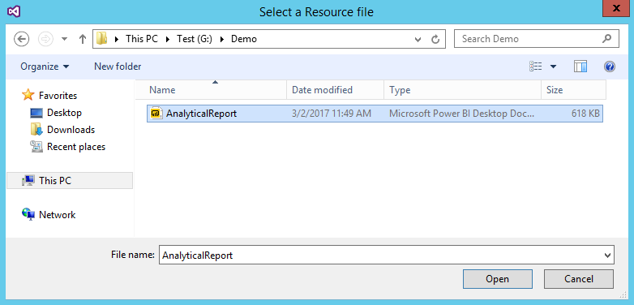
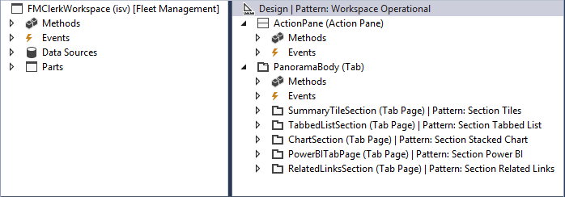
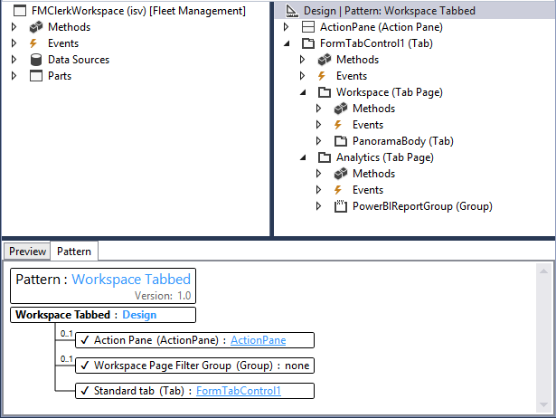

# Add analytics to workspaces by using Power BI Embedded

[!include [banner](../includes/banner.md)]

> [!NOTE]
> This feature is supported in finance and operations (version 7.2 and later).

## Introduction
This article shows how to embed a Microsoft Power BI report on the **Analytics** tab of a workspace. For the example that is given here, we will extend the **Reservation management** workspace in the Fleet Management application to embed an analytical workspace on an **Analytics** tab.

## Prerequisites
+ Access to a developer environment that runs Platform update 8 or later.
+ An analytical report (.pbix file) that was created by using Microsoft Power BI Desktop, and that has a data model that is sourced from the Entity store database.

## Overview
Whether you extend an existing application workspace or introduce a new workspace of your own, you can use embedded analytical views to deliver insightful and interactive views of your business data. The process for adding an analytical workspace tab has four steps.

1. Add a .pbix file as a Dynamics 365 resource.
2. Define an analytical workspace tab.
3. Embed the .pbix resource on the workspace tab.
4. Optional: Add extensions to customize the view.

> [!NOTE]
> For more information about how to create analytical reports, see [Getting started with Power BI Desktop](https://powerbi.microsoft.com/documentation/powerbi-desktop-getting-started/). This page is a great source for insights that can help you create compelling analytical reporting solutions.

## Add a .pbix file as a resource
Before you begin, you must create or obtain the Power BI report that you will embed in the workspace. For more information about how to create analytical reports, see [Getting started with Power BI Desktop](https://powerbi.microsoft.com/documentation/powerbi-desktop-getting-started/).

Follow these steps to add a .pbix file as a Visual Studio project artifact.

1. Create a new project in the appropriate model.
2. In Solution Explorer, select the project, right-click, and then select **Add** \> **New Item**.
3. In the **Add New Item** dialog box, under **Operations Artifacts**, select the **Resource** template.
4. Enter a name that will be used to reference the report in X++ metadata, and then click **Add**.

    

5. Find the .pbix file that contains the definition of the analytical report, and then click **Open**.

    

Now that you've added the .pbix file as a Dynamics 365 resource, you can embed the reports in workspaces and add direct links by using menu items.

## Add a tab control to an application workspace
In this example, we will extend the **Reservation management** workspace in the Fleet Management model by adding the **Analytics** tab to the definition of the **FMClerkWorkspace** form.

The following illustration shows what the **FMClerkWorkspace** form looks like in the designer in Microsoft Visual Studio.



Follow these steps to extend the form definition for the **Reservation management** workspace.

1. Open the form designer to extend the design definition.
2. In the design definition, select the top element that is labeled **Design | Pattern: Workspace Operational**.
3. Right-click, and then select **New** \> **Tab** to add a new control that is named **FormTabControl1**.
4. In the form designer, select **FormTabControl1**.
5. Right-click, and then select **New Tab Page** to add a new tab page.
6. Rename the tab page to something meaningful, such as **Workspace**.
7. In the form designer, select **FormTabControl1**.
8. Right-click, and then select **New Tab Page**.
9. Rename the tab page to something meaningful, such as **Analytics**.
10. In the form designer, select **Analytics (Tab Page)**.
11. Set the **Caption** property to **Analytics**, and set the **Auto Declaration** property to **Yes**.
12. Right-click the control, and then select **New** \> **Group** to add a new form group control.
13. Rename the form group to something meaningful, such as **powerBIReportGroup**.
14. In the form designer, select **PanoramaBody (Tab)**, and then drag the control onto the **Workspace** tab.
15. In the design definition, select the top element that is labeled **Design | Pattern: Workspace Operational**.
16. Right-click, and then select **Remove pattern**.
17. Right-click again, and then select **Add pattern** \> **Workspace Tabbed**.
18. Perform a build to verify your changes.

The following illustration shows what the design looks like after these changes are applied.



Now that you've added the form controls that will be used to embed the workspace report, you must define the size of the parent control so that it accommodates the layout. By default, both the **Filters Pane** page and the **Tab** page will be visible on the report. However, you can change the visibility of these controls as appropriate for the target consumer of the report.

> [!NOTE]
> For embedded workspaces, we recommend that you use extensions to hide both the **Filters Pane** and **Tab** pages, for consistency.

You've now completed the task of extending the application form definition. For more information about how to use extensions to do customizations, see [Customize through extension and overlayering](../extensibility/customization-overlayering-extensions.md).

## Add X++ business logic to embed a viewer control
Follow these steps to add business logic that initializes the report viewer control that is embedded in the **Reservation management** workspace.

1. Open the **FMClerkWorkspace** form designer to extend the design definition.
2. Press F7 to access the code behind the code definition.
3. Add the following X++ code.

    ```xpp
    [Form] 
    public class FMClerkWorkspace extends FormRun
    {
        private boolean initReportControl = true;
        protected void initAnalyticalReport()
        {
            if (!initReportControl)
            {
                return;
            }
            // Note: secure entry point into the Workspace's Analytics report
            if (Global::hasMenuItemAccess(menuItemDisplayStr(FMClerkWorkspace), MenuItemType::Display))
            {
                // initialize the PBI report control using shared helper
                PBIReportHelper::initializeReportControl('FMPBIWorkspaces', powerBIReportGroup);
            }
            initReportControl = false;
        }
        /// <summary>
        /// Initializes the form.
        /// </summary>
        public void init()
        {
            super();
            this.initAnalyticalReport();
        }
    }
    ```

4. Perform a build to verify your changes.

You've now completed the task of adding business logic to initialize the embedded report viewer control. The following illustration shows what the workspace looks like after these changes are applied.


> [!NOTE]
> You can access the existing operational view by using the workspace tabs below the page title.

## Reference

### PBIReportHelper.initializeReportControl method
This section provides information about the helper class that is used to embed a Power BI report (.pbix resource) in a form group control.

#### Syntax
```xpp
public static void initializeReportControl(
    str                 _resourceName,
    FormGroupControl    _formGroupControl,
    str                 _defaultPageName = '',
    boolean             _showFilterPane = false,
    boolean             _showNavPane = false,
    List                _defaultFilters = new List(Types::Class))
```

#### Parameters

| Name             | Description                                                                                                  |
|------------------|--------------------------------------------------------------------------------------------------------------|
| resourceName     | The name of the .pbix resource.                                                                              |
| formGroupControl | The form group control to apply the Power BI report control to.                                              |
| defaultPageName  | The default page name.                                                                                       |
| showFilterPane   | A Boolean value that indicates whether the filter pane should be shown (**true**) or hidden (**false**).     |
| showNavPane      | A Boolean value that indicates whether the navigation pane should be shown (**true**) or hidden (**false**). |
| defaultFilters   | The default filters for the Power BI report.                                                                 |


[!INCLUDE[footer-include](../../../includes/footer-banner.md)]
