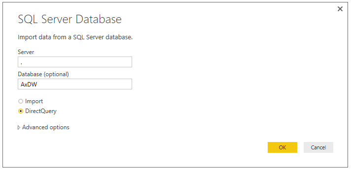

# Create analytical reports by using Power BI Desktop

[!include [banner](../includes/banner.md)]

If you're a power user or a business analyst, you probably create many reports for your organization. You might create these reports in Microsoft Excel by formatting and relating data before you share it with other people. People in your organization might even come to you when they require modifications to the report. This solution offers an easy way to create rich, interactive reports. As a report writer, you can use Microsoft Power BI Desktop as the reporting tool. The reports that you create can then be published to PowerBI.com. For more information about Power BI Desktop, see [Create stunning reports and visualizations with Power BI Desktop](https://powerbi.microsoft.com/desktop).

## Accessing the local Entity Store by using DirectQuery
You can create Microsoft Power BI reports by using Open Data Protocol (OData) endpoints that are exposed via data entities. Despite the limitations of this approach, the Entity Store still supports it for legacy solutions. However, DirectQuery is now the preferred method for sourcing data for analytical solutions. For more information about the benefits and limitations of DirectQuery, see [Use DirectQuery in Power BI Desktop](https://powerbi.microsoft.com/documentation/powerbi-desktop-use-directquery/).

When you use Power BI Desktop, you can create a report in your development or test environment by connecting directly to the local Entity Store database. When you're satisfied with the report, your administrator can help you migrate it to your production environment. The rest of this section walks you through this process.

> [!NOTE]
> To develop or extend analytical workspaces and reports in the application suite, customers must use a development environment running in their own subscription or on local machines. You won’t be able to develop or extend embedded analytical reports in Microsoft-provided Tier-1 environments. You need administrator rights to install Power BI Desktop.

> Power BI embedded integration has upgraded the infrastructure as part of the 10.0.22 release. This was an infrastructure change and will happen automatically when an environment is upgraded to release 10.0.22. With this change, users are now able to use the *latest version* of Power BI desktop when editing workspace reports.

> For environments running version 10.0.21 or earlier, you must still use the previous build of Power BI Desktop pre-installed on the development environment. Alternatively, you can use the *compatible* Power BI Desktop August 2020 release of Power BI Desktop with preview features turned off to author analytical reports for finance and operations apps. You can download the Power BI Desktop August 2020 release from the [LCS Shared asset library](https://lcs.dynamics.com/V2/SharedAssetLibrary).

### Step 1: Populate the local Entity Store database
For this example, we will stage the aggregate models that the Commerce analytical solution consumes in the local Entity Store. The models that the application uses are defined in the RetailCube aggregate measurement. 

1. In the client, open the **Entity Store** page. (Select **System administration** \> **Setup** \> **Entity Store**.) 
2. Select the **RetailCube** aggregate measurement, and then select **Refresh**. 
3. Enter a name for the job that will be run in the background, and then select **OK**.

The following illustration shows the administrator dialog box that is used to configure the frequency of updates for the aggregate model.

To monitor the progress of the job that stages the data, you can use the batch job monitoring page. (Select **System administration** \> **Database** \> **Batch jobs**.) If you're using demo data, the job should take about a minute. After the data is in the Entity Store, you can write reports. 

### Step 2: Connect to the local Entity Store database
1. Start Power BI Desktop. If any updates are available for Power BI Desktop, you might have to download and apply them. 
2. On the Power BI **Welcome** page, select **Get data**. 

    Alternatively, when Power BI Desktop starts, you can select **Get Data** \> **SQL Server**. 

    

3. In the **SQL Server Database** dialog box, enter **.** as the server name and **AxDW** as the database name. Then select the **DirectQuery** option. 

    The following illustration shows the settings that enable Power BI Desktop to access the local Entity Store database.

    

    > [!NOTE]
    > The **Import** option isn't currently supported.

4. Select **OK**. 

    The **Navigator** dialog box appears. You use this dialog box to select which tables and views from the Entity Store you want to report on. 

5. In the search box, enter **Retail** to filter for entities that are related to the RetailCube aggregate measurement.
6. Select the **RetailCube\_RetailTransDetailsView** table that is shown in the navigator, and then select **Load**. 

You can now create a report. You can drag measures and fields to the canvas, and can explore data and trends interactively.

The following illustration shows a basic report that uses the local Entity Store database as its source.

Power BI Desktop also supports the creation of calculations and lets you combine data from multiple aggregate measurements. Within minutes, you can create analytical reports by using data in the local development environment. When you're satisfied with the report, you can migrate it to the production environment, so that users can use the report to interact with production data.

## Validating reports in a demo environment

The report shows the demo or test data in your developer environment. If you want to integrate the report into a demo environment, you can continue to publish this report to your PowerBI.com account and pin it to the client. 

[!INCLUDE[footer-include](../../../includes/footer-banner.md)]

