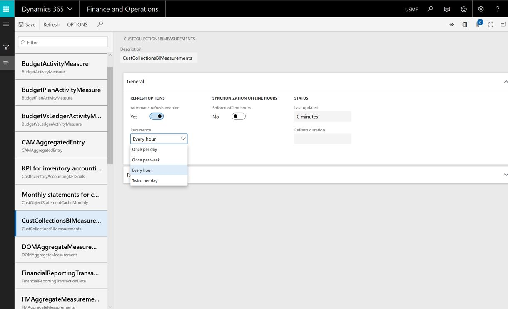

# Automated Entity store refresh

[!include [banner](../includes/banner.md)]

[!INCLUDE [PEAP](../../../includes/peap-3.md)]

## Overview

Entity store refresh is automated and managed by the system. Administrators do not need to schedule or monitor the Entity store refresh with the system batch schedules. The refresh operation is based on anticipated latency. This functionality is enabled in Platform update 23. As an administrator you do need to opt-in to use this feature.   

## Enable automated refresh
Complete the following steps to enable automated Entity store refresh.

1. Go to **System administration** > **Set up** > **Entity store**. On the **Entity store** page, a message indicates that you can switch to the **Automated Entity store refresh** option. This option is managed by the system. An admin does not have to schedule or monitor the Entity store refresh.

2. Select **Switch now**.

  > [!IMPORTANT]
  > This action isn't reversible. After you switch to the **Automated Entity store refresh** option, you can't revert to the old user interface (UI) experience.

3. Select **Yes** to continue.

You will now see the new experience.

After the new experience is turned on, you can define the refresh for each aggregate measurement. The following refresh options are available:

- Every hour
- Twice a day
- Once a day
- Once a week

An admin can also refresh any aggregate measurement on demand by clicking the **Refresh** button. Additional options will be added in future platform updates. These options will include options for real-time refresh.

> [!IMPORTANT]
> When automated refresh is enabled, the system can disable the refresh of aggregate measurements. You must revisit aggregate measurements and validate that appropriate refresh intervals have been applied.

[!INCLUDE[footer-include](../../../includes/footer-banner.md)]
