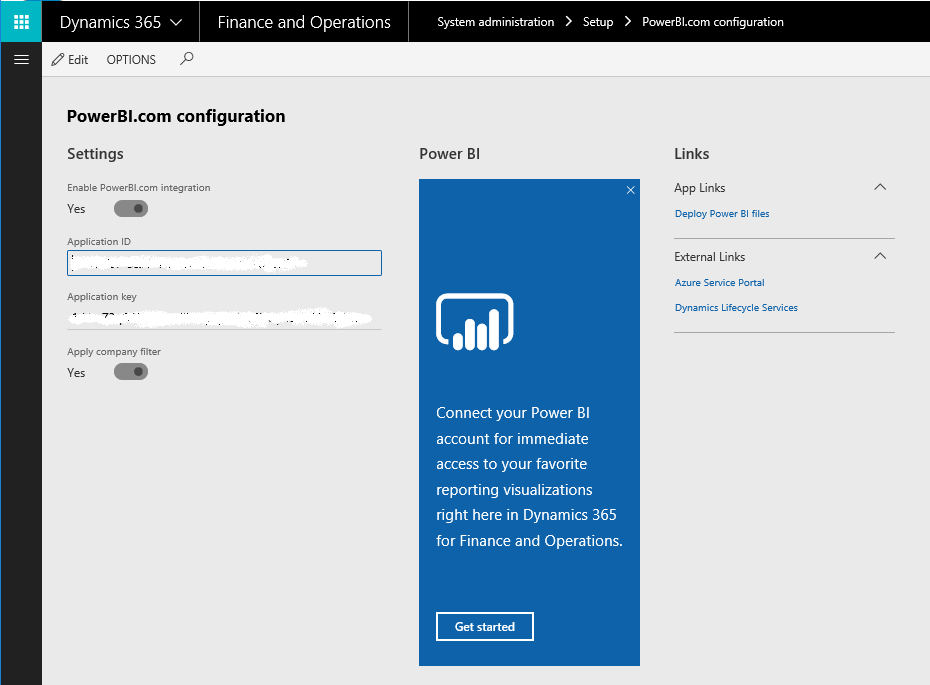
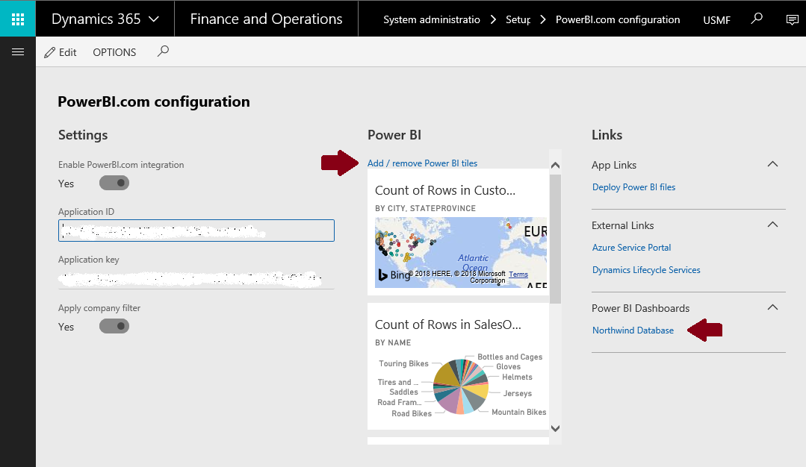

---
# required metadata

title: Configure PowerBI.com integration
description: This topic describes how to configure a new Finance and Operations environment to support integration with PowerBI.com. This configuration enables workspaces to show the Power BI control and lets users pin visualizations to a workspace.
author: MilindaV2
manager: AnnBe
ms.date: 10/23/2019
ms.topic: article
ms.prod: 
ms.service: dynamics-ax-platform
ms.technology: 

# optional metadata

ms.search.form: PowerBIConfiguration
# ROBOTS: 
audience: IT Pro
# ms.devlang: 
ms.reviewer: kfend
ms.search.scope: Core, Operations
# ms.tgt_pltfrm: 
ms.custom: 27661
ms.assetid: 861cfa94-c6f3-4c84-89ac-22c78bf6b7a4
ms.search.region: Global
# ms.search.industry: 
ms.author: milindav
ms.search.validFrom: 2016-02-28
ms.dyn365.ops.version: AX 7.0.0

---

# Configure PowerBI.com integration

[!include [banner](../includes/banner.md)]

## Overview

Users can pin tiles, dashboards, and reports from their own PowerBI.com account to application workspace.

This functionality requires a one-time configuration of your environment. An administrator must do this step to enable Microsoft Power BI to communicate and authenticate correctly.

For a workspace to show a Power BI tile, the server must contact the Power BI service on behalf of a user and access the visualization. It must then redraw the visualization in the application workspace. The fact that the server contacts the Power BI service "on behalf of a user" is important. When a user, such as `D365User@contoso.com`, contacts the PowerBI.com service, Power BI should show only tiles and reports from the user's PowerBI.com subscription.

By completing this configuration step, you enable to contact the PowerBI.com service.

## Things you must know before you start 

- You must be a system administrator in the application. This option is available on the **System administration** menu.
- You must have a PowerBI.com account. You can create a trial account if you don't have an account. (A Pro license isn't required for this configuration step.)
- You must have at least one dashboard and one report in your Power BI account. Although the dashboard and report aren't required for this configuration step, you might not be able to validate the configuration if you don't have any content in your PowerBI.com account.
- You must be an administrator for your Microsoft Azure Active Directory (Azure AD) account. If you aren't the administrator, an administrative user must perform this configuration step for you.
- The Azure AD domain that is configured must be the same domain that you used for your PowerBI.com account. For example, if you provisioned the application in the Contoso.com domain, you must have Power BI accounts in that domain, such as `Tim@ContosoAX7.onmicrosoft.com`.

## Registration process 

1. Sign in to https://portal.azure.com/ using an Azure tenant admin account. 
> [!NOTE]
> The user who completes this procedure must have Admin rights for the tenant to register applications.

2. Go to **Azure Active Directory** > **App registrations** > **New application registration**. 
    

3. Enter the following values:

- **Name** - Your app name.
- **Application type** - Web app/API
- **Sign-on URL** - The base URL of your client. For example, `https://contosoax7.cloud.dynamics.com`.

> [!NOTE]
> Depending on your version, you may need to add /oauth as a suffix to the URL, or use http instead of https as the protocol, such as: `https://contosoax7.cloud.dynamics.com/oauth/` or `http://contosoax7.cloud.dynamics.com/oauth/`.
			 
4. Click **Create**.
5. Copy the **Application ID**. This will be used to connect to the PowerBI.com service.
6. Click **Settings** > **Required permissions** > **Add** > **Select an API** > **Power BI Service (Power BI)**.
7. Click **Select**.
8. Enable Access and click **Select**. 
    

9. Click **Done** and then click **Grant Permissions**.
10. Click **Settings** > **Keys**.
11. Enter a value for **Key description** and **Expires**, and then click **Save**.

Make a note of the **Application ID** and **Application Key**. You will use these values in the next procedure.

## Specify Power BI settings in Finance and Operations

1. In the client, open the **Power BI configuration** page. 
    

2. Select **Edit**.
3. Set the **Enabled** option to **Yes**.
4. In the **Application ID** field, enter the **Application ID** value that you got from Power BI in the previous procedure.
5. In the **Application Key** field, enter the **Application Key** value that you got from Power BI in the previous procedure.

    You can apply the company filter only if your Power BI content has a table that is named **Company** and a column that is named **ID**. Ready-made Power BI content that is released uses this convention.

6. Click **Save**.

Complete the steps in the next section to verify the changes and enable PowerBI.com integrations.

## Pin tiles to a workspace

1. To validate the PowerBI.com configuration, click **Get started**. 
> [!NOTE]
> You may need to refresh the browser to apply the changes.  
> 

If you're starting Power BI from the application for the first time, you're prompted to authorize sign-in to Power BI from the client. Select **Click here to provide authorization to Power BI**.

Users must complete this step the first time they pin Power BI content.

2. The Azure AD consent page asks for your consent. User consent is required for the application to access PowerBI.com on behalf of the user. Select **Accept**.

3. Because you're already signed in to Azure AD, you don't have to enter your credentials again. A new tab appears, where you're prompted to authorize the connection between the application and Power BI. Authorize the connection, and then return to the original tab.

4. A list of tiles from your PowerBI.com account appears. Select one or more tiles to pin to the selected workspace.
    

## Troubleshooting common errors

In the procedure above, after you click **Accept**, you might receive the following error message if the process is unsuccessful. Note that the details of the error appear at the bottom of the message. Additional technical information provides clues that can help you determine what went wrong.

### Some common issues and the resolution steps

| Error                                                       | Resolution |
|-------------------------------------------------------------|------------|
| The Power BI service is unavailable.                        | This issue doesn't occur very often, but the Power BI service might sometimes be unreachable. You don't have to re-register. Try to pin a tile to a workspace later. |
| You can't access the application.                           | You probably didn't select all the check boxes under **Step 8 in the Registration proces** during the registration process. Start Power BI, and re-run the registration process. |
| The Power BI tiles page is empty (no content is shown).     | Your PowerBI.com account might not have a dashboard or any tiles. Add a dashboard, such as a sample dashboard, and try to pin a tile again. |
| Error when authorizing Power BI                             | On the Azure Admin dashboard, under **Users and Groups \> User settings**, make sure that the **Users can consent to apps accessing company data on their behalf** option is set to **Yes**. |

