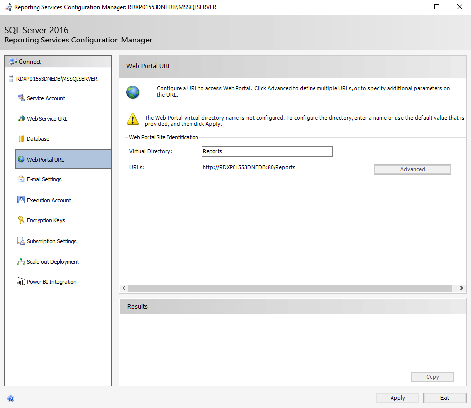
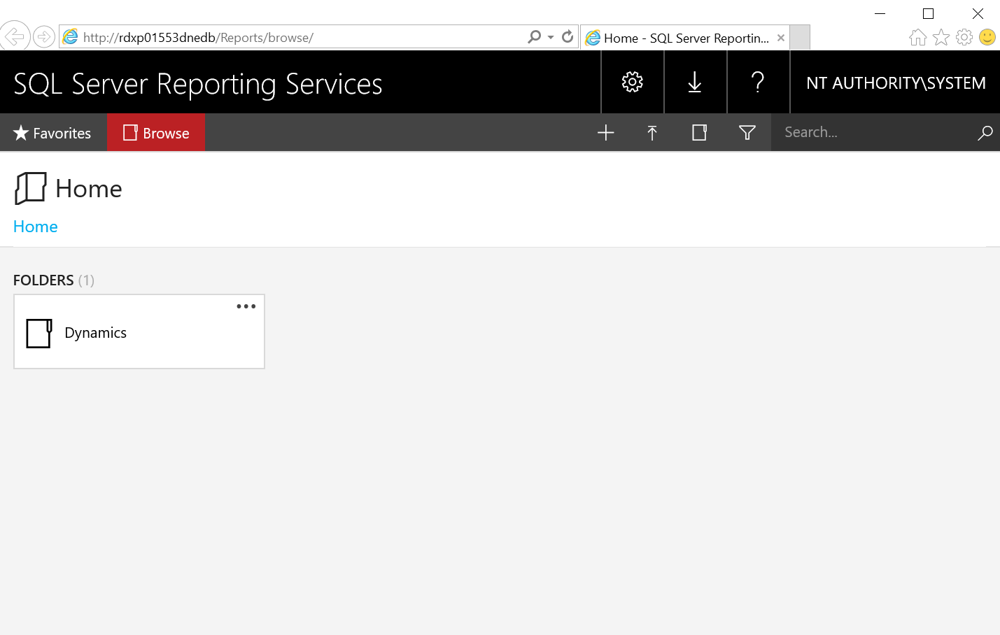
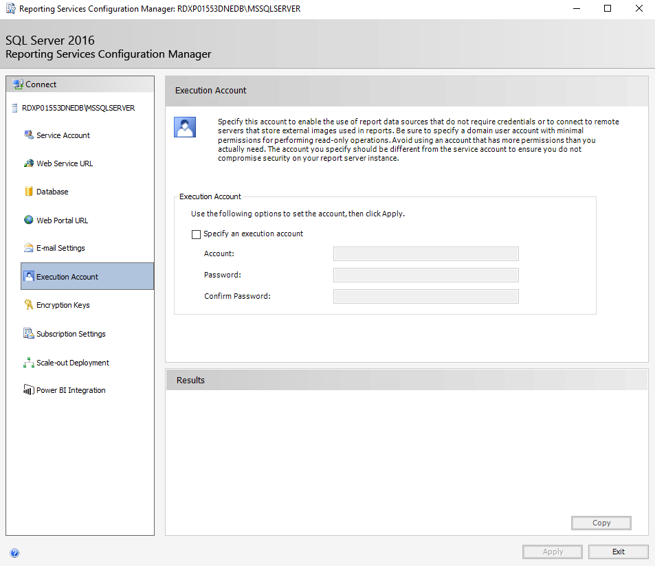
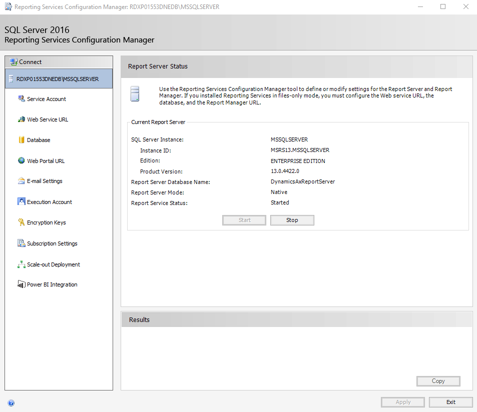

# Configure SQL Server Reporting Services for on-premises deployments

[!include [banner](../includes/banner.md)]

Use the steps in this article to configure SQL Server Reporting Services (SSRS) for your Microsoft Dynamics 365 Finance + Operations (on-premises) deployment.

> [!IMPORTANT]
> Only follow this guide if your environment was deployed using a base deployment older than Application version 10.0.17 (with Platform update 41).

1. Open the Reporting Services Configuration Manager application.
2. Leave the default **Server name**, which should be the name of the current machine, and the **Report Server Instance**, **MSSQLSERVER**.
3. Click **Connect**.

    

4. Click the **Service Account** tab and verify that the settings match the following graphic.

    > [!NOTE]
    > SQL Server Reporting Services 2019 no longer allows choosing the **Local System** account. Instead you need to use **NETWORK SERVICE** account.

    

5. Click the **Web Service URL** tab and verify that the settings match the following graphic.

    

6. Click the **Database** tab and verify that the **Database Name** and **Credential settings** match the following graphic.

    > [!NOTE]
    > You will need to create a new database. To do this, click **Change Database**, and then verify that the new database name is: **DynamicsAxReportServer**.

    

7. Click the **Web Portal URL** tab and verify that the settings match the following graphic.

    > [!NOTE]
    > You must click **Apply** to create and properly configure the Portal.

    

    After the Portal is configured, the **Web Portal** tab will match the following graphic.

    

8. Click the reports URL to view the SQL Server Reporting Services web portal.
9. When you are in the portal, create a new folder named **Dynamics**.

    

10. In the **Reporting Services Configuration Manager**, click the **E-mail Settings** tab and verify that the settings match the following graphic.

    

11. Click the **Execution Account** tab and verify that the settings match the following graphic.

    

    Don't change the default settings on the **Encryption Keys** tab.

    

12. Click the **Subscription Settings** tab, and verify that the settings match the following graphic.

    

    Don't change the default settings on the **Scale-out Deployment** tab.

    

    Don't change the default settings on the **Power BI Integration** tab.

    

13. Click **Exit** to close the **Reporting Services Configuration Manager**.

    

14. For SQL Server 2019 only, you need to manually grant **NETWORK SERVICE** the permissions to read the private keys of these certificates.
    - DataEncryption
    - DataSigning
    - ReportingService

[!INCLUDE[footer-include](../../../includes/footer-banner.md)]
