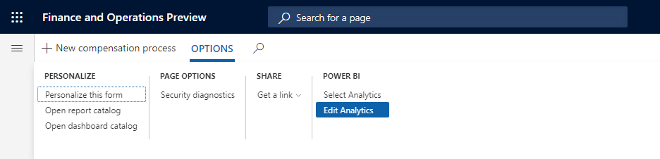
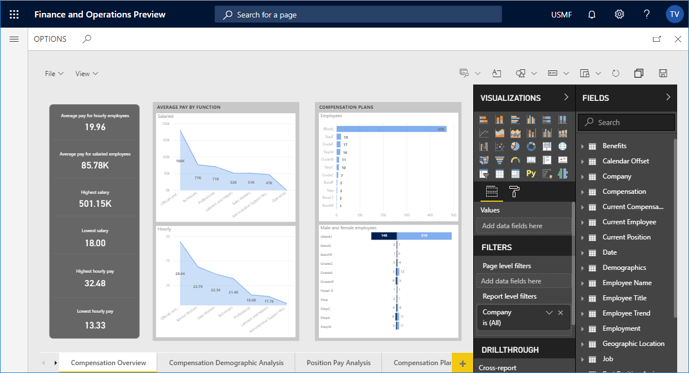

# Customize embedded reports in analytical workspaces

[!include [banner](../includes/banner.md)]

## Analytical workspaces

Analytical workspaces are bundled with the application suite. Through reporting, they offer users insights into data that is based on standard business operations. The reports are generic reports that are defined by business professionals. They include metrics that are considered interesting to a wide range of users from any industry.

However, in some cases, the standard reports include data that isn't relevant to all customers. More often, customers might want to access data points or calculations that are left out of the standard reports.

Power users can use web-friendly design tools to customize the analytical reports that are embedded in the application. By using the free-form canvas designer, users who are familiar with the relevant business insights that are required can help make the organization successful.

> [!IMPORTANT]
> Customizations that are made to the embedded analytical reports are automatically deployed by the service and made available to other users of the system.

### Edit embedded reports in analytical workspaces

> [!VIDEO https://www.microsoft.com/videoplayer/embed/RE3nnj4]

The [How to edit an embedded report in an analytical workspace](https://youtu.be/_8WlwmSggcQ) video (shown above) is included in the [Playlist](https://www.youtube.com/playlist?list=PLcakwueIHoT_SYfIaPGoOhloFoCXiUSyW) available on YouTube.

### Important points about embedded analytical reports

Although the standard reports deliver insights that are tailored to a given business persona, customizations can often maximize the value of these standard reports.

Here are some important points to note about this service capability:

- Customizations are limited to the report design canvas. Users can't change the definitions of report data sets.
- Report customizations that are made to the analytical workspace apply to all users in the environment.
- The service automatically preserves report customizations during product upgrades.
- The service doesn't support the export of customizations that are made to analytical workspaces.

## Customize an analytical workspace

To customize the embedded application solutions, a user must be assigned the **System report editor** security role. Users assigned this security role can do customizations by using the buttons on the **Options** tab on the Action Pane of the application workspaces. This example shows how to customize one of the standard analytical workspaces that are bundled with the application suite.

1. Sign in and open the application workspace that you want to customize. In this example, you will replace the standard analytical report that is embedded in the **Compensation management** workspace.

    

2. Select the **Analytics** tab to access the workspace's embedded analytical report.

    

    By default, you see the standard analytical workspace solution that is packaged with your application. The reports in this solution are automatically deployed and configured for your environment during the provisioning process.

    > [!NOTE]
    > The analytical workspaces require a hosted Microsoft Power BI service that is available only for dedicated environments. For more information, see [Accessing Analytical Workspaces and Reports on 1Box environment](/archive/blogs/dynamicsaxbi/accessing-analytical-workspaces-on-1box-environment).

3. On the Action Pane, on the **Options** tab, in the **Power BI** group, select **Edit Analytics**.

    

    The analytical workspace is opened in edit mode, and you have direct access to the Power BI web designer tools.

    

4. Use the Power BI web designer tools to customize the report canvas. The intuitive web controls let you perform typical actions such as adding and removing visuals, changing visual types, and formatting the content. You can also inspect the source of the report visualizations to make sure that decisions are based on the most relevant data that is available in the system. For more information, see [Add visualizations to a Power BI report](/power-bi/visuals/power-bi-report-add-visualizations-i).
5. After you've completed your report customizations, select the **Save** button to promote the report edits. Customizations to the report are reflected immediately in the service. Therefore, users in your organization have access to the latest innovations.

    > [!NOTE]
    > Customizations made in the web editor are not saved back to the underlying PBIX report and are not retrievable if the PBIX report is later customized on a development environment.

## Restore the standard application solution

Follow these steps to restore the analytical workspaces that are bundled with the application solution.

1. In the analytical workspace, on the Action Pane, on the **Options** tab, in the **Power BI** group, select **Restore Analytics**.
2. To view the updates to the workspace, reload the page. Either move away from the workspace and then return, or refresh your browser.
3. In the **Compensation management** workspace, select the **Analytics** tab to access the original analytical workspace that was packaged with the application.

## Troubleshooting

Follow these steps to address common issues encountered while attempting to use analytical workspaces.

**Error message:** ***Please log into Power BI to access its resource***

The Power BI service requires explicit permission from the user to allow access to hosted content. Use the following steps to ensure the current user is able to connect to reports hosted on PowerBI.com from the application suite.

1. Open any application workspace containing a section titled **Link**. For example, "Bank management".
2. Select **Options**, and then select **Open report catalog** on the top left.
3. Follow the steps in the dialog box to **Authorize to Power BI** to access finance and operations apps for the current user.

[!INCLUDE[footer-include](../../../includes/footer-banner.md)]

