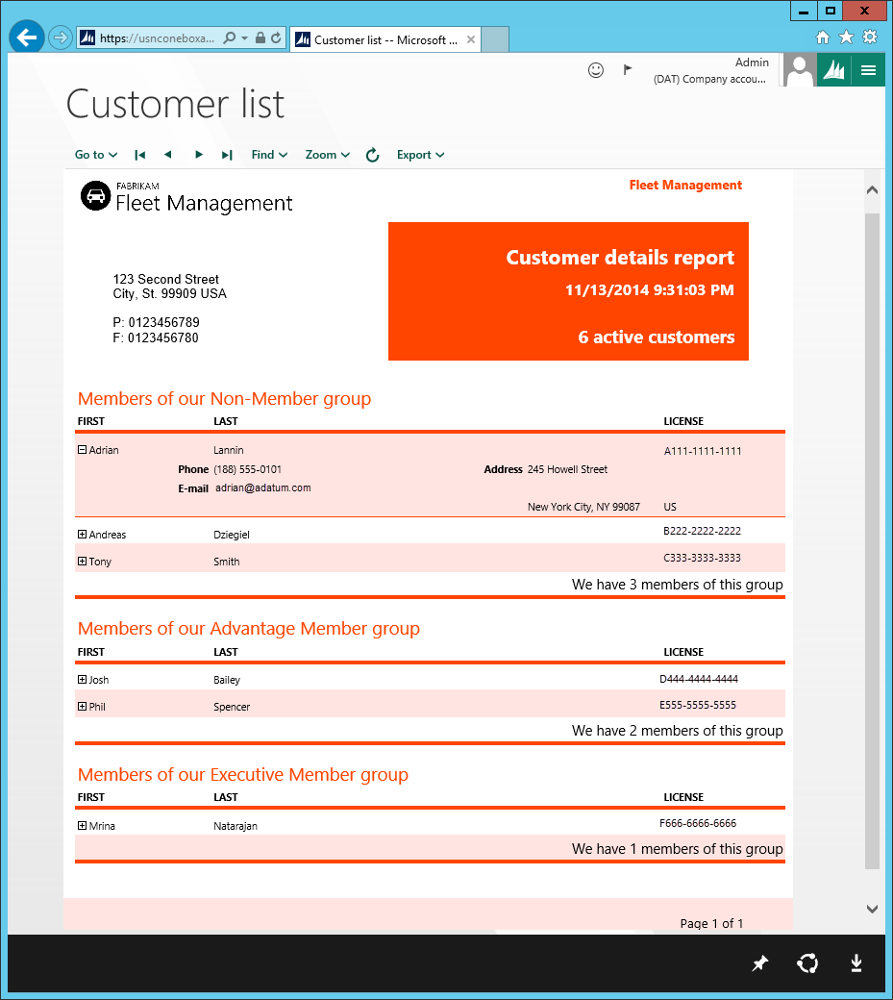

# Document Reporting Services

[!include [banner](../includes/banner.md)]

This article describes the integrated reporting solution that are available. This solution simplifies service administration, increases developer productivity, and provides an enhanced report viewing experience for users.

## Document Reporting Services

Document Reporting Services are based on Microsoft SQL Server Reporting Services (SSRS). In the current version of the application, these services are hosted in the Microsoft Azure Compute service. If you're developing in a one-box environment, the services also run locally in the Azure Compute Emulator.

### Service deployment – Local vs. cloud

In a one-box environment, developers can create, modify, and preview reports, from end to end, by using Microsoft Visual Studio. A separate process isn't required in order to add reports to the application's metadata store. Changes to reports are packaged together with other solution updates and then deployed to the cloud after development is completed in the local environment.

### Viewing reports 

The enhanced report viewing experience that provides for end users is the same as the report preview experience in Microsoft Visual Studio. You no longer use a separate design preview in Visual Studio. Instead, just press Ctrl+F5 to build and preview the report in an Internet Explorer window. The report appears exactly as it would appear in the client. Even the user's parameter experience is the same. The following image shows an example of a report preview that is opened from Visual Studio.

## Service administration prerequisites
The following table compares the service administration prerequisites for Microsoft Dynamics AX 2012 and the current version of the application.

<table>
<thead>
<tr>
<th>AX 2012</th>
<th>The current version of the application</th>
</tr>
</thead>
<tbody>
<tr>
<td>A report development environment has the following prerequisites:
<ul>
<li>SSRS must be installed.</li>
<li>SSRS must be configured by using Reporting Services Configuration Manager.</li>
<li>SSRS extensions for the application must be installed.</li>
</ul></td>
<td>Reporting services run in the Azure compute emulator, together with the application server. Therefore, there are no SSRS service administration prerequisites. After reports have been deployed to the local reporting services, they can be accessed from the client.</td>
</tr>
</tbody>
</table>

## Developing application reports
The process for developing a report in the current version is easier than it is in AX 2012, because you can create and validate a reporting solution entirely in Visual Studio. The following table describes how the application simplifies the basic procedure for adding an automatic design report that is based on a query.

<table>
<thead>
<tr>
<th>AX 2012</th>
<th>The current version of the application</th>
</tr>
</thead>
<tbody>
<tr>
<td><ol>
<li>In the application, create a query in the Application Object Tree (AOT).</li>
<li>In Visual Studio, create a reporting project, and add the query to it.</li>
<li>Edit the report in the Visual Studio model editor.</li>
<li>Preview the report design in Visual Studio by using the model editor toolbar.</li>
<li>Use Visual Studio to add the report to the AOT.</li>
<li>Use the AOT in the client to create a menu item for the report, and add the menu item to a menu.</li>
<li>Use the AOT to deploy the report to the report server.</li>
<li>Verify the report in the client.</li>
</ol></td>
<td><ol>
<li>In Visual Studio, create a reporting project and the query.</li>
<li>Edit the report in Visual Studio.</li>
<li>In Visual Studio, add the report to a menu item, and set the menu item as a startup object.</li>
<li>Use the AOT to deploy the report to the report server.</li>
<li>Press Ctrl+F5 to verify the report in the application.
<strong>NOTE: </strong>There is no longer a separate preview of the report design from the model editor.
</li>
<li>When the whole solution is completed, deploy it to the cloud in one package.</li>
</ol></td>
</tr>
</tbody>
</table>

[!INCLUDE[footer-include](../../../includes/footer-banner.md)]
