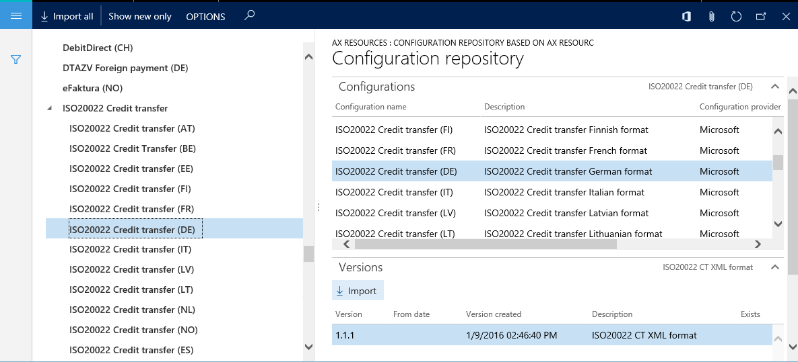

# Download Electronic reporting configurations from Lifecycle Services

[!include [banner](../includes/banner.md)]

This article explains how to download the newest version of [Electronic reporting (ER) configurations](general-electronic-reporting.md#Configuration) from the [Shared asset library](../lifecycle-services/asset-library.md) in Microsoft Dynamics Lifecycle Services (LCS).

> [!IMPORTANT]
> The use of LCS as a storage repository for ER configurations is being [deprecated](../../../finance/get-started/removed-deprecated-features-finance.md#features-removed-or-deprecated-in-the-finance-10017-release). For more information, see [Regulatory Configuration Service (RCS) – Lifecycle Services (LCS) storage deprecation](../../../finance/localizations/rcs-lcs-repo-dep-faq.md).

1. Sign in to the application by using one of the following roles:

    - Electronic reporting developer
    - Electronic reporting functional consultant
    - System administrator

2. Go to **Organization administration** &gt; **Workspaces** &gt; **Electronic reporting**.
3. In the **Configuration providers** section, select the **Microsoft** tile.
4. On the **Microsoft** tile, select **Repositories**.

    

5. On the **Configuration repositories** page, in the grid, select the existing repository of the **LCS** type. If this repository doesn't appear in the grid, follow these steps:

    1. Select **Add** to add a repository.
    2. Select **LCS** as the repository type.
    3. Select **Create repository**.
    4. If you're prompted about authorization, follow the on-screen instructions.
    5. Enter a name and description for the repository.
    6. Select **OK** to confirm the new repository entry.
    7. In the grid, select the new repository of the **LCS** type.

6. Select **Open** to view the list of ER configurations for the selected repository.

    

    > [!TIP]
    > If you have trouble accessing the LCS repository to download configurations from the Shared asset library in LCS, you can download configurations from the [Global repository](er-download-configurations-global-repo.md) instead.

7. In the configurations tree in the left pane, select the required ER configuration.
8. On the **Versions** FastTab, select the required version of the selected ER configuration.
9. Select **Import** to download the selected version from LCS to the current instance.

    > [!NOTE]
    > The **Import** button is unavailable for ER configuration versions that are already present in the current instance.

    

> [!NOTE]
> Depending on the ER settings, configurations are validated after they are imported. You might be notified about any inconsistency issues that are discovered. You must resolve those issues before you can use the imported configuration version. For more information, see the list of related topics for this article.

## Additional resources

[Electronic reporting (ER) overview](general-electronic-reporting.md)

[Download ER configurations from the Global repository of Configuration service](er-download-configurations-global-repo.md)

[!INCLUDE[footer-include](../../../includes/footer-banner.md)]
