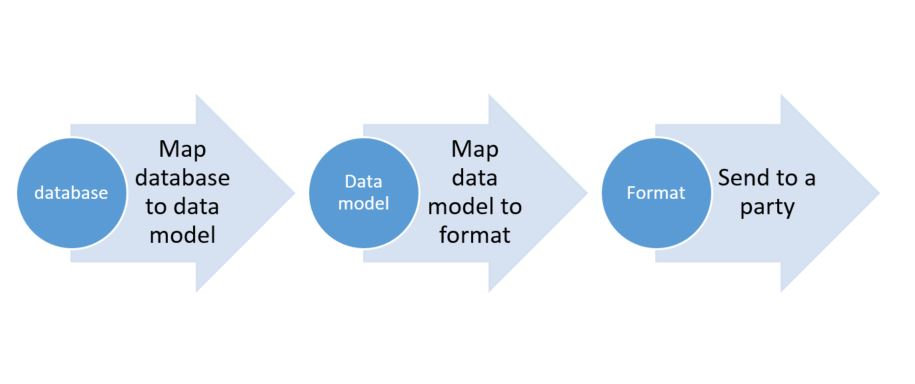

# Create Electronic reporting (ER) configurations

[!include [banner](../includes/banner.md)]

As part of the requirements for Microsoft Dynamics Lifecycle Services (LCS) solutions for localization and translation, localization ISV solution providers must implement features specific to a country/region or solutions by using the Electronic reporting tool. This article provides background information that helps you start using Electronic reporting for creating configurations. This article isn't meant to replace any available and upcoming Electronic reporting documentation, but is intended as a supplemental view from the perspective of localization requirements.

Electronic reporting (ER) is a configurable tool that helps you create and maintain regulatory electronic reporting and payments, based on the following three concepts:

 - Configuration instead of coding
 - One configuration for multiple Dynamics 365 Finance releases
 - Easy or automatic upgrade

By using LCS, ER provides one common way for Microsoft and partners to distribute electronic document configurations to other partners and customers. ER also makes it easier for partners and customers to customize, upgrade, and distribute electronic document formats for their specific business requirements.

You can use ER to set up data models that are domain-specific and independent of the database as data sources for document formats. You can configure formats based on these domain-specific data models by using simple visual tools that are similar to Excel. Data models and formats support versioning, and formats can be date-effective.

### Main data flow

### Data model configuration creation

Reuse and customize data models that Microsoft releases whenever you can. Or, create a business domain area–specific data model that introduces the abstract model of required entities and their relations. By using this approach, you stay aligned with future updates that Microsoft releases. You can also reuse your model for the design and maintenance of multiple domain–specific electronic documents that have different formats that are required in different scenarios or countries/regions.

#### Design the data model of the created model configuration

Design a data model to recognize and describe the required business entities and the relations between them in the selected domain. A data model consists of descriptors that express entities by using data containers (records). Use data items to express properties of entities. A record definition is an entity that contains fields (the data items). Each data item has a unique name, label, description, and value. You can desigh the value of each data item so that it's recognized as string, integer, real, date, enumerate type, and so on. Additionally, the value can be another record or record list. You can select a single record definition as a root of the data model. A root is the starting point of the entire model for data source mapping. In this case, the model is used as a data source that delivers data according to the single predefined data flow. If no record definition is selected as a root of the data model, the data model contains record definitions that can be assigned as a root at the format mapping stage. You can define the data flow of such a model as a data source in multiple ways, depending on the nature of the format. For example, you can design a single data model for the payments domain area. This data model can include data record definitions for the company as a legal entity, for vendors and customers, and also for payments. However, according to the nature of the format, the data must be presented in the following way: payer > payee > payments. Therefore, a single data model can offer data according to the following alternative paths:

- Company &gt; vendor &gt; payment for the Accounts payable domain when you select the company record definition as a root.
- Customer &gt; company &gt; payment for the Accounts receivable domain when you select the customer record definition as a root.

### Format configuration creation

Use the data model configuration created to hold abstract data for a new electronic format that you want to design. If you intend to consume a data model prepared earlier when you create a new format, make sure that you select the **Format based on data model** option for **Create configuration**. After you have a format configuration, you must define a format structure. You can create the structure manually or automatically by importing an example of an XML file or an Excel template. The data model of the parent configuration is automatically offered for format mapping, together with a proper root container. Nevertheless, a format might require that data be represented in a specific way. Therefore, you can use formula designer to define expressions as virtual data items (calculated fields) for your data containers.

> [!NOTE]
> Although you can map format components directly to database and application artifacts, such as tables or data entities, enumerations, or classes and objects in ER, don't use this approach. It's likely that multiple formats are maintained in some business domain areas that use the same data sources. Whenever the structure of the database artifacts changes, you must also change the format mapping to those database artifacts. The cost of these changes multiplies by the number of maintained formats. Therefore, work through the data model as the abstract description of the domain-specific data structure. Use the direct binding of format elements to database components only for simplification and for coverage for specific customizations. For example, use direct binding to refer to custom tables when those references are required in a limited number of maintained formats.

> [!TIP]
> If you still have to add ER data sources to configure a format component to access database and application artifacts at runtime, select **Show details** on the Action pane of the **Format designer** page.

## Version control

One of the principles behind the design of Electronic reporting is that you can easily distribute a data model and formats together with an enhanced maintenance model for their customizations. All the configurations are versioned, and you can "clone" an existing customization to derive a new configuration for localization or customization implementation. For example, you represent a company named Proseware, Inc. You subscribe to the service of a company named Litware Inc., which provides you with the Intrastat returns configuration and supports all legal requirements in it. You receive specific configurations from Litware Inc., together with data model and formats, and deploy them. Your company works in a district where, in addition to the federal requirements, you must support the following regional requirements:

- As part of Intrastat transactions details, your XML file must show the statistical procedure code that isn't required anywhere else.
- You must limit the length of the company name that is presented in the Intrastat returns header block to 200 characters.

To support these requirements and comply with local district authorities, you must implement this localization as a localized configuration. However, you must keep the link with the origin configuration, so that you can adopt any future changes that are introduced at the federal level as new versions of the origin configuration. Therefore, you import the Litware Inc. origin configuration from LCS, derive it as a new localized configuration, introduce the required changes, complete this work by introducing a first version of the localized format, and start to use it internally. Whenever Litware Inc. offers you a new version of the origin configuration, you import it from LCS, rebase your localized configuration to this version, adopt changes to support new federal requirements, complete this work by introducing a next version of the localized format, and continue to use it internally.

> [!NOTE]
> The draft version of any configuration must be "completed" before it can become available locally for further action, such as the following:
>
> - Make it available so that it can be referenced as a data source from a new format.
> - Enable configuration exchange between companies or instances via configuration import/export, and so on.

## Electronic reporting domain coverage

You can use several out-of-the-box configurations to meet electronic reporting requirements for specific countries/regions. The following list shows some examples of format configurations that are grouped into business domains. To get a complete, up-to-date list of available and supported configurations, open a configuration repository setup to show the configurations that are available for import from either resources or an LCS Assets library.  

- Audit file

    - FEC
    - GDPdU...

- Payments (ISO20022)

    - SEPA CT
    - SEPA DD
    - JBA
    - BACS...

- Statistical reports

    - EU Intrastat...

- Tax reports

    - CIS
    - BAS
    - ELSTER
    - EU Sales list...

- Customer e-Invoice

    - OIOUBL...
    
## Your solution uptake

You can choose how to move your electronic reporting functionality into ER. However, consider the following high-level steps when you plan that move.

1. Review the electronic reporting functionality that your solution currently provides.
2. Identify domain areas that your solution covers, such as Payments and E-Invoices.
3. Review the configurations that Microsoft provides. It's likely that you find a configuration that you can use as a base. For example, if your solution customizes the SEPA CT payment format, extend the SEPA CT configuration.
4. Create new configurations that are based on either an existing model or format, or a new model or format.
5. Define input parameters that users must select when they run the report, and validations for the content of the report.
6. Define mappings with the model by using arithmetic, string, date, or other available Excel-like functions.
7. Define labels and translation to different languages, where applicable.
8. Define templates that include named ranges, and set links from the configuration for the Excel report, if applicable.

## Terminology

| Term                 | Definition |
|----------------------|------------|
| ER                  | Electronic reporting is an engine that simplifies the creation of electronic reports for information interchange with governments, banks, and other parties. Currently, Electronic reporting supports text, XML, and OpenXML spreadsheet formats, and provides an extension interface to support more formats. |
| Transformation       | If you have a typical action that must be done on the source of data before it's sent as output to a format, you can introduce a transformation and attach it to format components. A transformation is an ER formula that takes one value as a parameter and returns another value. For example, you have many format fields that contain spaces, and the spaces should be replaced by spaces when the fields are exported. In this case, you can create a transformation that takes a string argument and uses the REPLACE function to do the job. You can then create string components and associate them with that transformation. |
| Data model           | A data model provides a structure for data. This structure is used to abstractly describe certain business domain areas at sufficient detail to satisfy the reporting requirements in this domain. |
| Configuration        | A container for either a data model or a format, together with its mappings to data sources, that can be maintained and executed, and that supports versioning. The configuration is the entity that's imported or exported to organize electronic document format exchange between finance and operations instances. |
| Derive action        | An operation that uses an existing configuration as a basis to create a new configuration. |
| Rebase action        | An operation that updates a derived configuration with changes that were introduced in a new version of the base configuration. The version number is selected at the rebase initialization stage. |
| Update conflict      | A conflict discovered during the rebase action, where the new base version contains adjustments of a format/mapping element (name, property, and so on) that's also adjusted in the derived version. |
| Relocation conflict  | A conflict discovered during the rebase action, where the new base version contains a new position (parent element) of a format element (name, property, and so on) that's also relocated to a different position in the derived version. |
| Duplication conflict | A conflict discovered during the rebase action, where the new base version introduced a new format element that is the same as an element (it has the same name and child components) that's also entered in the derived version.|

## Additional resources

[Electronic reporting (ER) overview](general-electronic-reporting.md)

[Manage the Electronic reporting (ER) configuration lifecycle](general-electronic-reporting-manage-configuration-lifecycle.md)

[!INCLUDE[footer-include](../../../includes/footer-banner.md)]

