# Electronic reporting (ER) destinations

[!include [banner](../includes/banner.md)]

You can configure a destination for each Electronic reporting (ER) format configuration and its output component (a folder or a file). Users who have appropriate access rights can also modify destination settings at runtime. This article explains ER destination management, the types of destinations that are supported, and security considerations.

ER format configurations usually contain at least one output component: a file. Typically, configurations contain multiple file output components of different types (for example, XML, TXT, XLSX, DOCX, or PDF) that are grouped into either a single folder or multiple folders. ER destination management lets you preconfigure what occurs when each component is run. By default, when a configuration is run, a dialog box appears that lets you save or open the file. The same behavior also occurs when you import an ER configuration and don't configure any specific destinations for it. After a destination is created for a main output component, that destination overrides the default behavior, and the folder or file is sent according to the destination's settings.

## Availability and general prerequisites

The functionality for ER destinations isn't available in Microsoft Dynamics AX 7.0 (February 2016). Therefore, you must install Microsoft Dynamics 365 for Operations version 1611 (November 2016) or later to use the following destination types:

- [Email](er-destination-type-email.md)
- [Archive](er-destination-type-archive.md)
- [File](er-destination-type-file.md)
- [Screen](er-destination-type-screen.md)
- [Power BI](er-destination-type-powerbi.md)

Alternatively, you can install one of the following prerequisites. However, be aware that these alternatives provide a more limited ER destination experience.

- Microsoft Dynamics AX application version 7.0.1 (May 2016)
- [Electronic reporting destination management application hotfix](https://fix.lcs.dynamics.com/issue/results/?q=3160213)

There is also a [Print](er-destination-type-print.md) destination type. To use it, you must install Microsoft Dynamics 365 Finance version 10.0.9 (April 2020).

## Overview

You can set up destinations only for ER configurations that have been [imported](general-electronic-reporting.md#importing-an-er-component-from-lcs-to-use-it-internally) into the current Finance instance, and for the formats that are available on the **Electronic reporting configurations** page. The functionality for ER destination management is available at **Organization administration** \> **Electronic reporting** \> **Electronic reporting destination**.

### Default behavior

The default behavior for an ER format configuration depends on the execution type that you specify when an ER format starts.

In the **Intrastat Report** dialog box, on the **Run in the background** FastTab, if you set the **Batch processing** option to **No**, an ER format is run immediately in interactive mode. When this execution is successfully completed, a generated outbound document is made available for download.

If you set the **Batch processing** option to **Yes**, an ER format is run in [batch](../sysadmin/batch-processing-overview.md) mode. The appropriate batch job is created, based on the parameters that you specify on the **Run in the background** tab of the **ER parameters** dialog box.

> [!NOTE]
> The job description informs you about the run of an ER format mapping. It also contains the name of the ER component that is run.

[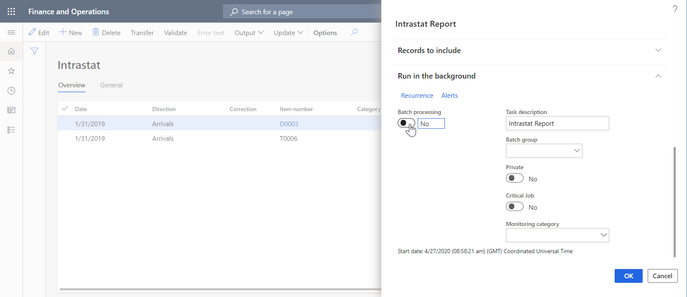](./media/ER_Destinations-RunInBatchMode.png)

You can find information about this job in several places:

- Go to **Common** \> **Inquiries** \> **Batch jobs** \> **My batch jobs** to check the status of the scheduled job.
- Go to **Organization administration** \> **Electronic reporting** \> **Electronic reporting jobs** to check the status of the scheduled job and the execution results of the completed job. When job execution is successfully completed, select **Show files** on the **Electronic reporting jobs** page to get a generated outbound document.

    > [!NOTE]
    > This document is stored as an attachment of the current job record and is controlled by the [Document management](../../fin-ops/organization-administration/configure-document-management.md) framework. The [document type](../../fin-ops/organization-administration/configure-document-management.md#configure-document-types) that is used to store ER artifacts of this type is configured in the [ER parameters](electronic-reporting-er-configure-parameters.md#parameters-to-manage-documents).

- On the **Electronic reporting jobs** page, select **Show files** to view the list of any errors and warnings that were generated during job execution.

    [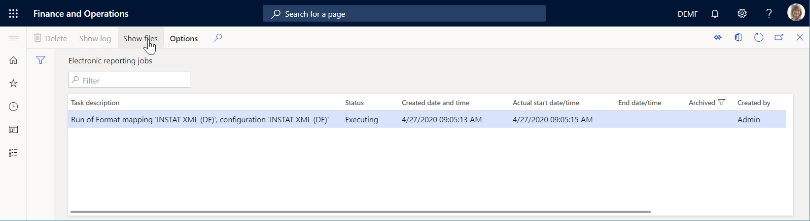](./media/ER_Destinations-ReviewERJobs.png)

### User-configured behavior

On the **Electronic reporting destination** page, you can override the default behavior for a configuration. Imported configurations aren't shown on this page until you select **New** and then, in the **Reference** field, select a configuration to create destination settings for.

[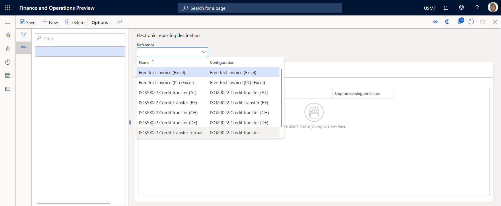](./media/ER_Destinations-SelectFormat.png)

After you create a reference, you can create a file destination for each **Folder** or **File** output component of the referenced ER format.

[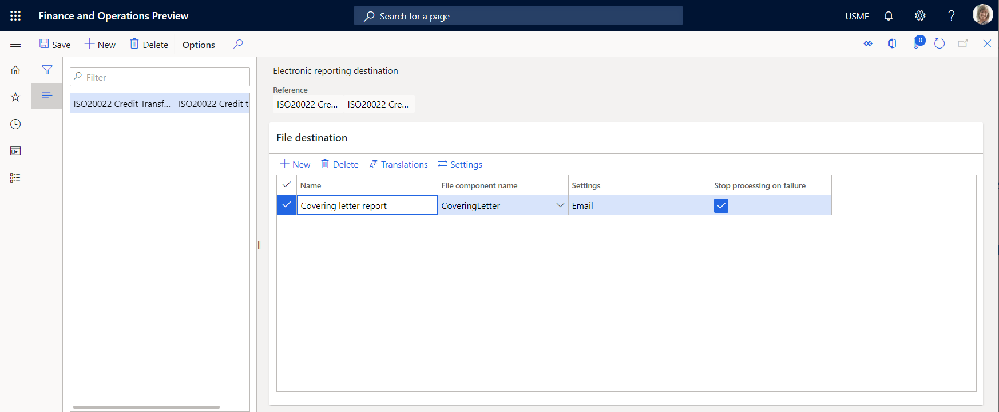](./media/ER_Destinations-ConfigureElementDestination.png)

Next, in the **Destination settings** dialog box, you can enable and disable individual destinations for the file destination. The **Settings** button is used to control all the destinations for a selected file destination. In the **Destination settings** dialog box, you can control each destination separately by setting the **Enabled** option for it.

In versions of Finance **before version 10.0.9**, you can create **one file destination** for each output component of the same format, such as a folder or a file that is selected in the **File Name** field. However, in **version 10.0.9 and later**, you can create **multiple file destinations** for each output component of the same format.

For example, you can use this capability to configure file destinations for a file component that is used to generate an outbound document in Excel format. One destination ([Archive](er-destination-type-archive.md)) can be configured to store the original Excel file in the ER jobs archive, and another destination ([Email](er-destination-type-email.md)) can be configured to simultaneously [convert](#OutputConversionToPDF) the Excel file to PDF format and send the PDF file by email.

[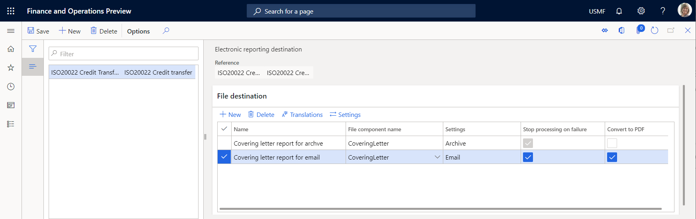](./media/ER_Destinations-SampleDestinations.png)

When you run an ER format, all destinations that were configured for components of the format are always run. In addition, in Finance **version 10.0.17 and later**, the ER destinations functionality has been improved and now lets you configure different sets of destinations for a single ER format. This configuration marks each set as configured for a particular user action. The ER API has been [extended](er-apis-app10-0-17.md) so that an action can be provided that the user performs by running an ER format. The action code that is provided is passed to ER destinations. You can run different destinations of an ER format, depending on the action code that is provided. For more information, see [Configure action-dependent ER destinations](er-action-dependent-destinations.md).

## Destination types

The following destinations are currently supported for ER formats. You can disable or enable all types at the same time. In this way, you can either do nothing or send the component to all configured destinations.

- [Email](er-destination-type-email.md)
- [Archive](er-destination-type-archive.md)
- [File](er-destination-type-file.md)
- [Screen](er-destination-type-screen.md)
- [Power BI](er-destination-type-powerbi.md)
- [Print](er-destination-type-print.md)

## Applicability

You can set up destinations only for ER configurations that have been imported, and for the formats that are available on the **Electronic reporting configurations** page.

> [!NOTE]
> Configured destinations are company-specific. If you plan to use an ER format in different companies of the current Finance instance, you must configure destinations for that ER format for each of those companies.

When you configure file destinations for a selected format, you configure them for the whole format.

[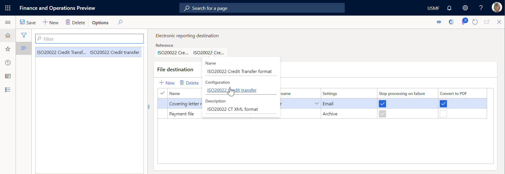](./media/ER_Destinations-ConfigurationLink.png)

At the same time, you might have multiple versions of the format that have been imported into the current Finance instance. You can view them if you select the **Configuration** link that is offered when you select the **Reference** field.

[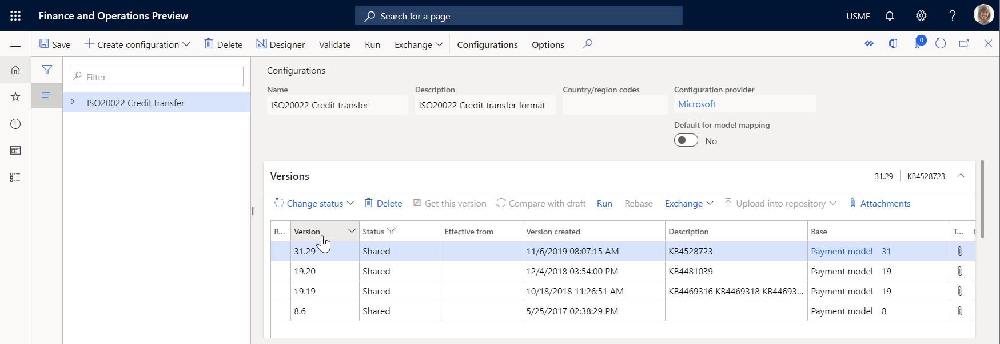](./media/ER_Destinations-ConfigurationVersions.png)

By default, configured destinations are applied only when you run an ER format version that has a status of either **Completed** or **Shared**. However, you must sometimes use configured destinations when the draft version of an ER format is run. For example, you modify a draft version of your format, and you want to use configured destinations to test how generated output will be delivered. Follow these steps to apply destinations for an ER format when the draft version is run.

1. Go to **Organization administration** \> **Electronic reporting** \> **Configurations**.
2. On the **Configurations** page, on the Action Pane, on the **Configurations** tab, in the **Advanced settings** group, select **User parameters**.
3. Set the **Use destinations for draft status** option to **Yes**.

[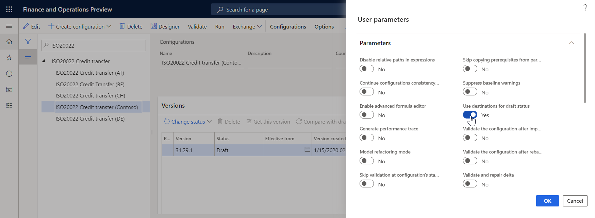](./media/ER_Destinations-UserSetting1.png)

To use the draft version of an ER format, you must mark the ER format accordingly.

1. Go to **Organization administration** \> **Electronic reporting** \> **Configurations**.
2. On the **Configurations** page, on the Action Pane, on the **Configurations** tab, in the **Advanced settings** group, select **User parameters**.
3. Set the **Run setting** option to **Yes**.

[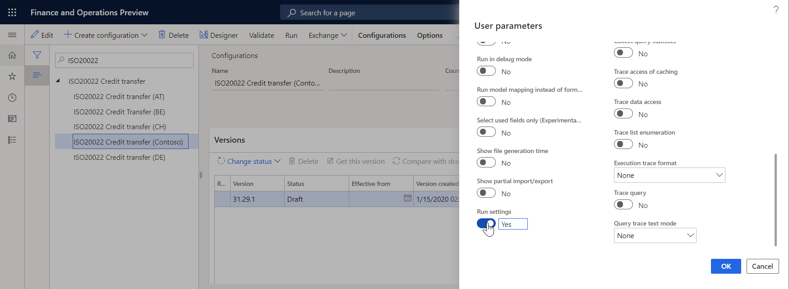](./media/ER_Destinations-UserSetting2.png)

After you complete this setup, the **Run draft** option becomes available for ER formats that you modify. Set this option to **Yes** to start to use the draft version of the format when the format is run.

[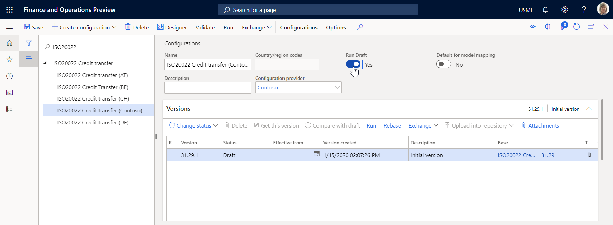](./media/ER_Destinations-FormatSetting.png)

## Destination failure handling

Usually, an ER format is run within the scope of a specific business process. However, the delivery of an outbound document that is generated during execution of an ER format must sometimes be considered part of that business process. In this case, if delivery of a generated outbound document to a configured destination is unsuccessful, execution of the business process must be canceled. To configure the appropriate ER destination, select the **Stop processing on failure** option.

For example, you configure vendor payment processing so that the **ISO20022 Credit Transfer** ER format is run to generate the payment file and supplementary documents (for example, the covering letter and control report). If a payment should be considered successfully processed only if the covering letter is successfully delivered by email, you must select the **Stop processing on failure** checkbox for the **CoveringLetter** component in the appropriate file destination, as shown in the following illustration. In this case, the status of the payment that is selected for processing will be changed from **None** to **Sent** only when the covering letter that is generated is successfully accepted for delivery by an email provider that is configured in the Finance instance.

[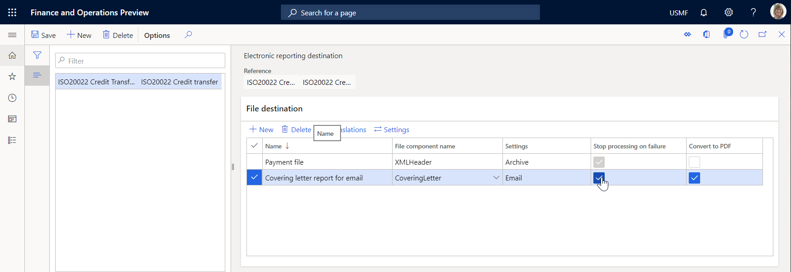](./media/ER_Destinations-StopProcessingAtDestinationFailure.png)

If you clear the **Stop processing on failure** checkbox for the **CoveringLetter** component in the destination, a payment will be considered successfully processed even if the covering letter isn't successfully delivered by email. The status of the payment will be changed from **None** to **Sent** even if the covering letter can't be sent because, for example, the email address of the recipient or sender is missing or incorrect.

## Output conversion to PDF

You can use the PDF conversion option to convert output in Microsoft Office (Excel or Word) format to PDF format.

### Make PDF conversion available

To make the PDF conversion option available in the current Finance instance, open the **Feature management** workspace, and turn on the **Convert Electronic Reporting outbound documents from Microsoft Office formats to PDF** feature.

[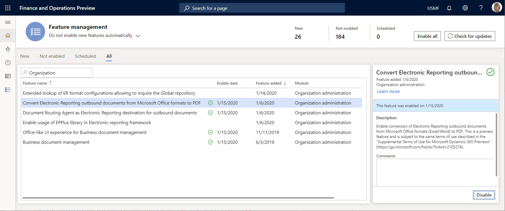](./media/ER_Destinations-EnablePdfConversionFeature.png)

> [!NOTE]
> In versions of Finance before 10.0.21, conversion to PDF had to be explicitly enabled. However, starting in version 10.0.21, the **Convert Electronic Reporting outbound documents from Microsoft Office formats to PDF** feature was automatically enabled. Starting in version 10.0.29, the feature became mandatory. In Finance version 10.0.32, the feature has been eliminated, and conversion to PDF is enabled out of the box.

### Applicability

In versions of Finance **before version 10.0.18**, the PDF conversion option can be turned on only for **Excel\\File** components that are used to generate output in Office (Excel or Word) format. When this option is turned on, output that is generated in Office format is automatically converted to PDF format. However, in **version 10.0.18 and later**, you can also turn on this option for components of the **Common\\File** type.

> [!NOTE]
> Pay attention to the warning message that you receive when you turn on the PDF conversion option for an ER component of the **Common\\File** type. This message informs you that there is no way to guarantee, at design time, that the selected file component will expose the content in PDF format or the PDF-convertible content at runtime. Therefore, you should turn on the option only if you're sure that the selected file component was configured to expose the content in PDF format or the PDF-convertible content at runtime.
> 
> If you turn on the PDF conversion option for a format component, if that component exposes content in a format other than PDF, and if the exposed content can't be converted to PDF format, an exception will occur at runtime. The message that you receive informs you that the generated content can't be converted to PDF format.

### Limitations

As of Finance **version 10.0.9**, the PDF conversion option is available only for cloud deployments. Starting in Finance version **10.0.27**, the PDF conversion option is available for any on-premises deployment that has [Internet connectivity](../user-interface/client-disconnected.md) enabled.

The PDF document that is produced is limited to a maximum length of 300 pages.

As of Finance **version 10.0.9**, only landscape page orientation is supported in the PDF document that is produced from Excel output. Starting in Finance **version 10.0.10**, you can [specify the page orientation](#SelectPdfPageOrientation) of the PDF document that is produced from Excel output while you configure an ER destination.

Only the common system fonts of the Window operating system are used to convert output that contains no embedded fonts.

### Resources

Before Finance version 10.0.29, PDF conversion could be done only outside the current Finance instance. A generated file was sent out of Finance to the conversion service, and that service then returned the converted document. However, in version **10.0.29 and later**, in addition to the **Convert Electronic Reporting outbound documents from Microsoft Office formats to PDF** feature, you can enable the **Utilize application resources to perform CBD documents conversion from Word to PDF format** feature. This feature lets you convert generated Word documents to PDF format locally by using application server resources in the current Finance instance. 

Here are the advantages of local PDF conversion when the **Utilize application resources to perform CBD documents conversion from Word to PDF format** feature is enabled:

- The PDF document that is produced isn't [limited](#limitations) to a maximum number of pages.
- The Word document that is converted can contain a [large number of content controls](https://fix.lcs.dynamics.com/Issue/Details?bugId=647877&dbType=3).
- Internet connectivity isn't required in on-premises deployments.

### Use the PDF conversion option

To turn on PDF conversion for a file destination, select the **Convert to PDF** checkbox.

[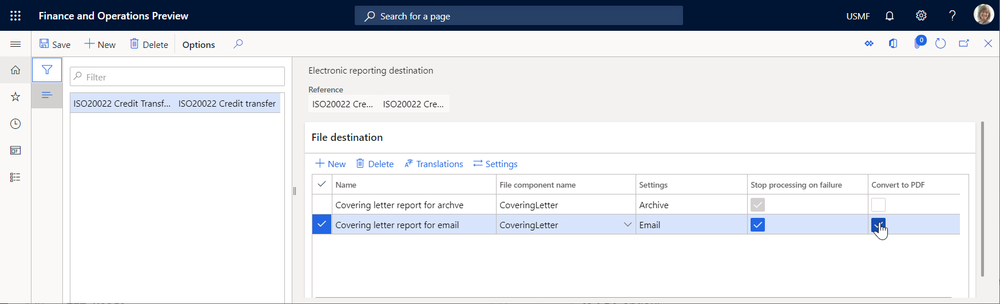](./media/ER_Destinations-TurnOnPDFConversion.png)

### <a name="SelectPdfPageOrientation">Select a page orientation for PDF conversion</a>

If you generate an ER configuration in Excel format and want to convert it to PDF format, you can explicitly specify the page orientation of the PDF document. When you select the **Convert to PDF** checkbox to turn on PDF conversion for a file destination that produces an output file in Excel format, the **Page orientation** field becomes available on the **PDF conversion settings** FastTab. In the **Page orientation** field, select the preferred orientation.

[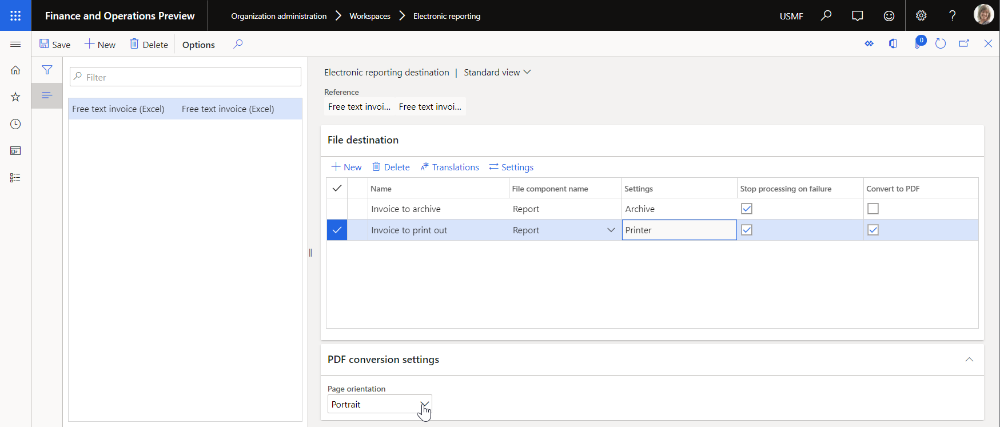](./media/ER_Destinations-SelectPDFConversionPageOrientation.png)

To have the option to select the PDF page orientation, install Finance version 10.0.10 or later. In versions of Finance **before version 10.0.23**, this option offers the following page orientation options:

- Portrait
- Landscape

The selected page orientation is applied to all pages of an outbound document that is generated in Excel format and then converted to PDF format.

However, in **version 10.0.23 and later**, the list of page orientation options has been extended as follows:

- Portrait
- Landscape
- Worksheet specific

When you select the **Worksheet specific** option, every worksheet of a generated Excel workbook is converted to PDF by using page orientation that has been configured for this worksheet in the used Excel template. So, you might have a final PDF document containing portrait and landscape pages. 

If an ER configuration in Word format is converted to PDF format, the page orientation of the PDF document is always taken from the Word document.

### Use the PDF conversion component in formats

In Finance **version 10.0.33**, you can use PDF conversion directly in format configurations. In this case, you don't have to use the [**Convert to PDF**](#ConvertToPDF) checkbox on the **Electronic reporting destination** page. A new format component, **PDF Converter**, has been added.

[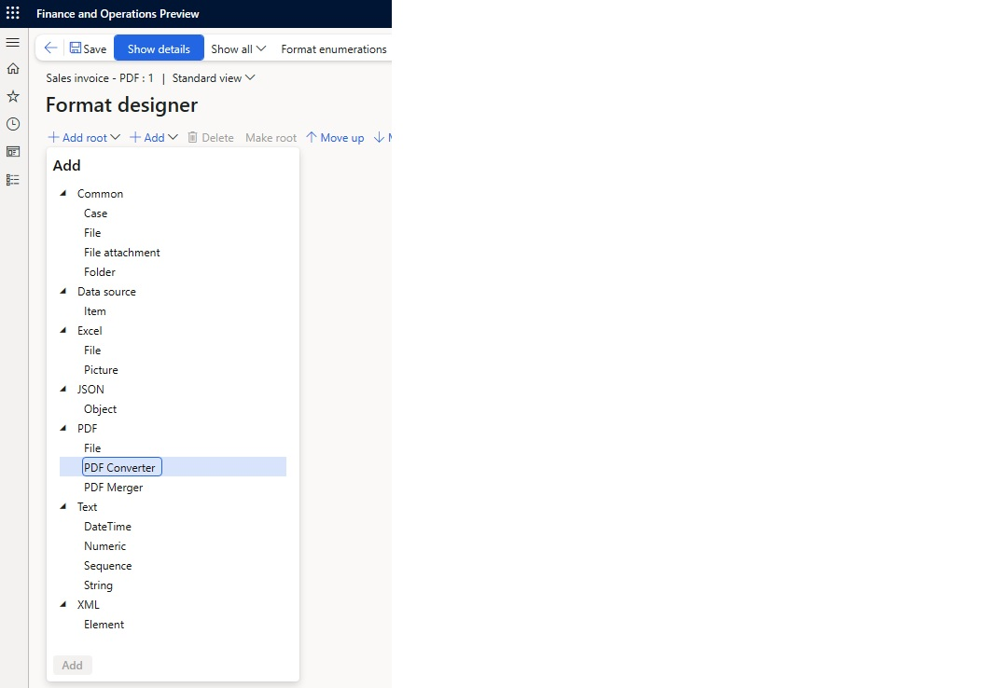](./media/ERformatPDFconverter.jpg)

> [!NOTE]
> The **PDF Converter** component can be added only in the format configurations of a **PDF** format type, or when the format type isn't explicitly defined but is left blank. The **PDF Converter** component can contain only one **Excel\\File** sub-component.

## Output unfolding

When you configure a destination for the **Folder** component of your ER format, you can specify how the output of that component is delivered to the configured destination.

### Make output unfolding available

To make the output unfolding option available in the current Finance instance, open the **Feature management** workspace, and turn on the **Allow configuring ER destinations to send folders content as separate files** feature.

### Applicability

The output unfolding option can be configured only for the format components of the **Folder** type. When you start to configure a **Folder** component, the **General** FastTab becomes available on the **Electronic reporting destination** page. 

### Use the output unfolding option

On the **General** FastTab, in the **Send folder as** field, select one of the following values:

- **ZIP archive** – Deliver a generated file as a zip file.
- **Separate files** – Deliver every file of a generated zip file as an individual file.

    > [!NOTE]
    > When you select **Separate files**, the generated output is collected in memory in a zipped state. Therefore, the maximum [file size limit](er-compress-outbound-files.md) is applied for zipped output when the real file size might exceed this limit. We recommend that you select this value when you expect the size of the generated output to be quite large.

[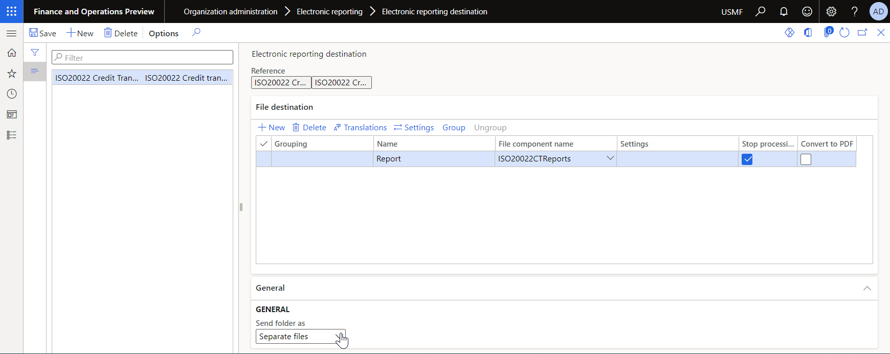](./media/er_destinations-set-unfolding-option.png)

### Limitations

If you set the **Send folder as** field to **Separate files** for a **Folder** component that contains other nested **Folder** components, the setting isn't recursively applied to the nested **Folder** components.

##  Change page layout properties of a template

You can configure an ER destination for an ER format component that's designed to use a template in a Microsoft Office (Excel or Word) format for report generation. If you aren't the owner of this format and you need to change page layout properties of the format's template, in versions of Finance before version 10.0.29, you have to create a derived format and modify the template properties. Then, you have to maintain the derived format configuration. However, in version 10.0.29 and later, you can change the page layout properties of the template at runtime to avoid creating and maintaining the derived format configuration. To do this, set up the desired properties as part of the settings of the configured ER destination. When you run an ER format and execute an ER destination that's configured to use certain page layout properties, the values of page layout properties of the executed destination are applied to the template you're using, replacing the original template's properties. You can configure different destinations for the same format's component configuring different page layout properties for the template in use.

The following properties can be configured in an ER destination for a format component that's designed to use a template in Excel or Word format:

- Page orientation
    - Portrait
    - Landscape
- Paper size
    - A3
    - A4
    - A5
    - B4
    - B5
    - Executive
    - Legal
    - Letter
    - Statement
    - Tabloid
- Page margins
    - Top
        - Header
    - Bottom
        - Footer
    - Left
    - Right

> [!NOTE]
> The page orientation of the template that's configured in this way must be aligned with the [page orientation for PDF conversion](#select-a-page-orientation-for-pdf-conversion) if the PDF conversion is configured.

You must select the length unit for setting page margins:

- Inches
- Centimeters
- Millimeters

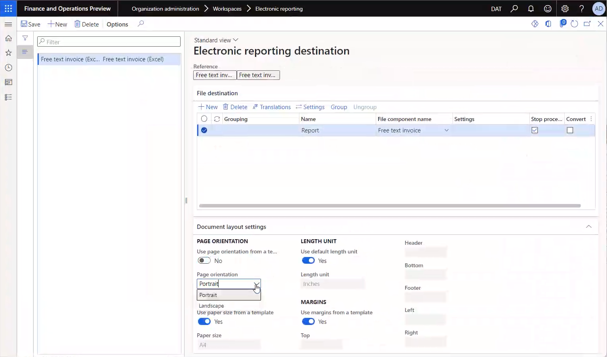

> [!TIP]
> When a margin value is nominated in centimeters and specified with multiple decimals, it's rounded at runtime to the nearest value with 1 decimal point.
>
> When a margin value is nominated in millimeters and specified with decimals, it's rounded at runtime for Excel to the nearest integer value with no decimal point.
>
> When a margin value is nominated in millimeters and specified with multiple decimals, it's rounded at runtime for Word to the nearest value with one decimal point.

## Security considerations

Two types of privileges and duties are used for ER destinations. One type controls a user's overall ability to maintain the destinations that are configured for a legal entity (that is, it controls access to the **Electronic reporting destinations** page). The other type controls an application user's ability to override, at runtime, the destination settings that an ER developer or ER functional consultant has configured.

| Role (AOT name)                     | Role name                                  | Duty (AOT name)                     | Duty name                                                        |
|-------------------------------------|--------------------------------------------|-------------------------------------|------------------------------------------------------------------|
| ERDeveloper                         | Electronic reporting developer             | ERFormatDestinationConfigure        | Configure electronic reporting format destination                |
| ERFunctionalConsultant              | Electronic reporting functional consultant | ERFormatDestinationConfigure        | Configure electronic reporting format destination                |
| PaymAccountsPayablePaymentsClerk    | Accounts payable payments clerk            | ERFormatDestinationRuntimeConfigure | Configure electronic reporting format destination during runtime |
| PaymAccountsReceivablePaymentsClerk | Accounts receivable payments clerk         | ERFormatDestinationRuntimeConfigure | Configure electronic reporting format destination during runtime |

> [!NOTE]
> Two privileges are used in the preceding duties. These privileges have the same names as the corresponding duties: **ERFormatDestinationConfigure** and **ERFormatDestinationRuntimeConfigure**.

## Frequently asked questions

### I have imported electronic configurations, and I see them on the Electronic reporting configurations page. But why don't I see them on the Electronic reporting destinations page?

Make sure that you select **New** and then select a configuration in the **Reference** field. The **Electronic reporting destinations** page shows only configurations that destinations have been configured for.

### Is there any way to define which Microsoft Azure Storage account and Azure Blob storage are used?

No. The default Microsoft Azure Blob storage that is defined and used for the document management system is used.

### What is the purpose of the File destination in the destination settings? What does that setting do?

The **File** destination is used to control a dialog box of your web browser when you run an ER format in interactive mode. If you enable this destination, or if no destination is defined for a configuration, an open or save dialog box appears in your web browser after an output file is created.

### Can you give an example of the formula that refers to a vendor account that I can send email to?

The formula is specific to the ER configuration. For example, if you use the ISO 20022 Credit Transfer configuration, you can use **'$PaymentsForCoveringLetter'.Creditor.Identification.SourceID** or **model.Payments.Creditor.Identification.SourceID** to get an associated vendor account.

### One of my format configurations contains multiple files that are grouped into one folder (for example, Folder1 contains File1, File2, and File3). How do I set up destinations so that Folder1.zip isn't created at all, File1 is sent by email, File2 is sent to SharePoint, and I can open File3 immediately after the configuration is run?

Your format must first be available in the ER configurations. If this prerequisite is met, open the **Electronic reporting destination** page, and create a new reference to the configuration. You must then have four file destinations, one for each output component. Create the first file destination, give it a name such as **Folder**, and select a file name that represents a folder in your configuration. Then select **Settings**, and make sure that all the destinations are disabled. For this file destination, the folder won't be created. By default, because of hierarchical dependencies between files and parent folders, the files will behave in the same way. In other words, they won't be sent anywhere. To override that default behavior, you must create three more file destinations, one for each file. In the destination settings for each, you must enable the destination that the file should be sent to.

## Additional resources

[Electronic reporting (ER) overview](general-electronic-reporting.md)

[Configure action-dependent ER destinations](er-action-dependent-destinations.md)

[!INCLUDE[footer-include](../../../includes/footer-banner.md)]
