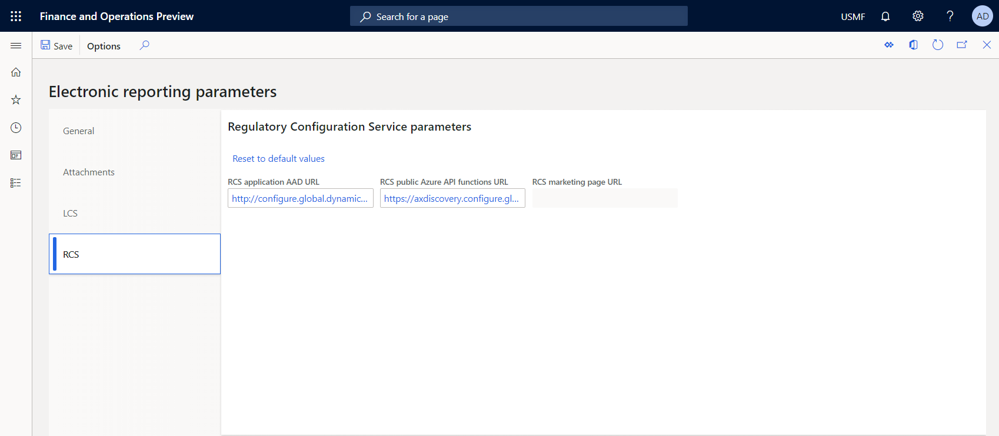

---
# required metadata

title: Configure the Electronic reporting (ER) framework
description: This topic explains how to configure parameters of the Electronic reporting (ER) framework.
author: NickSelin
manager: AnnBe
ms.date: 05/11/2017
ms.topic: article
ms.prod: 
ms.service: dynamics-ax-platform
ms.technology: 

# optional metadata

ms.search.form: ERSolutionTable, ERVendorTable, ERWorkspace, ERParameters, ERFormatDestinationTable
# ROBOTS: 
audience: Developer, IT Pro
# ms.devlang: 
ms.reviewer: kfend
ms.search.scope: Core, Operations
# ms.tgt_pltfrm: 
ms.custom: 27621
ms.assetid: 3c1291de-230c-4e31-96c4-ba69a310690a
ms.search.region: Global
# ms.search.industry: 
ms.author: nselin
ms.search.validFrom: 2016-02-28
ms.dyn365.ops.version: July 2017 update

---

# Configure the Electronic reporting (ER) framework

[!include [banner](../includes/banner.md)]

This topic explains how to set up the basic functionality for Electronic reporting (ER). It also describes the steps that you must complete before you can set up ER.

## Prerequisites for ER setup
Before you can set up ER, you must set up the required [document types](https://docs.microsoft.com/dynamics365/fin-ops-core/fin-ops/organization-administration/configure-document-management#configure-document-types) in Document management:

- A document type for Microsoft Office documents that are used as templates for ER reports.
- A document type that is used to store the output of ER reports in the jobs archive.
- A document type that is used to store the output of ER reports so that they can be viewed in other programs.
- A document type that is used to keep baselines of outputs of ER configurations.
- A document type that is used to handle files in the ER framework for all other purposes.

For each document type, the following attribute values can be selected.

| Attribute name | Attribute value                     |
|----------------|-------------------------------------|
| Class          | **Attach file**                     |
| Group          | **File**                            |
| Location       | **Azure storage** or **SharePoint** |

## Set up ER
Use the following procedure to set up the basic functionality of ER for all legal entities.

1. Open the **Electronic reporting** workspace page.
2. Click **Electronic reporting parameters**.

## Main parameters

On the **Electronic reporting parameters** page, on the **General** tab, define the desire value of the following ER parameters:

1. **Enable design mode** parameter:
    - Set it to **Yes** to enable embedded ER designers allowing users to create their own ER configurations in this Finance instance.
    - Set it to **No** forcing users to access the functionality of ER designers by signing up for the **Regulatory services**.

2. **Disable tracing of ER performance in data handling** parameter:
    - Set it to **No** to allow collecting in Microsoft Telemetry information about average time needed to process a single incoming / outgoing record as an ER configuration specific health metric of the using environment. This information will help Microsoft to quickly identify and address issues affecting customers that are using the ER framework.
    - Set it to **Yes** to stop collecting in Microsoft Telemetry mentioned above information. 

## <a name="ManageDocumentsParameters">Parameters to manage documents</a>

On the **Electronic reporting parameters** page, on the **Attachments** tab, define the desire value of the following ER parameters:

1. In the **Configurations** parameter, select the document type to specify the storage of templates of ER formats.
    >
    > Note that this document type is selected in scope of a particular company. This document type will be used regardless of the company a user is logged in while an ER format is used. 

2. In the **Job archive** parameter, select the document type to specify the storage of generated documents that are attached to the records of the ER jobs [archive](er-destination-type-archive.md).
    >
    > Note that this document type is selected as a company specific one. You must be sure that the selected document type is configured for every company in which you plan to run ER formats the result of execution of which will be stored in ER jobs archive.

3. In the **Temporary** parameter, select the document type to specify the storage of generated documents that are used for other purposes, for example, for [preview](er-destination-type-screen.md) by other services.
    >
    > Note that this document type is selected as a company specific one. You must be sure that the selected document type is configured for every company in which you plan to run ER formats the result of execution of which will be stored in ER jobs archive.

4. In the **Baseline** parameter, select the document type to specify the storage of documents that are used as [baselines](er-trace-reports-compare-baseline.md) during the automated testing of ER configurations.
    >
    > Note that this document type is selected as a company specific one. You must be sure that the selected document type is configured for every company in which you plan to run ER formats the result of execution of which will be stored in ER jobs archive.

5. In the **Others** parameter, select the document type to specify the storage of generated documents that are used for all other purposes.
    >
    > Note that this document type is selected as a company specific one. You must be sure that the selected document type is configured for every company in which you plan to run ER formats the result of execution of which will be stored in ER jobs archive.

6. Define the desire value of the **Stop making backup copies of templates** parameter:

    - Set it to **No** to automatically make the backup copy of any template of using ER format configuration and to store this copy in the database storage.
    - Set it to **Yes** to stop making backup copies of templates of ER format configurations.

    >
    > See [Backup storage of ER templates](er-backup-storage-templates.md) for more.

## LCS parameters

On the **LCS** tab, define the number of parallel threads that should be used to load an ER configuration from repositories in Microsoft Dynamics Lifecycle Services (LCS), so that the configurations are loaded in the most efficient manner. The value can vary from **1** to **15**, depending on the available resources of the current program.

>
> Note that the real number of threads will be defined automatically, based on this setting, and on the number of other tasks and their priorities.

## RCS parameters

On the **RCS** tab, sign up for the **Regulatory service**.

## Active ER configurations provider

On the **Configuration provider table** page, create ER provider records. Each provider can be [marked](tasks/er-configuration-provider-mark-it-active-2016-11.md) as **Active**. The active provider's name and Internet address are stored in an ER configuration as attributes of the owner of the configuration.

## Optional setup for ER
In addition to the basic functionality, ER has other functionality that you can set up.

- On the **Electronic reporting destination** page, define the ER output destinations for each file output of each ER format configuration. Use the [document types](https://docs.microsoft.com/dynamics365/fin-ops-core/fin-ops/organization-administration/configure-document-management#configure-document-types) of the Document management framework that you set up earlier. You can also use this page to set up the optional functionality of ER for each legal entity. For more information, see the topic about ER destinations that is linked in the [Additional resources](#AdditionalResources) section of this topic.
- Whenever you add new Application Object Tree (AOT) artifacts or update existing AOT artifacts that are used as data sources (tables, views, or data entities) in ER, use the **Rebuild table references** menu item (**Organization administration** \> **Electronic reporting** \> **Rebuild table references**) to bring your AOT changes into the ER metadata.

## Frequently asked questions
**Question:** What is the optimal number of parallel threads to use to load an ER configuration from LCS?

**Answer:** To calculate the optimal number of parallel threads, use the following empirical formula: Cores ÷ 2 + 1(2). For example, if the program runs on a virtual machine (VM) that has two CPUs, and each CPU contains four cores, the optimal number is five or six parallel threads.

**Question:** I have added a custom table to the AOT. I created a new ER model mapping configuration for my ER data model. During the design of the model mapping, I tried to add a new data source type, **Table records**, that refers to my table. I could manually add my table name to the **Table** lookup, and the ER model mapping accepted it without errors or warnings. However, my table's name isn't included in the list of available choices that the **Table** lookup of this data source offers. How do I include the name of my table?

**Answer:** To include the name of your custom table in the **Table** lookup, use the **Rebuild table references** menu item as described in the "Optional setup for ER" section earlier in this topic.

**Question:** Why can't I mark the Microsoft provider as **Active** in the **Electronic reporting** workspace in my production environment?

**Answer:** The Microsoft provider is used to mark ER configurations that have been designed and maintained by Microsoft. We expect that Microsoft will release new versions of the configurations in the future. We recommend that you not mark the Microsoft provider as **Active**. Otherwise, you can update the configurations. (For example, you can change the content and register new versions.) These updates will cause issues in the future, when Microsoft provides new versions of the configurations, and those new versions must be imported and adopted. Instead, register a new ER provider for your company, and use it for your ER configurations maintenance. To reuse a Microsoft configuration, select it as the base for your derived copy. To incorporate changes that are provided by Microsoft, rebase your configuration to a new version of the Microsoft configuration when it becomes available.

**Question:**
I successfully executed an ER format in one company. While I executed the same ER format in another company having same settings, I have got an error message: `The provided document type is not a File type.`

**Answer:**
Most likely, the second company does not contain document types that have been selected in **Job archive**, **Temporary**, **Baseline** or **Others** ER [parameters](#ManageDocumentsParameters). You need to configure these document types in the second company.

## <a name="AdditionalResources">Additional resources</a>

- [Electronic reporting (ER) overview](general-electronic-reporting.md)
- [Electronic reporting (ER) destinations](electronic-reporting-destinations.md)
