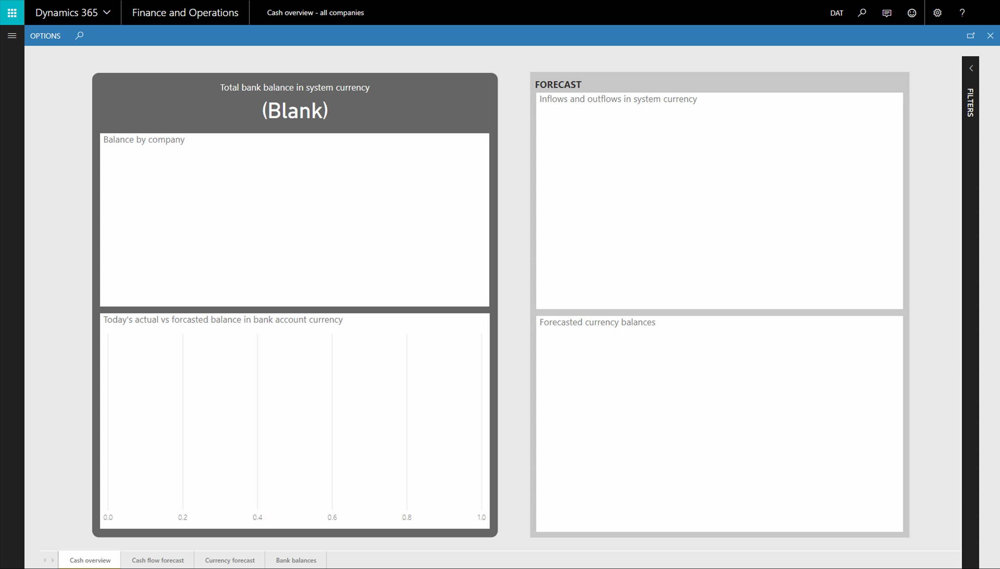

---
# required metadata

title: Resolve issues after entity store maintenance
description: This topic describes procedures that must be completed after entity store maintenance.
author: MilindaV2
ms.date: 04/09/2021
ms.topic: article
ms.prod: 
ms.technology: 

# optional metadata

# ms.search.form:  [Operations AOT form name to tie this topic to]
audience: IT Pro
# ms.devlang: 
ms.reviewer: kfend
# ms.tgt_pltfrm: 
# ms.custom: [used by loc for topics migrated from the wiki]
ms.search.region: [Global for most topics. Set Country/Region name for localizations]
# ms.search.industry: [leave blank for most, retail, public sector]
ms.author: milindav
ms.search.validFrom: 2018-3-30
ms.dyn365.ops.version: Platform update 15
---

# Resolve issues after entity store maintenance

[!include[banner](../includes/banner.md)]

When maintenance is performed on the entity store, it impacts the following components:

- Application analytical workspaces.
- Entity store-based reports that have been deployed to PowerBI.com.

To resolve issues with these components, complete the procedures in this topic.

> [!NOTE]
> There will be **no impact** to the normal operation of your application.

## If you are using application analytical workspaces

Application analytical workspaces and reports may not render data after certain maintenance operations are completed. The following screenshot shows an example of this.

To resolve this issue:

1. Sign in to the application.
2. Go to **System administration** > **Inquiries** > **Batch jobs**.
3. On the **Batch jobs** page, delete all pending batch jobs associated with the entity store. These batch jobs:

    - Will have a status of **Waiting**.
    - Will typically have a description of **Deploy measurement**, **Full reset**, or **Incremental update**.

    > [!NOTE]
    > The default description is **Deploy measurement** in older versions and **Full reset** in newer versions. If Data Lake integration is enabled with the option, **Trickle update Data Lake**, a batch job with the description, **Incremental update** is created. If the description has been customized, you can verify whether a batch job is associated with the entity store by looking at the class name. Batch jobs associated with the entity store will have a class name of **BIMeasurementDeployManagementEntityBatchJob**, **BIMeasurementProcessorFull**, or **BIMeasurementProcessorIncremental**.

4. Go to the **Entity store** page (**System Administration \> Setup \> Entity Store**).
5. Select all measurements that need to be refreshed.
6. Click **Refresh**, and then click **OK**.

After the refresh completes, the application analytical workspaces and reports will render data.

## If you have deployed entity store-based reports to PowerBI.com and are using the reports within PowerBI.com

After refreshing the entity store (as described above), redeploy the reports using the **Deploy Power BI report files** page by selecting **System Administration** \> **Setup** \> **Deploy Power BI files**.

> [!NOTE]
> Reports that were previously deployed to PowerBI.com may produce errors. If this occurs, you may need to delete the report and the related dataset, and then redeploy the report after the maintenance activity is completed.

[!INCLUDE[footer-include](../../../includes/footer-banner.md)]
