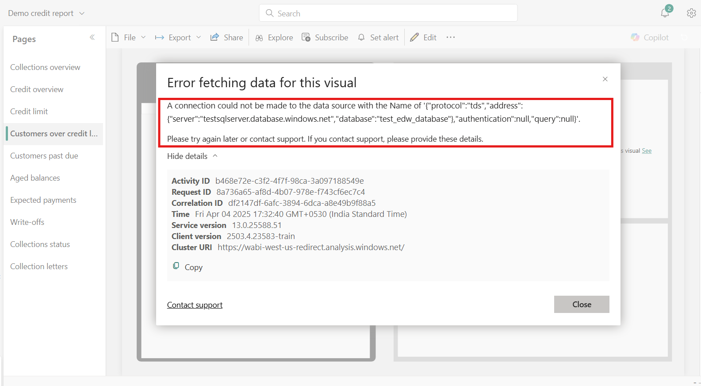

# Resolve issues after entity store maintenance

[!include[banner](../includes/banner.md)]

When maintenance is performed on the entity store, it impacts the following components:

- Application analytical workspaces.
- Entity store-based reports deployed to PowerBI.com.

To resolve issues with these components, complete the procedures in this article.

> [!NOTE]
> There's no impact to the normal operation of your application.

## If you're using application analytical workspaces

Application analytical workspaces and reports may not render data after certain maintenance operations are completed. The following screenshot shows an example of this.

To resolve this issue:

1. Sign in to the application.
2. Go to **System administration** > **Inquiries** > **Batch jobs**.
3. On the **Batch jobs** page, delete all pending batch jobs associated with the entity store. These batch jobs:

    - Have a status of **Waiting**.
    - Typically have a description of **Deploy measurement**, **Full reset**, or **Incremental update**.

    > [!NOTE]
    > The default description is **Deploy measurement** in older versions and **Full reset** in newer versions. If Data Lake integration is enabled with the **Trickle update Data Lake** option, a **Incremental update** batch job is created. If the description is customized, you can verify whether a batch job is associated with the entity store by looking at the class name. Batch jobs associated with the entity store have a class name of **BIMeasurementDeployManagementEntityBatchJob**, **BIMeasurementProcessorFull**, or **BIMeasurementProcessorIncremental**.

4. Go to the **Entity store** page (**System Administration \> Setup \> Entity Store**).
5. Select all measurements that need to be refreshed.
6. Click **Refresh**, and then click **OK**.

After the refresh completes, the application analytical workspaces and reports will render data.

## Deployed entity store-based reports to PowerBI.com and using the PowerBI.com reports

Refresh the Entity store measurements as described above.

The reports deployed to PowerBI.com may receive the following errors:

- The credentials provided for the SQL source are invalid.
- Login failed for user <user_name>.
- A connection couldn't be made to the data source with the Name of '{"protocol":"tds","address":{"server":"testsqlserver.database.windows.net","database":"test_edw_database"},"authentication":null,"query":null}'.
Try again later or contact support. When you contact support, provide these details:

These errors can occur if the credentials of Entity store database are rotated and PowerBI.com reports are configured with old credentials.

To resolve this issue, follow one of the following solutions:

1. Redeploy the reports where the error occurred. Go to **System Administration** \> **Setup** \> **Deploy Power BI files**.
   - This action overwrites the current report and any customizations not in Microsoft Dynamics Lifecycle Services as PBIX are lost. If there are customizations in PowerBI.com, export the report as a PBIX file and upload it to Microsoft Dynamics Lifecycle Services for redeployment.

2. Deploy a [sample report](https://download.microsoft.com/download/4990e70d-1c68-45ab-9d23-2475a2b99596/Samplereport.pbix) Go to **System Administration** \> **Setup** \> **Deploy Power BI files**. This fixes the above errors for any Entity store based reports in PowerBI.com
   - Users encountering this issue need to perform this action individually.
     

> [!NOTE]
> For errors with the PowerBI.com reports after maintenance activity or if the above solution didn't resolve the issue, you may need to delete the report and the related dataset, and redeploy the report. To redeploy the report, go to **System Administration** \> **Setup** \> **Deploy Power BI files**. Any customizations not in Microsoft Dynamics Lifecycle Services as PBIX are lost.

[!INCLUDE[footer-include](../../../includes/footer-banner.md)]
