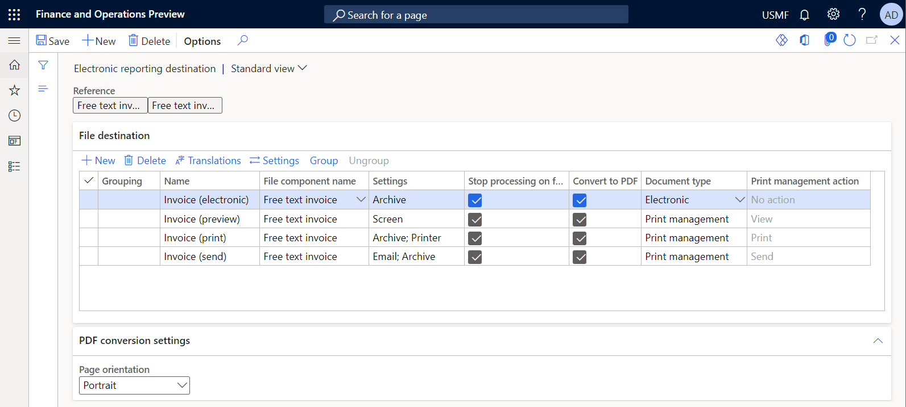
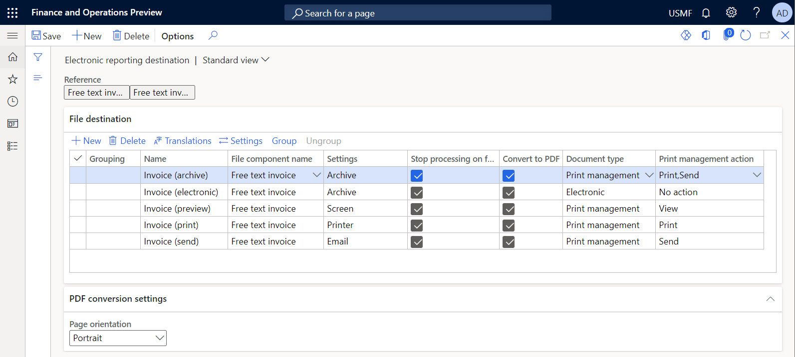
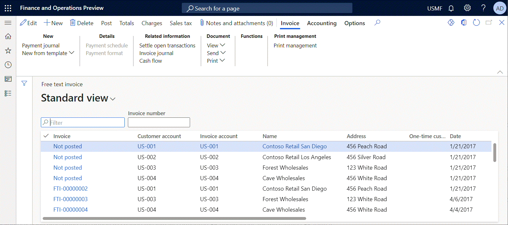
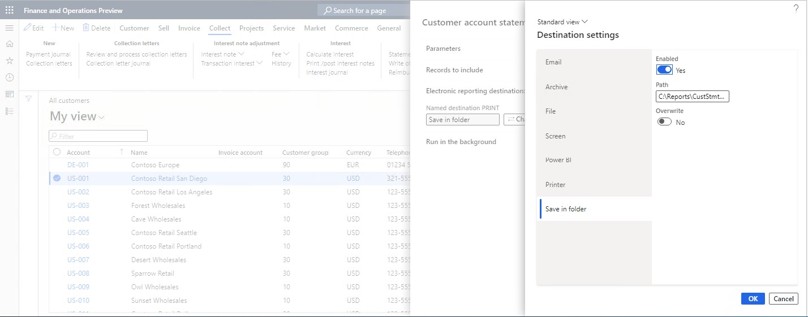
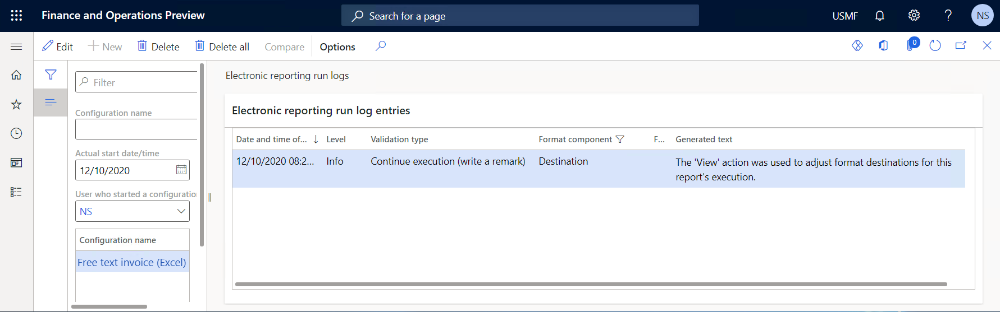

# Configure action-dependent ER destinations

[!include [banner](../includes/banner.md)]

You can configure [destinations](electronic-reporting-destinations.md) for each output component (folder or file) of an [Electronic reporting (ER)](general-electronic-reporting.md) format [configuration](general-electronic-reporting.md#Configuration) that is used to generate an outbound document. Users who run an ER format of this type, and who have appropriate access rights, can also change the configured destination settings at runtime.

In Microsoft Dynamics 365 Finance **version 10.0.17 and later**, an ER format can be run by [provisioning](er-apis-app10-0-17.md) an action code that the user performs by running that ER format. For example, in the **Accounts receivable** module, in the Print management settings, you can select an ER format that generates a specific business document, such as a free text invoice. You can then select **View** to preview the invoice or **Print** to send it to a printer. If a user action is passed for the running ER format at runtime, you can configure different ER destinations for different user actions. This article explains how to configure ER destinations for this type of ER format.

## Make action-dependent ER destinations available

To configure action-dependent ER destinations in the current Finance instance and enable the [new](er-apis-app10-0-17.md) ER API, open the [Feature management](../../fin-ops/get-started/feature-management/feature-management-overview.md#the-feature-management-workspace) workspace, and turn on the **Configure specific ER destinations to be used for different PM actions** feature. To use configured ER destinations for reports at runtime, enable the **Route output of PM reports based on ER destinations that are user action specific (wave 1)** feature.

## Configure action-dependent ER destinations

When you turn on the **Configure specific ER destinations to be used for different PM actions** feature, you can configure action-dependent ER destinations on the **File destination** FastTab of the **Electronic reporting destination** page. For each component, you can add a record and enable specific ER destinations. For each record, you must specify the type of document that the configured ER destinations should be applied for. In the **Document type** field, select one of the following values:

- Select **Electronic** to apply the configured destinations if no user action code is provided at runtime.
- Select **Print management** to apply the configured destinations if a user action code is provided at runtime.
- Select **Any** to always apply the configured destinations, regardless of whether a user action is provided at runtime.

If you select the **Print management** document type, you must specify the user actions that the configured ER destinations should be applied for. In the **Print management action** field, select one of the following values:

- Select **View** to apply the configured destinations if the **View** user action is provided at runtime.
- Select **Print** to apply the configured destinations if the **Print** user action is provided at runtime.
- Select **Send** to apply the configured destinations if the **Send** user action is provided at runtime.

> [!NOTE]
> Multiple actions can be selected for a single destination record.

If you select the **Any** document type, **Autodetect** is automatically selected in the **Print management action** field as a user action, and the following behavior occurs:

- If no user action code is provided at runtime, all configured ER destinations are applied.
- If a user action code is provided at runtime, an ER destination that is predefined for a specific action is applied, **regardless of whether it has been enabled**:

    - When the **View** action is provided at runtime, the **Screen** ER destination is applied.
    - When the **Send** action is provided at runtime, the **Email** ER destination is applied.
    - When the **Print** action is provided at runtime, the **Printer** ER destination is applied.

For example, you can use the **Free text invoice (Excel)** ER format to print a [free text invoice](../../../finance/accounts-receivable/create-free-text-invoice-new.md) when you post it. To route a generated document, you must configure ER destinations for this ER format. For example, you may need to configure these ER destinations to perform the following on a generated document:

- Archive the document if the ER format is run but no action code is provided (for example, when the document is sent electronically).
- Preview the document in a web browser when a user performs the **View** action.
- Archive and print the document when a user performs the **Print** action.
- Archive the document and email it as the attachment of an outbound email message when a user performs the **Send** action.

The following illustration shows how you can achieve this configuring ER destinations as the set of individual destination records when every record is configured for an individual user action:

The following illustration shows how you can achieve the same alternatively configuring ER destinations as the set of individual destination records when every record is configured for an individual destination:

> [!NOTE]
> If an action code is provided for the running ER format, but no destinations have been configured for that action code, the [default](electronic-reporting-destinations.md#default-behavior) destination behavior is applied.

## Change action-dependent ER destinations at runtime

When an ER format is run, if user actions have been provisioned by users who have the appropriate [permissions](electronic-reporting-destinations.md#security-considerations) to change configured destination settings at runtime, a dialog box appears that gives the option to change the configured destination settings. This dialog box is optional, and its appearance depends on how the call that the ER framework makes to run an ER format has been implemented. If this dialog box appears, the ER destinations in it will be enabled according to the user action that is provided.

The following illustration shows an example of the **Electronic reporting format destinations** dialog box that appears when a free text invoice is [posted](../../../finance/accounts-receivable/create-free-text-invoice-new.md) and the **Free text invoice (Excel)** ER format is run to generate this document, if the **Printer** action was provisioned and ER destinations were configured for this format as shown earlier in this article.

> [!NOTE]
> If you configured ER destinations for several components of the running ER format, an option will be offered separately for every configured component of the ER format.

If several ER formats are applicable as report templates for the selected document, all ER destinations for all applicable ER report templates are shown in the dialog box and available for manual adjustment at runtime.

If no [SQL Server Reporting Services (SSRS)](SSRS-report.md) report templates are applicable to the selected document, the standard selection of Print management destinations is dynamically hidden.

As of Finance version **10.0.31**, you can manually change the assigned ER destinations at runtime for the following business documents:

- Customer account statement
- Interest note
- Collection letter note
- Customer Payment advice
- Vendor Payment advice

To activate the capability to change ER destinations at runtime, enable the **Allow ER destinations adjustment at runtime** feature in the [Feature management](../../fin-ops/get-started/feature-management/feature-management-overview.md#the-feature-management-workspace) workspace.

> [!IMPORTANT]
> For the **Customer Payment advice** and **Vendor Payment advice** reports, the capability to manually change ER destinations is available only if the **ForcePrintJobSettings** flight is enabled.

> [!NOTE]
> When the **Use print management destination** option is set to **Yes**, the system uses the default ER destinations that are configured for specific ER reports. All manual changes that are made in the dialog box are ignored. Set the **Use print management destination** option to **No** to process documents to the ER destinations that are defined in the dialog box immediately before you run the reports.

The following business documents don't assume explicit user selection of an action when they're run:

- Customer account statement
- Interest note
- Collection letter note
- Customer Payment advice
- Vendor Payment advice

The following logic is used to determine which action is used while the preceding reports are processed:

- If the **ForcePrintJobSettings** flight is enabled:

    - If the **Use print management destination** option is set to **Yes**, the **Print** action is used.
    - If the **Use print management destination** option is set to **No**, the **View** action is used.

- If the **ForcePrintJobSettings** flight isn't enabled:

    - If the **Use print management destination** option is set to **Yes**, the **Print** action is used for the **Customer Payment advice** and **Vendor Payment advice** reports.
    - If the **Use print management destination** option is set to **No**, the default SSRS report template is always used for the **Customer Payment advice** and **Vendor Payment advice** reports, regardless of any ER settings that are configured.
    - The **Print** action is always used for the **Customer account statement**, **Interest note**, and **Collection letter note** reports.

For the preceding logic, the **Print** or **View** actions can be used to configure action-dependent ER report destinations. At runtime, only ER destinations that are configured for a specific action are filtered in the dialog box.

## Verify the provided user action

You can verify what user action, if any, is provided for the running ER format when you perform a specific user action. This verification is important when you must configure action-dependent ER destinations, but you aren't sure which user action code, if any, is provided. For example, when you start to post a free text invoice and set the **Print invoice** option to **Yes** in the **Post free text invoice** dialog box, you can set the **Use print management destination** option to **Yes** or **No**.

Follow these steps to verify the user action code that is provided.

1. Go to **Organization administration** \> **Electronic reporting** \> **Configurations**.
2. On the **Configurations** page, on the Action Pane, on the **Configurations** tab, in the **Advanced settings** group, select **User parameters**.
3. In the **User parameters** dialog box, [set](er-trace-reports-compare-baseline.md#configure-er-parameters-to-use-the-baseline-feature) the **Run in debug mode** option to **Yes**.
4. Perform a user action by running an ER format. Remember that ER user parameters are company-specific and user-specific.
5. Go to **Organization administration** \> **Electronic reporting** \> **Configuration debug logs**.
6. On the **Configuration debug logs** page, filter the ER run logs to find the log for your ER format run.
7. Review the log entries that must contain the record that presents the provided user action code, if any action has been provided for the ER format run.

    

## Additional resources

[Electronic reporting (ER) overview](general-electronic-reporting.md)

[Electronic reporting (ER) destinations](electronic-reporting-destinations.md)

[Electronic reporting framework API changes for Application update 10.0.17](er-apis-app10-0-17.md)

[!INCLUDE[footer-include](../../../includes/footer-banner.md)]
