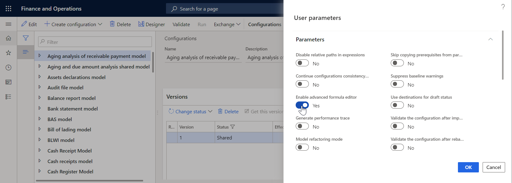
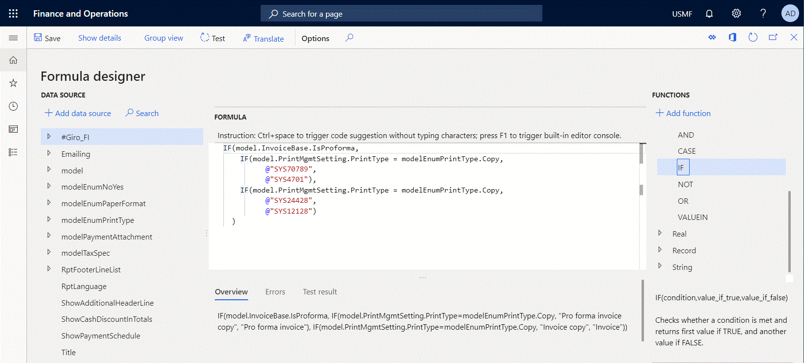
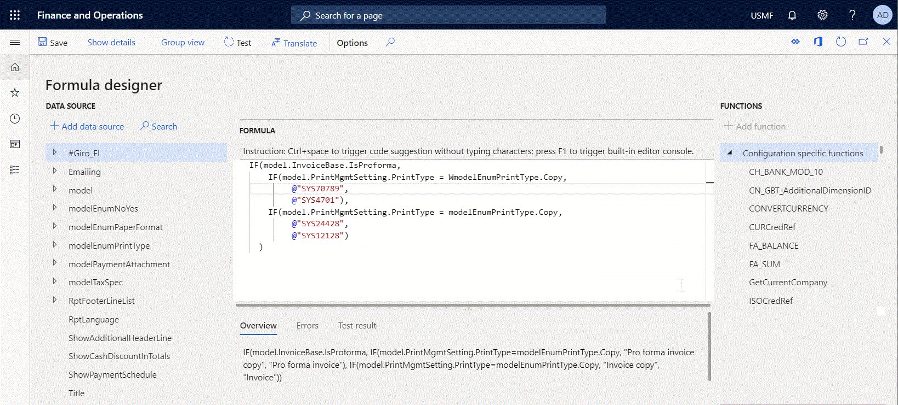
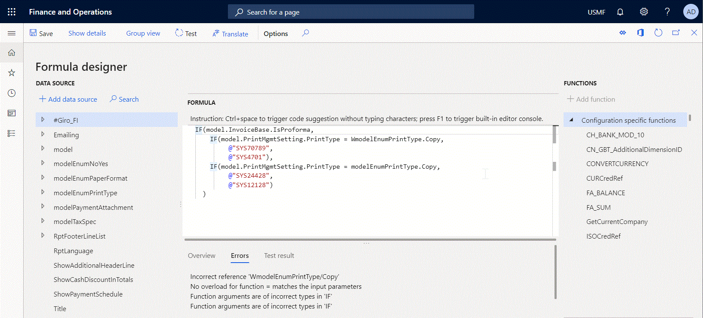
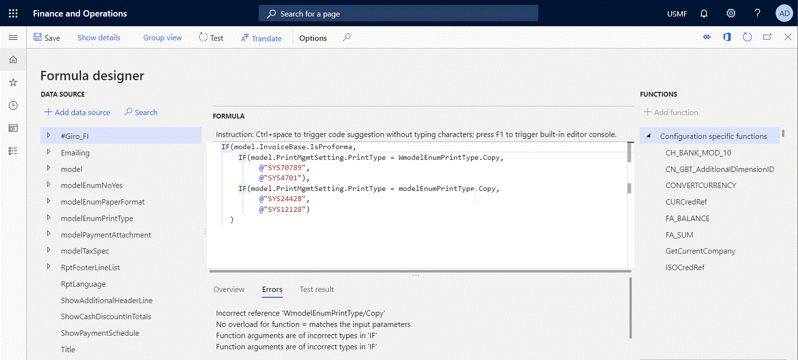
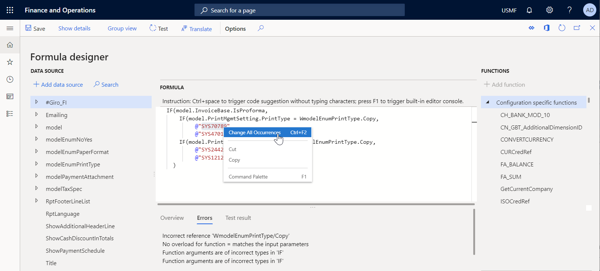

# Electronic reporting advanced formula editor

[!include [banner](../includes/banner.md)]

In addition to the [Electronic reporting](general-electronic-reporting.md) [formula editor](general-electronic-reporting-formula-designer.md), you can use the advanced Electronic reporting formula editor to improve the experience of configuring Electronic reporting (ER) expressions. The advanced editor is browser-based and powered by the [Monaco editor](https://microsoft.github.io/monaco-editor). The most commonly used advanced editor features are described in this article:

- [Code autoformatting](#Autoformatting)
- [IntelliSense](#IntelliSense)
- [Code completion](#CodeCompletion)
- [Code navigation](#CodeNavigation)
- [Code structuring](#CodeStructuring)
- [Find and replace](#FindAndReplace)
- [Data pasting](#DataPasting)
- [Syntax colorization](#SyntaxColorization)

## <a name="ActivateAdvEditor">Activate the advanced formula editor</a>

Complete the following steps to start using the advanced formula editor in your instance of Microsoft Dynamics 365 Finance.

1.  Go to **Organization administration** \> **Electronic reporting** \> **Configurations**.
2.  On the **Configurations** page, on the Action Pane, on the **Configurations** tab, in the **Advanced settings** group, select **User parameters**.
3.  In the **User parameters** dialog box, in the **Execution tracing** section, set the **Enable advanced formula editor** parameter to **Yes**.

> [!NOTE]
> Be aware that this parameter is user specific and company specific.

Starting in Microsoft Dynamics 365 Finance version 10.0.19, you can control what ER formula editor is offered by default. Complete the following steps to enable the advanced formula editor for all users and companies of the current Finance instance.

1.  Open the **Feature management** workspace.
2.  Find and select the feature **Set the ER advanced formula editor as the default one for all users** in the list, and then select **Enable now**.
3.  Go to **Organization administration** > **Electronic reporting** > **Configurations**.
4.  On the **Configurations** page, on the Action Pane, on the **Configurations** tab, in the **Advanced settings** group, select **User parameters**.
5.  In the **User parameters** dialog box, find the **Disable advanced formula editor** parameter and verify that it is set to **No**.

> [!NOTE]
> The values of the parameters **Enable advanced formula editor** and **Disable advanced formula editor** are kept separate for each user and offered on the **User parameters** dialog box depending on the status of the **Set the ER advanced formula editor as the default one for all users** feature.

## <a name="Autoformatting">Code autoformatting</a>

When you write a complex expression that consists of multiple rows of code, the indentation of a new entered line will be automatic based on the indentation of the previous row. You can select lines and change their indentation by typing **Tab** or **Shift+Tab**.

Autoformatting allows you to keep the entire expression well formatted to make further maintenance easier and to simplify understanding of the configured logic.

## <a name="IntelliSense">IntelliSense</a>

The editor provides word completion to help you write expression faster and avoid typos. When you start adding new text, the editor automatically offers a list of functions supported in ER functions that contain the characters you have entered. You can also trigger IntelliSense in any place of a configured expression by typing **Ctrl+Space**.

## <a name="CodeCompletion">Code completion</a>

The editor automatically provides code completion by:

- Inserting a closing bracket when an opening  bracket is entered, keeping the cursor inside the brackets.
- Inserting the second quotation symbol when the first one is entered, keeping the cursor inside the quotations.
- Inserting the second double quotation symbol when the first one is entered, keeping the cursor inside the quotations.

When you point to the typed bracket, the second bracket of this pair is automatically highlighted to show the construct that they support.

## <a name="CodeNavigation">Code navigation</a>

You can locate required symbols or lines in your expression by typing the **Go to** command using the command palette or the context menu.

For example, to jump to line **8**, do the following:

- Press **Ctrl+G**, enter the value **8**, and then press **Enter**.

  -or-

- Press **F1**, type **G**, select **Go to line**, enter the value **8**, and the press **Enter**.

## <a name="CodeStructuring">Code structuring</a>

The code for some functions, such as [IF](er-functions-logical-if.md) or [CASE](er-functions-logical-case.md), is automatically structured. You can expand and collapse any or all of the folding regions of this code to reduce the editable part of an expression in order to focus on only  thepiece of code that requires your attention. The toggle fold/unfold commands can be used for that.

For example, to fold all regions, do the following:

- Press **Ctrl+K**

  -or-

- Press **F1**, press **FO**, select **Fold all**, and then press **Enter**

To unfold all regions, do the following:

- Press **Ctrl+J**

  -or-
  
- Press **F1**, type **UN**, select **Unfold all**, and then press **Enter**

## <a name="FindAndReplace">Find and replace</a>

To find occurrences of certain text, select the text in your expression, and do the following:

- Press **Ctrl+F** and then press **F3** to find the next occurrence of the selected text, or press **Shift+F3** to find the previous occurrence.

  -or-
  
- Press **F1**, type **F**, and then select the required option to find the selected text.

To replace occurrences of a certain text, select the text in your expression, and do the following:

- Press **Ctrl+H**. Enter the alternative text and select the replacement option to replace either the selected text or all occurrences of this text in the current expression.

  -or-
  
- Press **F1**, type **R**, and then select the required option to replace the selected text. Enter the alternative text and select the replacement option to replace either the selected text or all occurrences of this text in the current expression.

To change all occurrences of a certain text, select the text in your expression, and do the following:

- Press **Ctrl+F2** and then enter the alternative text.

  -or-
  
- Press **F1**, type **C**, and then select the required option to change the selected text. Enter the alternative text.

## <a name="DataPasting">Data sources and functions pasting</a>

You can select **Add data source**, which pastes to the current expression a data source that is currently selected on the **Data source** left panel. Simlilarly, you can select **Add function**, which pastes to the current expression a function that is currently selected on the **Functions** right panel. If you use the ER formula editor, a selected function or a selected data source will always be pasted to the end of the configured expression. When you use the advanced ER formula editor, a selected function or a selected data source can be pasted to any part of the configured expression. You will need to use the cursor to specify where you want to paste the data.

## <a name="SyntaxColorization">Syntax colorization</a>

Currently, different colors are used to highlight the following parts of expressions:

- The text in double brackets that can represent a label ID of a text constant.

## Limitations

The editor is currently supported in the following web browsers:

- Chrome
- Edge
- Firefox
- Opera
- Safari

## Additional resources

- [Electronic reporting (ER) overview](general-electronic-reporting.md)
- [Formula designer in Electronic reporting](general-electronic-reporting-formula-designer.md)
- [Monaco editor](https://microsoft.github.io/monaco-editor)

[!INCLUDE[footer-include](../../../includes/footer-banner.md)]
