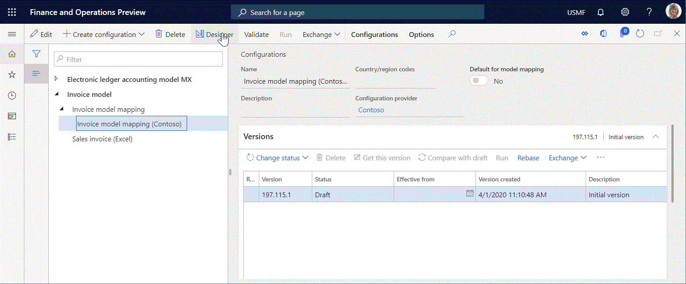

---
# required metadata

title: Electronic reporting framework API changes
description: This topic describes how the API of the Electronic reporting (ER) framework has been changed in Microsoft Dynamics 365 Finance with the release of 10.0.11.
author: NickSelin
manager: AnnBe
ms.date: 04/03/2020
ms.topic: article
ms.prod: 
ms.service: dynamics-ax-platform
ms.technology: 

# optional metadata

# ms.search.form:  
audience: Developer, IT Pro
# ms.devlang: 
ms.reviewer: kfend
ms.search.scope:  Operations
# ms.tgt_pltfrm: 
# ms.custom: 
ms.search.region: Global 
# ms.search.industry: 
ms.author: nselin
ms.search.validFrom: 2020-04-01
ms.dyn365.ops.version: 10.0.11
---

# Electronic reporting framework API changes

[!include [banner](../includes/banner.md)]

[!include [banner](../includes/preview-banner.md)]

This topic describes how the API of the Electronic reporting (ER) framework has been changed in Microsoft Dynamics 365 Finance with the release of 10.0.11.

## API to run a format mapping for generation of outbound documents

To generate an [outbound document](general-electronic-reporting.md#configuring-data-model-mappings-for-outgoing-documents), you need to run an ER [format mapping](general-electronic-reporting.md#FormatComponentInbound). Most ER format mappings contain a data source of the **Data model** type. A specific [model mapping](general-electronic-reporting.md#data-model-and-model-mapping-components) must be identified at runtime as the implementation of the [data model](general-electronic-reporting.md#data-model-and-model-mapping-components) for which this data source has been configured.

When an ER format mapping is called from an execution point in the source code by using the [initial](er-apis-app73.md#code-to-run-a-format-mapping-for-data-export) API of the ER framework, a model mapping is found which takes into account the
settings of the corresponding ER [configurations](general-electronic-reporting.md#Configuration) (default model mapping flag and country/region codes) that contain a model mapping component. For more information, see [Configure country context dependent ER model mappings](er-country-dependent-model-mapping.md).

In some cases, you need to specify additional criteria to find the most appropriate model mapping when an ER format mapping is called from a particular place of the X++ code. For example, you might have an ER format mapping that has been configured using a data model for which you have two model mappings. The first model mapping is marked as a default because it guarantees the smooth execution of this ER format mapping whenever it is called, from every execution point available at this time. In X++, you implement a new execution point from which you want to call this ER format mapping. This forces the data model to use the second model mapping because it will perform better with the other conditions of this call (provided arguments, available resource of the current application instance, etc.).

To do this, configure your model mapping with an integration point. On the **Data source properties** page, you can select a single data source of your model mapping as the component of this integration point.



Then, you can use the new API of the ER framework to call an ER format mapping forcing it to use a model mapping that has been configured as containing a particular integration point. The sample code below shows how this new API can be used.

```
using Microsoft.Dynamics365.LocalizationFramework;
using Microsoft.Dynamics365.LocalizationFramework.XppSupportLayer;

class ERIntegrationPointCodeSamples extends RunBaseBatch
{
    private ERFormatMappingId formatMappingId;

    public void run()
    {
        var runner = ERObjectsFactory::createFormatMappingRunByFormatMappingId(this.formatMappingId, 'OutboundFileName', true);
        var integration_point = new ERIntegrationPointFactory().WithObjectIntegrationPoint('SalesInvoiceDP').ToIntegrationPoint();
        /// new ERIntegrationPointFactory().WithTableRecordsIntegrationPoint(tableName)
        /// new ERIntegrationPointFactory().WithTableIntegrationPoint(tableName)
        /// new ERIntegrationPointFactory().WithObjectIntegrationPoint(className)
        /// new ERIntegrationPointFactory().WithClassIntegrationPoint(className)
        runner.withIntegrationPoint(integration_point).run();
    }
}
```

> [!NOTE]
> Only the data source of the **Table record**, **Table**, **Class**, or **Object** type can be marked as the component of the model mapping integration point. 
> 
> Currently, only a single data source can be used as the component of the model mapping integration point.
>
> In addition to other existing criteria, the integration point will be considered in the selection of the most appropriate model mapping.
>
> At runtime, when more than one model mapping with the requested integration point is found among model mappings that are applicable for the running ER format mapping, an error will occur.

## API to display a format mapping lookup

The [initial](er-apis-app73.md#code-to-display-a-format-mapping-lookup) API of the ER framework used to lookup an ER format mapping utilizes the data model name and container name as text constants. This lookup offers only the ER format mappings of the one data model that has the specified names and whose criteria were met first in the ER configurations list.

The new API of the ER framework allows you to implement the same lookup by using the configured integration point. This lookup will offer all of the ER format mappings that contain a data source of the **Data model** type for which a model mapping with the specified integration point is available regardless of the data model for which it has been configured.

```
using Microsoft.Dynamics365.LocalizationFramework;
using Microsoft.Dynamics365.LocalizationFramework.XppSupportLayer;

class ERIntegrationPointCodeSamples extends RunBaseBatch
{
    private ERFormatMappingId formatMappingId;

    public void formatMappingLookup(FormReferenceControl _referenceGroupControl)
    {
        var integration_point = new ERIntegrationPointFactory().WithIntegrationPointKey('SalesInvoiceDP').ToIntegrationPoint();
        ERObjectsFactory::createFormatMappingTableLookupForIntegrationPoint(
            integration_point,
            _referenceGroupControl
            ).performFormLookup();
    }
}
```
