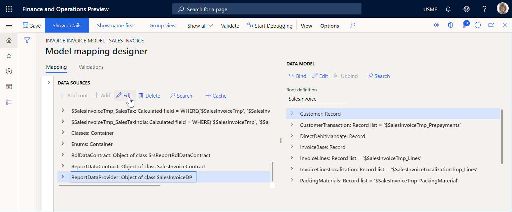
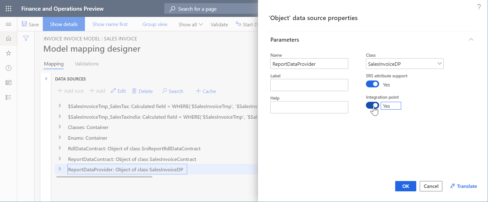

# Electronic reporting framework API changes for Application update 10.0.11

[!include [banner](../includes/banner.md)]

This article describes how the application programming interfaces (APIs) of the Electronic reporting (ER) framework have been changed in Microsoft Dynamics 365 Finance version 10.0.11.

## API to run a format mapping for the generation of outbound documents

To generate an [outbound document](general-electronic-reporting.md#configuring-data-model-mappings-for-outgoing-documents), you must run an ER format mapping. Most ER format mappings contain a data source of the **Data model** type. At runtime, a specific model mapping must be identified as the implementation of the data model that the data source has been configured for.

When the [initial](er-apis-app73.md#code-to-run-a-format-mapping-for-data-export) API of the ER framework is used to call an ER format mapping from an execution point in the source code, a model mapping is found that takes into account the settings (the default model mapping flag and country/region codes) of the corresponding ER [configurations](general-electronic-reporting.md#Configuration) that contain a model mapping component. For more information, see [Configure country context dependent ER model mappings](er-country-dependent-model-mapping.md).

In some cases, when an ER format mapping is called from a specific place in the X++ code, you must specify additional criteria to find the most appropriate model mapping. For example, an ER format mapping has been configured by using a data model that you have two model mappings for. The first model mapping is marked as a default model mapping, because it ensures the smooth execution of this ER format mapping whenever it's called, from every execution point that is currently available. In X++, you implement a new execution point to call this ER format mapping from. In this way, you force the data model to use the second model mapping, because that model mapping will perform better, given the other conditions of this call (for example, the arguments that are provided and the available resources of the current application instance).

To complete this setup, configure your model mapping with an integration point. In the **Data sources** pane, you can select a single data source of your model mapping as the component of this integration point. Then select **Edit** to change the properties of this data source.



In the **Data source properties** dialog box, you can set the **Integration point** option to **Yes** to mark the data source as the component of the integration point.



You can then use the new API of the ER framework to call an ER format mapping and force it to use a model mapping that has been configured to contain a specific integration point. The following example shows how this new API can be used.

```xpp
using Microsoft.Dynamics365.LocalizationFramework;
using Microsoft.Dynamics365.LocalizationFramework.XppSupportLayer;

class ERIntegrationPointCodeSamples extends RunBaseBatch
{
    private ERFormatMappingId formatMappingId;

    public void run()
    {
        var runner = ERObjectsFactory::createFormatMappingRunByFormatMappingId(this.formatMappingId, 'OutboundFileName', true);
        var integration_point = new ERIntegrationPointFactory().WithObjectIntegrationPoint('SalesInvoiceDP').ToIntegrationPoint();
        /// new ERIntegrationPointFactory().WithTableRecordsIntegrationPoint(tableName)
        /// new ERIntegrationPointFactory().WithTableIntegrationPoint(tableName)
        /// new ERIntegrationPointFactory().WithObjectIntegrationPoint(className)
        /// new ERIntegrationPointFactory().WithClassIntegrationPoint(className)
        runner.withIntegrationPoint(integration_point).run();
    }
}
```

> [!NOTE]
> - Only a data source of the **Table record**, **Table**, **Class**, or **Object** type can be marked as the component of the model mapping integration point.
> - Currently, only a single data source can be used as the component of the model mapping integration point.
> - In addition to other existing criteria, the integration point will be considered during the selection of the most appropriate model mapping.
> - At runtime, an error will occur if more than one model mapping that has the requested integration point is found among the model mappings that are applicable to the ER format mapping that is running.

## API to show a format mapping lookup

The [initial](er-apis-app73.md#code-to-display-a-format-mapping-lookup) API of the ER framework is used to look up the ER format mappings. It uses the data model name and container name as text constants. This lookup offers only the ER format mappings of the one data model that meets both these conditions:

- It has the specified names.
- Its criteria were met first in the ER configurations list.

The new API of the ER framework lets you use the configured integration point to implement the same lookup. This lookup offers all the ER format mappings that contain a data source of the **Data model** type that a model mapping that has the specified integration point is available for. The ER format mappings that are offered in this lookup can use different model mappings as data sources.

The following example shows how this new API can be used.

```xpp
using Microsoft.Dynamics365.LocalizationFramework;
using Microsoft.Dynamics365.LocalizationFramework.XppSupportLayer;

class ERIntegrationPointCodeSamples extends RunBaseBatch
{
    private ERFormatMappingId formatMappingId;

    public void formatMappingLookup(FormReferenceControl _referenceGroupControl)
    {
        var integration_point = new ERIntegrationPointFactory().WithIntegrationPointKey('SalesInvoiceDP').ToIntegrationPoint();
        ERObjectsFactory::createFormatMappingTableLookupForIntegrationPoint(
            integration_point,
            _referenceGroupControl
            ).performFormLookup();
    }
}
```


[!INCLUDE[footer-include](../../../includes/footer-banner.md)]
