---
# required metadata

title: Configure ER formats to use parameters that are specified per legal entity
description: This topic explains how you can configure Electronic reporting (ER) formats to use parameters that are specified per legal entity.
author: NickSelin
ms.date: 04/02/2021
ms.topic: article
ms.prod: 
ms.technology: 

# optional metadata

ms.search.form: ERSolutionTable, EROperationDesigner, ERLookupDesigner, ERComponentLookupStructureEditing
# ROBOTS: 
audience: Application User, Developer, IT Pro
# ms.devlang: 
ms.reviewer: kfend
# ms.tgt_pltfrm: 
ms.custom: 
ms.assetid: 
ms.search.region: Global
# ms.search.industry: 
ms.author: nselin
ms.search.validFrom: 2019-01-01
ms.dyn365.ops.version: Release 8.1.3

---

# Configure ER formats to use parameters that are specified per legal entity

[!include[banner](../includes/banner.md)]

## Overview

In many of the Electronic reporting (ER) formats that you will design, you must filter data by using a set of values that are specific to each legal entity of your instance (for example, a set of tax codes to filter tax transactions). Currently, when filtering of this type is configured in an ER format, values that are dependent on the legal entity (for example, tax codes) are used in expressions of the ER format to specify data filtering rules. Therefore, the ER format is made legal entity–specific, and to generate the required reports, you must create derived copies of the original ER format for each legal entity where you have to run the ER format. Each derived ER format must be edited to bring legal entity–specific values into it, rebased whenever the original (base) version has been updated, exported from a test environment, and imported into a production environment when it must be deployed for production use, and so on. Therefore, maintenance of this type of configured ER solution is complex and time-consuming for several reasons:

-	The more legal entities there are, the more ER format configurations must be maintained.
-	Maintenance of ER configurations requires that business users have ER knowledge.

The ER application-specific parameters feature lets power users configure data filtering in an ER format so that it's based on a set of abstract rules. This set of rules can be configured to use the data sources that are available in an ER format. Business users can then specify real rules beyond the ER framework by using the user interface (UI) that is automatically generated based on the settings of the corresponding ER format and the current legal entity data that will be accessed by the ER format's data sources. The set of rules that is specified for an ER format can be exported from the current legal entity of the Dynamics 365 Finance (Finance) instance. It can then be imported into another legal entity of either the same Finance instance or a different instance as a set of rules for the same ER format.

## Prerequisites

To complete the examples in this topic, you must have access to the instance of Regulatory Configuration Services (RCS) that has been provisioned for the same tenant as Finance for one of the following roles:

- Electronic reporting developer
- Electronic reporting functional consultant
- System administrator

We recommend that you complete the steps in the [Support parameterized calls of ER data sources of CALCULATED FIELD type](er-calculated-field-type.md) topic. If you've already completed those steps, you can skip the steps in the **Import ER configurations into RCS** section that follows.

## Import ER configurations into RCS

Download and locally store the following ER configurations.

| **Content description**                        | **File name**                                        |
|------------------------------------------------|------------------------------------------------------|
| Sample **ER data model** configuration file    | [Model to learn parameterized calls.version.1.xml](https://download.microsoft.com/download/2/d/b/2db913a0-3622-494e-91a2-97fc494af9b9/Modeltolearnparameterizedcalls.version.1.xml)     |
| Sample **ER metadata** configuration file      | [Metadata to learn parameterized calls.version.1.xml](https://download.microsoft.com/download/1/b/3/1b343968-5a47-4000-b5a8-6487698ef4c0/Metadatatolearnparameterizedcalls.version.1.xml)  |
| Sample **ER model mapping** configuration file | [Mapping to learn parameterized calls.version.1.1.xml](https://download.microsoft.com/download/8/6/6/866e0ab6-2e05-4d98-9d52-d2da2038f6e4/Mappingtolearnparameterizedcalls.version.1.1.xml) |
| Sample **ER format** configuration             | [Format to learn parameterized calls.version.1.1.xml](https://download.microsoft.com/download/e/3/9/e392eadc-b9b4-4834-95c3-b8066dd00b9c/Formattolearnparameterizedcalls.version.1.1.xml)  |

Next, sign in to your RCS instance.

In this example, you will create a configuration for the Litware, Inc sample company. Before you can complete this procedure, you must complete the steps in the [Create a configuration provider and mark it as active](tasks/er-configuration-provider-mark-it-active-2016-11.md) topic in RCS.

1.	On the default dashboard, select **Electronic reporting**.
2.	Select **Reporting configurations**.
3.	Import the ER configurations that you downloaded earlier into RCS, in the following order: data model, metadata, model mapping, and format. For each ER configuration, follow these steps:

    1.	Select **Exchange**.
    2.	Select **Load from XML file**.
    3.	Select **Browse** to select the file for the required ER configuration in XML format.
    4.	Select **OK**.

## Review the ER solution that is provided

1.	In the configuration tree, expand the contents of the **Model to learn parameterized calls** item.
2.	Select the **Format to learn parameterized calls** item.
3.	Select **Designer**.
4.	Select **Expand/Collapse**.

    The **Format to learn parameterized calls** ER format is designed to generate a tax statement in XML format that presents several levels of taxation (regular, reduced, and none). Each level has a different number of details.

    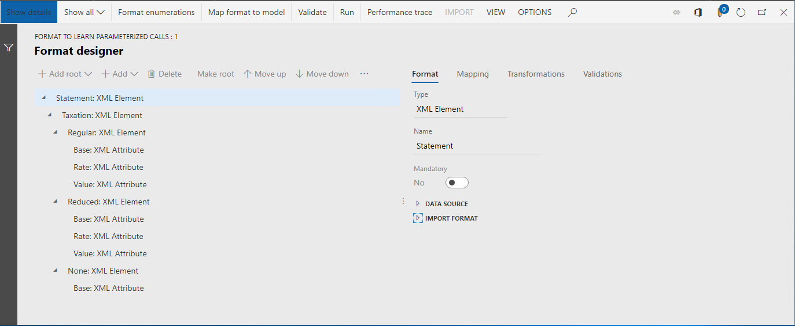

5.	On the **Mapping** tab, expand the **Model**, **Data**, and **Summary** items.

    The **Model.Data.Summary** data source returns the list of tax transactions. These transactions are summarized by tax code. For this data source, the **Model.Data.Summary.Level** calculated field has been configured to return the code for the taxation level of each summarized record. For any tax code that can be retrieved from the **Model.Data.Summary** data source at runtime, the calculated field returns the taxation level code (**Regular**, **Reduced**, **None**, or **Other**) as a text value. The **Model.Data.Summary.Level** calculated field is used to filter records of the **Model.Data.Summary** data source and enter the filtered data in each XML element that represents a taxation level by using the **Model.Data2.Level1**, **Model.Data2.Level2**, and **Model.Data2.Level3** fields.

    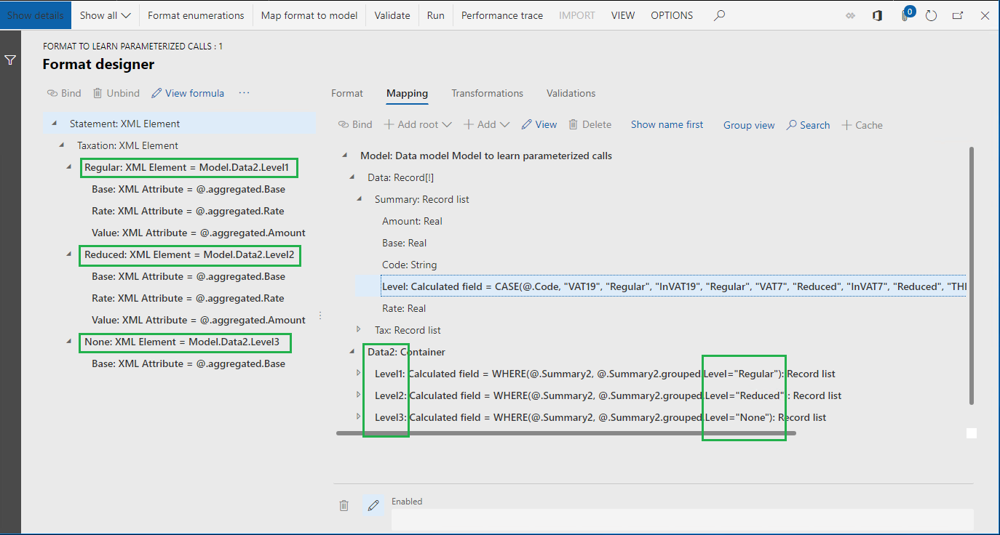

    The **Model.Data.Summary.Level** calculated field has been configured so that it contains an ER expression. Tax codes (**VAT19**, **InVAT19**, **VAT7**, **InVAT7**, **THIRD**, and **InVAT0**) are hardcoded into this configuration. Therefore, this ER format is dependent on the legal entity where these tax codes were configured.

    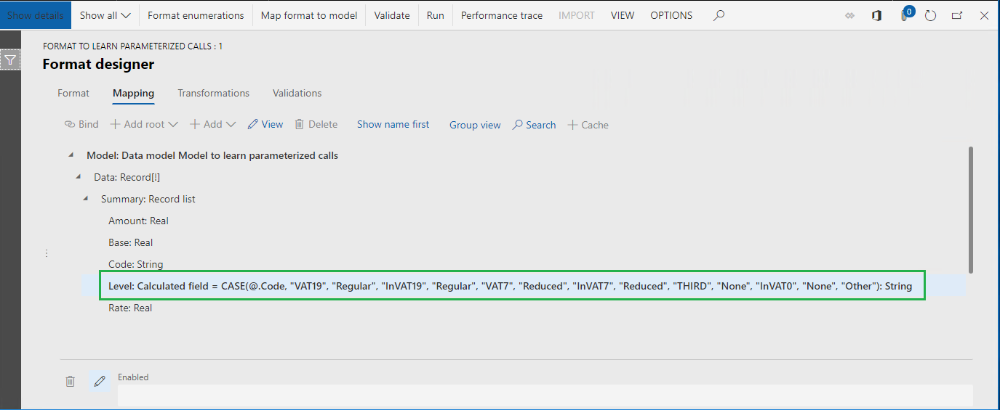

    To support a different set of tax codes for each legal entity, you must follow these steps:

    - Create a derived version of the ER format for each legal entity.
    - Update the tax codes in the **Model.Data.Summary.Level** calculated field, based on the legal entity setting.

6.	Close the **Format designer** page.

## Create a derived format

Next, you will use the ER application-specific parameters feature to support a different set of tax codes for each legal entity in a single ER format.

1.	In the configuration tree, expand the contents of the **Model to learn parameterized calls** item.
2.	Select the **Format to learn parameterized calls** item.
3.	Select **Create configuration**.
4.	Select the **Derive from Name: Format to learn parameterized calls, Microsoft** option.
5.	In the **Name** field, enter **Format to learn how to lookup LE data**.
6.	Select **Create configuration**.

## Configure a derived format

### Add a format enumeration

Next, you will add a new ER format enumeration. The values of this format enumeration will be presented to business users, who will specify legal entity–dependent sets of tax codes for the various taxation levels that are used in the ER format.

1.	Select **Designer**.
2.	Select **Format enumerations**.
3.	Select **Add**.
4.	In the **Name** field, enter **List of taxation levels**.
5.	Select **Save**.
6.	On the **Format enumeration values** tab, select **Add**.
7.	In the **Name** field, enter **Regular taxation**.
8.	Select **Add** again.
9.	In the **Name** field, enter **Reduced taxation**.
10.	Select **Add** again.
11.	In the **Name** field, enter **No taxation**.
12.	Select **Add** again.
13.	In the **Name** field, enter **Other**.

    

    Because the business users might use different languages to specify legal entity–dependent sets of tax codes, we recommend that you translate the values of this enumeration into the languages that are configured as the preferred languages for those users in Finance.

14.	Select the **No taxation** record.
15.	Click in the **Label** field.
16.	Select **Translate**.
17.	In the **Text translation** pane, in the **Label ID** field, enter **LBL_LEVELENUM_NO**.
18.	In the **Text in default language** field, enter **No taxation**.
19.	In the **Language** field, select **DE**.
20.	In the **Translated text** field, enter **keine Besteuerung**.
21.	Select **Translate**.

    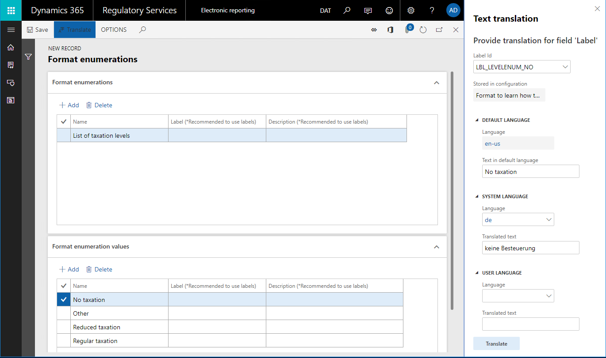

22.	Select **Save**.
23.	Close the **Format enumerations** page.

### Add a new lookup data source

Next, you will add a new data source to specify how business users will specify legal entity–dependent rules to recognize the correct taxation level for each summarized transaction record.

1.	On the **Mapping** tab, select **Add**.
2.	Select **Format enumeration\Lookup**.

    You just identified that each rule that business users specify for taxation level recognition will return a value of an ER format enumeration. Notice that the **Lookup** data source type can be accessed under the **Data model** and **Dynamics 365 for Operations** blocks in addition to the **Format enumeration** block. Therefore, ER data model enumerations and application enumerations can be used to specify the type of values that are returned for data sources of that type. To learn more about the **Lookup** data sources, see [Configure Lookup data sources to use the ER application-specific parameters feature](er-lookup-data-sources.md).
    
3.	In the **Name** field, enter **Selector**.
4.	In the **Format enumeration** field, select **List of taxation levels**.

    You specified that, for each rule that is specified in this data source, a business user must select one of the values of the **List of taxation levels** format enumeration as a returned value.
    
5.	Select **Edit lookup**.
6.	Select **Columns**.
7.	Expand the **Model** item.
8.	Expand the **Data** item.
9.	Expand the **Tax** item.
10.	Select the **Model.Data.Tax.Code** item.
11.	Select the **Add** button (the right arrow).

    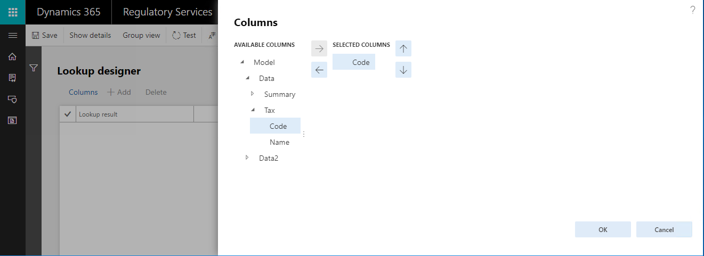

    You just specified that, for each rule that is specified in this data source for taxation level recognition, a business user must select one of the tax codes as a condition. The list of tax codes that the business user can select will be returned by the **Model.Data.Tax** data source. Because this data source contains the **Name** field, the name of the tax code will be shown for each tax code value in the lookup that is presented to the business user.
    
12.	Select **OK**.

    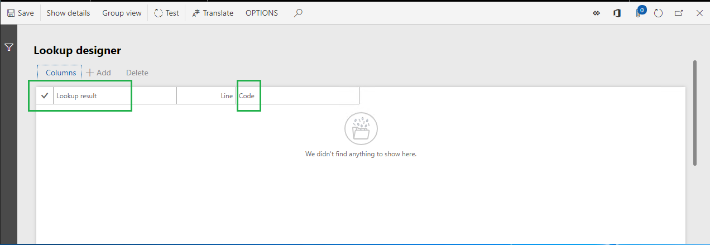

    Business users can add multiple rules as records of this data source. Each record will be numbered by a line code. Rules will be evaluated in order of increasing line number.

    Because you selected the **Tax code** field as a condition for rules in this lookup data source, and because **Tax code** is set up as a field of the **String** data type, each rule will be evaluated at runtime by comparing the tax code that is passed to the data source with the tax code that is defined in this record of the data source.

    When a rule that satisfies the configured condition is found, this data source returns the lookup value of the rule that is defined in the **Lookup result** field. If no rule is found, an exception is thrown to notify the user that the current data source can't return a correct value.

13.	Select **Save**.
14.	Close the **Lookup designer** page.
15.	Select **OK**.

    Notice that you added a new data source that will return the taxation level as the value of the **List of taxation levels** format enumeration for any tax code that is passed to the data source as the argument of the **Code** parameter of the **String** data type.
    
    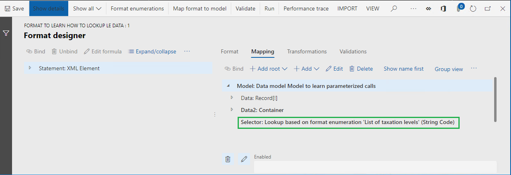

    The evaluation of configured rules depends on the data type of the fields that have been selected to define conditions of those rules. When you select a field that is configured as a field of either the **Numeric** or **Date** data type, the criteria will differ from the criteria that were described earlier for the **String** data type. For **Numeric** and **Date** fields, the rule must be specified as a range of values. The condition of the rule will then be considered satisfied when a value that is passed to the data source is in the configured range.
    
    The following illustration shows an example of this type of setup. In addition to the **Model.Data.Tax.Code** field of the **String** data type, the **Model.Tax.Summary.Base** field of the **Real** data type is used to specify conditions for a lookup data source.
    
    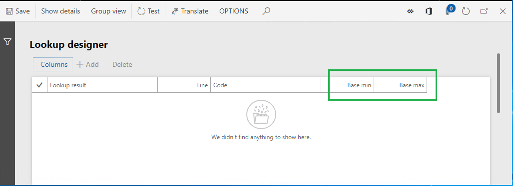

    Because the **Model.Data.Tax.Code** and **Model.Tax.Summary.Base** fields are selected for this lookup data source, each rule of this data source will be configured in the following way:
    
    -	In the list that is presented, the value of the **List of taxation levels** format enumeration must be selected as a returned value.
    -	The tax code must be entered as a condition of this rule. Only tax codes that are provided by the **Model.Data.Tax** data source are applicable.
    -	Minimum and maximum values of the tax base amount must be entered as conditions of this rule.

    Here is how each rule of this data source will be evaluated at runtime:
    -	Does the code of the **String** data type that was passed to this data source equal the tax code of a rule?
    -	Does the value of the **Real** data type that was passed to this data source fall between specific minimum and maximum values?

    A rule will be considered applicable when both conditions are satisfied.

### Translate the label of the lookup data source that was added

Because business users might use different languages to specify legal entity–dependent sets of tax codes, we recommend that you translate the label of any lookup data source that you add, so that it's presented in each user's preferred language on the corresponding page.

1.	Select the **Model.Data.Selector** data source.
2.	Select **Edit**.
3.	Click in the **Label** field.
4.	Select **Translate**.
5.	In the **Text translation** pane, in the **Label ID** field, enter **LBL_SELECTOR_DS**.
6.	In the **Text in default language** field, enter **Select tax level by tax code**.
7.	In the **Language** field, select **DE**.
8.	In the **Translated text** field, enter **Steuerebene für Steuerkennzeichen auswählen**.
9.	Select **Translate**.
10.	Select **OK**.

    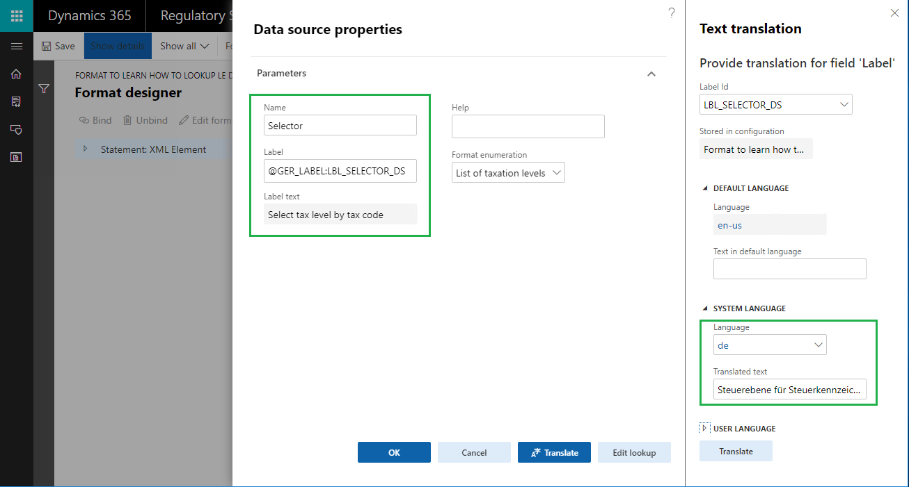

### Add a new field to consume the configured lookup

1.	Expand the **Model.Data** item.
2.	Select the **Model.Data.Summary** item.
3.	Select **Add**.
4.	Select **Functions/Calculated field**.
5.	In the **Name** field, enter **LevelByLookup**.
6.	Select **Edit formula**.
7.	In the **Formula field**, enter **Model.Selector(Model.Data.Summary.Code)**.
8.	Select **Save**.

    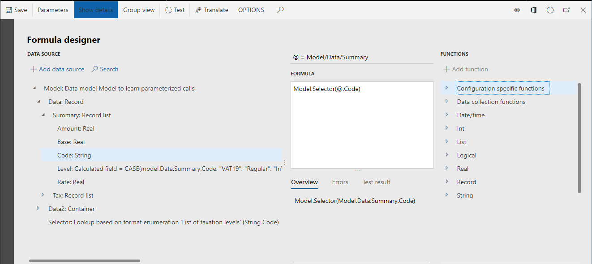

9.	Close the **Formula editor** page.
10.	Select **OK**.

    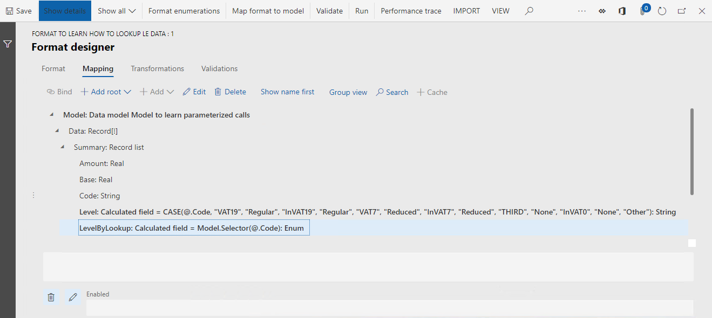

    Notice that the **LevelByLookup** calculated field that you added will return the taxation level as the value of the **List of taxation levels** format enumeration for each summarized tax transactions record. The tax code of the record will be passed to the **Model.Selector** lookup data source, and the set of rules for this data source will be used to select the correct taxation level.

### Add a new format enumeration-based data source

Next, you will add a new data source that refers to the format enumeration that you added earlier. Values of this data source will be used in an ER format expression later.

1.	Select **Add root**.
2.	Select **Format enumerations\Enumeration**.
3.	In the **Name** field, enter **TaxationLevel**.
4.	In the **Format enumeration** field, select **List of taxation levels**.
5.	Select **Save**.

### Modify an existing field to start to use the lookup

Next, you will modify the existing calculated field so that it uses the configured lookup data source to return the correct taxation level value, depending on the tax code.

1.	Select the **Model.Data.Summary.Level** item.
2.	Select **Edit**.
3.	Select **Edit formula**.

    Notice that the current expression of the **Model.Data.Summary.Level** field includes the following hard-coded tax codes:
    
    CASE (@.Code, "VAT19", "Regular", "InVAT19", "Regular", "VAT7", "Reduced", "InVAT7", "Reduced", "THIRD", "None", "InVAT0", "None", "Other")

4.	In the **Formula** field, enter **CASE(@.LevelByLookup, TaxationLevel.'Regular taxation', "Regular", TaxationLevel.'Reduced taxation', "Reduced", TaxationLevel.'No taxation', "None", "Other")**.

    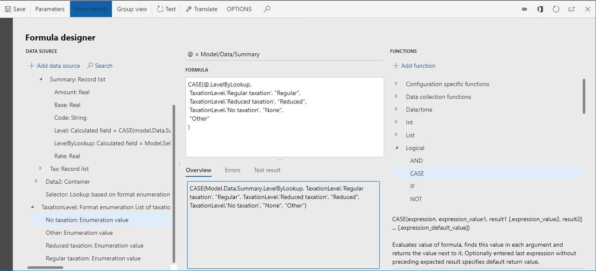
    
    Notice that the expression of the **Model.Data.Summary.Level** field will now return the taxation level, based on the tax code of the current record and the set of rules that a business user configures in the **Model.Data.Selector** lookup data source.
    
5.	Select **Save**.
6.	Close **Formula designer** page.
7.	Select **OK**.
8.	Select **Save**.
9.	Close **Format designer** page.

## Complete the draft version of a derived format

1.	On the **Versions** FastTab, select **Change status**.
2.	Select **Complete**.
3.	Select **OK**.

## Export completed version of modified format

1.	In the configuration tree, select the **Format to learn how to look up LE data** item.
2.	On the **Versions** FastTab, select the record that has a status of **Completed**.
3.	Select **Exchange**.
4.	Select **Export as XML file**.
5.	Select **OK**.
6.	The web browser downloads a **Format to learn how to look up LE data.xml** file. Store this file locally.

Repeat steps in this section for parent items of the **Format to learn how to look up LE data** format, and store the following files locally:

-	Format to learn parameterized calls.xml
-	Mapping to learn parameterized calls.xml
-	Model to learn parameterized calls.xml

To learn how to use the configured **Format to learn how to look up LE data** ER format to set up legal entity–dependent sets of tax codes to filter tax transactions by different taxation levels, complete the steps in the [Set up the parameters of an ER format per legal entity](er-app-specific-parameters-set-up.md) topic.

## Additional resources

[Formula designer in Electronic reporting](general-electronic-reporting-formula-designer.md)

[Set up the parameters of an ER format per legal entity](er-app-specific-parameters-set-up.md)

[Configure Lookup data sources to use the ER application-specific parameters feature](er-lookup-data-sources.md)

[!INCLUDE[footer-include](../../../includes/footer-banner.md)]
