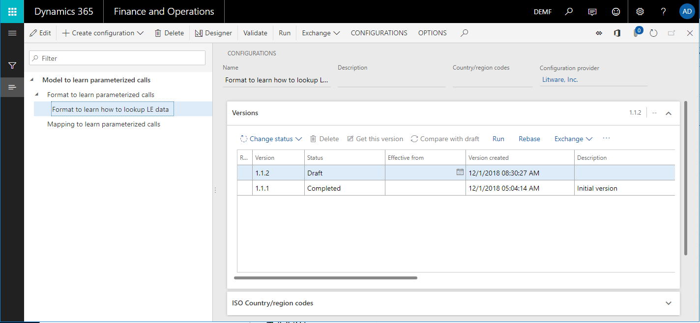
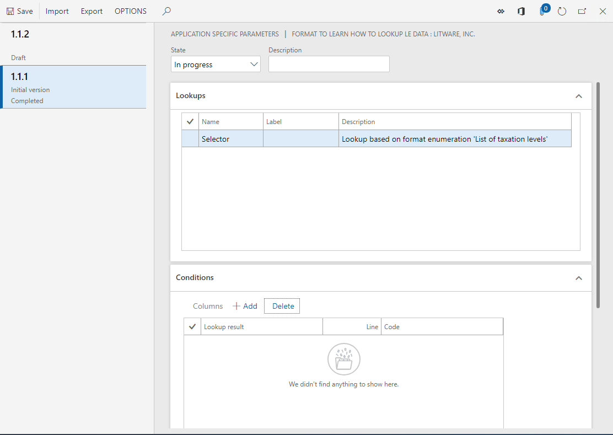
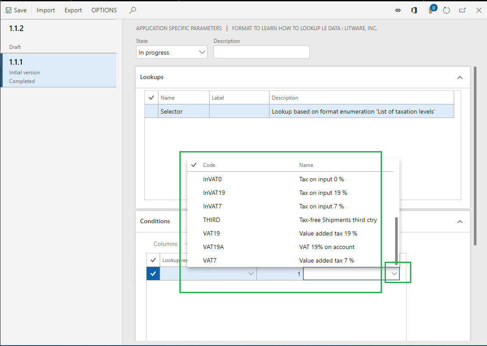
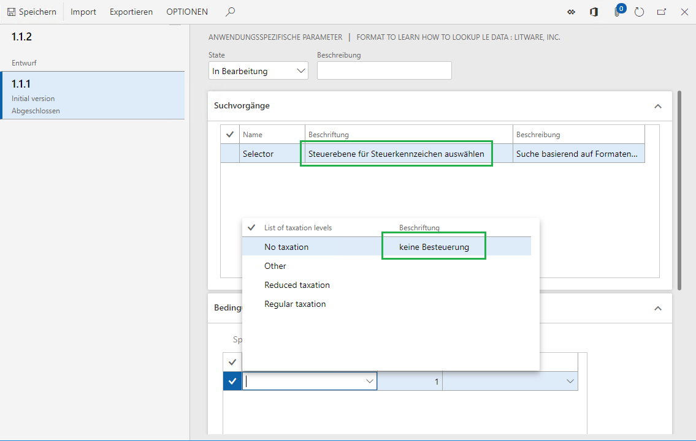
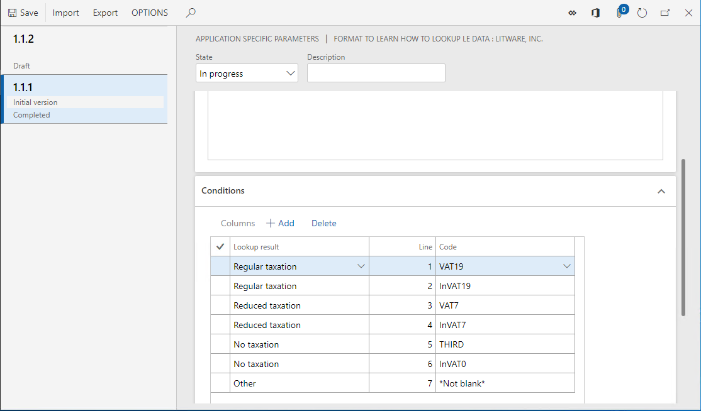
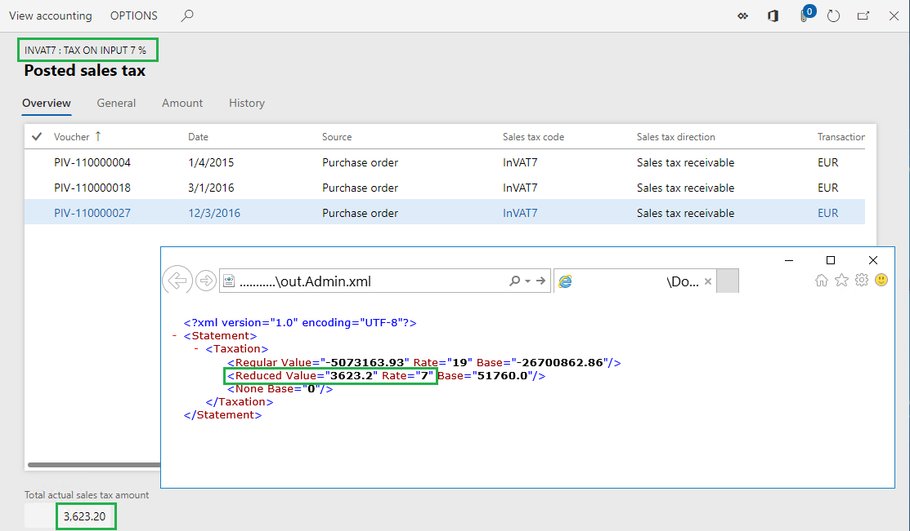
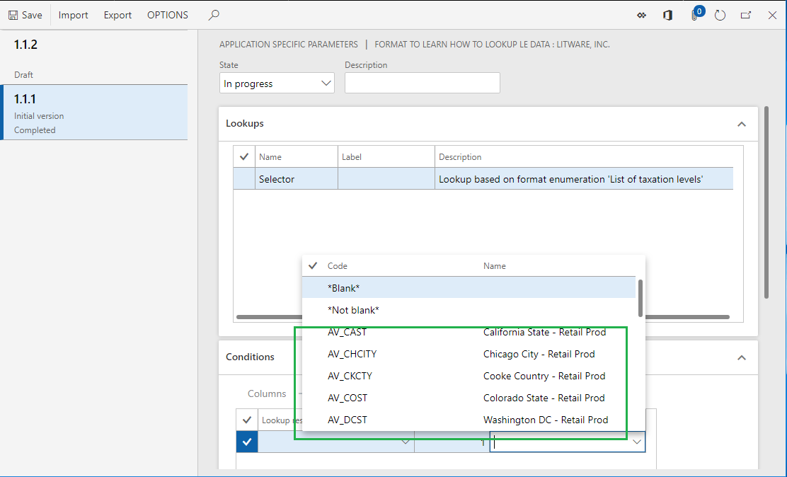
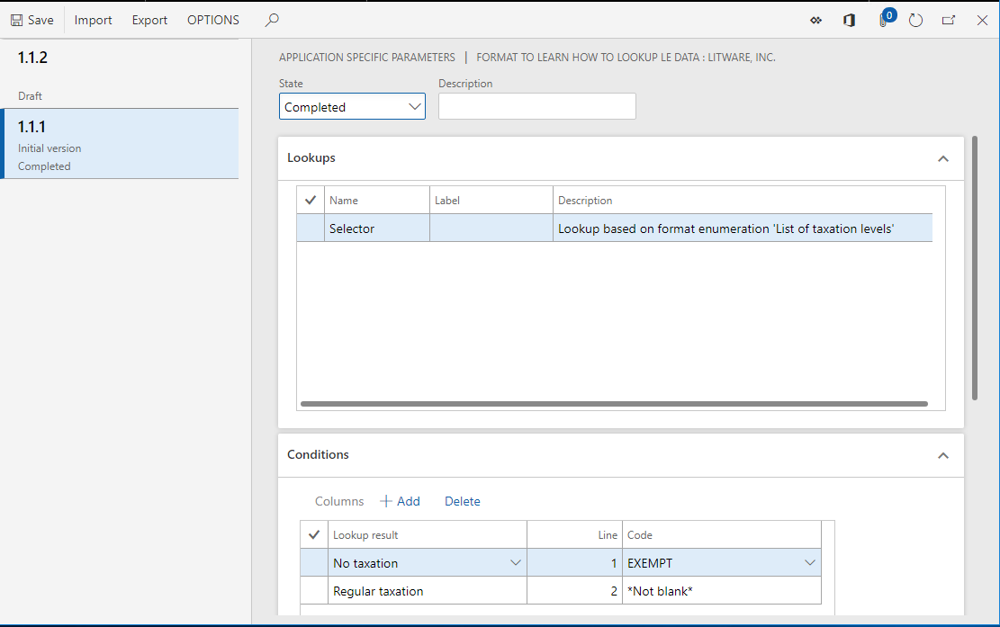
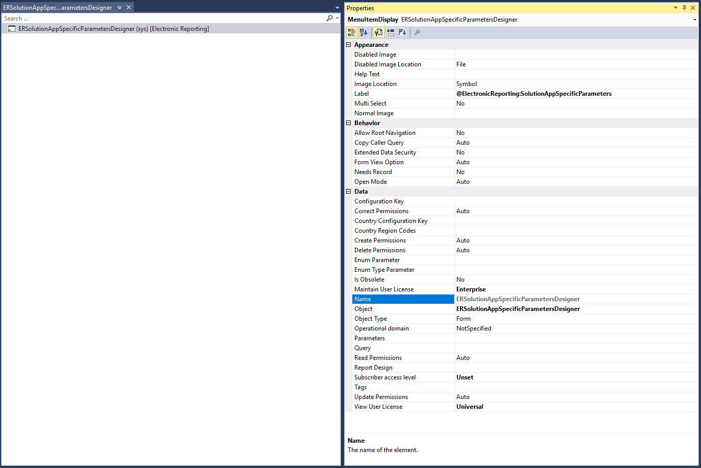
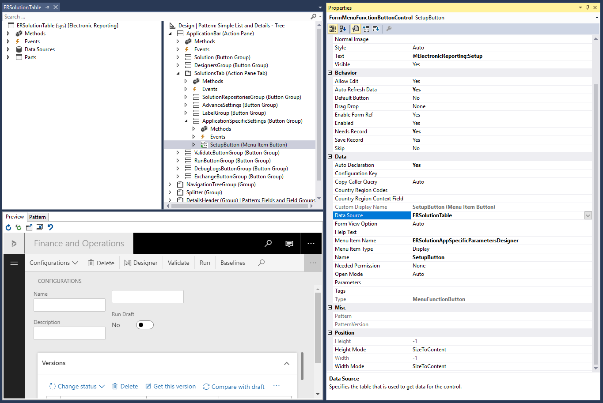

---
# required metadata

title: Set up the parameters of an ER format per legal entity
description: This topic explains how you can set up the parameters of an Electronic reporting (ER) format per legal entity.
author: NickSelin
manager: AnnBe
ms.date: 10/29/2019
ms.topic: article
ms.prod: 
ms.service: dynamics-ax-platform
ms.technology: 

# optional metadata

ms.search.form: ERSolutionTable, EROperationDesigner, ERLookupDesigner, ERComponentLookupStructureEditing
# ROBOTS: 
audience: Application User, Developer, IT Pro
# ms.devlang: 
ms.reviewer: kfend
ms.search.scope: Core, Operations
# ms.tgt_pltfrm: 
ms.custom: 
ms.assetid: 
ms.search.region: Global
# ms.search.industry: 
ms.author: nselin
ms.search.validFrom: 2019-01-01
ms.dyn365.ops.version: Release 8.1.3

---

# Set up the parameters of an ER format per legal entity

[!include[banner](../includes/banner.md)]

## Prerequisites

To complete these steps, you must first complete the steps in the [Configure ER formats to use parameters that are specified per legal entity](er-app-specific-parameters-configure-format.md) topic.

To complete the examples in this topic, you must have access to Microsoft Dynamics 365 Finance (Finance) for one of the following roles:

- Electronic reporting developer
- Electronic reporting functional consultant
- System administrator

## Import ER configurations

1.	Sign in to your environment.
2.	On the default dashboard, select **Electronic reporting**.
3.	Select **Reporting configurations**.
4.	Import, into the current instance of Finance, the configurations that you exported from Regulatory Configuration Services (RCS) while you were completing the steps in the [Configure ER formats to use parameters that are specified per legal entity](er-app-specific-parameters-configure-format.md) topic. Follow these steps for each Electronic reporting (ER) configuration, in the following order: data model, model mapping, and formats.

    1. Select **Exchange \> Load from XML file**.
    2. Select **Browse** to select the file for the required ER configuration in XML format.
    3. Select **OK**.
    
    The following illustration shows the configurations that you must have when you've finished.

    

## Set up parameters for the DEMF company

You can use the ER framework to set up application-specific parameters for an ER format.

1.	Select the **DEMF** legal entity.
2.	In the configurations tree, select the **Format to learn how to lookup LE data** format.
3.	On the Action Pane, on the **Configurations** tab, in the **Application specific parameters** group, select **Setup**.

    
    
    On the **Application specific parameters** page, you can configure the rules for the **Selector** data source of the **Format to learn how to lookup LE data** format.
    
    If the base ER format will contain several data sources of the **Lookup** type, you must select the desired data source on the **Lookups** FastTab before you can start to configure the set of rules for the data source.
    
    For each data source, you can configure separate rules for each version of the selected ER format.
    
    The whole set of rules for all lookup data sources that are available in the selected version of the base ER format makes up the application-specific parameters for the ER format.

4.	Select version **1.1.1** of the ER format.
5.	On the **Conditions** FastTab, select **Add**.
6.	In the **Code** field of the new record, select the drop-down arrow to open the lookup.

    The lookup presents the list of tax codes for selection. This list is returned by the **Model.Data.Tax** data source that has been configured in the base ER format. Because this data source contains the **Name** field, the name of each tax code appears in the lookup.

    
    
7.	Select the **VAT19** tax code.
8.	In the **Lookup result** field of the new record, select the drop-down arrow to open the lookup. The lookup presents the list of values for the TaxationLevel format enumeration for selection.

    Note that, if German is selected as the preferred language of the user that you're signed in as, the labels of the values in the lookup will be in German, provided that they have been translated in the base ER format. Additionally, if the label of a lookup data source has been translated, that label will appear in the user's preferred language on the **Lookups** tab.

    

9.	Select the **Regular taxation** value.

    By adding this record, you define the following rule: Whenever the **Selector** lookup data source is requested, and the **VAT19** tax code is passed as an argument, **Regular taxation** will be returned as the requested taxation level.

10.	Select **Add**, and then follow these steps:

    1. In the **Code** field, select the **InVAT19** tax code.
    2. In the **Lookup result** field, select the **Regular taxation** value.
    
11.	Select **Add** again, and then follow these steps:

    1. In the **Code** field, select the **VAT7** tax code.
    2. In the **Lookup result** field, select the **Reduced taxation** value.
    
12.	Select **Add** again, and then follow these steps:

    1. In the **Code** field, select the **InVAT7** tax code.
    2. In the **Lookup result** field, select the **Reduced taxation** value.
    
13.	Select **Add** again, and then follow these steps:

    1. In the **Code** field, select the **THIRD** tax code.
    2. In the **Lookup result** field, select the **No taxation** value.
    
14.	Select **Add** again, and then follow these steps:

    1. In the **Code** field, select the **InVAT0** tax code.
    2. In the **Lookup result** field, select the **No taxation** value.
    
15.	Select **Add** again, and then follow these steps:

    1. In the **Code** field, select the **\*Not blank\*** option.
    2. In the **Lookup result** field, select the **Other** value.
    
    By adding this last record, you define the following rule: Whenever the tax code that is passed as an argument doesn't satisfy any of the previous rules, the lookup data source will return **Other** as the requested taxation level.

    
    
16.	In the **State** field, select **Completed**.

    When you run an ER format version that has a status of either **Completed** or **Shared**, this set of rules must be in the **Completed** state. Otherwise, execution of the base ER format will be interrupted when the format tries to load data from this set of rules while the **Selector** lookup data source is being run.
    
    When you run an ER format version that has a status of **Draft**, the base ER format can access this set of rules, regardless of its state.
    
17.	Select **Save**.
18.	Close the **Application specific parameters** page.

## Run the ER format in the DEMF company

1.	In the configurations tree, select the **Format to learn how to lookup LE data** format.
2.	On the Action Pane, select **Run**.
3.	In the dialog box that appears, select **OK**.
4.	Download the statement that is generated and store it locally.

    In the generated statement, notice that the summary of the **InVAT7** tax code has been put on the **Reduced** level, and the summaries of the **VAT19** and **InVA19** tax codes have been put on the **Regular** level. This behavior is determined by the configuration in the legal entity–dependent set of rules.
    
5.	Go to **Tax \> Indirect taxes \> Sales tax \> Sales tax codes**.
6.	Select the **InVAT7** tax code.
7.	On the Action Pane, on the **Sales tax code** tab, in the **Inquiries** group, select **Posted sales tax** to view information about the tax value and applied tax rate per tax code.

    

8.	Close the Posted sales tax page.

## Set up parameters for the USMF company

1.	Select the **USMF** legal entity.
2.	Go to **Organization administration \> Electronic reporting \> Configurations**.
3.	In the configurations tree, expand the **Model to learn parameterized calls** item, expand the **Format to learn parameterized calls** item, and select the **Format to learn how to lookup LE data** format.
4.	On the Action Pane, on the **Configurations** tab, in the **Application specific parameters** group, select **Setup**.
5.	Select version **1.1.1** of the selected ER format.
6.	On the **Conditions** FastTab, select **Add**.
7.	In the **Code** field of the new record, select the drop-down arrow to open the lookup.

    The lookup now presents the list of tax codes for the **USMF** company tax for selection.

    
    
8.	Select the **EXEMPT** tax code.
9.	In the **Lookup resul**t field of the new record, select the **No taxation** value.
10.	Select **Add** again.
11.	In the **Code** field of the new record, select the **\*Not blank\*** option.
12.	In the **Lookup result** field of the new record, select the **Regular taxation** value.
13.	In the **State** field, select **Completed**.
14.	Select **Save**.

    
    
15.	Close the **Application specific parameters** page.

## Run the ER format in the USMF company

1.	In the configurations tree, select the **Format to learn how to lookup LE data** format.
2.	On the Action Pane, select **Run**.
3.	In the dialog box that appears, select **OK**.
4.	Download the statement that is generated and store it locally.

    In the generated statement, notice that you've now reused the same ER format for a different legal entity, but without making any adjustments to the ER format.

## Reuse legal entity–dependent parameters

### Export parameters

1.	Go to **Organization administration \> Workspaces \> Electronic reporting**.
2.  Select **Reporting configurations**.
3.	In the configurations tree, select the **Format to learn how to lookup LE data** format.
4.	On the Action Pane, on the **Configurations** tab, in the **Application specific parameters** group, select **Setup**.
5.	Select version **1.1.1** of the ER format.
6.	On the Action Pane, select **Export**.
7.	Download the file that is generated and store it locally.

    The configured set of application-specific parameters has now been exported as an XML file.

### Import parameters

1.	Select version **1.1.2** of the ER format.
2.	On the Action Pane, select **Import**.
3.	Select **Yes** to confirm that you want to override the existing application-specific parameters for this format version.
4.	Select **Browse** to find the file that contains the exported application-specific parameters for version **1.1.1**.
5.	Select **OK**.

    Version **1.1.2** of the ER format now has the same application-specific parameters that you originally configured for version **1.1.1**.
    
    Note that the application-specific parameters of an ER format are legal entity–dependent. To reuse the application-specific parameters that were configured for one legal entity in a different legal entity, you must export them while you're signed in to the first legal entity and then import them after you sign in to the other legal entity.

    You can also use this approach to transfer an ER format related application-specific parameters that were originally configured in one instance of Finance to another instance of Finance.

    Be aware that if you configure application-specific parameters for one version of an ER format and import a higher version of the same format into the current Finance instance, the existing application-specific parameters won't be applied for the imported version.
    
    Also be aware that, when you select a file for import, the structure of the application-specific parameters in that file is compared with the structure of the corresponding data source of the **Lookup** type in the ER format that is selected for import. The import is done when the structure of each application-specific parameter matches the structure of the corresponding data source in the ER format that is selected for import. If the structures don't match, you receive a warning message that states that the import can't be done. If you force the import to be done, the existing application-specific parameters for the selected ER format will be cleaned up, and you must set them up from the beginning.

## Relationship between application-specific parameters and an ER format

The relationship between an ER format and its application-specific parameters is established by the ER format's instance-independent unique identification code. Therefore, when you remove an ER format from Finance, the application-specific parameters that are configured for the ER format are kept in the current instance of Finance. They can be accessed whenever the base ER format is reimported into this instance of Finance.

## Access application-specific parameters by using the ER framework

In the preceding example, you have accessed application-specific parameters of an ER format by using the ER framework. This approach doesn't let you restrict access to the application-specific parameters of a specific ER format. If you must apply such restrictions, follow these steps. 

1.  Either reuse an existing **ERSolutionAppSpecificParametersDesigner** menu item, or implement your own **ERSolutionAppSpecificParametersDesigner** menu item.

    
    
2.  Follow one of these steps:

    1.  Create a new menu item button, and link it to the corresponding record from the **ERSolutionTable** table by setting its **Data Source** property to **ERSolutionTable**.
    
        
        
    2.  Create a simple button, and override the **Clicked** method as shown in the following example.
    
        By using this approach, you can specify a unique solution ID (defined via the **GUID** value) to allow access to the application-specific parameters of only a specific ER format and descendant copies that have been derived from it.
        
        ```xpp
        public void clicked()
            {
                super();

                ERSolutionTable solutionTableRecord = ERSolutionTable::findByGUID(str2Guid('ADACCB2F-EFD1-4C90-877D-7E1E5D1AEE92'));

                Args args = new Args();
                args.record(solutionTableRecord);
                args.caller(this);

                new MenuFunction(menuItemDisplayStr(ERSolutionAppSpecificParametersDesigner), MenuItemType::Display)
                    .run(args);
            }
        ```

## Additional resources

[Formula designer in Electronic reporting](general-electronic-reporting-formula-designer.md)

[Configure ER formats to use parameters that are specified per legal entity](er-app-specific-parameters-configure-format.md)
