---
# required metadata

title: Automate testing with Electronic reporting
description: This topic explains how you can use the baseline feature of Electronic reporting (ER) framework to automate testing of functionality. 
author: NickSelin
ms.date: 07/02/2019
ms.topic: article
ms.prod: 
ms.technology: 

# optional metadata

ms.search.form: ERSolutionTable, ERFormatBaselineTable, ERFormatMappingRunLogTable, ERParameters
# ROBOTS: 
audience: Application User, Developer, IT Pro
# ms.devlang: 
ms.reviewer: kfend
# ms.tgt_pltfrm: 
# ms.custom: 
# ms.assetid: 
ms.search.region: Global
# ms.search.industry: 
ms.author: nselin
ms.search.validFrom: 2018-04-01
ms.dyn365.ops.version: Release 8.0

---

# Automate testing with Electronic reporting

[!include[banner](../includes/banner.md)]

This topic explains how you can use the Electronic reporting (ER) framework to automate testing of some functionality. The example in this topic shows how to automate the testing of vendor payment processing.

The application uses the ER framework to generate payment files and corresponding documents during vendor payment processing. The ER framework consists of a data model, model mappings, and format components that support payment processing for different payment types and the generation of documents in different formats. These components can be downloaded from Microsoft Dynamics Lifecycle Services (LCS) and imported into the instance.

You also can customize each Microsoft component and use it as the basis of your own custom component. By creating a custom version, you can make changes that support specific requirements. For example, you can adjust the ER data model and ER model mapping to access customer-specific application data, or you can change an ER format to modify the layout of a generated document.

You can use customized ER formats to process payment files that generate vendor payments and also to process control reports. Versioning is supported in ER components. Therefore, Microsoft can provide updated versions of ER solutions for vendor payment processing, and you can automatically merge the updated version with your customized component by rebasing it. However, you must test the rebased version to make sure that it works as you expect.

ER data models and ER model mappings are common for many ER formats that are used to process payments of different types and to generate country/region-specific payment documents. Therefore, it's highly desirable to automate user acceptance and integration testing so that it's automatically done in multiple companies but considers the country/region context of each target company, uses different datasets, and so on.

For more information about how to create a custom version of a format that is based on the format that you received from a configuration provider, see [ER Upgrade your format by adopting a new, base version of that format](./tasks/er-upgrade-format.md).

## Key concepts

Functional power users can author user acceptance and integration testing without having to write source code.

- Use the ER baseline feature to compare generated documents to master copies. For more information, see [Trace generated report results and compare them with baseline values](er-trace-reports-compare-baseline.md).
- Use Task recorder to record test cases, and include baseline assessment. For more information, see [Task recorder resources](../user-interface/task-recorder.md).
- Group test cases for required test scenarios. For more information, see [Create and automate user acceptance tests](../lifecycle-services/using-task-guides-and-bpm-to-create-user-acceptance-tests.md).

    - Use Business process modeler (BPM) in LCS to make libraries for user acceptance tests.
    - Use BPM test libraries to create a test plan and test suites in Microsoft Azure DevOps Services (Azure DevOps).

Functional power users can run user acceptance and integration tests.

- Use Regression suite automation tool (RSAT) to run test cases of the desired test suite.
- Report the results of the testing to Azure DevOps, and use this service to investigate those results.

## Prerequisites

Before you can complete the tasks in this topic, you must complete the following prerequisites:

- Deploy a topology that supports test automation. You must have access to the instance of this topology for the **System administrator** role. This topology must contain the demo data that will be used in this example. For more information, see [Deploy and use an environment that supports continuous build and test automation](../perf-test/continuous-build-test-automation.md).
- To run user acceptance and integration tests automatically, you must install RSAT in the topology that you're using and configure it in the appropriate manner. For information about how to install and configure RSAT and configure it to work with Finance and Operations apps and Azure DevOps, see [Regression Suite Automation Tool](https://www.microsoft.com/download/details.aspx?id=57357). Pay attention to the prerequisites for using the tool. The following illustration shows an example of the RSAT settings. The blue rectangle encloses the parameters that specify access to Azure DevOps. The green rectangle encloses the parameters that specify access to the instance.

    

- To organize test cases in suites to help guarantee the correct execution sequence, so that you can collect logs of test executions for further reporting and investigation, you must have access to Azure DevOps from the deployed topology.
- To complete the example in this topic, we recommend that you download [ER usage for RSAT tests](https://go.microsoft.com/fwlink/?linkid=874684). This zip file contains the following task guides:

    | Content                                           | File name and location |
    |---------------------------------------------------|------------------------|
    | Sample task recording to prepare data for testing | Prepare\\Recording.xml |
    | Sample task recording to process vendor payment   | Process\\Recording.xml |

## Prepare the Accounts payable module to process vendor payments

1. Sign in to your instance.
2. Download the following ER configurations from LCS. For instructions, see [ER Import a configuration from Lifecycle Services](./tasks/er-import-configuration-lifecycle-services.md).

    - **Payment model** ER model configuration
    - **Payment model mapping 1611** ER model mapping configuration
    - **BACS (UK)** ER format configuration

    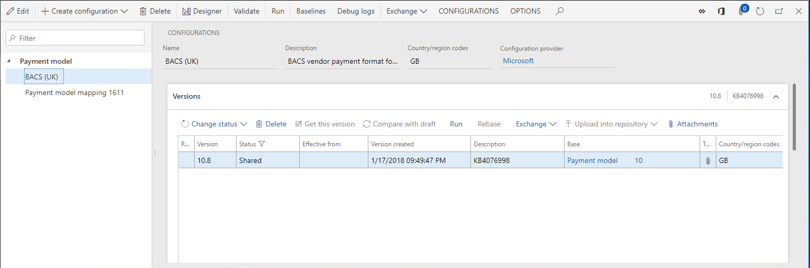

3. Select the **GBSI** demo data company, which has a country/region context in Great Britain.
4. Configure Accounts payable parameters:

    1. Go to **Accounts payable \> Payment setup \> Methods of payment**.
    2. Select the **Electronic** method of payment.
    3. Configure the selected method of payment so that it uses the **BACS (UK)** ER format that you downloaded earlier for vendor payment processing:

        1. On the **File formats** FastTab, set the **Generic electronic Export format** option to **Yes**.
        2. In the **Export format configuration** field, select **BACS (UK)**.

    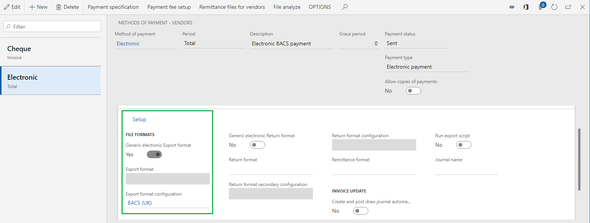

    > [!NOTE]
    > If you have the derived version of this ER format that was created to support customizations, you can select this configuration in the **Electronic** method of payment.

5. Create an example vendor payment:

    1. Go to **Accounts payable \> Payments \> Payment journal**.
    2. Make sure that you haven't posted the payment journal.

        

    3. Select **Lines**, and enter a line that has the following information.

        | Field               | Example value   |
        |---------------------|-----------------|
        | Vendor name         | GB\_SI\_000001  |
        | Debit               | 1,000.00        |
        | Currency            | GBP             |
        | Offset account type | Bank            |
        | Offset account      | GBSI OPER       |
        | Method of payment   | Electronic      |

    

## Prepare the ER framework to test vendor payment processing

### Configure ER parameters

1. Go to **Organization administration \> Electronic reporting \> Electronic reporting parameters**.
2. On the **Attachments** tab, in the **Baseline** field, select **File** as the document type that the Document management (DM) framework uses to keep documents that are related to the baseline feature as DM attachments.

    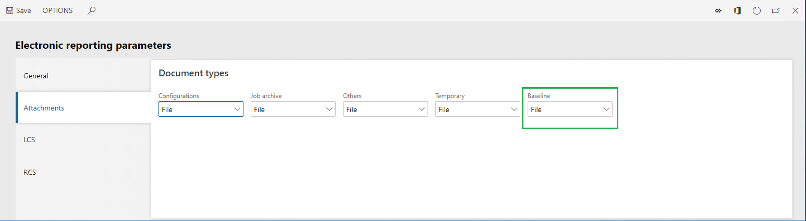

### Generate baseline copies of vendor payment–related documents

1. Go to **Accounts payable \> Payments \> Payment journal**.
2. Select **Lines**.
3. Select **Generate payments**.
4. Select the **Electronic** method of payment.
5. Select the **GBSI OPER** bank account.
6. Set the **Print control report** option to **Yes**.
7. Download the generated output as a zip file.
8. Open the downloaded file.
9. Extract following files from the downloaded file:

    - **File** payment file in text format
    - **ERVendOutPaymControlReport** control report file in XLSX format

    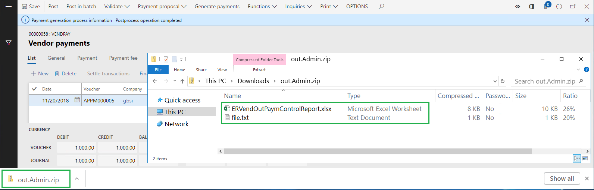

### Turn on the ER baseline feature

1. Go to **Organization administration \> Electronic reporting \> Configurations**.
2. On the Action Pane, on the **Configurations** tab, select **User parameters**.
3. Set the **Run in debug mode** option to **Yes**.

By turning on the **Run in debug mode** parameter, you force the ER framework to perform the following actions after the execution of any ER format that generates outgoing documents:

1. Determine whether a baseline was configured for any of components of the executed ER format.
2. Determine whether each configured baseline is applicable in the current conditions (company code of the signed-in company, file name and file name extension of the generated output, and so on).
3. For each applicable baseline, perform the following actions:

    1. Compare the output that is generated during execution of the ER format with the corresponding baseline.
    2. Store the results of the comparison in the ER configurations debug log.

### Configure ER baselines for vendor payment processing

1. Go to **Organization administration \> Electronic reporting \> Configurations**.
2. Select **Baselines**.
3. Select **New**.
4. In the **Reference** field, select the **BACS (UK)** format.
5. Select **Attachments**.
6. Add a new baseline for the vendor payment file:

    1. Select **New**.
    2. In the **Type** field, select the **File** DM document type that you configured in the ER parameters to store baseline artifacts.
    3. Browse to select the locally saved **File** payment file in text format.
    4. In the **Description** field, enter **Payment TXT file**.

7. Add a new baseline for the control report for the vendor payment:

    1. Select **New**.
    2. In the **Type** field, select the **File** DM document type that you configured in the ER parameters to store baseline artifacts.
    3. Browse to select the locally saved **ERVendOutPaymControlReport** control report file in XLSX format.
    4. In the **Description** field, enter **Payment XLSX control report**.

    

8. Close the page.
9. On the **Baselines** FastTab, select **New** to configure a baseline for the payment file:

    1. Name the line **Baseline setting for payment file**.
    2. In the **File component name** field, select **file** to apply this baseline to the ER format output that generates the payment file in BACS (UK) text format.
    3. In the **Companies** field, select **GBSI** to apply this baseline when the **BACS (UK)** ER format is run in the GBSI company.
    4. In **File name mask** field, enter **\*.TXT** to apply this baseline only to outputs of the **file** format component that have the **.txt** file name extension.
    5. In the **Baseline** field, select **Payment TXT file** so that this baseline is used for comparison with the generated output.

10. Select **New** to configure a baseline for the control report:

    1. Name the line **Baseline setting for control report**.
    2. In the **File component name** field, select **ERVendOutPaymControlReport** to apply this baseline to the ER format output that generates the control report.
    3. In the **Companies** field, select **GBSI** to apply this baseline when the **BACS (UK)** ER format is run in the GBSI company.
    4. In **File name mask** field, enter **\*.XLSX** to apply this baseline only to outputs of the **ERVendOutPaymControlReport** format component that have the **.xslx** file name extension.
    5. In the **Baseline** field, select **Payment XLSX control report** so that this baseline is used for comparison with the generated output.

    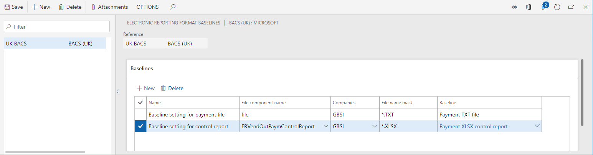

## Record tests to validate vendor payment processing

As a functional power user, you can record your own steps to test vendor payment processing. We recommend that you play (and edit, as required) the **Prepare\\Recording.xml** task recording that you downloaded earlier. This recording is used to set all testing data to the correct state. That step is required because the testing can be done many times, and every test must use data that is in the same state.

### Reset user settings

1. Open the default dashboard.
2. Select the **Settings** button (the gear symbol).
3. Select **User options**.
4. Select **Usage data**.
5. Select **Reset**.
6. Select **Yes** to confirm that you want to reset usage data.
7. Close the page.

### Record the steps to prepare data for testing

1. Select the **Settings** button (the gear symbol).
2. Select **Task recorder**.
3. Select **Playback recording**.
4. Select **Open from this PC**.
5. Select **Browse**, and select the locally save **Prepare\\Recording.xml** file.
6. Select **Start**.
7. Keep selecting **Play next pending step** until all the steps in the recording have been played.

This task recording performs the following actions:

1. Set the status of the processed payment line to **None**.

    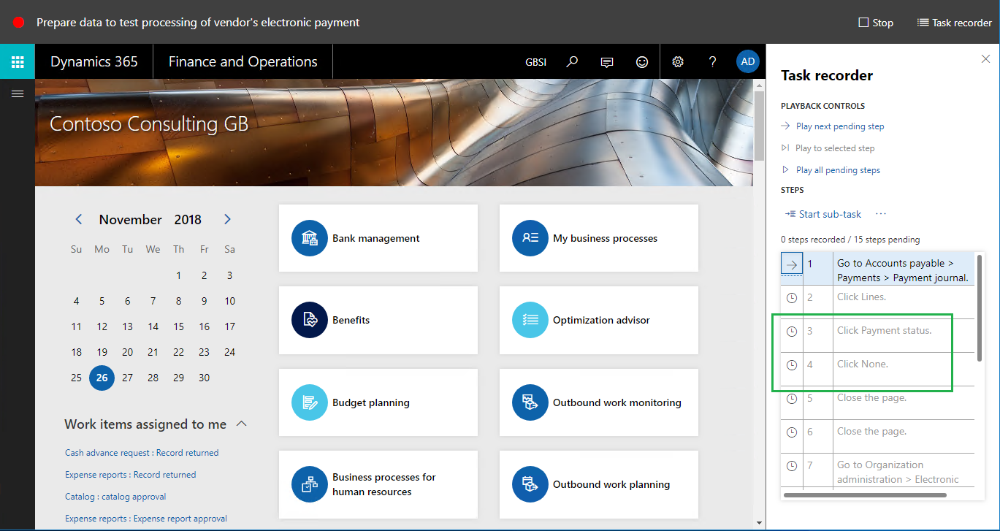

2. Turn on the **Run in debug mode** ER user parameter.

    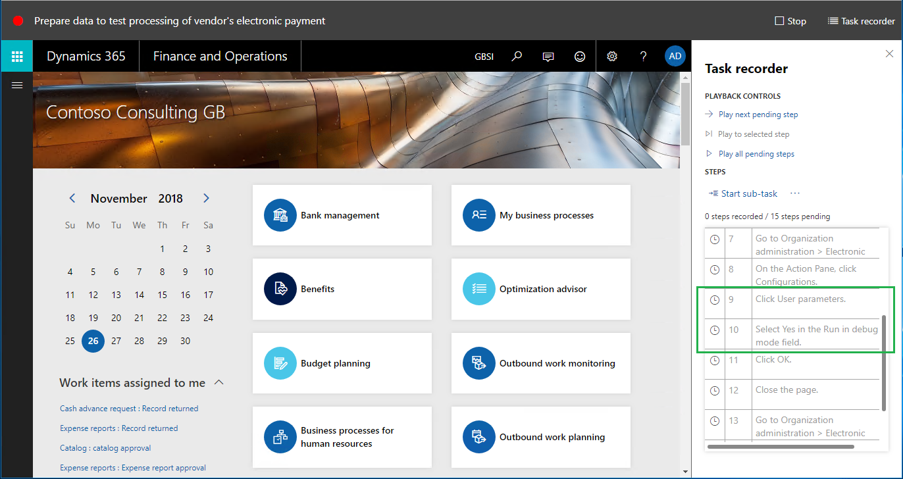

3. Clean up the ER debug log that contains the results of the comparison of generated files to baselines.

    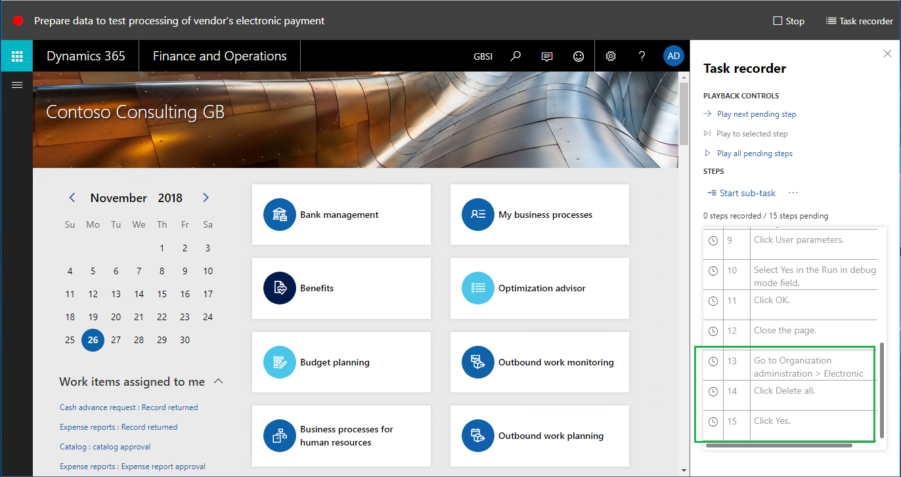

### Record the steps to test vendor payment processing

We recommend that you play (and edit, as required) the **Process\\Recording.xml** task recording that you downloaded earlier. This recording is used to process vendor payments and validate the results of the comparison of generated documents to corresponding baselines.

1. Select the **Settings** button (the gear symbol).
2. Select **Task recorder**.
3. Select **Playback recording**.
4. Select **Open from this PC**.
5. Select **Browse**, and select the locally saved **Process\\Recording.xml** file.
6. Select **Start**.
7. Keep selecting **Play next pending step** until all the steps in the recording have been played.

This task recording performs the following actions:

1. Start vendor payment processing.
2. Select the correct runtime parameters, and turn on generation of a control report.

    

3. Access the ER debug log to record the results of the comparison of generated outputs to corresponding baselines.

    In the ER debug log, the results of the comparison appear in the **Generated text** field. The **Format component** and **Format path that caused a log entry** fields refer to the file component for which the generated output has been compared to the baseline.

    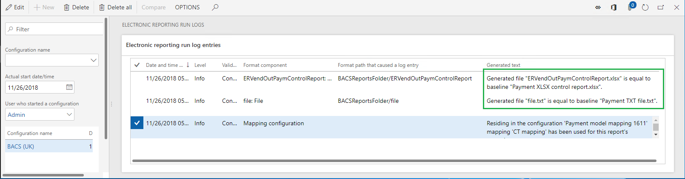

4. The comparison of the current output to the baseline is recorded by using the **Validate** Task recorder option and selecting  **Current Value**.

    

    The following illustration shows what the recorded validation steps look like in the task recording.

    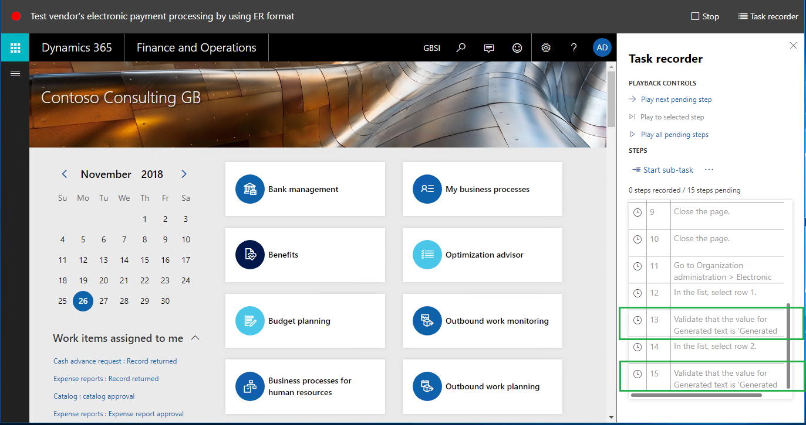

## Add the recorded tests to Azure DevOps

1. Open the Azure DevOps environment.
2. Select the project that you defined in the RSAT parameters when you [configured the tool](#prerequisites).
3. Select the test plan that you defined in the RSAT parameters when you [configured the tool](#prerequisites).
4. Create a new test case for the selected test plan:

    1. Name the test case **Prepare data to test processing of vendor's electronic payment**.
    2. Attach the **Recording.xml** file from the **Prepare** folder that you downloaded earlier.

5. Create a new test case for the selected test plan:

    1. Name the test case **Test processing of vendor payments by using ER format BACS (UK)**.
    2. Attach the **Recording.xml** file from the **Process** folder that you downloaded earlier.

    

> [!NOTE]
> Pay attention to the correct execution order of the tests that are added.

## Prepare RSAT to run the recorded tests

### Load the tests from Azure DevOps to RSAT

1. Open the local RSAT application in the current topology.
2. Select **Load** to load the tests that currently reside in Azure DevOps into RSAT.

    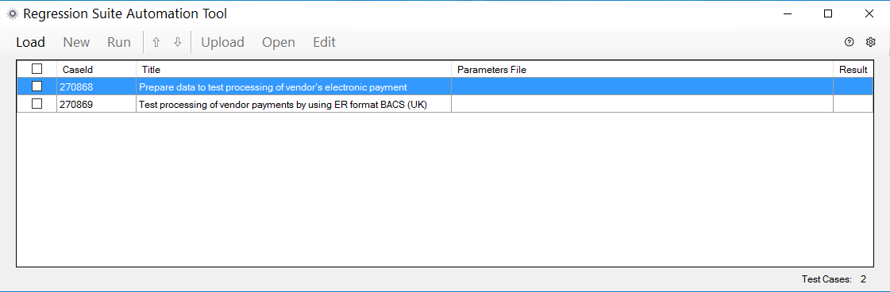

### Create automation and parameters files

1. In RSAT, select the tests that you loaded from Azure DevOps.
2. Select **New** to create RSAT automation and parameters files.

    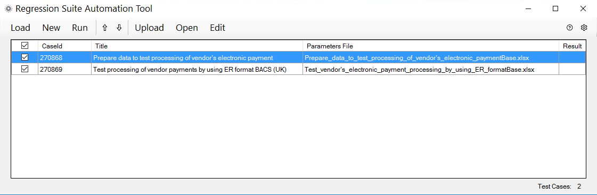

### Modify the parameters files

1. In RSAT, select the **Prepare data to test processing of vendor's electronic payment** test case.
2. Select **Edit**.
3. In the Microsoft Excel workbook that is opened, on the **General** worksheet, change the company code to **GBSI**, because this company will be used for test execution.
4. In RSAT, select the **Test processing of vendor payments by using ER format BACS (UK)** test case.
5. Select **Edit**.
6. In the Excel workbook that is opened, on the **General** worksheet, change the company code to **GBSI**.
7. On the **ERFormatMappingRunLogTable** worksheet, notice that cells A:3 and C:3 contain the text of the fields in the ER debug log table that are used to validate the results of the comparison of the output to the baseline. These texts will be used to evaluate ER debug log records that are created during test execution.

    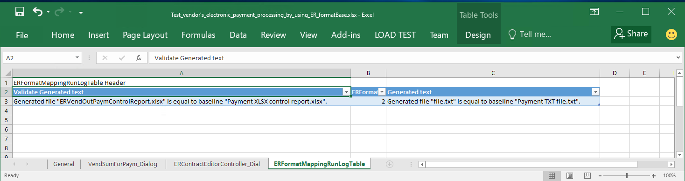

## Run the tests and analyze the results

### Run the tests in RSAT

1. In RSAT, select the loaded tests.
2. Select **Run**.

Notice that test cases are automatically run in the application by using a web browser.

### Analyze the results of test execution

The results of the test execution are stored in RSAT. Notice that both tests were passed.

Notice that the results of the test execution are also sent to Azure DevOps so that you can do further analysis.

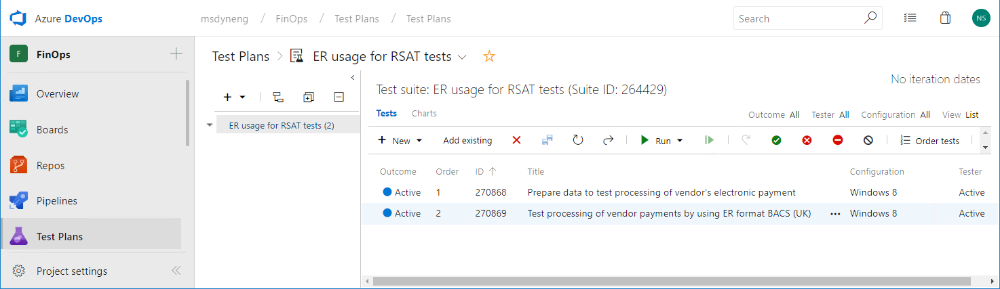

### Simulate a situation where tests fail

This test suite must fail when at least one of the generated outputs doesn't match the corresponding baseline. To achieve this situation, you can use your derived version of the **BACS (UK)** format that will generate a payment file that has different content than the corresponding baseline. To simulate this situation, you can use the same **BACS (UK)** format but change the payment amount on the processed payment line.

1. Open the application and go to **Accounts payable \> Payments \> Payment journal**.
2. Select **Lines**.
3. Select the payment line, and then select **Payment status \> None**.
4. In the **Debit** field, change the value from **1,000.00** to **2,000.00**.
5. Select **Save** to save your changes.

### Run the tests in RSAT

1. In RSAT, select the loaded tests.
2. Select **Run**.

Notice that test cases are automatically run in the application by using a web browser.

### Analyze the results of test execution

The results of the test execution are stored in RSAT. Notice that the second test failed during the second execution.

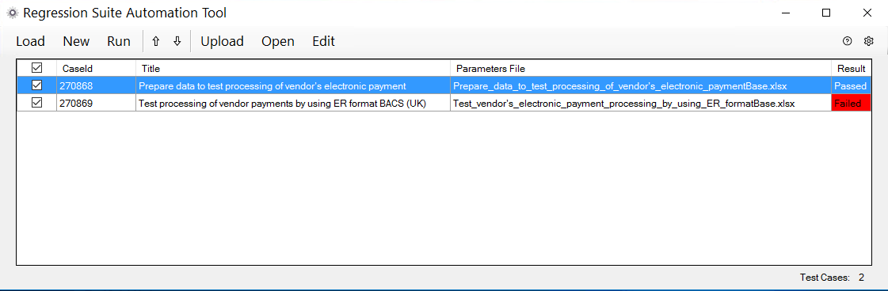

Notice that the results of the test execution are also sent to Azure DevOps so that you can do further analysis.

You can access the status of each test. You can also access the execution log so that you analyze the reasons for any failure. In the following illustration, the execution log shows that the failure occurred because of the difference in content between the generated payment file and its baseline.

Therefore, as you've seen, the functioning of any ER format can be evaluated automatically by using RSAT as the testing platform and by using Task recorder-based test cases that use the ER baseline feature.

## Additional resources

- [Task recorder resources](../user-interface/task-recorder.md)
- [Regression suite automation tool](https://www.microsoft.com/download/details.aspx?id=57357)
- [Create and automate user acceptance tests](../lifecycle-services/using-task-guides-and-bpm-to-create-user-acceptance-tests.md)
- [Deploy and use an environment that supports continuous build and test automation](../perf-test/continuous-build-test-automation.md)
- [Trace generated report results and compare them with baseline values](er-trace-reports-compare-baseline.md)
- [ER Upgrade your format by adopting a new, base version of that format](tasks/er-upgrade-format.md)
- [ER Import a configuration from Lifecycle Services](tasks/er-import-configuration-lifecycle-services.md)

[!INCLUDE[footer-include](../../../includes/footer-banner.md)]