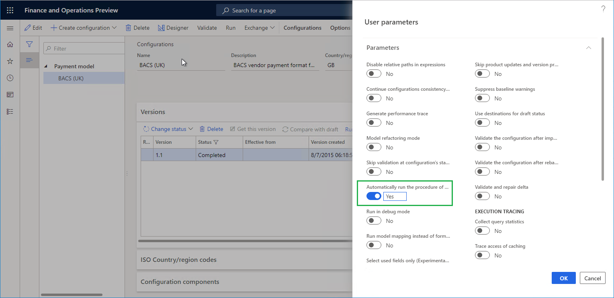
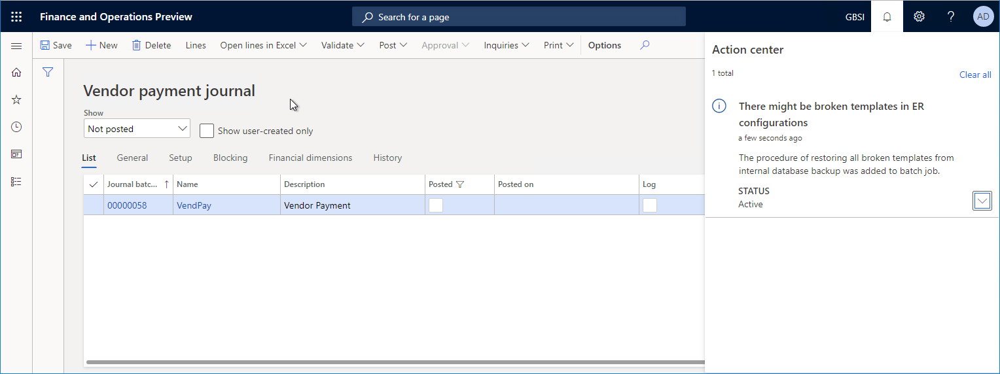
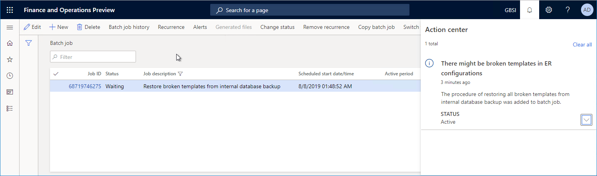
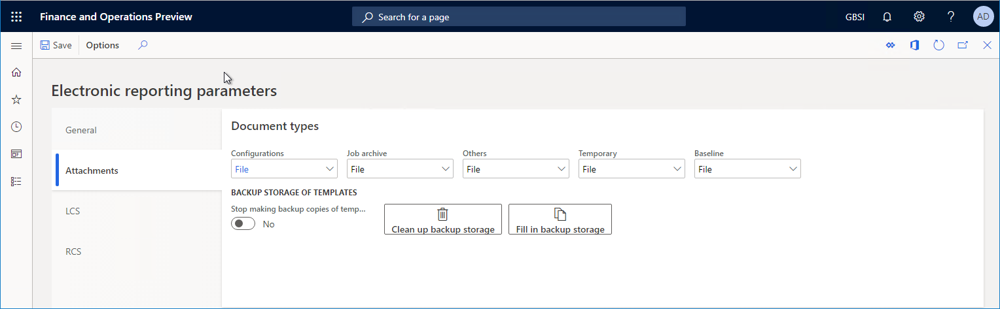

# Backup storage of ER templates

[!include [banner](../includes/banner.md)]

The [Electronic reporting (ER) overview](general-electronic-reporting.md) lets business users configure formats for outbound documents according to the legal requirements of various countries and regions. Configured ER formats can use predefined templates to generate outbound documents in various formats, such as Microsoft Excel workbooks, Microsoft Word documents, or PDF documents. The templates are filled with data that the configured dataflow for generated documents requires.

Each configured format can be published as part of an ER solution. Each ER solution can be exported from one instance of finance and operations and imported into another instance.

The ER framework uses the [Configure document management](../../fin-ops/organization-administration/configure-document-management.md) to keep the required templates for the current finance and operations instance. Depending on the settings of the ER framework, Microsoft Azure Blob storage or a Microsoft SharePoint folder can be selected as the physical primary storage location for templates. (For more information, see [Configure the Electronic reporting (ER) framework](electronic-reporting-er-configure-parameters.md).) The DocuValue table holds an individual record for each template. In each record, the **AccessInformation** field stores the path of a template file that is located in the configured storage location.

When you manage your finance and operations instances, you might decide to migrate the current instance to another location. For example, you might migrate your production instance to a new sandbox environment. If you configured the ER framework to store templates in Blob storage, the DocuValue table in the new sandbox environment refers to the instance of Blob storage in the production environment. However, this instance can't be accessed from the sandbox environment, because the migration process doesn't support the migration of artifacts in Blob storage. Therefore, if you try to run an ER format that uses a template to generate business documents, an exception occurs, and you're notified about the missing template. You're also guided to use the ER cleanup tool to delete and then re-import the ER format configuration that contains the template. Because you might have several ER format configurations, this process can be time consuming.

The Backup storage of ER templates feature can help you make your templates so that they are always available to generate business documents.

> [!NOTE]
> This feature can be used only when Blob storage has been selected as the physical storage location for ER templates.

## Automated recovery and notification

For this feature, every template of a new ER format configuration in the current environment is automatically saved to the backup storage location for templates (the ERDocuDatabaseStorage database table) when the following events occur:

- You import a new ER format configuration that contains a template.
- You complete the draft version of an ER format configuration that contains a template.

Backup copies of templates are migrated to a new instance of finance and operations as part of the application database.

If a template of an ER format is required for generation of outbound documents, to process vendor payments including generation of payment advice and control reports, for example, but the required template isn't found in the primary storage location, the following events occur:

- If the template is available in the backup storage location, it is automatically taken from the backup storage location, restored to the primary storage location, and used for the current execution.
- Every user who is assigned to the **Electronic reporting developer** or **System administrator** role is notified about the missing template issue through the Action center. The message that appears depends on the value of the **Automatically run the procedure of restoring the broken templates in batch** parameter:

    - If this parameter is set to **Off**, the message recommends that you start the batch process to automatically fix similar issues for other ER format configuration templates. The message includes a link that you can use to start the batch process.
    - If this parameter is set to **On**, the message notifies you that a missing templates issue has been discovered, and that a new batch process, **Restore broken templates from internal database backup**, has been automatically scheduled. This batch process will automatically fix similar issues for other templates.

To set up the **Automatically run the procedure of restoring the broken templates in batch** parameter, complete the following steps:

1. In finance and operations, open the **Organization administration \> Electronic reporting \> Configurations page**.
2. On the **Configurations** page, on the Action Pane, on the **Configurations** tab, in the **Advanced settings** group, select **User parameters**.
3. In the **User parameters** dialog box, set the required value for the **Automatically run the procedure of restoring the broken templates in batch** parameter.

> [!NOTE]
> This parameter is defined as application user and logged company specific.

The following illustration shows an example of the message that appears when the **Automatically run the procedure of restoring the broken templates in batch** parameter is set to **On**.

The following illustration shows the **Restore broken templates from internal database backup** batch process on the **Batch job** page.

The execution log of the completed **Restore broken templates from internal database backup** batch process includes information about the templates that have been restored from the backup storage location to the primary storage location.

By default, the process of automatically creating backup copies of templates that reside in ER format configurations is turned on. To stop making backup copies of templates, set the **Stop making backup copies of template** option to **Yes** on the **Attachments** tab of the **Electronic reporting parameters** page. You can open this page from the **Electronic reporting** workspace.

If you set the **Stop making backup copies of templates** option to **Yes** and don't want to keep the backup copies that were previously made of templates, select **Clean up backup storage** on the **Electronic reporting parameters** page.

If you upgraded your environment to finance and operations version 10.0.5 (October 2019) and want to migrate to a new environment that includes ER format configurations that can be run, select **Fill in backup storage** on the **Electronic reporting parameters** page before the migration occurs. This button starts the process of making backup copies of all available templates, so that they can be stored in the ER backup storage location for templates.

## Manual recovery

Go to **Organization administration** \> **Electronic reporting** \> **Restore broken templates** to manually initiate the process of restoring ER templates from the backup storage location to the primary storage location. Before you start this process, on the **Restore broken templates** page you can specify whether it will be performed interactively, or the batch process will be scheduled for this.

## Supported deployments

In finance and operations version 10.0.5, the Backup storage of ER templates feature is available only in cloud deployments.

## Additional resources

[Electronic reporting (ER) overview](general-electronic-reporting.md)

[Configure the Electronic reporting (ER) framework](electronic-reporting-er-configure-parameters.md)

[!INCLUDE[footer-include](../../../includes/footer-banner.md)]
