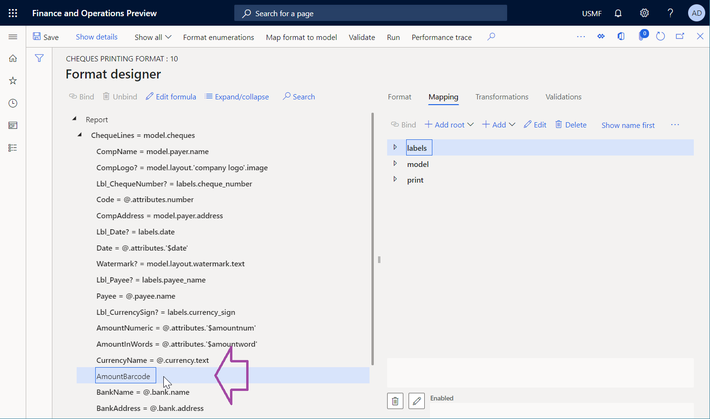

# Use Barcode data sources to generate bar code images

[!include[banner](../includes/banner.md)]

You can use the [Electronic reporting (ER)](general-electronic-reporting.md) framework to design ER format components that you can run to generate electronic and printable outbound documents that you require. To generate an outbound document in Microsoft Office format, you must specify the layout of the report by using either a Microsoft Excel document or a Microsoft Word document as a report template. The [ER Operations designer](general-electronic-reporting.md#building-a-format-that-uses-a-data-model-as-a-base) lets you attach an Excel or Word document as a template for an ER format. The following named elements in the attached template are associated with the elements of the configured format component:

- Content controls in Word
- Named sheets, ranges, cells, shapes, and images in Excel

These named elements are used as placeholders for data that is entered in a generated document when an ER format is run. ER format elements are bound to data sources. These data sources specify the data that will be entered in the generated documents at runtime. For more information, see [Embed images and shapes in documents that you generate by using ER](electronic-reporting-embed-images-shapes.md).

ER now supports the **Barcode** data source type. Therefore, you can now generate an image that represents the bar code for specified text. When you configure an ER format, you can specify data sources of the **Barcode** type to generate bar code images. You can then add those images to generated business documents, such as orders, invoices, packing slips, and receipts. You can also add them to various kind of labels, such as product and shelf labels, and packaging and shipping labels.

The following placeholders can be used in report templates to enter bar code images:

- [Picture](/office/client-developer/word/content-controls-in-word) content control for Word
- [Picture](https://support.office.com/article/insert-pictures-3c51edf4-22e1-460a-b372-9329a8724344) object in Excel

By using a data source of the **Barcode** type, you can generate bar codes in the following formats:

- One-dimensional bar codes:

    - Codabar
    - Code 39
    - Code 93
    - Code 128
    - EAN-8
    - EAN-13
    - ITF-14
    - Intelligent Mail
    - MSI
    - Plessey
    - PDF417
    - UPC-A
    - UPC-E

- Two-dimensional bar codes:

    - Aztec
    - Data Matrix
    - QR Code

When you configure a **Barcode** data source, you can define specific rendering parameters that are used to generate an image:

- **Width** – Specify the bar code's width in pixels. A value of **0** (zero) indicates that the default width is used. The meaning can vary for different formats.
- **Height** – Specify the bar code's height in pixels. A value of **0** (zero) indicates that the default height is used. The meaning can vary for different formats.
- **Margin** – Specify the size of the bar code's margin in pixels. The margin is the area on each side of a bar code that must be kept clear (quiet zone). A value of **0** (zero) indicates that the default margin is used. The meaning can vary for different formats.
- **Output content** – Set the value to **Yes** to generate a bar code image that contains the encoded information as text. The default value is **No**.
- **Encoding** – Specify the type of characters that are encoded in the generated bar code image. By default, the **UTF-8** encoding is used.

> [!IMPORTANT]
> When you add a new **Barcode** data source, you must place it under another item (container) as a nested element.
>
> When you bind a **Barcode** data source to a cell element in a format, and the cell element represents either a Word content control or an Excel picture, the data source is presented in that binding as a function that has a single parameter of the **String** type. You must use this parameter to specify the text that should be transformed into a bar code image and read when a generated bar code is scanned.

For more information about this feature, complete the examples in this article.

## Example: Generate a payment check that contains a bar code that encodes the payable amount

This example shows how a user in the **System administrator** or **Electronic reporting functional consultant** role can configure an ER format that contains a template that is used to generate an outbound document in Excel format that contains a bar code. Here is an overview of the steps that are involved.

1. [Complete the prerequisites](#ExamplePrerequisites).
2. [Activate a configuration provider](#ExampleProvider).
3. [Import the provided ER solution](#ExampleImportSolution).
4. [Generate a payment check](#ExampleGenerateCheque).
5. [Review the generated payment check](#ExampleReviewGeneratedCheque).
6. [Modify the format of the provided ER solution](#ExampleModifyFormat).

    1. [Apply a new check template](#ExampleModifyFormatApplyTemplate).
    2. [Add a new Barcode data source](#ExampleModifyFormatAddDataSource).
    3. [Bind a new format element](#ExampleModifyFormatBindFormatElement).
    4. [Make the modified version available for test runs](#ExampleModifyFormatMakeVersionAvailable).

        1. [Complete the modified format version](#CompleteToRun).
        2. [Make the draft version available for use](#MarkToRun).

7. [Generate a payment check](#ExampleGenerateCheque2).
8. [Convert the generated check to a PDF](#ExampleConvertToPDF).

In this example, you will use the provided ER solution that has been configured to generate payment checks. This solution generates payment checks where the payable amount is written both as a number and as text. You will modify this ER solution so that the check also includes a generated bar code where the payable amount is encoded and can be read by using a bar code scanner.

The steps can be completed in the **USMF** company in Microsoft Dynamics 365 Finance.

### Complete the prerequisites

To complete this example, you must have access to the USMF company in Finance for one of the following roles:

- Electronic reporting functional consultant
- System administrator

If you haven't yet completed the example in the [Embed images and shapes in documents that you generate by using ER](electronic-reporting-embed-images-shapes.md) article, download the following configurations of the sample ER solution.

| Content description         | File name                   |
|-----------------------------|-----------------------------|
| ER data model configuration | [Model for cheques.xml](https://download.microsoft.com/download/6/e/a/6ea166fd-1382-4fdb-8dcb-0f13379f9c8e/Modelforcheques.xml)      |
| ER format configuration     | [Cheques printing format.xml](https://download.microsoft.com/download/1/7/c/17c301e3-c4ee-4886-ae75-440fcc002c8c/Chequesprintingformat.xml) |

Additionally, download the following Excel file that contains the modified template for the provided ER solution.

| Content description | File name                 |
|---------------------|---------------------------|
| Report template     | [Check template Excel.xlsx](https://download.microsoft.com/download/3/b/d/3bd3b944-da8f-43b4-8533-3c1292a4c3ef/CheckTemplateExcel.xlsx) |

### Activate a configuration provider

1. Go to **Organization administration** \> **Workspaces** \> **Electronic reporting**.
2. On the **Localization configurations** page, in the **Configuration providers** section, make sure that the [configuration provider](general-electronic-reporting.md#Provider) for the **Litware, Inc.** sample company is listed, and that it's marked as active. If it isn't listed, or if it isn't marked as active, follow the steps in the [Create a configuration provider and mark it as active](tasks/er-configuration-provider-mark-it-active-2016-11.md) article.

### Import the provided ER solution

1. Go to **Organization administration** \> **Workspaces** \> **Electronic reporting**.
2. On the **Localization configurations** page, in the **Configurations** section, select the **Reporting configurations** tile.
3. On the **Configurations** page, if the **Model for cheques** configuration isn't available in the configuration tree, follow these steps to import the ER data model configuration:

    1. On the Action Pane, select **Exchange** \> **Load from XML file**.
    2. In the dialog box, select **Browse**, find and select the **Model for cheques.xml** file, and then select **OK**.

4. If the **Cheques printing format** configuration isn't available in the configuration tree, follow these steps to import the ER format configuration:

    1. On the Action Pane, select **Exchange** \> **Load from XML file**.
    2. In the dialog box, select **Browse**, find and select the **Cheques printing format.xml** file, and then select **OK**.

5. In the configuration tree, expand **Model for cheques**.
6. Review the list of imported ER configurations in the configuration tree.

### Generate a payment check

1. Go to **Cash and bank management** \> **Bank accounts** \> **Bank accounts**.
2. On the **Bank accounts** page, select the **USMF OPER** account.
3. On the bank account details page, on the Action Pane, on the **Set up** tab, in the **Layout** group, select **Check**.
4. On the **Check layout** page, select **Edit**.
5. On the **General** FastTab, set the **Generic electronic Export format** option to **Yes**.
6. In the **Export format configuration** field, select the **Cheques printing format** ER format that you imported earlier.
7. On the Action Pane, select **Print test**.
8. In the dialog box, set the **Negotiable check format** option to **Yes**, and then select **OK**.

    

### Review the generated payment check

- Open the generated check in Excel.
2. Review the generated check.

    

### Modify the format of the provided ER solution

#### Apply a new check template

You can use the Excel desktop application to open the **Cheque template Excel.xlsx** file that you imported earlier. Notice that this template differs from the template that you used to generate a payment check in the provided ER solution. In addition, it includes an **AmountBarcode** element for the bar code image.

You must now modify the ER solution and then [reapply](modify-electronic-reporting-format-reapply-excel-template.md) the modified template.

1. Go to **Organization administration** \> **Workspaces** \> **Electronic reporting**.
2. On the **Localization configurations** page, in the **Configurations** section, select **Reporting configurations**.
3. On the **Configurations** page, in the configuration tree, expand **Model for cheques**, and select **Cheques printing format**.
4. On the Action Pane, select **Designer**.
5. In the ER Operations designer, select the **Mapping** tab on the right side of the page, and then, in the format tree pane on the left, select **Expand/collapse**.
6. Notice that all cell format elements are bound to the appropriate data sources.

    

7. Select the **Format** tab on the right side of the page.
8. On the Action Pane, select the ellipsis (**...**), and then select **Import**.
9. In the **Import** group, select **Update from Excel**, and then select **Update template**.
10. In the dialog box, browse to the **Cheque template Excel.xlsx** file that is saved on your computer, select it, and then select **OK** to confirm that the selected template should be applied.
11. Select the **Mapping** tab on the right side of the page, and then, in the format tree pane on the left, select **Expand/collapse**.
12. Notice that the **AmountBarcode** cell element has been added to the format. This element is associated with the **AmountBarcode** element that has been added to the modified Excel template as a placeholder for a bar code image.

    

#### Add a new Barcode data source

Next, you must add a new data source of the **Barcode** type.

1. In the ER Operations designer, on the **Mapping** tab on the right side of the page, select the **print** data source.
2. Select **Add**, and then, in the **Functions** group, select the **Barcode** data source type.

    

3. In the dialog box, in the **Name** field, enter **barcode**.
4. In the **Barcode format**, select **Code 128**.
5. In the **Width** field, enter **500**.
6. Select **OK**.

    

#### Bind a new format element

Next, you must bind the new format element to the data source that you just added.

1. In the ER Operations designer, on the **Mapping** tab on the right side of the page, select the **print\\barcode** data source.
2. In the format tree pane on the left, select the **AmountBarcode** cell element, and then select **Bind**.
3. On the Action Pane, select **Show details**.
4. Notice that, because the **Barcode** data source is represented in the binding as a function that contains a single parameter, the name of the bound format element has been automatically taken as the argument of that parameter.

    

5. Select **Edit formula** to adjust the binding.

    You don't want the name of the cell element to be returned. Therefore, you must configure an expression that returns text that contains the payable amount of the current check. Because the parent **ChequeLines** range is bound to the **model.cheques** data source, the payable amount of the current check is available in the **model.cheques.attributes.amount** field of the **Real** data type.

6. In the **Formula** field, enter **print.barcode(NUMBERFORMAT(@.attributes.amount, "F2"))**.
7. Select **Save**, and then close the [ER Formula designer](general-electronic-reporting-formula-designer.md).
8. Notice that the binding has been adjusted.

    

9. Select **Save**, and then close the ER Operations designer.

#### Make the modified version available for test runs

By default, the only versions that have a status of **Completed** and **Shared** are used when you run an ER format.

If you've finalized your changes, you can complete your work with the current draft version and make your changes available for use. For instructions, see the [Complete the modified format version](#CompleteToRun) section that follows.

If you want to continue to work with the current draft version, but you have to use it to generate checks, you must explicitly specify that you want to use the draft version of the format for execution. For instructions, see the [Make the draft version available for use](#MarkToRun) section.

##### Complete the modified format version

1. Go to **Organization administration** \> **Workspaces** \> **Electronic reporting**.
2. On the **Localization configurations** page, in the **Configurations** section, select **Reporting configurations**.
3. On the **Configurations** page, in the configuration tree, expand **Model for cheques**, and select **Cheques printing format**.
4. On the **Versions** FastTab, select the record that has a status of **Draft**.
5. Select **Change status**, and then select **Complete**.
6. In the dialog box, select **OK**.

The status of the current version is changed from **Draft** to **Completed**, and a new version that has a status of **Draft** is created. You can use this new draft version to apply additional changes.

##### Make the draft version available for use

1. Go to **Organization administration** \> **Workspaces** \> **Electronic reporting**.
2. On the **Localization configurations** page, in the **Configurations** section, select **Reporting configurations**.
3. On the **Configurations** page, on the Action Pane, in the **Configurations** tab, in the **Advance settings** group, select **User parameters**.
4. In the dialog box, set the **Run setting** options to **Yes**, and then select **OK**.
5. In the configuration tree, expand **Model for cheques**, and select **Cheques printing format**.
6. Set the **Run draft** option to **Yes**.
7. Select **Save**.

The draft version of the selected format is marked as available for use when the selected format is run.

### Generate a payment check

1. Go to **Cash and bank management** \> **Bank accounts** \> **Bank accounts**.
2. On the **Bank accounts** page, select the **USMF OPER** account.
3. On the bank account details page, on the Action Pane, on the **Set up** tab, in the **Layout** group, select **Check**.
4. On the **Check layout** page, on the Action Pane, select **Print test**.
5. In the dialog box, set the **Negotiable check format** option to **Yes**.
6. Select **OK**.
7. Review the generated check. Notice that a bar code has been generated to encode the payable amount of the check.

    

> [!IMPORTANT]
> An exception is thrown if the argument of a **Barcode** data source doesn't comply with the appropriate requirements that are specific to the bar code format. For example, when the **Barcode** data source is called to generate an [EAN-8](https://wikipedia.org/wiki/EAN-8) bar code for the provided text, an exception is thrown if the length of the text exceeds seven characters.

### Convert the generated check to a PDF

As described in the [Generate printable FTI forms](er-generate-printable-fti-forms.md#finland) article, you can use a special font to produce bar codes in a generated document. In this case, additional transformations of the generated document might depend on the availability of that font in the transformation environment. For example, if you try to convert a document to PDF format or preview it in an environment where the font is missing, bar codes won't be rendered correctly.

However, when you use the **Barcode** data source to produce bar codes, the rendering of those bar codes doesn't depend on any font. Therefore, you can easily convert documents that contain the bar codes to PDF format. The following illustration shows the preview of a generated payment check that has been [converted](electronic-reporting-destinations.md#OutputConversionToPDF) to a PDF, based on the setting of the configured ER [destination](electronic-reporting-destinations.md).

## Limitations

> [!NOTE]
> Some types of bar codes that are generated have a fixed aspect ratio. This behavior makes sense if you've turned on the **Enable usage of EPPlus library in Electronic reporting framework** feature to work with Excel documents in ER. In that case, an image is entered into a placeholder that has a locked aspect ratio. Therefore, when the dimensions of a placeholder in a template correspond to the ratio of an image that is entered, a real picture in a generated document might be resized to maintain the required aspect ratio. To prevent picture resizing, use a placeholder that has an expected aspect ratio.

## Additional resources

- [Electronic Reporting overview](general-electronic-reporting.md)
- [Electronic Reporting destinations](electronic-reporting-destinations.md)
- [Electronic reporting formula language](er-formula-language.md)
- [NUMBERFORMAT function](er-functions-text-numberformat.md)

[!INCLUDE[footer-include](../../../includes/footer-banner.md)]
