---
# required metadata

title: Add new fields to a business document template in Microsoft Excel
description: This topic provides information about how to add new fields to a business document template in Microsoft Excel by using Business document management feature.
author: NickSelin
ms.date: 11/15/2019
ms.topic: article
ms.prod: 
ms.technology: 

# optional metadata

ms.search.form: ERBDWorkspace, ERBDParameters, ERBDTemplateEditor
# ROBOTS: 
audience: Application User, Developer, IT Pro
# ms.devlang: 
ms.reviewer: kfend
# ms.tgt_pltfrm: 
ms.custom: 
ms.assetid: 
ms.search.region: Global
# ms.search.industry: 
ms.author: nselin
ms.search.validFrom: 2019-10-01
ms.dyn365.ops.version: 10.0.7

---

# Add new fields to a business document template in Microsoft Excel

[!include[banner](../includes/banner.md)]

You can add new fields to a template that is used to generate business documents in Microsoft Excel format. These fields can be added as placeholders that are used to fill generated documents with required information from the application. For every field that you add, you can also specify a binding to the data sources, to specify what application data will be entered in the field when the template is used to generate business documents.

To learn more about this feature, complete the example in this topic. This example shows how to update a template to fill in the fields in free text invoice forms that are generated.

## Configure Business document management to edit templates

Because Business document management (BDM) is built on top of the [Electronic reporting (ER) overview](general-electronic-reporting.md) framework, you must configure the required ER and BDM parameters before you can start to work with BDM.

1.	Sign in to the instance of Microsoft Dynamics 365 Finance as the system administrator.
2.	Complete the following steps of the example in the [Business document management overview](er-business-document-management.md) topic:

    1.	Configure ER parameters.
    2.	Turn on BDM.

You can now start to use BDM to edit business document templates.

## Import ER solutions that contain a template

The example in this procedure uses the officially published ER solution. You must import the ER configurations of this solution into your current instance of Finance.

The **Free text invoice (Excel)** ER format configuration of this solution contains the business document template in Excel format that can be edited by using BDM. Import the latest version of this ER format configuration from Microsoft Dynamics Lifecycle Service (LCS). The corresponding ER data model and ER model mapping configurations will be imported automatically.

For more information about how to import ER configurations, see [Manage the ER configuration lifecycle](general-electronic-reporting-manage-configuration-lifecycle.md).

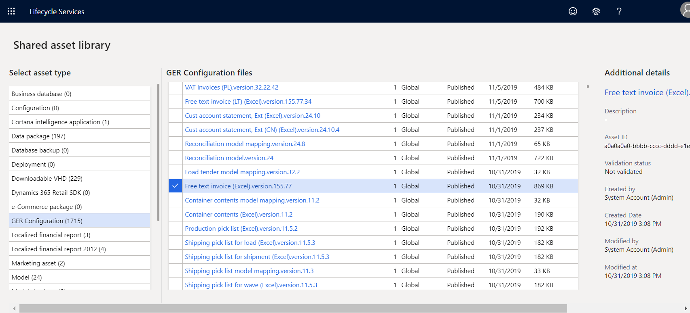

### Edit the ER solution template

1.	Sign in as a user who has access to the **Business document management** workspace.
2.	Open the **Business document management** workspace.

    

3.	In the grid, select the **Free text invoice (Excel)** template.
4.	In the right pane, select **New template** to create a new template that is based on the selected template.
5.	In the **Title** field, enter **Free text invoice (Excel) Contoso** as the title of the new template.
6.	Select **OK** to confirm the start of the editing process.

The BDM template editor page appears. You can use Microsoft 365 to edit the selected template online in the embedded control.

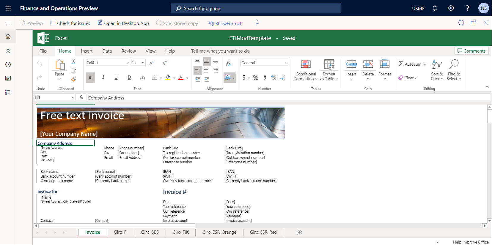

### Add the label for a new field to the template

1.	On the BDM template editor page, on the Excel ribbon, on the **View** tab, select the **Headings and Gridlines** check boxes for the editable Excel template.

    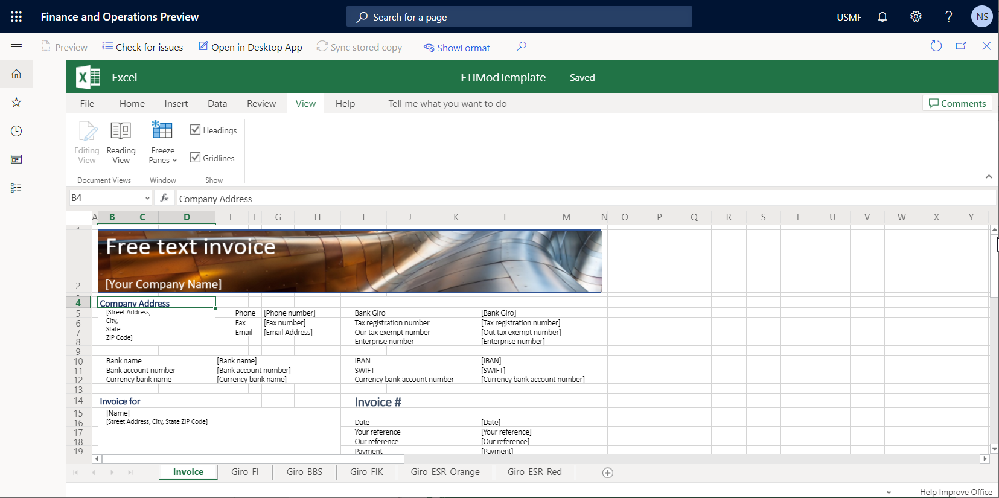

2.	Select cells **E8:F8**.
3.	On the Excel ribbon, on the **Home** tab, select **Merge & Center** to merge the selected cells into a new merged **E8:F8** cell.
4.	In the merged cell **E8:F8**, enter **URL**.
5.	Select merged cell **E7:F7**, select **Format painter**, and then select merged cell **E8:F8** to format it in the same way as merged cell **E7:F7**.

    

### Format the template to reserve space for a new field

1.	On the BDM template editor page, select merged cell **G8:H8**.
2.	On the Excel ribbon, on the **Home** tab, select **Merge & Center** to merge the selected cells into a new merged **G8:H8** cell.
3.	Select merged cell **G7:H7**, select **Format painter**, and then select merged cell **G8:H8** to format it in the same way as merged cell **G7:H7**.

    

4.	In the **Name** box field, select **CompanyInfo**.

    The **CompanyInfo** range of the current Excel template holds all the fields that are used to fill the header of a generated report with the details of the current company as a seller party.

    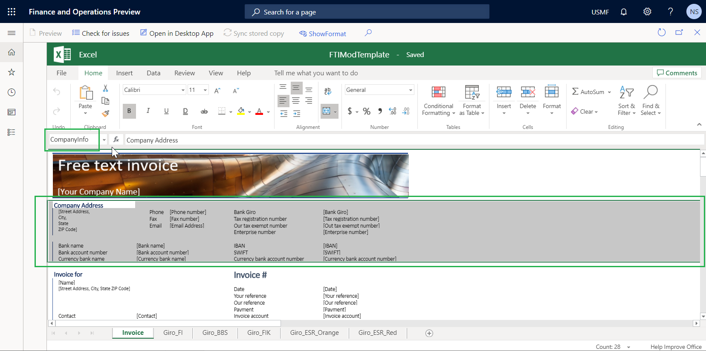

### Add a new field to the template

1.	On the **BDM template editor** page, on the Action Pane, select **Show format**.
2.	In the **Template structure** pane, select **Add**.

    > [!NOTE]
    > You must adjust the section of the template that you want to use as a new field. You already made this adjustment by formatting merged cell **G8:H8**.

    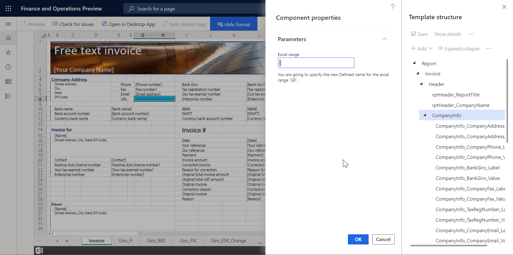

3.	Select **Excel\Cell** to add a new field as a cell in the template.

    You can select **Excel\Range** if you want to add a new range to the template. The range that is entered can contain multiple cells. You can add these cells later.
    
    Notice that the **CompanyInfo** template component, is automatically selected in the **Template structure** pane, because it's the most suitable parent component in the current template structure for the field that you're adding.
    
4.	In the **Excel range** field, enter **CompanyURL_Value**.
5.	Select **OK**.

    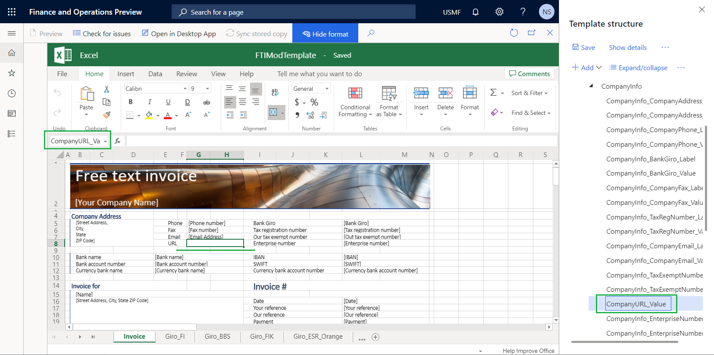

6.	In the **Template structure** pane, select the ellipsis button (...), and then select **Show bindings**.

    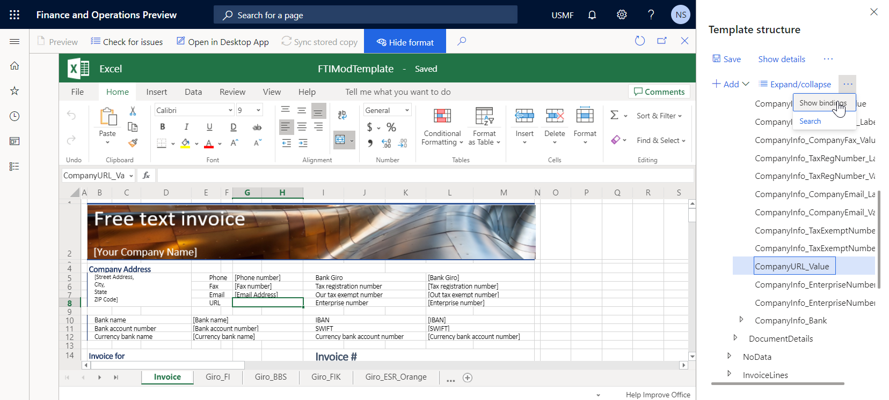

    The **Template structure** pane now shows the data sources that are available in the underlying ER format.

7.	Select **CompanyInfo_Value** as the field that you plan to bind to a data source of the underlying ER format.
8.	In the **Data sources** section of the **Template structure** pane, expand **Model \> InvoiceBase \> CompanyInfo**.
9.	Under **CompanyInfo**, select the **WebsiteURI** item.

    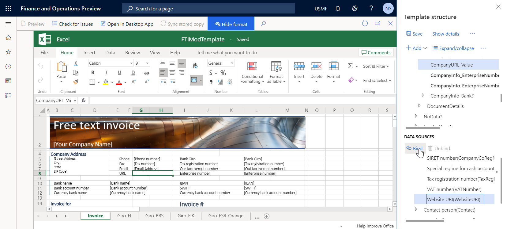

10.	Select **Bind**.
11.	In the **Template structure** pane, select **Save**, and then close the BDM template editor page.

In the **Business document management** workspace, the **Template** tab in the right pane shows the updated template. In the grid, notice that the **Status** field for the edited template has been changed to **Draft**, and the **Revision** field is no longer blank. These changes indicate that the process of editing this template has been started.

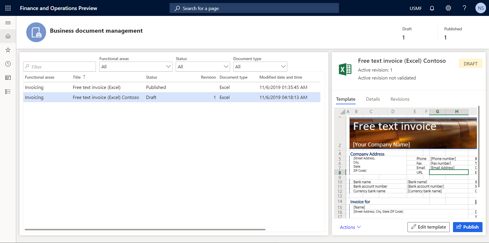

## Review company settings

1.	Go to **Organization administration \> Organizations \> Legal entities**.
2.	On the **Contact information** FastTab, verify that the company URL is entered.

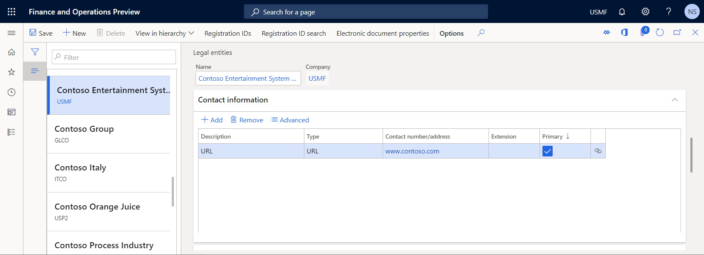

## Generate business documents to test the updated template

1.	In the application, change the company to **USMF**, and go to **Accounts receivable \> Invoices \> All free text invoices**.
2.	Select invoice **FTI-00000002**, and then select **Print management**.
3.	In the left pane, expand **Module - accounts receivable \> Documents \> Free text invoice**.
4.	Under **Free text invoice**, select the **Original document** level to specify the scope of invoices for processing.
5.	In the right pane, in the **Report format** field, select the **Free text invoice (Excel) Contoso** template for the specified document level.

    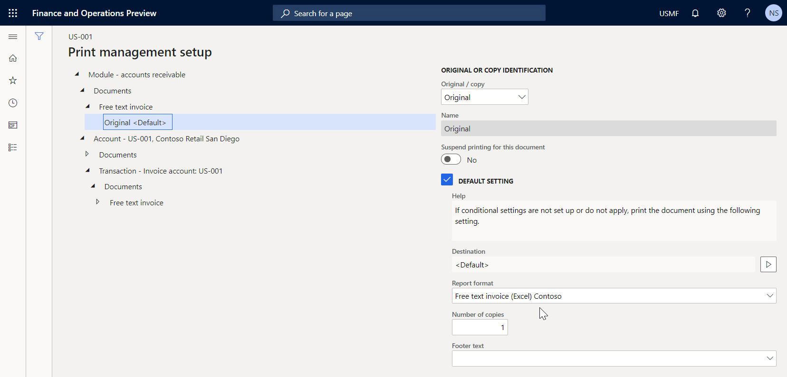

6.	Press **Esc** to close the current page.
7.	Select **Print \> Selected**.
8.	Download the generated document, and open it in Excel.

    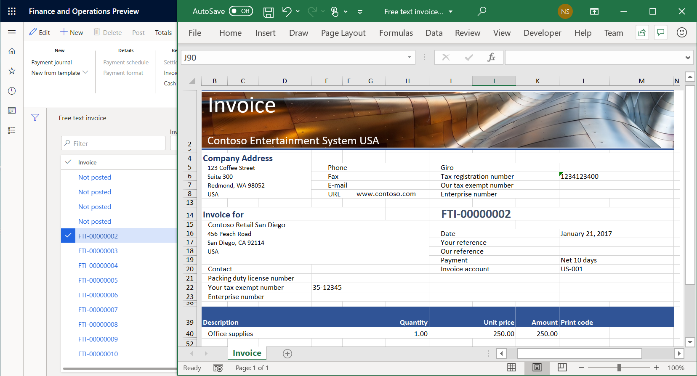

The modified template is used to generate the free text invoice report for the selected item. To analyze how this report is affected by changes that you make to the template, run the report in one application session immediately after you change the template in another application session.

## Related links

[Electronic reporting (ER) overview](general-electronic-reporting.md)

[Business document management overview](er-business-document-management.md)

[Design a configuration for generating reports in OPENXML format](tasks/er-design-reports-openxml-2016-11.md)

[!INCLUDE[footer-include](../../../includes/footer-banner.md)]