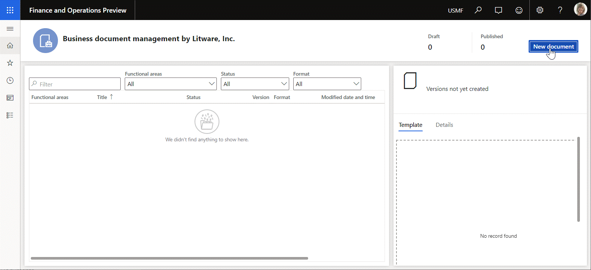
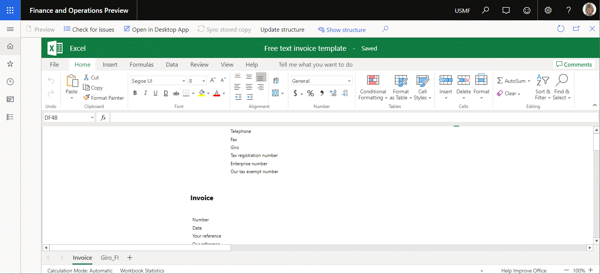
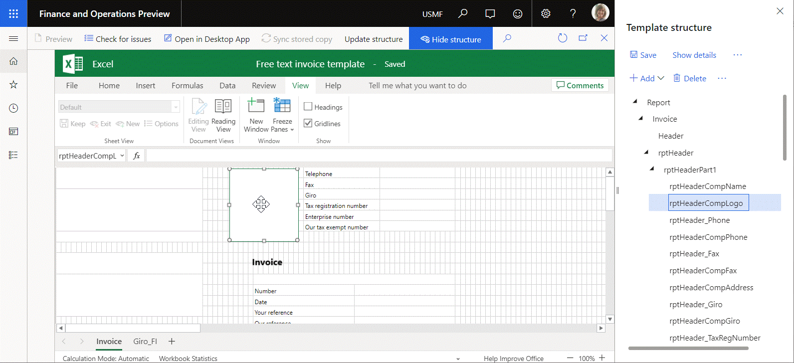
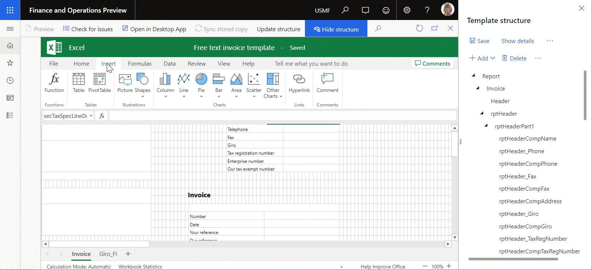

# Update the structure of a business document template 

[!include[banner](../includes/banner.md)]

In the **Template structure** pane of the [Business document management](er-business-document-management.md) template editor, you can modify a business document template by [adding new fields](er-bdm-add-field-to-excel-template.md) to a template in Microsoft Excel. The structure of the template is then automatically updated in Dynamics 365 Finance, so that it reflects the changes that you made in the **Template structure** pane.

You can also modify a template by using Office 365 online functionality. For example, you can add a new named item, such as a picture or shape, to the editable worksheet. In this case, the structure of the template isn't automatically updated in Finance, and the item that you added doesn't appear in the **Template structure** pane. Manually update the template structure in Finance by selecting **Update structure** on the template editor page.

For more information about this feature, complete the following example.

## Example: Update the structure of a business document template

This example shows how a system administrator can update the structure of a business document template in Finance after the template is modified in Office Online. The following sections explain the steps that are involved.

### Prepare a business document template for editing

Complete the following procedures in [Business document management overview](er-business-document-management.md).

1. [Configure ER parameters](er-business-document-management.md#configure-er-parameters)
2. [Import ER solutions](er-business-document-management.md#import-er-solutions)
3. [Enable Business document management](er-business-document-management.md#enable-business-document-management)
4. [Configure parameters](er-business-document-management.md#configure-parameters)

### Edit a business document template

1. In the **Business document management** workspace, select **New document**.
2. On the **Create a new template** page, select the **Free text invoice (ER sample)(Excel)** template.
3. Select **Create document**.
4. In the **Title** field, enter **FTI sample Litware**.
5. Select **OK** to create the new template.

    > [!NOTE]
    > If you haven't yet signed in to Office Online, you're [directed to the Office 365 sign-in page](er-business-document-management.md#frequently-asked-questions). To return to your Finance environment, select the **Back** button in your browser.

    The new template is opened for editing in the Excel Online embedded control on the template editor page.

### Review the current structure of the editable template

1. In Excel Online, on the ribbon, on the **View** tab, in the **Show** group, select **Gridlines**.
2. In the editable template, select the rectangle above the template title. This rectangle is a picture that is named **rptHeaderCompLogo**.
3. If the **Template structure** pane is hidden, select **Show structure**.
4. In the **Template structure** pane, expand **Report \> Invoice \> rptHeader \> rptHeaderPart1**.
5. Notice that, in the template structure in Finance, the **rptHeaderCompLogo** item is presented as a child item of **Report \> Invoice \> rptHeader \> rptHeaderPart1**.

### Update the structure of a business document template by deleting a picture

1. In Excel Online, in the editable template, select the **rptHeaderCompLogo** picture.
2. Follow one of these steps to delete the selected picture from the editable template:

    - Select the **Delete** key on your keyboard.
    - Select and hold (or right-click) the picture, and then select **Cut**.

    > [!NOTE]
    > The **rptHeaderCompLogo** item is currently still present in the template structure in Finance, even though the picture is no longer included in the Excel template.

3. Select **Update structure** to sync the structure of the editable template in Excel and Finance.
4. In the **Template structure** pane, expand **Report \> Invoice \> rptHeader \> rptHeaderPart1**.
5. Notice that the **rptHeaderCompLogo** item is no longer included in the template structure in Finance.

### Update the structure of a business document template by adding a picture

1. In Excel Online, on the ribbon, on the **Insert** tab, in the **Illustrations** group, select **Picture**.
2. Select **Choose file**, browse to the image that you want to add, select it, and then select **OK**.
3. Select **Insert**.
4. Move the new picture until it's in the correct place. By default, Excel names the picture. For example, it might name the picture **Picture 2**.
5. Select **Update structure** to sync the structure of the editable template in Excel and Finance.
6. In the **Template structure** pane, expand **Report \> Invoice \> rptHeader \> rptHeaderPart1**.
7. Notice that the new picture is now included as an item in the template structure in Finance.

## Related links

[Electronic reporting (ER) overview](general-electronic-reporting.md)

[Business document management overview](er-business-document-management.md)

[!INCLUDE[footer-include](../../../includes/footer-banner.md)]
