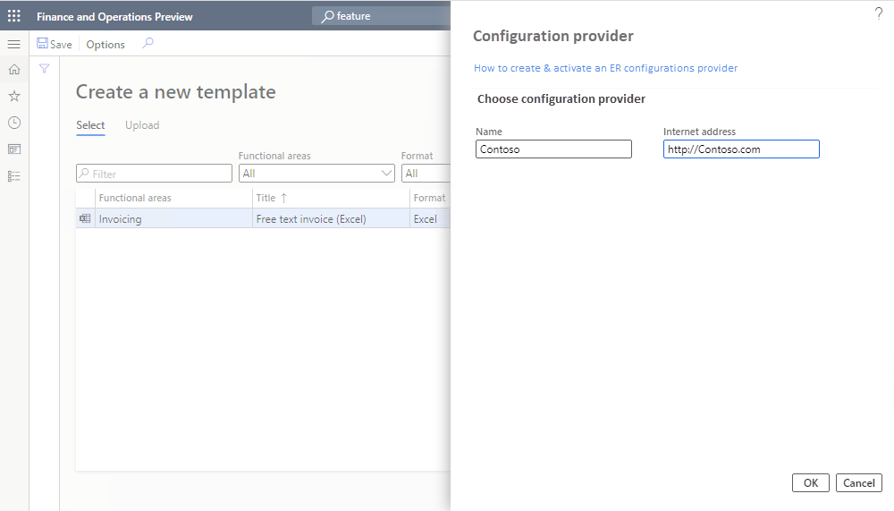

---
# required metadata

title: Microsoft Office-style user interface in Business document management (contains video)
description: This topic explains how to use the new user interface in the Business document management feature of Electronic reporting (ER) framework.
author: v-anamir
ms.date: 04/12/2021
ms.topic: article
ms.prod: 
ms.technology: 

# optional metadata

ms.search.form: ERBDWorkspace, ERBDParameters
# ROBOTS: 
audience: Application User, Developer, IT Pro
# ms.devlang: 
ms.reviewer: kfend
# ms.tgt_pltfrm: 
ms.custom: 
ms.assetid: 
ms.search.region: Global
# ms.search.industry: 
ms.author: v-anamir
ms.search.validFrom: 2019-08-01
ms.dyn365.ops.version: 10.0.5

---

# Microsoft Office-style user interface in Business document management

[!include [banner](../includes/banner.md)]

Business document management lets business users edit business document templates by using a Microsoft Office 365 service or the appropriate Microsoft Office desktop application. Edits might include design changes or new deployments, or users might add placeholders to include additional data without having to change the source code. For more information about how to work with Business document management, see [Business document management overview](er-business-document-management.md).

The new user interface (UI) is clearer and more comfortable to use. The **Business document** area shows only the templates that are owned by the current [active](tasks/er-configuration-provider-mark-it-active-2016-11.md) [provider](general-electronic-reporting.md#Provider) and located in the current Dynamics 365 Finance instance. In the previous UI, the **Template** tab listed all the templates that were available for any providers. It also showed all the templates that were created and edited by any user who had the same role.

You can use the **New document** button to create and edit a template in an [Electronic reporting (ER)](general-electronic-reporting.md) format [configuration](general-electronic-reporting.md#Configuration) that is provided by another provider and located in the current Finance instance, or upload a new template from a Microsoft Office Excel workbook. In version 10.0.25 and later, you can additionally use the **New document** button to create and edit a template in an ER format configuration that is stored in the [Global repository](general-electronic-reporting.md#Repository).

 In the examples in this topic, the active provider is Contoso the user of which creates a template based on a template provided by Microsoft. Alternatively, you can create a template by uploading your own template in Excel format.

> [!VIDEO https://www.microsoft.com/en-us/videoplayer/embed/RWAVQg]

The [Create a new business document using Business document management](https://youtu.be/gAIYl-mM_pw) video (shown above) is included in the [Finance and Operations playlist](https://www.youtube.com/playlist?list=PLcakwueIHoT_SYfIaPGoOhloFoCXiUSyW) available on YouTube.

## Make the new document UI in Business document management available

To start to use the new document UI in Business document management, you must turn on the **Office-like UI experience for Business document management** feature in the **Feature management** workspace.

Follow these steps to turn on this feature for all legal entities.

1. In the **Feature management** workspace, on the **All** tab, select the **Office-like UI experience for Business document management** feature in the list.
2. Select **Enable now** to turn on the selected feature.
3. Refresh the page to access the new feature.

## Add or activate a provider

Each template of a business document is stored in an ER format configuration that is marked as owned by a certain configuration provider. When you create a new template, a new ER format configuration is created to hold it. So, a provider must be identified for this configuration. The active provider of the ER framework is used for this purpose. So, if there isn't a provider in Electronic reporting, you can create one. If there's no active provider, you can select to activate one.

- To create a provider, change the name of the provider in the **Name** field, update the internet address of the new provider in the **Internet address** field, and select **OK** to confirm.

    
    
- To activate existing provider, choose the name of the provider in the **Configuration provider** field, and select **OK** to set provider as active.

    

> [!NOTE]
> Each BDM template is located in an ER format configuration that refers to the provider as the author of the configuration. This is why an active provider is required for the template.

## Edit a template that is owned by another provider

In this example the **New document** button is used to create and edit a template in an ER format configuration that is provided by another provider and located in the current Finance instance. In this example, the active provider is Contoso the user of which uses the provided by Microsoft ER format configuration. When you select **New document** and the **Select** tab, you can view all the templates of the current Finance instance that are owned by current and other providers. After you select a template, it's opened for creating a new editable copy of it. The edited template will then be stored in a new ER format configuration that is automatically generated.

1. In the **Business document management** workspace, select **New document**.

    

2. On the **Create a new template** page, on the **Select** tab, select the document to use as a template, and then select **Create document**.

    

3. In the new dialog box, in the **Title** field, change the title as you require. The title text is used to name the new ER format configuration that is automatically created. The draft version of this configuration (**Customer FTI report (GER) Copy**) will contain the edited template and will be used to run this ER format for the current user. The original template from the base ER format configuration will be used to run this ER format for every other user.
4. In the **Name** field, change the name of the first revision of the editable template that will be automatically created.
5. In the **Comment** field, update the remarks for the revision of the editable template that will be automatically created.
6. Select **OK** to confirm the start of the editing process.

    

## Upload a template that uses an existing Excel workbook

The **New document** button is used to create and edit a template in an ER format configuration based on the available Excel workbook. In this example, the active provider is Contoso the user of which uses the provided by Microsoft ER [data model](er-overview-components.md#data-model-component) and ER [model mapping](er-overview-components.md#model-mapping-component) configurations. When you select **New document** and the **Upload** tab, you can specify details of an Excel workbook upload. After you specified required settings and uploaded an Excel workbook, this workbook is transformed into a business document template that is opened for editing. The edited template will then be stored in a new ER format configuration that is automatically generated.

Follow these steps to provide required information before you upload a template.

1. In the **Business document management** workspace, select **New document**.

    
    
2. On the **Create a new template** page, on the **Upload** tab, on the **Template** tab, select **Browse** to find and select the Excel file that you want to use as a template. In the **Template** section, the **Title** and **Description** fields are automatically filled in. They specify the name and description of the new ER format configuration that is automatically created. You can edit these fields as you require.
3. In the **Document Type** section, in the **Name** field, specify the type of business document. This value will be used to search the correct data source (that is, the ER model configuration).

    

4. On the **Data source** tab, on the **Filter** FastTab, select **Apply filter**. In the **Data source** section, the **Name** field is automatically filled in, or you can manually select a value. You can use the filter to search for the appropriate data source name by name, description, country/region code, and business document type.

    
    
    > [!NOTE]
    > The **Filter** FastTab is used to search the correct data source (that is, the ER model configuration). You can edit all filter fields to find the most appropriate data source for the document that you're uploading.
    > 
    > The conditions on the **Filter** FastTab are used as **OR** conditions.
    
5. On the **Mapping** tab, select **Auto detect**. The **Root definition** field is automatically filled in, or you can manually select a value. This tab shows the end mapping for the elements from the template and the model.

    
    
   > [!NOTE]
   > The mapping in the **Template structure** section uses the full match of the labels or descriptions in the data source in the user's language, and in the cell name in the template.

6. Select **Create document** to confirm that you want to create a template and start the editing process.

For more information, see [Business document management overview](er-business-document-management.md).

## Upload a template from the Global repository

In this example the **New document** button is used to create and edit a template in an ER format configuration that is provided by Microsoft and located in the Global repository. In this example, the active provider is Contoso the user of which uses the provided by Microsoft ER format configuration. When you select **New document** and the **Import from Global repository** tab, you can view all the templates of business documents that are stored in the Global repository and that are missing the in current Finance instance. After you select a template, it's imported from the Global repository to the current Finance instance for creating a new editable copy of it. The edited template will then be stored in a new ER format configuration that is automatically generated.

1. In the **Business document management** workspace, select **New document**.

    

2. On the **Create a new template** page, on the **Import from Global repository** tab, select the document to use as a template, and then select **Create document**.

    

3. On the dialog box, select **Yes** to confirm the import of the selected document from the Global repository to the current Finance instance. If prompted, follow the authorization instructions.

4. In the new dialog box, in the **Title** field, change the title as you require. The title text is used to name the new ER format configuration that is automatically created. The draft version of this configuration (**Collection letter note (Excel) Copy**) will contain the edited template and will be used to run this ER format for the current user. The original template from the base ER format configuration will be used to run this ER format for every other user.
5. In the **Name** field, change the name of the first revision of the editable template that will be automatically created.
6. In the **Comment** field, update the remarks for the revision of the editable template that will be automatically created.
7. Select **OK** to confirm the start of the editing process.

    

[!INCLUDE[footer-include](../../../includes/footer-banner.md)]
