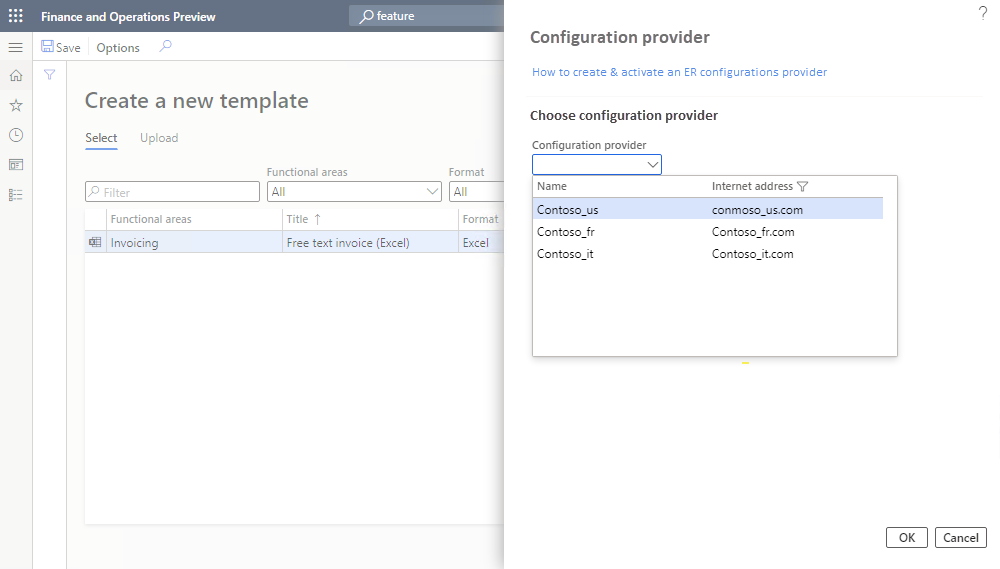

---
# required metadata

title: Microsoft Office-style user interface in Business document management (contains video)
description: This article explains how to use the new user interface in the Business document management feature of Electronic reporting (ER) framework.
author: v-anamir
ms.date: 01/05/2022
ms.topic: article
ms.prod: 
ms.technology: 

# optional metadata

ms.search.form: ERBDWorkspace, ERBDParameters
# ROBOTS: 
audience: Application User, Developer, IT Pro
# ms.devlang: 
ms.reviewer: kfend
# ms.tgt_pltfrm: 
ms.custom: 
ms.assetid: 
ms.search.region: Global
# ms.search.industry: 
ms.author: v-anamir
ms.search.validFrom: 2019-08-01
ms.dyn365.ops.version: 10.0.5

---

# Microsoft Office-style user interface in Business document management

[!include [banner](../includes/banner.md)]

Business document management lets business users edit business document templates by using a Microsoft Office 365 service or the appropriate Microsoft Office desktop application. Edits might include design changes or new deployments, or users might add placeholders to include additional data without having to change the source code. For more information about how to work with Business document management, see [Business document management overview](er-business-document-management.md).

The new user interface (UI) is clearer and more comfortable to use. The **Business document** area shows only the templates that are owned by the current [active](tasks/er-configuration-provider-mark-it-active-2016-11.md) [provider](general-electronic-reporting.md#Provider) and located in the current instance of Dynamics 365 Finance. In the previous UI, the **Template** tab listed all the templates that were available for any provider. It also showed all the templates that were created and edited by any user who had the same role.

You can use the **New document** button in the **Business document management** workspace to create and edit a template in an [Electronic reporting (ER)](general-electronic-reporting.md) format [configuration](general-electronic-reporting.md#Configuration) that is provided by another provider and located in the current Finance instance, or to upload a new template from an Excel workbook. Additionally, in version 10.0.25 and later, you can use the **New document** button to create and edit a template in an ER format configuration that is stored in the [Global repository](general-electronic-reporting.md#Repository).

In the examples in this article, the active provider is Contoso, and you use it to create a template that is based on a template that is provided by Microsoft. Alternatively, you can create a template by uploading your own template in Excel format.

> [!NOTE]
> In versions of Finance before 10.0.21, Business document management functionality and the Microsoft Office–style UI had to be explicitly enabled. However, starting in version 10.0.21, the corresponding **Business document management** and **Office-like UI experience for Business document management** features were turned on by default. Then, starting in version 10.0.29, these features became mandatory. In other words, they were turned on by default and couldn't be turned off.
>
> Starting in Finance version 10.0.32, both features have been removed. Therefore, if you're using Finance version 10.0.32 and later, disregard the information about feature enablement later in this article.

> [!VIDEO https://www.microsoft.com/videoplayer/embed/RWAVQg]

The [Create a new business document using Business document management](https://youtu.be/gAIYl-mM_pw) video (shown above) is included in the [finance and operations playlist](https://www.youtube.com/playlist?list=PLcakwueIHoT_SYfIaPGoOhloFoCXiUSyW) available on YouTube.

## Make the new document UI in Business document management available

To start to use the new document UI in Business document management, you must turn on the **Office-like UI experience for Business document management** feature in the **Feature management** workspace.

Follow these steps to turn on this feature for all legal entities.

1. In the **Feature management** workspace, on the **All** tab, select the **Office-like UI experience for Business document management** feature in the list.
2. Select **Enable now** to turn on the selected feature.
3. Refresh the page to access the new feature.

## Add or activate a provider

Each template of a business document is stored in an ER format configuration that is marked as owned by a specific configuration provider. When you create a new template, a new ER format configuration is created to hold it. Therefore, a provider must be identified for that configuration. The active provider of the ER framework is used for this purpose. If there is no provider in ER, you can create one. If there is no *active* provider, you can activate one of the existing providers. A dialog for adding or activating a provider is opened when it is necessary whereas you start adding a new template.

### Add a new provider

To create a new provider, follow these steps on the **Configuration provider** dialog:

1.  On the **Choose configuration provider** tab, in the **Name** field, enter the name of the new provider.
2.  In the **Internet address** field, enter the internet address (URL) of the new provider. 
3.  Select **OK**.

    

The added provider will be automatically activated.

### Activate a provider

To activate a provider, follow these steps on the **Configuration provider** dialog:

1.  On the **Choose configuration provider** tab, in the **Configuration provider** field, select the provider.
2.  Select **OK**.

    

The selected provider will be activated.

> [!NOTE]
> Each Business document management template is located in an ER format configuration that refers to the provider as configuration author. Therefore, an active provider is required for each template.

## Edit a template that is owned by another provider

This example shows how to use the **New document** button in the **Business document management** workspace to create and edit a template in an ER format configuration that is provided by another provider and located in the current Finance instance. In this example, the active provider is Contoso, which uses the ER format configuration that is provided by Microsoft. After you select **New document**, the **Select** tab on the **Create a new template** page shows all the templates of the current Finance instance that are owned by the current provider and other providers. Select a template to open it. You can then create a new editable copy of the template. The edited template is stored in a new ER format configuration that is automatically generated.

1. In the **Business document management** workspace, select **New document**.

    

2. On the **Create a new template** page, on the **Select** tab, select the document to use as a template, and then select **Create document**.

    

3. In the new dialog box, in the **Title** field, change the title as you require. The title text is used to name the new ER format configuration that is automatically created. The draft version of this configuration (**Customer FTI report (GER) Copy**) will contain the edited template and will be used to run this ER format for the current user. The original template from the base ER format configuration will be used to run this ER format for every other user.
4. In the **Name** field, change the name of the first revision of the editable template that will be automatically created.
5. In the **Comment** field, update the remarks for the revision of the editable template that will be automatically created.
6. Select **OK** to confirm the start of the editing process.

    

## Upload a template that uses an existing Excel workbook

This example shows how to use the **New document** button in the **Business document management** workspace to create and edit a template in an ER format configuration, based on the available Excel workbook. In this example, the active provider is Contoso, and you use the ER [data model](er-overview-components.md#data-model-component) and ER [model mapping](er-overview-components.md#model-mapping-component) configurations that are provided by Microsoft. After you select **New document**, select the **Upload** tab on the **Create a new template** page. There, you can specify the details of an Excel workbook upload. After you upload the Excel workbook, it's transformed into a business document template that is opened for editing. The edited template will be stored in a new ER format configuration that is automatically generated.

Follow these steps to provide required information before you upload a template.

1. In the **Business document management** workspace, select **New document**.
2. On the **Create a new template** page, on the **Upload** tab, on the **Template** tab, select **Browse** to find and select the Excel file that you want to use as a template. In the **Template** section, the **Title** and **Description** fields are automatically filled in. They specify the name and description of the new ER format configuration that is automatically created. You can edit these fields as you require.
3. In the **Document Type** section, in the **Name** field, specify the type of business document. This value will be used to search the correct data source (that is, the ER model configuration).

    

4. On the **Data source** tab, on the **Filter** FastTab, select **Apply filter**. In the **Data source** section, the **Name** field is automatically filled in, or you can manually select a value. You can use the filter to search for the appropriate data source name by name, description, country/region code, and business document type.

    

    > [!NOTE]
    > The **Filter** FastTab is used to search the correct data source (that is, the ER model configuration). You can edit all filter fields to find the most appropriate data source for the document that you're uploading.
    > 
    > The conditions on the **Filter** FastTab are used as **OR** conditions.

5. On the **Mapping** tab, select **Auto detect**. The **Root definition** field is automatically filled in, or you can manually select a value. This tab shows the end mapping for the elements from the template and the model.

    

    > [!NOTE]
    > The mapping in the **Template structure** section uses the full match of the labels or descriptions in the data source in the user's language, and in the cell name in the template.

6. Select **Create document** to confirm that you want to create a template and start the editing process.

For more information, see [Business document management overview](er-business-document-management.md).

## Upload a template from the Global repository

This example shows how to use the **New document** button in the **Business document management** workspace to create and edit a template in an ER format configuration that is provided by Microsoft and located in the Global repository. In this example, the active provider is Contoso, which uses the ER format configuration that is provided by Microsoft. After you select **New document**, the **Import from Global repository** tab on the **Create a new template** page shows all the business document templates that are stored in the Global repository but missing in the current Finance instance. After you select a template, it's imported from the Global repository into the current Finance instance to create a new editable copy. The edited template is stored in a new ER format configuration that is automatically generated.

1. In the **Business document management** workspace, select **New document**.
2. On the **Create a new template** page, on the **Import from Global repository** tab, select the document to use as a template, and then select **Create document**.

    

3. In the message box, select **Yes** to confirm that you want to import the selected document from the Global repository into the current Finance instance. If you're prompted for authorization, follow the on-screen instructions.
4. In the new dialog box, in the **Title** field, change the title as you require. The title text is used to name the new ER format configuration that is automatically created. The draft version of this configuration (**Collection letter note (Excel) Copy**) will contain the edited template and will be used to run this ER format for the current user. The original template from the base ER format configuration will be used to run this ER format for every other user.
5. In the **Name** field, change the name of the first revision of the editable template that will be automatically created.
6. In the **Comment** field, update the remarks for the revision of the editable template that will be automatically created.
7. Select **OK** to confirm the start of the editing process.

[!INCLUDE[footer-include](../../../includes/footer-banner.md)]

